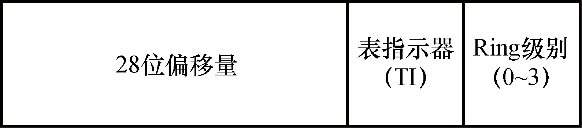

# 第8章　系统机制

Windows 操作系统提供了多种可供执行体、内核以及设备驱动程序等内核模式组件使用的基本机制。本章将介绍下列系统机制及其用法：

● 处理器执行模型，包括 Ring 级别、段、任务状态、陷阱调度（包括中断、延迟过程调用（DPC）、异步过程调用（APC）、计时器、系统工作线程、异常调度以及系统服务调度）。

● 预测执行的屏障和其他软件侧信道缓解措施。

● 执行体对象管理器。

● 同步，包括自旋锁、内核调度程序对象、等待调度，以及与用户模式相关的同步基元（synchronization primitive），如基于地址的等待、条件变量以及精简读取器/写入器（Slim Reader-Writer，SRW）锁。

● 高级本地过程调用（Advanced Local Procedure Call，ALPC）子系统。

● Windows 通知设施（Windows Notification Facility，WNF）。

● WoW64。

● 用户模式调试框架。

此外，本章还将详细介绍通用 Windows 平台（Universal Windows Platform，UWP）以及驱动该平台的用户模式和内核模式服务，例如：

● 打包的应用程序（Packaged Application）和 AppX 部署服务。

● Centennial 应用程序和 Windows 桌面桥（Windows Desktop Bridge）。

● 进程状态管理（Process State Management，PSM）和进程生命周期管理（Process Lifetime Management，PLM）。

● 主机活动管理器（Host Activity Manager，HAM）和后台活动审查器（Background Activity Moderator，BAM）。

## 8.1　处理器执行模型

本节将深入介绍 Intel i386 处理器架构，以及现代系统中更常用的 AMD64 架构（i386 架构的扩展）的内部机制。虽然这两种架构最初由不同公司设计，但现在，这两家供应商已经实现了对方的设计。因此，尽管我们可能依然会在 Windows 文件和注册表键中看到这些后缀，但目前普遍用 x86（32 位）和 x64（64 位）指代这两种架构。

本节将讨论段（segmentation）、任务、Ring 级别等与关键机制相关的概念，以及陷阱（trap）、中断（interrupt）和系统调用（system call）等概念。

### 8.1.1　段

诸如 C/C++ 和 Rust 等高级编程语言会被编译为机器代码，通常可称之为汇编语言或汇编代码。借助这种低级语言可直接访问处理器寄存器。通常程序可访问以下三种主要类型的寄存器（调试代码时可见）：

● 程序计数器（Program Counter，PC），在 x86/x64 架构中可将其称为指令指针（Instruction Pointer，IP），由 EIP（x86）和 RIP（x64）寄存器所代表。该寄存器始终指向正在执行的汇编代码行（某些 32 位 ARM 架构存在例外情况）。

● 栈指针（Stack Pointer，SP），由 ESP（x86）和 RSP（x64）寄存器所代表。该寄存器会指向保存了当前栈位置的内存位置。

● 其他通用寄存器（General Purpose Register，GPR），包括但不限于 EAX/RAX、ECX/RCX、EDX/RDX、ESI/RSI 及 R8、R14 等寄存器。

虽然这些寄存器可包含指向内存的地址值，但在访问内存位置时还需要其他寄存器的介入，这是一种称为受保护模式段（protected mode segmentation）的机制。为此需要检查各种段寄存器，此类寄存器亦可称为选择器（selector）：

● 所有针对程序计数器的访问首先需要检查代码段（Code Segment，CS）寄存器。

● 所有针对栈指针的访问首先需要检查栈段（Stack Segment，SS）寄存器。

● 对其他寄存器的访问由段重写（Override）决定，段重写所用的编码方式可强制针对特定寄存器进行检查，如数据段（Data Segment，DS）、扩展段（Extended Segment，ES）或 F 段（F Segment，FS）。

这些选择器位于 16 位段寄存器中，可在一种名为全局描述符表（Global Descriptor Table，GDT）的数据结构中进行查找。为了定位 GDT，处理器还会用到另一个 CPU 寄存器：GDT 寄存器，也就是 GDTR。这些选择器的格式如图 8-1 所示。



图8-1　x86段选择器的格式

段选择器中的偏移量可以在GDT中查看，除非TI位设置为使用另一种名为本地描述符表（Local Descriptor Table，LDT）的数据结构，该数据结构由LDTR所确定，但现代Windows操作系统中已不再使用该数据结构了。因为这种工作方式会造成这样一种结果：在被发现的段项（或者无效段项）中产生一般性保护错误（#GP）或段错误（#SF）异常。

这个段项在现代操作系统中通常被称为段描述符，主要提供两种关键用途：

● 对于代码段，它给出运行这个段选择器所加载的代码即将执行的Ring级别，也叫代码特权级别（Code Privilege Level，CPL）。Ring级别的范围介于0到3之间，会被缓存至实际选择器的最低两位，如图8-1所示。Windows操作系统会使用Ring 0来运行内核模式组件和驱动程序，并使用Ring 3运行应用程序和服务。此外在x64系统中，代码段还可体现出这是一个长模式还是兼容模式的段。前者允许x64代码以原生方式执行，后者可激活与x86的遗留兼容模式。x86系统中也存在类似机制，据此可将段标记为16位段或32位段。

● 对于其他段，它给出访问这些段所需的Ring级别，也叫描述符特权级别（Descriptor Privilege Level，DPL）。虽然在当今现代操作系统中已经算是一项过时的检查，但处理器（以及应用程序）依然会强制要求正确设置该段。

最后，在x86系统中，段项也可以使用32位基址，该值会被添加到已载入（使用重写引用该段的）寄存器的其他任意值中。随后会使用相应的段限制来检查底层寄存器的值是否超过某个固定上限。因为在大部分操作系统中，该基址会被设置为0（且限制为0xFFFFFFFF），所以x64架构代码摒弃了这个概念，但FS和GS选择器除外，它们的工作方式略有差异，如下：

● 如果代码段为长模式，那么会从FS_BASE这个特殊模块寄存器（Model Specific Register，MSR）中的0C0000100h处获得FS段的基址。对于GS段，则查看当前的Swap状态，该状态可通过swapgs指令修改，随后则会载入GS_BASE MSR（0C0000101h）或GS_SWAP MSR（0C0000102h）。  
如果FS或GS段选择器寄存器中设置了TI位，则会从LDT项相应的偏移量处获得对应的值，该值只能采用32位基址。这样做是为了保证与某些忽略32位基址限制操作系统的兼容性。

● 如果代码段为兼容模式，那么会照常从相应的GDT项（如果TI位已设置，则会从LDT项）读取基址。该限制会强制实施，并且会通过段重写后寄存器中的偏移量进行验证。

FS和GS段这种有趣的行为可被Windows等操作系统用于实现某种类型的线程本地寄存器效果，借此，段基址可指向某种特定的数据结构，进而以简单的方式访问其中的特定偏移量/字段。

例如，Windows会将线程环境块（Thread Environment Block，TEB）的地址存储在x86系统的FS段或x64系统的GS（已交换）段中（TEB已在卷1第3章中进行了详细介绍）。随后，当在x86系统中执行内核模式代码时，该FS段会被手动修改为一个不同的段项，该段项包含内核处理器控制区（Kernel Processor Control Region，KPCR）的地址，而在x64系统中则是由GS（未交换）段存储该地址。

因此，段可在Windows上实现这两种效果：在处理器级别下编码并强制实施可供代码片段执行的特权级别，并分别为用户模式和内核模式代码提供对TEB和KPCR数据结构的直接访问。请注意，由于GDT是由CPU寄存器（GDTR）指向的，因此每个CPU都可以有自己的GDT。实际上，Windows正是借此保证了每个GDT都加载相应的每个处理器KPCR，并且在当前处理器上，当前执行线程的TEB同样会保存在自己的段中。

实验：在x64系统中查看GDT

在进行远程调试或分析崩溃转储文件（都需要用到LiveKD）时，我们可以使用dg这个调试器命令查看GDT的内容，包括所有段的状态及其基址（如果相关）。该命令可接收起始段和终止段，也就是下文范例中的10和50：

```
0: kd> dg 10 50 
                                                    P Si Gr Pr Lo 
Sel         Base             Limit           Type   l ze an es ng flags 
---- ----------------- ----------------- ---------- - -- -- -- -- --------
0010 00000000`00000000 00000000`00000000 Code RE Ac 0 Nb By P Lo 0000029b 
0018 00000000`00000000 00000000`00000000 Data RW Ac 0 Bg By P Nl 00000493 
0020 00000000`00000000 00000000`ffffffff Code RE Ac 3 Bg Pg P Nl 00000cfb 
0028 00000000`00000000 00000000`ffffffff Data RW Ac 3 Bg Pg P Nl 00000cf3 
0030 00000000`00000000 00000000`00000000 Code RE Ac 3 Nb By P Lo 000002fb 
0050 00000000`00000000 00000000`00003c00 Data RW Ac 3 Bg By P Nl 000004f3 
```

此处的关键段为10h、18h、20h、28h、30h和50h（上述输出结果有省略，删除了与本话题无关的项）。

在10h（KGDT64_R0_CODE）中可以看到一个处于Ring 0的长模式代码段，该代码段在PI列下显示数字“0”，在Long列下显示字母“Lo”，其类型为Code RE。类似地，在20h（KGDT64_R3_CMCODE）中可以看到一个处于Ring 3的Nl段（Nl代表Not Long，也就是兼容模式），该段可用于在WoW64子系统中执行x86代码。而在30h（KGDT64_R3_CODE）中可以看到一个等价的长模式段。随后请注意18h（KGDT64_ R0_DATA）和28h（KGDT64_R3_DATA）段，它们对应栈、数据和扩展段。

还有最后一个段50h（KGDT_R3_CMTEB），除非我们在转储GDT时在WoW64下运行某些x86代码，否则该段的基址通常为零。根据上文的介绍，在兼容模式下运行时，该段通常会存储TEB的基址。

要查看64位TEB和KPCR段，我们需要转储相应的MSR。在进行本地或远程内核调试时，可通过下列命令进行转储（这些命令无法用于崩溃转储）：

```
lkd> rdmsr c0000101 
msr[c0000101] = ffffb401`a3b80000 
　
lkd> rdmsr c0000102 
msr[c0000102] = 000000e5`6dbe9000 
```

我们可以将这些值与@$pcr和@$teb的值进行对比，随后应该能看到相同的值，例如：

```
lkd> dx -r0 @$pcr 
@$pcr              : 0xffffb401a3b80000 [Type: _KPCR *] 
　
lkd> dx -r0 @$teb 
@$teb              : 0xe56dbe9000 [Type: _TEB *] 
```

实验：在x86系统中查看GDT

在x86系统中，虽然GDT包含类似的段，但分别位于不同的选择器中。此外，由于使用了双FS段来替代swapgs功能，并且缺乏长模式，因此选择器的数量也会有所差异，如下所示：

```
kd> dg 8 38 
                                  P Si Gr Pr Lo 
Sel    Base     Limit     Type    l ze an es ng flags 
---- -------- -------- ---------- - -- -- -- -- --------
0008 00000000 ffffffff Code RE Ac 0 Bg Pg P Nl 00000c9b 
0010 00000000 ffffffff Data RW Ac 0 Bg Pg P Nl 00000c93 
0018 00000000 ffffffff Code RE    3 Bg Pg P Nl 00000cfa 
0020 00000000 ffffffff Data RW Ac 3 Bg Pg P Nl 00000cf3 
0030 80a9e000 00006020 Data RW Ac 0 Bg By P Nl 00000493 
0038 00000000 00000fff Data RW    3 Bg By P Nl 000004f2 
```

此处的关键段为08h、10h、18h、20h、30h和38h。在08h（KGDT_R0_CODE）

中可以看到一个处于Ring 0的代码段。类似地，在18h（KGDT_R3_CODE）中会看到一个Ring 3的段。随后请注意10h（KGDT_R0_DATA）和20h（KGDT_R3_DATA）段，它们对应栈、数据和扩展段。

在x86系统中，可以在30h（KGDT_R0_PCR）段中看到KPCR的基址，并在38h（KGDT_R3_TEB）段中看到当前线程TEB的基址。此类系统的段不使用MSR。

#### 延迟段加载

根据上文有关段的描述和相关值的介绍，在x86或x64系统中调查DS和ES段的值可能会有“惊喜”：它们的值未必会与相应Ring级别所定义的值相匹配。例如，一个x86用户模式线程可能包含下列段：

```
CS = 1Bh (18h | 3) 
ES, DS = 23 (20h | 3) 
FS = 3Bh (38h | 3) 
```

然而，在Ring 0的系统调用中，可能会看到如下段：

```
CS = 08h (08h | 0) 
ES, DS = 23 (20h | 3) 
FS = 30h (30h | 0) 
```

类似地，内核模式执行的x64线程也可以将自己的ES和DS段设置为2Bh（28h | 3）。造成这种差异的原因在于一项名为延迟段加载（lazy segment loading）的功能。此外，这种差异体现在平面内存模型下运作的系统中，如果当前代码特权级别（CPL）为0，那么数据段的描述符特权级别（DPL）将毫无意义。由于更高位的CPL始终可以访问更低位DPL的数据（但无法反向访问），因此在进入内核时将DS和ES段设置为各自“适当”的值后，还需要在返回用户模式时将这些值还原。

虽然10h处的MOV DS指令看似无关紧要，但在遇到该指令后，处理器的微码需要执行一系列选择器正确性检查，这会为系统调用和中断处理增加大量处理成本。因此，为避免增加这些成本，Windows始终会使用Ring 3数据段值。

### 8.1.2　任务状态段

除了代码和数据段寄存器，x86和x64架构中还有另一种特殊寄存器：任务寄存器（Task Register，TR），这也是GDT中充当偏移量的另一个16位选择器。然而，此时的段项并不与代码或数据相关联，而是与任务相关联。这意味着，对于处理器的内部状态而言，当前执行的代码片段会调用任务状态（task state），在Windows中所调用的为当前线程。现代x86操作系统会使用这些由段代表的任务状态（即任务状态段，Task State Segment，TSS）构建各种可关联至关键处理器陷阱（下文将详细介绍）的任务。在最基本的情况下，TSS可代表一个页目录（借助CR3寄存器），如x64系统中的PML4（有关分页的详细信息请参阅卷1第5章），也可代表代码段、堆栈段、指令指针，甚至最多可代表四个栈指针（每个Ring级别一个指针）。此类TSS主要用于如下场景：

● 在未出现特定陷阱时，可代表当前执行状态。如果处理器当前正运行在Ring 3级别下，那么随后处理器可从该TSS加载Ring 0栈，以便正确地处理中断和异常。

● 解决处理调试错误（#DB）时的架构竞争条件，这需要有包含自定义调试错误处理程序和内核栈的专用TSS。

● 代表在出现双重错误（#DF）陷阱时需要加载的执行状态。借此可在安全（备份）内核栈而非当前线程的内核栈上切换至双重错误处理程序，而后者可能也是出现错误的原因。

● 代表在出现不可屏蔽的中断（#NMI）时需要加载的执行状态。类似地，该TSS可用于在安全内核栈上加载NMI处理程序。

● 对于会在计算机检查异常（#MCE）中使用的其他类似任务，出于相同原因，它们也可以在专用的安全内核栈中运行。

在x86系统中，可以在GDT的028h选择器中找到主要的（当前）TSS，这也解释了在Windows的正常执行过程中TR会位于028h的原因。此外，#DF TSS位于58h，NMI TSS位于50h，#MCE TSS位于0A0h，#DB TSS位于0A8h。

在x64系统上，由于TSS功能已被降级为主要执行在专用内核栈上运行的陷阱处理程序，因此删除了系统具有多个TSS的功能。目前只使用一个TSS（在Windows中位于040h），它使用了一个由八个可能的栈指针组成的数组，该数组名为中断栈表（Interrupt Stack Table，IST）。先前遇到的每个陷阱都会关联至IST索引，而不再关联至自定义TSS。在下一节内容中，随着我们转储几个IDT项，你就会直观感受到x86和x64系统以及它们处理这些陷阱的方法上的差异。

实验：在x86系统中查看TSS

在x86系统中，我们可以使用上一个实验中用过的dg命令在28h处查看系统范围内的TSS：

```
kd> dg 28 28 
                                  P Si Gr Pr Lo 
Sel    Base     Limit     Type    l ze an es ng flags 
---- -------- -------- ---------- - -- -- -- -- --------
0028 8116e400 000020ab TSS32 Busy 0 Nb By P  Nl 0000008b 
```

上述命令将返回KTSS数据结构的虚拟地址，随后可使用dx或dt命令对其创建转储：

```
kd> dx (nt!_KTSS*)0x8116e400 
(nt!_KTSS*)0x8116e400              : 0x8116e400 [Type: _KTSS *] 
    [+0x000] Backlink        : 0x0 [Type: unsigned short] 
    [+0x002] Reserved0       : 0x0 [Type: unsigned short] 
    [+0x004] Esp0            : 0x81174000 [Type: unsigned long] 
    [+0x008] Ss0             : 0x10 [Type: unsigned short] 
```

请注意，上述指令只设置了Esp0和Ss0字段，因为Windows绝不会在上文介绍的陷阱之外的其他情况下使用基于硬件的任务切换。因此这个TSS的唯一用途是在硬件中断期间加载相应的内核栈。

正如在“陷阱调度”一节中所述，对于不会受到“Meltdown”处理器架构漏洞影响的系统，这个栈指针也是当前线程的内核栈指针（基于卷1第5章介绍过的KTHREAD

结构）；但对于受此漏洞影响的系统，这个栈指针会指向处理器描述符区域内部的过渡栈。同时，栈段将始终设置为10h，即KGDT_R0_DATA。

如上文所述，计算机检查异常（#MC）使用了另一个TSS。我们同样可以通过dg命令查看：

```
kd> dg a0 a0 
                                  P Si Gr Pr Lo 
Sel    Base     Limit     Type    l ze an es ng flags 
---- -------- -------- ---------- - -- -- -- -- --------
00A0 81170590 00000067 TSS32 Avl  0 Nb By P  Nl 00000089 
```

不过这一次我们会使用.tss命令而非dx命令，该命令可格式化KTSS结构中的不同字段，并以类似于在当前执行线程中那样的方式显示任务。本例中的输入参数为栈选择器（A0h）。

```
kd> .tss a0 
　
eax=00000000 ebx=00000000 ecx=00000000 edx=00000000 esi=00000000 edi=00000000 
eip=81e1a718 esp=820f5470 ebp=00000000 iopl=0         nv up di pl nz na po nc 
cs=0008 ss=0010 ds=0023 es=0023 fs=0030 gs=0000                  efl=00000000 
　
hal!HalpMcaExceptionHandlerWrapper: 
81e1a718 fa              cli 
```

请留意段寄存器的设置方式与上文“延迟段加载”中所提到的方式是一致的，并且程序计数器（EIP）指向了#MC的处理程序。此外，为了不受内存错误影响，该栈被配置为指向内核二进制库中的一个安全栈。最后，尽管并未显示在.tss的输出结果中，但CR3实际上被配置为系统页目录。在“陷阱调度”一节，我们还将使用!idt命令重新查看这个TSS。

实验：在x64系统中查看TSS和IST

很不幸，x64系统中的dg命令存在Bug，无法正确显示64位基址，因此，为了获取TSS段（40h）的基址，我们需要对两个段创建转储，并将高位、中位和低位基址的数据结合在一起：

```
0: kd> dg 40 48 
                                                    P Si Gr Pr Lo 
Sel         Base             Limit          Type    l ze an es ng flags 
---- ----------------- ----------------- ---------- - -- -- -- -- --------
0040 00000000`7074d000 00000000`00000067 TSS32 Busy 0 Nb By P  Nl 0000008b 
0048 00000000`0000ffff 00000000`0000f802 <Reserved> 0 Nb By Np Nl 00000000 
```

因此在本例中，KTSS64位于0xFFFFF8027074D000。作为获取该地址的另一种方式，请注意每个处理器的KPCR都包含一个名为TssBase的字段，其中也包含一个指向KTSS64的指针：

```
0: kd> dx @$pcr->TssBase 
@$pcr->TssBase              : 0xfffff8027074d000 [Type: _KTSS64 *] 
    [+0x000] Reserved0      : 0x0 [Type: unsigned long] 
    [+0x004] Rsp0           : 0xfffff80270757c90 [Type: unsigned __int64] 
```

请留意，此处看到的虚拟地址与GDT中看到的地址是相同的。此外我们还会发现，除RSP0之外，其他所有字段都是零，与x86架构类似，RSP0包含（在不受“Meltdown”硬件漏洞影响的计算机上）当前线程内核栈的地址，或包含处理器描述符区域过渡栈的地址。

执行该实验所用的系统配备了一个第10代Intel处理器，因此RSP0等于当前内核栈：

```
0: kd> dx @$thread->Tcb.InitialStack 
@$thread->Tcb.InitialStack : 0xfffff80270757c90 [Type: void *] 
```

最后，查看中断栈表会看到关联至#DF、#MC、#DB和NMI陷阱的各种栈，在“陷阱调度”一节我们还将进一步查看中断调度表（Interrupt Dispatch Table，IDT）是如何引用这些栈的：

```
0: kd> dx @$pcr->TssBase->Ist 
@$pcr->TssBase->Ist     [Type: unsigned __int64 [8]] 
    [0] :            0x0 [Type: unsigned __int64] 
    [1] :            0xfffff80270768000 [Type: unsigned __int64] 
    [2] :            0xfffff8027076c000 [Type: unsigned __int64] 
    [3] :            0xfffff8027076a000 [Type: unsigned __int64] 
    [4] :            0xfffff8027076e000 [Type: unsigned __int64] 
```

在讨论了GDT中Ring级别、代码执行以及某些关键段之间的关系后，我们将通过下文的“陷阱调度”一节一起看看不同代码段（及其Ring级别）之间实际的过渡过程。但在讨论陷阱调度前，我们先分析在易受熔断（Meltdown）硬件旁路攻击影响的系统中TSS配置是如何变化的。

## 8.2　硬件侧信道漏洞

现代CPU可以在内部寄存器之间以非常快的速度（皮秒级别）计算并移动数据。处理器的寄存器是一种稀缺资源，因此，操作系统和应用程序代码总是通过指令让CPU将数据从CPU寄存器移动至主存，反之亦然。CPU可以访问不同类型的内存。位于CPU封装内部以及可由CPU执行引擎直接访问的内存称为缓存（Cache），缓存具有高速和昂贵的特点。CPU通过外部总线访问的内存通常可称为RAM（随机访问内存，Random Access Memory），RAM速度更慢，价格更低，但容量更大。内存与CPU之间的位置关系定义了一种所谓的“基于内存层次结构”的内存，这些内存有着不同的速度和容量（位置越接近CPU的内存，速度就越快，但容量就越小）。如图8-2所示，现代计算机的CPU通常包含L1、L2和L3这三级高速缓存内存，每个物理内核均可直接访问这些高速缓存。L1和L2缓存距离CPU的内核最近，并且是每个内核专用的。L3缓存距离最远，并且始终被所有CPU内核共享（不过嵌入式处理器一般不具备L3缓存）。

访问时间是缓存的一个重要特征，其访问时间几乎等同于CPU的寄存器（其实缓存比寄存器略慢一些）。主存的访问时间则会慢数百倍。这意味着，如果CPU按顺序执行所有指令，由于需要通过指令访问位于主存中的数据，整体速度会慢很多倍。为了解决这个问题，现代CPU采取了不同的策略。在历史上，这些策略曾引发了侧信道攻击（也叫预测式攻击），事实证明，这会极大地影响终端用户系统的整体安全性。


图8-2　现代CPU的缓存和存储内存及其平均容量与访问时间

为了准确描述侧信道硬件攻击以及Windows所采取的缓解措施，我们首先需要通过一些基本概念了解CPU内部的工作原理。

### 8.2.1　乱序执行

现代微处理器通过自己的流水线执行计算机指令。流水线包含很多阶段，如指令获取、解码、寄存器分配和更名、指令重排序、执行，以及退出。CPU应对内存访问速度不够快的一种常用策略是：让执行引擎忽略指令顺序，优先执行所需资源已可用的指令。这意味着CPU并不会按照某种严格一致的顺序执行指令，借此能够通过让所有内核尽可能满载的方式将所有执行单元的利用率提升至最大限度。在确定某些指令很快将会被用到并被提交（退出）之前，现代处理器能够以预测性的方式执行数百条此类指令。

上述乱序执行方法最大的问题之一在于分支指令。一条带有附带条件的分支指令会在机器代码中定义两个可能的路径，而最终要执行的“正确”路径取决于之前执行过的指令。在计算具体情况时，因为所依赖的“之前执行过的指令”需要访问速度缓慢的RAM，因此整体速度也会被拖慢。此时，执行引擎需要等待定义条件的指令退出（意味着需要等待内存总线完成内存访问操作），随后才能以乱序执行的方式执行正确路径下所包含的后续指令。间接分支也会遇到类似情况。在间接分支中，CPU的执行引擎并不知道分支（通常为Jump或Call）的具体目标，因为必须从主存中获取相关地址。在这个语境中，“推测执行”（speculative execution）这个术语意味着CPU的流水线需要以并行或乱序的方式解码并执行多条指令，但其结果并不会退出至永久性寄存器中，在分支指令最终执行完毕之前，内存写入操作依然会处于挂起状态。

### 8.2.2　CPU分支预测器

在彻底评估分支条件前，CPU如何得知哪个分支（路径）需要执行？（由于目标地址未知，间接分支同样存在类似问题。）答案位于CPU封装所包含的两个组件中：分支预测器（branch predictor）和分支目标预测器（branch target predictor）。

分支预测器是CPU中一种复杂的数字电路，在最终得以确认前，它会尽可能猜测每个分支最终的行进路径。借助类似方式，CPU中所包含的分支目标预测器会在最终确定前，尽可能预测间接分支的目标。虽然实际的硬件实现主要取决于CPU制造商，但这两个组件都用到了一种名为分支目标缓冲（Branch Target Buffer，BTB）的内部缓存，BTB可以使用由索引函数生成的地址标签记录分支的目标地址（或有关条件分支过去曾经做过什么的相关信息），该地址标签与缓存生成标签的方法类似，下一节会详细介绍。当分支指令首次执行时，会将目标地址存储在BTB中。通常，当执行流水线首次停机时，会迫使CPU等待从主存中成功获取条件或目标地址。当同一个分支第二次执行时，会使用BTB中的目标地址来获取预测的目标并将其置于流水线中。图8-3展示了CPU分支目标预测器简化后的架构范例。


图8-3　CPU分支目标预测器简化后的架构范例

如果预测出错，并且已经以预测的方式执行了错误的路径，那么指令流水线会被刷新，之前预测执行的结果会被丢弃。随后会向CPU流水线中送入其他路径，并从正确的分支开始重新执行。这个过程也叫分支预测错误。在这种情况下，浪费掉的CPU周期总数并不会多于顺序执行并等待分支条件的结果或评估间接地址所使用的CPU周期数。然而，CPU依然会在预测执行的过程中产生各种副作用，例如CPU缓存行污染。不幸的是，一些副作用可能会被攻击者发现并利用，进而危及系统的整体安全性。

### 8.2.3　CPU缓存

正如上一节所述，CPU缓存（Cache）是一种高速内存，可大幅缩短获取和存储数据与指令所需的时间。数据会以固定大小的块（通常为64或128字节）在内存和缓存之间传输，这种数据块也叫缓存行或缓存块。当一个缓存行从内存复制到缓存时，会创建一个缓存项。该缓存项中包含数据副本以及用于分辨所请求内存位置的标签。与分支目标预测器不同，缓存始终会通过物理地址创建索引（否则多个地址空间之间的映射和变更过程将变得极为复杂）。从缓存的角度来看，一个物理地址可以拆分为不同的成分，其中较高的位通常代表标签，较低的位代表缓存行以及行本身的偏移量。标签具备唯一性，可用于区分每个缓存块所属的内存地址，如图8-4所示。

当CPU读/写内存位置时，首先会检查缓存中是否存在对应的项（会在可能包含来自该地址数据的任何缓存行中检查。但某些缓存可能存在不同的“向”，下文很快将会提到）。如果处理器发现来自该位置的内存数据已经位于缓存中，此时就出现了“缓存命中”的情况，处理器会立即通过该缓存行读/写数据；如果数据不在缓存中，此谓之“缓存未命中”，此时CPU会在缓存中分配一个新项，并将数据从主存中复制进去，随后进行访问。


图8-4　48位单向CPU缓存范例

图8-4展示了一个单向CPU缓存，该缓存最大可寻址48位虚拟地址空间。在本例中，CPU正在从虚拟地址0x19F566030中读取48字节数据。内存内容最开始已从主存读取到缓存块0x60，该块已经被完全装满，但所请求的数据位于偏移量0x30处。范例缓存只有256块，每块256字节，因此多个物理地址可以装入编号为0x60的块中。标签（0x19F56）能够唯一地区分数据在主存中所在的物理地址。

通过类似的方式，当CPU接到指令向一个内存地址写入新内容时，它首先会更新该内存地址所属的一个或多个缓存行。某些时候，CPU还会将数据写回至物理RAM，这主要取决于内存页面所应用的缓存类型（write-back、write-through、uncached等）。请注意，在多处理器系统中这具有重要的意义：必须设计某种缓存一致协议，以避免出现主CPU更新某个缓存块后，其他CPU针对陈旧数据执行操作的情况（多CPU缓存一致算法是存在的，但超出了本书的讨论范畴）。

当出现缓存未命中情况时，为了给新的缓存项腾出空间，CPU有时会清除某个现有的缓存块。选择要清除的缓存项（意味着选择用哪个缓存块来存储新数据）时所用的算法叫作放置策略（placement policy）。如果放置策略只能替换特定虚拟地址的一个块，这种情况可以叫作直接映射（如图8-4所示缓存只有一个方向，且属于直接映射）。相反，如果缓存可以自由选择（具备相同块编号的）任意项来保存新数据，这样的缓存也叫全相联（fully associative）缓存。很多缓存机制在实现方面进行了妥协，使得主存中的每个项可保存到缓存中*N*个位置中的任何一个位置内，这种机制也叫N向组相联（N-ways set associative）。因此一个“向”可以看作缓存的一个组成部分，缓存中每个向的容量相等，并按照相同的方式进行索引。图8-5展示了一个四向组相联缓存。图中所示的缓存可以存储分属于四个不同物理地址的数据，并通过不同的四个缓存组（使用不同标记）对相同的缓存块创建索引。


图8-5　一个四向组相联缓存

### 8.2.4　侧信道攻击

如上节内容所述，现代CPU的执行引擎只有在指令真正退出后才会写入计算结果。这意味着，就算有多条指令已经乱序执行完毕，并且对CPU寄存器和内存架构不会产生任何可见的影响，但这样做依然会对微架构（microarchitecture）产生一定的副作用，尤其是会影响到CPU缓存。2017年年底出现了一种针对CPU乱序引擎和分支预测器发起的新颖攻击，这种攻击所依赖的前提条件是，微架构所产生的副作用是可衡量的，尽管这些影响无法通过任何软件代码直接访问。

围绕这种方式产生的最具破坏性且最有效的硬件侧信道攻击分别名为Meltdown和Spectre。

#### Meltdown

Meltdown，又被称为恶意数据缓存负载（Rogue Data Cache Load，RDCL），可供恶意的用户模式进程读取所有内存，而该进程完全不需要具备相关授权。该攻击利用了处理器的乱序执行引擎，以及内存访问指令处理过程中内存访问和特权检查两个环节之间存在的内部争用条件。

在Meltdown攻击中，恶意的用户模式进程首先会刷新整个缓存（从用户模式调用可执行该操作的指令），随后该进程会执行一个非法的内核内存访问，并执行指令以可控的方式（使用一个probe数组）填满缓存。因为该进程无法访问内核内存，所以此时处理器会产生异常，该异常会被应用程序捕获，进而导致进程被终止。然而由于乱序执行的缘故，CPU已经执行了（但未退出，这意味着在任何CPU寄存器或RAM中均无法检测到对架构产生的影响）非法内存访问之后发出的指令，因此已经使用非法请求的内核内存内容填满了缓存。

随后恶意应用程序会衡量访问数组（该数组已被用于填充CPU的缓存块）中每个页面所需的时间，借此探测整个缓存。如果访问时间落后于某个阈值，则意味着数据位于缓存行中，攻击者进而就可以通过从内核内存读取的数据推断出准确的内容。图8-6取自最早有关Meltdown的研究论文（详见https://meltdownattack.com/ ），其中展示了1 MB probe数组（由256个4KB的页组成）的访问时间。


图8-6　访问一个1 MB probe数组所需的CPU时间

如图8-6所示，每个页面的访问时间都是类似的，只有一个页面的时间有较大差异。假设一次可读取1字节的机密数据，而1字节只能有256个值，那么只要准确得知数组中的哪个页面导致了缓存命中，攻击者就可以知道内核内存中到底存储了哪一字节的数据。

#### Spectre

Spectre攻击与Meltdown攻击类似，意味着它也依赖上文介绍的乱序执行漏洞，但Spectre所利用的CPU组件主要为分支预测器和分支目标预测器。起初，Spectre攻击曾出现过两种变体，这两种变体都可以总结为如下三个阶段：

1）在设置阶段，攻击者会通过低特权（且由攻击者控制的）进程反复执行多次操作，误导CPU分支预测器，此举意在通过训练让CPU执行（合法的）条件分支或精心定义好的间接分支目标。

2）在第二阶段，攻击者会迫使作为受害者的高特权应用程序（或上一阶段所使用的进程）以预测执行的方式执行错误预测分支中所包含的指令。这些指令通常会将机密信息从受害者应用程序的上下文中转移至微架构信道（通常为CPU缓存）。

3）在最终阶段，攻击者会通过低特权进程恢复存储在CPU缓存（微架构信道）中的敏感信息，为此攻击者会探测整个缓存（与Meltdown攻击的做法相同），借此即可获得本应在受害者高特权地址空间中受到保护的机密信息。

Spectre攻击的第一个变体可通过迫使CPU分支预测器以预测执行的方式执行条件分支中错误的分支，进而获取存储在受害者进程地址空间（该地址空间可以是攻击者所控制的地址空间，或不受攻击者控制的地址空间）中的机密信息。该分支通常是一个函数的一部分，这个函数会在访问内存缓冲区中所包含的某些非机密数据之前执行边界检查。如果该缓冲区与某些机密数据相邻，并且攻击者控制了提供给分支条件的偏移量，攻击者即可反复训练分支预测器并提供合法的偏移量值，借此顺利通过边界检查并让CPU执行正确的路径。

随后，攻击者会准备一个精心定义的CPU缓存（通过精心调整内存缓冲区大小，使得边界检查无法位于缓存中）并为实现边界检查分支的函数提供一个非法的偏移量。通过训练，CPU分支预测器会始终沿用最初的合法路径，然而这一次的路径是错误的（此时本应选择其他路径）。因此访问内存缓冲区的指令会以预测执行的方式来执行，进而导致在边界之外执行以机密数据为目标的读取操作。通过这种方式，攻击者即可探测整个缓存并读取机密数据（与Meltdown攻击的做法类似）。

Spectre攻击的第二个变体利用了CPU分支目标预测器，并会对间接分支投毒。通过这种方式，即可在攻击者控制的上下文中，借助间接分支错误预测的路径读取受害者进程（或操作系统内核）的任意内存数据。如图 8-7 所示，对于变体2，攻击者会通过恶意目标对分支预测器进行误导性训练，使得CPU能在BTB中构建出足够的信息，进而以乱序执行的方式执行位于攻击者所选择的地址中的指令。在受害者的地址空间内，该地址本应指向Gadget。Gadget是一组可以访问机密数据，并将其存储在缓冲区（该缓冲区会以受控的方式进行缓存）中的指令（攻击者需要间接控制受害者一个或多个CPU寄存器的内容，如果API接受不可信的输入数据，那么这种目的很好实现）。

在攻击者完成对分支目标预测器的训练后，即可刷新CPU缓存并调用由目标高特权实体（进程或操作系统内核）提供的服务。实现该服务的代码必须同时实现与攻击者控制的进程类似的间接分支。随后，CPU分支目标预测器会以预测执行的方式执行位于错误目标地址中的Gadget。这与变体1和Meltdown攻击一样，会在CPU缓存中产生微架构副作用，进而使其可以从低特权上下文中读取。


图8-7　Spectre攻击变体2的结构

#### 其他侧信道攻击

Spectre和Meltdown攻击一经曝光，就催生了多种类似的侧信道硬件攻击。与Meltdown和Spectre相比，虽然其他攻击方式的破坏性和影响范围并没有那么大，但我们依然有必要了解这类全新侧信道攻击所采用的整体方法。

CPU性能优化措施所催生的预测式存储旁路（Speculative Store Bypass，SSB），可以让CPU评估过的加载指令不再依赖之前所用的存储，而是能够在存储的结果退出前以预测执行的方式执行。如果预测错误，则可能导致加载操作读取陈旧数据，其中很可能包含机密信息。读取到的数据可以转发给预测过程中执行的其他操作。这些操作可以访问内存并生成微架构副作用（通常位于CPU缓存中）。借此攻击者即可衡量副作用并从中恢复机密信息。

Foreshadow（又名L1TF）是一种更严重的攻击，在设计上，这种攻击最初是为了从硬件隔区（SGX）中窃取机密数据，随后广泛应用于在非特权上下文中执行的普通用户模式软件。Foreshadow利用了现代CPU预测执行引擎中的两个硬件漏洞，分别如下：

● 在不可访问的虚拟内存中进行预测。在本场景中，当CPU访问由页表项（Page Table Entry，PTE）所描述的虚拟地址中存储的某些数据时，如果未包含“存在”位（意味着该地址非有效地址），则将以正确的方式生成一个异常。然而，如果该项包含有效地址转换，CPU就可以根据读取的数据预测执行指令。与其他所有侧信道攻击方式类似，处理器并不会重试这些指令，但会产生可衡量的副作用。在这种情况下，用户模式应用程序即可读取内核内存中保存的机密数据。更严重的是，该应用程序在某些情况下还能读取其他虚拟机中的数据：当CPU转换客户物理地址（Guest Physical Address，GPA）时，如果在二级地址转换（Second Level Address Translation，SLAT）表中遇到了不存在的项，就会产生相同的副作用（有关SLAT、GPA以及转换机制的详细信息，请参阅本书卷1第5章，以及卷2第9章）。

● 在CPU内核的逻辑（超线程）处理器上进行预测。现代CPU的每个物理核心可以具备多条执行流水线，借此即可通过共享的执行引擎以乱序的方式同时执行多个指令（这是一种对称多线程（Symmetric Multi-Threading，SMT）架构，详见第9章）。在这种处理器中，两个逻辑处理器（Logical Processor，LP）共享同一个缓存。因此，当一个LP在高特权上下文中执行某些代码时，对端的另一个LP即可读取这个LP的高特权代码执行过程中产生的副作用。这会对系统的整体安全性造成极为严重的影响。与Foreshadow的第一个变体类似，在低特权上下文中执行攻击者代码的LP，甚至只需要等待虚拟机代码通过调度由对端LP执行，即可窃取其他高安全性虚拟机中存储的机密信息。Foreshadow的这个变体属于一种Group 4漏洞。

微架构副作用并非总是以CPU缓存为目标。为了更好地访问已缓存和未缓存的内存并对微指令重新排序，Intel的CPU使用了其他中等级别的高速缓冲区（不同缓冲区的介绍已超出本书范畴）。微架构数据采样（Microarchitectural Data Sampling，MDS）攻击可暴露下列微架构结构所包含的机密数据：

● **存储缓冲区（store buffer）**。在执行存储操作时，处理器会将数据写入一个名为存储缓冲区的内部临时微架构结构中，这样CPU就能在数据被真正写入缓存或主存（对于未缓存的内存访问）之前继续执行指令。当加载操作从与之前的存储相同的内存地址读取数据时，处理器可以从该存储缓冲区直接转发数据。

● **填充缓冲区（fill buffer）**。填充缓冲区是一种内部处理器结构，主要用于在一级数据缓存未命中（并且执行了I/O或特殊寄存器操作）时收集（或写入）数据。填充缓冲区在CPU缓存和CPU乱序执行引擎之间充当了中介的作用，其中可能保留了上一个内存请求所涉及的数据，这些数据可能会以推测的方式转发给加载操作。

● **加载端口（load port）**。加载端口是一种临时的内部CPU结构，主要用于从内存或I/O端口执行加载操作。

微架构缓冲区通常属于单一CPU内核，但会被SMT线程共享。这意味着，即使难以通过可靠的方式对这些结构发起攻击，在特定情况下依然有可能跨越SMT线程，通过推测的方式从中提取机密数据。

一般来说，所有硬件侧信道漏洞的后果都是相同的：可以从受害者地址空间中窃取机密数据。为了防范Spectre、Meltdown以及上文提到的其他各种侧信道攻击，Windows实现了多种缓解措施。

## 8.3　Windows中的侧信道缓解措施

本节简要介绍Windows如何通过各种缓解措施防范侧信道攻击。总的来说，某些侧信道缓解措施是由CPU制造商通过微码（microcode）更新实现的。然而，并非所有这类措施都始终可用，有些缓解措施需要由软件（Windows内核）启用。

### 8.3.1　KVA影子

内核虚拟地址影子（kernel virtual address shadowing）也称KVA影子（在Linux的世界中称为KPTI，代表内核页表隔离，kernel page table isolation），可在内核与用户页表之间创建清晰的隔离，借此缓解Meltdown攻击。当处理器未以正确的特权级别访问时，预测执行使得CPU能够获取到内核数据，但这要求在转换目标内核页的页表中存在一个有效的页帧编号。Meltdown攻击针对的内核内存通常会使用系统页表中有效的叶项（leaf entry）进行转换，这意味着需要具备监管特权级别（有关页表和虚拟地址转换的介绍请参阅本书卷1第5章）。在启用KVA影子后，系统会为每个进程分配并使用两个顶级页表：

● 内核页表，用于映射整个进程地址空间（包括内核和用户页）。在Windows中，用户页会以不可执行的方式进行映射，这是为了防止内核代码执行以用户模式分配的内存（这类似于硬件SMEP提供的功能）。

● 用户页表（又名影子页表），只负责映射用户页以及最少量不包含任何机密信息的内核页，可用于为页表切换、内核栈提供最基本的功能，以及中断、系统调用和其他转换、陷阱的处理。这组内核页也叫过渡（transition）地址空间。

在这个过渡地址空间中，NT内核通常会映射一种名为KPROCESSOR_DESCRIPTOR_ AREA的数据结构，该数据结构被包含在处理器的PRCB中，其中包含需要在用户（或影子）和内核页表之间共享的数据，如处理器的TSS、GDT以及内核模式GS基址的副本。此外，该过渡地址空间还包括NT内核映像“.KVASCODE”节下的所有影子陷阱处理程序。

当启用KVA影子的系统运行非特权用户模式线程（如以非管理员特权级别运行）时，处理器并不会映射任何可能包含机密数据的内核页。因此Meltdown攻击将彻底失效，因为内核页不再有效映射至进程的页表，并且任何以这些页为目标的CPU预测操作都无法继续进行。当用户进程使用系统调用，或当CPU在用户模式进程中执行代码的同时遇到中断时，CPU会在过渡栈上构建一个陷阱帧，并按照上文所述的方式将其同时映射至用户和内核页表。随后CPU会执行影子陷阱处理程序的代码，借此处理中断或系统调用。在处理系统调用时通常还需要切换至内核页表，复制内核栈中的陷阱帧，然后跳转至最初的陷阱处理程序（这意味着需要实现一种妥善的算法，以便刷新TLB中陈旧的项。下文将详细介绍TLB刷新算法）。这样即可在映射了整个地址空间的情况下，执行最初的陷阱处理程序。

#### 初始化

在内核初始化第1阶段的早期，当处理器功能位（feature bit）计算完毕后，NT内核会借助内部例程KiDetectKvaLeakage判断CPU是否会受到Meltdown攻击。该例程会获取处理器信息，并将除Atom（一种有序处理器）外其他所有Intel处理器的内部变量KiKvaLeakage都设置为“1”。

内部变量KiKvaLeakage设置完毕后，系统会通过KiEnableKvaShadowing例程启用KVA影子，并开始准备处理器的TSS和过渡栈。处理器TSS的RSP0（内核）和IST栈会设置为指向相应的过渡栈。随后在基栈中写入一种名为KIST_BASE_FRAME的数据结构，借此让过渡栈（其大小为512字节）做好准备。该数据结构使得过渡栈能够链接至自己的非过渡内核栈（只有在页表切换之后才能访问），如图8-8所示。请注意，常规的非IST内核栈并不需要该数据结构。操作系统可以从CPU的PRCB中获取用户与内核模式切换所需的全部数据。每个线程都有对应的内核栈。当新线程被选中执行后，调度器会将其内核栈链接至处理器的PRCB，以此激活该内核栈。这是内核栈与IST栈的一个重要差异，并且每个处理器中只存在一个IST栈。


图8-8　KVA影子被激活后，CPU任务状态段（TSS）的配置情况

KiEnableKvaShadowing例程还承担一个重要职责：确定适合的TLB刷新算法（下面将详细介绍）。而确定后的结果（全局项或PCID）会存储在全局变量KiKvaShadowMode中。最后，对于非引导处理器，该例程会调用KiShadowProcessorAllocation在影子页表中映射每个处理器的共享数据结构。对于BSP处理器，则会在初始化阶段1的后期，当SYSTEM进程及其影子页表均已成功创建（且IRQL已被降至被动级别）之后再进行映射。只有在这种情况下，影子陷阱处理程序（全局的，且并非每个处理器专用的）才会映射至用户页表。

#### 影子页表

当进程的地址空间创建完成后，内存管理器将使用内部例程MiAllocateProcessShadow分配影子（或用户）页表。新进程的影子页表在创建好后内容为空。随后，内存管理器会将SYSTEM进程的所有内核影子顶级页表项复制到新进程的影子页表中。

借此，操作系统可快速将整个过渡地址空间（位于内核中，被所有用户模式进程共享）映射给新进程。对于SYSTEM进程，影子页表依然为空，正如上一节所述，该页表将由KiShadowProcessorAllocation例程填充，这个例程会使用内存管理器服务将特定的内存块映射至影子页表，并重建整个页面层次结构。

内存管理器只会在特定情况下更新影子页表，并且仅有内核可以写入映射或解除映射。当一个请求需要分配或映射新内存到用户进程地址空间时，可能会遇到特定地址的顶级页表项丢失的情况。在这种情况下，内存管理器会分配整个页表层次结构的所有页面，并将新的顶级PTE存储在内核页表中。然而在启用KVA后，仅这样做还不够，内存管理器还必须在影子页表中写入顶级PTE。否则在陷阱处理程序正确切换页表后，返回用户模式之前，该地址将无法出现在用户映射中。

相比内核页表，内核地址会使用不同的方式映射至过渡地址空间。为防止错误地将与映射至过渡地址空间中的内存块距离太过接近的地址共享出来，内存管理器会始终为被共享的一个或多个PTE重建页表层次结构映射。这也意味着当内核需要在进程的过渡地址空间中映射某些新页面时，都必须在所有进程的影子页表中重复进行该映射（该操作完全由内部例程MiCopyTopLevelMappings负责）。

#### TLB刷新算法

在x86架构中，切换页表通常会导致刷新当前处理器的TLB（Translation Look-aside Buffer，转译后备缓冲区）。TLB是一种缓存，处理器会用它来快速转译在执行代码或访问数据时所用的虚拟地址。TLB中的有效项可以让处理器无须查询页表链，因此可加快执行速度。在未启用KVA影子的系统中，TLB中用于转译内核地址的项无须显式刷新。在Windows中，内核地址空间在大部分情况下是唯一的，并会被所有进程共享。Intel和AMD采用不同的技术来避免每次切换页表时刷新内核项，例如全局/非全局位和进程上下文标识符（Process-Context Identifier，PCID）。Intel与AMD的架构手册中详细描述了TLB及其刷新方法，本书不再深入讨论。

通过使用CPU的新功能，操作系统可以只刷新用户项，以此确保性能不受影响。但在启用KVA影子的情况下无疑是无法接受这种做法的，因为线程有义务切换页表，即使是在进入或退出内核时。在启用KVA的系统中，Windows会借助一种算法确保只在必要时才明确刷新内核和用户TLB项，进而实现下列两个目标：

● 在执行线程用户代码时，TLB中不维持任何有效的内核项。否则这些内核项可能被攻击者使用与Meltdown类似的推测技术所利用，进而读取机密的内核数据。

● 在切换页表时，只刷新最少量的TLB项。这样可确保因启用KVA影子而导致的性能损失处于可接受范围内。

TLB刷新算法主要应用于这三个场景：上下文切换、进入陷阱以及退出陷阱。无论是只支持全局/非全局位，还是在此基础上还能支持PCID的系统，都可以运行该算法。对于只支持全局/非全局位的系统，非KVA影子的配置将有所差异，其中所有内核页面都会标记为“非全局”，而过渡页和用户页会标记为“全局”。进行页表切换时，全局页不会被刷新（系统会更改CR3寄存器的值）。对于支持PCID的系统，则会将内核页标记为PCID 2，并将用户页标记为PCID 1。此时会忽略全局位和非全局位。

在当前执行的线程结束其量程（quantum）时，将会初始化上下文切换。当内核被调度去执行隶属于其他进程地址空间的线程时，TLB算法会保证TLB中的所有用户页均已移出（这意味着对于使用全局/非全局位的系统，需要进行一次彻底的TLB刷新，并且用户页会被标记为全局）。在内核退出陷阱（内核执行完代码返回用户模式）时，算法会保证TLB中的所有内核项已被移出（或作废）。这一点很容易实现，在支持全局/非全局位的处理器上，只需重新加载页表即可迫使处理器将所有非全局页作废；在支持PCID的系统中，用户页表会使用User PCID重新加载，进而让所有陈旧的内核TLB项自动作废。

该策略允许内核进入陷阱，即系统正在执行用户代码时产生了中断，或线程使用了系统调用，此时TLB中的一切都不会作废。上述TLB刷新算法的方案如表8-1所示。

表8-1　KVA影子TLB刷新策略

| 配置类型              | 用户页        | 内核页        | 过渡页        |
| ----------------- | ---------- | ---------- | ---------- |
| KVA影子已禁用          | 非全局        | 全局         | N / D      |
| KVA影子已启用，PCID策略   | PCID 1，非全局 | PCID 2，非全局 | PCID 1，非全局 |
| KVA影子已启用，全局/非全局策略 | 全局         | 非全局        | 全局         |

### 8.3.2　硬件间接分支控制（IBRS、IBPB、STIBP、SSBD）

处理器制造商也为不同的侧信道攻击设计了硬件层面的缓解措施。这些缓解措施在设计上能够与软件措施配合生效。有关侧信道攻击的硬件缓解措施主要通过下列间接分支控制机制来实现，具体采用何种机制通常是由CPU特殊模块寄存器（MSR）中的一位决定的。

● **间接分支限制推测（Indirect Branch Restricted Speculation，IBRS）**： 可在切换至不同安全上下文（用户/内核模式，或VM根/非根）时彻底禁用分支预测器（并刷新分支预测器缓冲区）。如果操作系统在过渡到更高特权的模式后设置了IBRS，那么间接分支预测目标将无法继续被低特权模式下执行的软件所控制。此外，在启用IBRS后，间接分支预测目标将无法被其他逻辑处理器所控制。操作系统通常会将IBRS设置为1，并在返回至较低特权安全上下文之前始终保持该设置。  
IBRS的实现取决于CPU制造商：一些CPU会在启用IBRS后彻底禁用分支预测器缓冲区（这是一种禁止行为），而其他CPU可能只会刷新预测器的缓冲区（这是一种刷新行为）。在这些CPU中，IBRS缓解措施的工作方式与IBPB的较为类似，因此这些CPU通常只会实现IBRS。

● **间接分支预测器屏障（Indirect Branch Predictor Barrier，IBPB）**：在设置为“1”后，会刷新分支预测器的内容，以此防止之前执行过的软件控制同一个逻辑处理器上的间接分支预测目标。

● **单线程间接分支预测器（Single Thread Indirect Branch Predictor，STIBP）**：可对同一个物理CPU内核上不同逻辑处理器之间共享的分支预测进行限制。将逻辑处理器的STIBP设置为“1”后，可防止当前正在执行的逻辑处理器的间接分支预测目标被同一个内核中其他逻辑处理器上执行（或曾经执行过）的软件所控制。

● **预测存储旁路禁止（Speculative Store Bypass Disable，SSBD）**：可以让处理器不以预测执行的方式加载，除非所有较旧的存储均处于已知状态。这样即可确保加载操作不会因为同一个逻辑处理器上较旧存储所产生的旁路，而以预测的方式使用陈旧的数据值，从而可防范预测性存储旁路攻击（详见上文“其他侧信道攻击”一节）。

NT内核会使用一种复杂的算法来确定上述间接分支限制机制的值，而这些值也会在上文有关KVA影子介绍中所提到的三个场景中产生相应的变化，这三个场景分别为上下文切换、进入陷阱以及退出陷阱。在兼容的系统中，系统会在始终启用IBRS的情况下运行内核代码（除非启用了Retpoline）。如果没有可用的IBRS（但IBPB和STIBP均可支持），内核将在启用STIBP的情况下运行，并在每次进入陷阱时（使用IBPB）刷新分支预测器缓冲区（这样，分支预测器就不会被用户模式运行的代码或在其他安全上下文中运行的“同胞”线程所影响）。如果CPU支持SSBD，则SSBD会始终在内核模式中启用。

出于性能方面的考虑，用户模式线程在执行时通常并不会启用硬件预测缓解措施，或只启用STIBP（取决于STIBP配对是否启用，详见下一节）。如果需要，则必须通过全局或每个进程的预测执行功能手动启用针对预测性存储旁路攻击的防护。实际上，所有预测缓解措施均可通过全局注册表值HKLM\System\CurrentControlSet\Control\Session Manager\ Memory Management\FeatureSettings加以调整。这是一个32位掩码值，其中的每一位对应一个具体的设置。表8-2总结了不同的功能设置及其含义。

表8-2　功能设置及其对应的值

| 名称                                              | 值       | 含义                                                                   |
| ----------------------------------------------- | ------- | -------------------------------------------------------------------- |
| FEATURE_SETTINGS_DISABLE_IBRS_EXCEPT_<br>HVROOT | 0x1     | 禁用IBRS，但非嵌套根分区除外（Server SKU的默认设置）                                    |
| FEATURE_SETTINGS_DISABLE_KVA_SHADOW             | 0x2     | 强制禁用KVA影子                                                            |
| FEATURE_SETTINGS_DISABLE_IBRS                   | 0x4     | 忽略计算机配置，直接禁用IBRS                                                     |
| FEATURE_SETTINGS_SET_SSBD_ALWAYS                | 0x8     | 始终在内核和用户模式下设置SSBD                                                    |
| FEATURE_SETTINGS_SET_SSBD_IN_KERNEL             | 0x10    | 仅在内核模式下设置SSBD（会导致用户模式代码容易遭受SSB攻击）                                    |
| FEATURE_SETTINGS_USER_STIBP_ALWAYS              | 0x20    | 忽略 STIBP 配对，始终为用户线程启用STIBP                                           |
| FEATURE_SETTINGS_DISABLE_USER_TO_USER           | 0x40    | 禁用默认的预测缓解策略（仅限 AMD 系统），只启用“用户对用户”的缓解措施。设置该标记后，内核模式下运行时将不再使用预测执行控制措施  |
| FEATURE_SETTINGS_DISABLE_STIBP_PAIRING          | 0x80    | 始终禁用STIBP配对                                                          |
| FEATURE_SETTINGS_DISABLE_RETPOLINE              | 0x100   | 始终禁用Retpoline                                                        |
| FEATURE_SETTINGS_FORCE_ENABLE_RETPOLINE         | 0x200   | 无论 CPU 可支持 IBPB 或 IBRS，均启用Retpoline（为防范Spectre v2，Retpoline至少需要IBPB） |
| FEATURE_SETTINGS_DISABLE_IMPORT_LINKING         | 0x20000 | 忽略Retpoline，直接禁用导入优化                                                 |

### 8.3.3　Retpoline和导入优化

硬件缓解措施会对系统性能产生极大影响，因为在启用这些缓解措施后，CPU的分支预测器会受到限制甚至被彻底禁用。对游戏和关键业务应用程序来说，大幅度的性能下降往往是无法接受的。用于防范Spectre的IBRS（或IBPB）可能是对性能产生最大影响的缓解措施。在内存屏障（memory fence）指令的帮助下，可以在不使用任何硬件缓解措施的情况下防范Spectre的第一个变体，例如x86架构中所用的LFENCE。这些指令会迫使处理器在屏障本身建立完成之前不以预测执行的方式执行任何新操作，仅在屏障建立完成（并且在此之前的所有指令均已退出）后，处理器的流水线才会重新开始执行（并预测）新的操作码（Opcode）。不过Spectre的第二个变体依然需要通过硬件缓解措施来预防，进而会因为IBRS和IBPB导致性能退化。

为了解决这个问题，Google的工程师设计了一种新颖的二进制修改技术，名为Retpoline。Retpoline代码序列如图8-9所示，可将间接分支从预测执行中隔离出来。这样无须执行存在漏洞的间接调用，处理器可以跳转至一个安全控制序列，该序列可动态地修改栈，记录最终的预测，并通过“Return”操作抵达新的目标。


图8-9　x86 CPU的Retpoline代码序列

在Windows中，Retpoline是在NT内核里实现的，这样可通过动态值重定位表（Dynamic Value Relocation Table，DVRT），动态地为内核与外部驱动程序映像应用Retpoline代码序列。当内核映像使用Retpoline编译（通过兼容的编译器）时，编译器会在映像的DVRT里为代码中存在的每个间接分支插入一个项，以此描述其地址和类型。执行该间接分支的操作码会照原样保存在最终的代码中，但会被增加一个大小可变的填充（padding）。DVRT中的项包含NT内核动态修改间接分支的操作码所需的全部信息。这种架构确保了使用Retpoline选项编译的外部驱动程序也可以在老版本操作系统中运行，为此只需跳过DVRT表中这些项的解析操作即可。

|  | **注意**　DVRT的开发最初是为了支持内核ASLR（Address Space Layout Randomization，地址空间布局随机化，详见卷1第5章）。随后DVRT表通过扩展包含了Retpoline描述符。系统可以识别映像中所包含的DVRT表的版本。 |
| ------------------------------------------------------------------------------------------------------- | ----------------------------------------------------------------------------------------------------------------------------------- |

在初始化的阶段1，内核将检测处理器是否会受到Spectre攻击，如果系统可兼容并具备足够可用的硬件缓解措施，就会启用Retpoline并将其应用到NT内核映像和HAL。RtlPerformRetpolineRelocationsOnImage例程会扫描DVRT，将表中每项所描述的间接分支替换为不容易受到预测攻击，且以Retpoline代码序列为目标的直接分支。间接分支最初的目标地址会保存在一个CPU寄存器（AMD和Intel处理器的R10寄存器）中，并通过一条指令覆盖写入由编译器生成的填充。Retpoline代码序列会存储在 NT 内核映像的RETPOL节中，为该节提供支撑的页面会映射至每个驱动程序映像的结尾处。

启动前，内部例程MiReloadBootLoadedDrivers会将引导驱动程序物理迁移至其他位置，并为每个驱动程序的映像进行必要的修复（包括Retpoline）。所有引导驱动程序、NT内核以及HAL映像都会被Windows加载器（Windows Loader）分配一块连续的虚拟地址空间，该空间不包含相关的控制区域，因此这些空间将不可分页。这意味着为这些映像提供支撑的内存将始终驻留，并且NT内核可以使用同一个RtlPerformRetpolineRelocationsOnImage函数直接在代码中修改每个间接分支。如果启用了HVCI，那么系统必须调用安全内核（Secure Kernel）以应用Retpoline（借助安全调用PERFORM_RETPOLINE_RELOCATIONS）。实际上，在这个场景中，驱动程序的可执行内存会按照第9章介绍的安全内核写入执行限制措施加以保护，不允许任何形式的修改，仅安全内核可以进行修改。

|  | **注意**　Retpoline和导入优化修复措施是由内核在PatchGuard（也叫内核补丁保护，Kernel Patch Protection，详见本书卷1第7章）初始化并提供一定程度的保护之前对引导驱动程序应用的。对于驱动程序和NT内核本身，修改受保护驱动程序的代码节是一种非法操作。 |
| ------------------------------------------------------------------------------------------------------- | ------------------------------------------------------------------------------------------------------------------------------------------------- |

运行时驱动程序（详见本书卷1第5章）由NT内存管理器负责加载，可创建出由驱动程序的映像文件支撑的节对象（section object）。这意味着为了跟踪内存节中的页面，需要创建一个控制区（包括原型PTE数组）。对于驱动程序节，一些物理页面最初被放入内存中只是为了验证代码的完整性，随后就会被转移至备用表（standby list）中。当这样的节随后被映射并且驱动程序的页面被首次访问时，来自备用表（或来自备份文件）的物理页面会被页面错误处理程序按需进行具体化。Windows会对原型PTE所指向的共享页面应用Retpoline。如果同一节同时也被用户模式的应用程序所映射，内存管理器就会新建一个私有页，并将共享页面中的内容复制到私有页，借此重新恢复Retpoline（以及导入优化）的修复措施。

|  | **注意**　一些较新的Intel处理器还会对“Return”指令进行预测。此类CPU将无法启用Retpoline，因为无法借此防范Spectre v2。在这种情况下，只能使用硬件缓解措施。增强型IBRS（一种新的硬件缓解措施）解决了IBRS的性能退化问题。 |
| ------------------------------------------------------------------------------------------------------- | --------------------------------------------------------------------------------------------------------------------------------- |

#### Retpoline位图

在Windows中实现Retpoline的最初设计目标（局限）之一在于需要为混合环境（同时包含兼容和不兼容Retpoline的驱动程序）提供支持，并针对Spectre v2提供整体性系统保护。这意味着不支持Retpoline的驱动程序应在启用IBRS（或在启用STIBP的情况下同时为内核项启用IBPB，详见“硬件间接分支控制”一节）的情况下运行，其他驱动程序则可在不启用任何硬件预测缓解措施的情况下运行（此时可由Retpoline代码序列和内存屏障提供保护）。

为了动态实现与老旧驱动程序的兼容性，在初始化的阶段0过程中，NT内核会分配并初始化一个动态位图，以此跟踪组成整个内核地址空间的每个64 KB内存块。在这种模型中，设置为“1”的位代表64 KB的地址空间块包含可兼容Retpoline的代码，反之则会设置为“0”。随后，NT内核会将代表HAL和NT映像（始终兼容Retpoline）的地址空间对应的位设置为“1”。每次加载新的内核映像后，系统都会尝试为其应用Retpoline。如果能成功应用，那么Retpoline位图中对应的位也会被设置为“1”。

Retpoline代码序列还可进一步加入位图检查功能：每次执行间接分支时，系统会检查最初的调用目标是否位于可兼容Retpoline的模块中。如果检查通过（且相关位被设置为“1”），则系统会执行Retpoline代码序列（见图8-9）并以安全的方式进入目标地址。否则（当Retpoline位图中的位被设置为“0”时）将会初始化Retpoline退出序列。随后，当前CPU的PRCB会设置RUNNING_NON_RETPOLINE_CODE标记（用于上下文切换），IBRS会被启用（或启用STIBP，取决于硬件配置），需要时会发出IBPB和LFENCE，并生成内核事件SPEC_CONTROL。最后，处理器依然能以安全的方式进入目标地址（由硬件缓解措施提供所需的保护能力）。

当线程量程终止且调度器选择新线程后，调度器会将当前处理器的Retpoline状态（由是否出现RUNNING_NON_RETPOLINE_CODE标记来表示）保存在旧线程的KTHREAD数据结构中。通过这种方式，当旧线程被选中再次执行（或发生了进入内核陷阱事件）时，系统就会知道自己需要重新启用所需的硬件预测缓解措施，进而确保系统能够始终获得保护。

#### 导入优化

DVRT中的Retpoline项还描述了以导入函数为目标的间接分支。DVRT会借助导入的控制传输项，使用指向IAT中正确项的索引来描述此类分支（IAT是指Image Import Address Table，即映像导入地址表，这是一种由加载器编译的导入函数指针数组）。当Windows加载器编译了IAT后，其内容通常就不太可能发生变化了（但存在一些罕见的例外情况）。如图8-10所示，其实并不需要将指向导入函数的间接分支转换为Retpoline分支，因为NT内核可以保证两个映像（调用方和被调用方）的虚拟地址足够接近，可直接调用（不超过2 GB的）目标。


图8-10　ExAllocatePool函数不同的间接分支

导入优化（import optimization，在内部通常称为“导入链接”）这项功能可使用Retpoline动态重定向，将指向导入函数的间接调用转换为直接分支。如果使用直接分支将代码执行过程转向至导入函数，则无须应用Retpoline，因为直接分支不会受到预测攻击。NT内核会在应用Retpoline的同时应用导入优化，虽然这两个功能可以单独配置，但为了正常生效，它们都用到了相同的DVRT项。借助导入优化，甚至在不会受到Spectre v2攻击的系统中，Windows也可以进一步获得性能提升（直接分支不需要任何额外的内存访问）。

### 8.3.4　STIBP配对

在超线程（hyper-thread）系统中，为保护用户模式代码免受Spectre v2攻击，系统至少会在启用了STIBP的情况下运行用户线程。在非超线程系统中则无须这样做：因为先前执行内核模式代码时已经启用了IBRS，此时已经可以防止先前执行的用户模式线程进行预测。如果启用了Retpoline，当跨进程切换线程并且首次从内核陷阱返回时，就已经发出了所需的IBPB。这确保了在执行用户线程代码前，CPU分支预测器缓冲区一定为空。

在超线程系统中启用STIBP会导致性能退化，因此，默认情况下，用户模式线程的STIBP会被禁用，这会导致线程可能受到来自同胞SMT线程的预测攻击。终端用户可以通过USER_STIBP_ALWAYS功能设置，或使用RESTRICT_INDIRECT_BRANCH_PREDICTION这个进程缓解选项为用户线程手动启用STIBP（详见“硬件间接分支控制”一节）。

上述场景并非最理想的。更好的解决方案是通过STIBP配对机制来实现。STIBP配对是由I/O管理器在NT内核初始化的阶段1启用的（使用KeOptimizeSpecCtrlSettings函数），但这需要满足一些条件。系统必须启用超线程，CPU需要支持IBRS和STIBP。此外，只有非嵌套虚拟化环境或禁用Hyper-V的情况下才能支持STIBP配对（详见第9章）。

在STIBP配对场景中，系统会为每个进程分配一个安全域标识符（存储在EPROCESS数据结构中），该标识符由一个64位数字表示。System安全域标识符（等于“0”）只会分配给使用System或完整管理令牌运行的进程。Nonsystem安全域则会在进程创建时（由内部函数PspInitializeProcessSecurit）按照如下规则分配：

● 如果新建的进程未明确分配新的主令牌，那么它会从创建它的父级进程获得相同的安全域。

● 如果新进程明确指定了新的主令牌（例如使用CreateProcessAsUser或CreateProcessWithLogon API），则会从内部符号PsNextSecurityDomain开始为新进程生成新的用户安全域ID。随后每生成一个新的域ID，其值都会增加（保证了在系统运行全过程中不会产生冲突的安全域）。

● 请注意，进程最初创建完毕后，还可以使用NtSetInformationProcess API（以及ProcessAccessToken信息类）分配新的主令牌。为了让该API的操作成功实现，进程需要创建为挂起状态（其中未运行任何线程）。至此，该进程依然具备最初的令牌并处于非冻结状态。新安全域则会按照上文介绍的规则进行分配。

安全域还可以以手动方式分配给属于同一组的不同进程。应用程序可以使用NtSetInformationProcess API以及ProcessCombineSecurityDomainsInformation类，将进程的安全域替换为同一组中其他进程的安全域。该API可接收两个进程句柄，并在两个令牌都被冻结的情况下替换第一个进程的安全域，而这两个进程可以通过PROCESS_VM_ WRITE和PROCESS_VM_OPERATION访问权打开对方。

STIBP配对机制的正常生效离不开安全域。STIBP配对可将逻辑处理器（LP）与其“同胞”链接在一起（两者共享一个物理内核。本节内容中出现的LP和CPU这两个术语可互换）。只有在本地CPU和远程CPU的安全域相同，或者两个LP中有一个闲置时，两个LP才会由STIBP配对算法（实现于内部函数KiUpdateStibpPairing中）进行配对。这些情况下，两个LP都可以在不设置STIBP的情况下运行，并暗地受到预测执行保护（对相同安全上下文中运行的同胞CPU进行此类攻击无法获得任何好处）。

STIBP配对算法实现于KiUpdateStibpPairing函数中，其中包含一个完整的状态机。只有当CPU的PRCB中所存储的配对状态信息变得陈旧时，陷阱退出处理程序才会调用该例程（会在系统退出内核模式开始执行用户模式线程时调用）。LP的配对状态主要会因为如下两个原因变得陈旧：

● NT调度器选择了在当前CPU上执行的新线程。如果新线程的安全域不同于旧线程，CPU的PRCB配对状态就会被标记为陈旧。随后STIBP配对算法会重新评估两者的配对状态。

● 当同胞CPU脱离闲置状态时，它会请求远程CPU重新评估自己的STIBP配对状态。

请注意，当LP在启用STIBP的情况下运行代码时，可防范来自同胞CPU的预测。STIBP配对是基于相反概念开发的：启用STIBP的情况下执行LP时，可保证同胞CPU能够防范来自自己的预测。这意味着当通过上下文切换进入不同的安全域时，完全不需要中断同胞CPU的执行，哪怕对方正在禁用STIBP的情况下运行用户模式代码。

上述场景唯独不适用于这种情况：调度器选择的VP调度线程（在启用根调度器的情况下为虚拟处理器提供支撑，详见第9章）隶属于VMMEM进程。这种情况下，系统会立刻向同胞线程发送IPI以便更新其STIBP配对状态。实际上，运行客户端虚拟机代码的VP调度线程始终可以决定禁用STIBP，导致同胞线程（同样运行于STIBP禁用的情况下）处于不受保护的状态。

实验：查询系统的侧信道缓解状态

Windows会使用原生API NtQuerySystemInformation，通过SystemSpeculationControl- Information和SystemSecureSpeculationControlInformation这两个信息类暴露侧信道缓解信息。很多工具可利用该API向终端用户显示系统的侧信道缓解状态：

● 由Matt Miller开发并由微软官方提供支持的PowerShell脚本SpeculationControl，这是一个开源工具，已发布至如下 GitHub 代码库：https://github.com/microsoft/ SpeculationControl。

● 由亚历克斯·伊奥尼斯库（本书作者之一）开发的SpecuCheck工具，同样已开源并发布至如下GitHub代码库：https://github.com/ionescu007/SpecuCheck。

● 由安德里亚·阿列维（本书作者之一）开发的SkTool，（在撰写本书时）已被纳入较新的Windows Insider版本中。

上述三个工具都能提供大致相同的结果。但只有SkTool能够显示安全内核中实现的侧信道缓解措施（虚拟机监控程序和安全内核详见第9章）。在这个实验中，我们将了解自己系统中启用了哪些缓解措施。请下载SpecuCheck并打开命令提示符窗口（在搜索框中输入cmd）执行该工具，随后应该能看到类似如下的输出结果：

```
SpecuCheck v1.1.1    --   Copyright(c) 2018 Alex Ionescu 
https://ionescu007.github.io/SpecuCheck/  --   @aionescu 
--------------------------------------------------------
　
Mitigations for CVE-2017-5754 [rogue data cache load] 
--------------------------------------------------------
[-] Kernel VA Shadowing Enabled:                       yes 
     > Unnecessary due lack of CPU vulnerability:    no 
     > With User Pages Marked Global:                no 
     > With PCID Support:                           yes 
     > With PCID Flushing Optimization (INVPCID):   yes 
　
Mitigations for CVE-2018-3620 [L1 terminal fault] 
[-] L1TF Mitigation Enabled:                           yes 
     > Unnecessary due lack of CPU vulnerability:    no 
     > CPU Microcode Supports Data Cache Flush:     yes 
     > With KVA Shadow and Invalid PTE Bit:         yes 
```

（为节省版面，上述输出结果已节略。）

此外，也可下载最新的Windows Insider版本并尝试使用SkTool工具。在不添加任何命令行参数的情况下启动该工具后，默认即可显示虚拟机监控程序和安全内核的状态。要查看所有侧信道缓解措施的状态，需要使用/mitigations这个命令行参数来调用该工具：

```
Hypervisor / Secure Kernel / Secure Mitigations Parser Tool 1.0 
Querying Speculation Features... Success! 
   This system supports Secure Speculation Controls. 
　
System Speculation Features. 
   Enabled: 1 
   Hardware support: 1 
   IBRS Present: 1 
   STIBP Present: 1 
   SMEP Enabled: 1 
   Speculative Store Bypass Disable (SSBD) Available: 1 
   Speculative Store Bypass Disable (SSBD) Supported by OS: 1 
   Branch Predictor Buffer (BPB) flushed on Kernel/User transition: 1 
   Retpoline Enabled: 1 
   Import Optimization Enabled: 1 
   SystemGuard (Secure Launch) Enabled: 0 (Capable: 0) 
   SystemGuard SMM Protection (Intel PPAM / AMD SMI monitor) Enabled: 0 
　
Secure system Speculation Features. 
   KVA Shadow supported: 1 
   KVA Shadow enabled: 1 
   KVA Shadow TLB flushing strategy: PCIDs 
   Minimum IBPB Hardware support: 0 
   IBRS Present: 0 (Enhanced IBRS: 0) 
   STIBP Present: 0 
   SSBD Available: 0 (Required: 0) 
   Branch Predictor Buffer (BPB) flushed on Kernel/User transition: 0 
   Branch Predictor Buffer (BPB) flushed on User/Kernel and VTL 1 transition: 0 
   L1TF mitigation: 0 
   Microarchitectural Buffers clearing: 1
```

## 8.4　陷阱调度

中断和异常是一类会导致处理器在常规控制流范围外执行代码的操作系统状况。硬件和软件都可能导致此类状况。陷阱（trap）是指在发生异常或中断时，处理器捕获执行中的线程并将控制权转交到操作系统中固定位置的机制。在Windows中，处理器会将控制权转交给陷阱处理程序（trap handler），这是一种针对特定中断或异常的函数。图8-11展示了一些可能会激活陷阱处理程序的状况。


图8-11　陷阱调度

内核会通过如下方式区分中断和异常。中断（interrupt）是一种异步事件（可能会在任何时间发生），但通常与处理器正在执行的工作无关。中断主要由I/O设备、处理器时钟或计时器生成的，可以启用（开启）或禁用（关闭）。作为对比，异常（exception）是一种同步状况，通常是在执行特定指令时产生的（对计算机检查的中止是一种处理器异常，但这通常与指令的执行无关）。异常和中止有时也被称为错误（fault），如页面错误（page fault）或双重错误（double fault）。在相同条件下用相同数据再次运行程序可以重现异常。异常的常见范例包括内存访问冲突、某些调试器指令及“除以零”错误等。内核也会将系统服务调用视为异常（不过从技术的角度来看，它们其实是系统陷阱）。

无论硬件或软件都可能产生异常和中断。例如，硬件问题可能造成总线错误异常，软件Bug可能导致“除以零”异常。同样，I/O设备也可产生中断，而内核本身也可能产生软件中断（如APC或DPC，下面将介绍它们）。

产生硬件异常或中断后，x86和x64处理器首先会检查当前代码段（Code Segment，CS）是否位于CPL 0或更低级别（即当前线程是在内核模式还是用户模式下运行）。如果线程已经运行在Ring 0级别，则处理器会为当前栈存储（或推送）下列信息，这相当于进行了从内核到内核的过渡。

● 当前处理器的标记（EFLAGS/RFLAGS）。

● 当前的代码段（CS）。

● 当前的程序计数器（EIP/RIP）。

● 可选：某些类型异常的错误代码。

当处理器实际在Ring 3级别下运行用户模式代码时，首先会根据任务寄存器（Task Register，TR）查找当前的TSS，随后在x86系统中切换至SS0/ESP0，或在x64系统中直接切换至RSP0，这一过程已在“任务状态段”中进行了介绍。随着处理器开始在内核栈上执行，它会首先存储之前的SS（用户模式值）和ESP（用户模式栈），随后存储从内核到内核过渡期间的其他相同数据。

存储这些数据可以获得双重收益。首先，可以在内核栈中记录足够的计算机状态信息，以便在当前线程的控制流中返回最初的点位并继续执行，就好像什么事情都没有发生过。其次，由此操作系统可以（根据保存的CS值）得知陷阱的来源，例如可以得知某个异常是来自用户模式代码还是内核系统调用。

由于处理器仅存储还原控制流所必需的信息，计算机的其他状态（包括EAX、EBX、ECX、EDI等寄存器）均保存在陷阱帧中，这是Windows在线程的内核栈中分配的一种数据结构。陷阱帧存储了线程的执行状态，属于线程完整上下文的超集，并包含额外的状态信息。若要查看其定义，可在内核调试器中使用dt nt!_KTRAP_FRAME命令，或下载Windows驱动程序开发包（WDK）并查看NTDDK.H头文件，其中包含相关定义及备注信息（有关线程上下文的详细介绍请参阅本书卷1第5章）。内核会将软件中断作为硬件中断的一部分加以处理，或当线程调用与软件中断有关的内核函数时以同步的方式来处理。

大部分情况下，在将控制权转交给产生陷阱的其他函数之前或之后，内核会安装前端陷阱处理函数，并以此执行与陷阱有关的常规处理任务。举例来说，如果遇到设备中断，内核硬件中断陷阱处理程序会将控制权转交给设备驱动程序为中断设备提供的中断服务例程（Interrupt Service Routine，ISR）。如果相关状况是由系统服务的调用所致，那么常规系统服务陷阱处理程序会将控制权转交给执行体中的特定系统服务函数。

在一些不常见的情形下，内核还会收到本不应看到或处理的陷阱或中断。有时这些情况也叫虚假陷阱或非预期陷阱。陷阱处理程序通常会执行系统函数KeBugCheckEx，当内核检测到有问题或错误的行为时，它会将计算机挂起，如果不检查这样的情况，则可能会导致数据出错。下一节将进一步详细介绍中断、异常以及系统服务调度。

### 8.4.1　中断调度

硬件生成的中断通常源自那些需要通知处理器自己何时需要服务的I/O设备。中断驱动的设备可以用重叠的方式集中处理I/O操作，以此让操作系统最大限度地充分利用处理器。当线程向/从一个设备启动I/O传输后，即可在设备完成传输操作的过程中执行其他工作。当设备传输操作完成后，会向处理器发出中断，以便要求获得服务。指点设备、打印机、键盘、磁盘驱动器以及网卡通常都属于中断驱动的设备。

系统软件也可以产生中断。举例来说，内核产生软件中断以初始化线程调度，并以异步的方式打断线程的执行。内核还可以禁用中断，这样处理器就不会再遇到中断，但这种情况并不常见，通常只发生在一些关键时刻，如对中断控制器进行编程或调度异常时。

为响应设备中断，内核会安装中断陷阱处理程序。中断陷阱处理程序可以将控制权转交给处理该中断的外部例程（ISR），或者转交给响应该中断的内部内核例程。设备驱动程序会为设备中断的相关服务提供ISR，其他类型的中断则由内核提供中断处理例程。

在下面几节我们将介绍硬件向处理器发出设备中断通知的方式、内核可支持的中断类型、设备驱动程序与内核交互的方式（这是中断处理工作的一部分）、内核可识别的软件中断（以及用于实现中断的内核对象）。

#### 硬件中断处理

在Windows可支持的硬件平台上，外部I/O中断将成为中断控制器（例如I/O高级可编程中断控制器，I/O Advanced Programmable Interrupt Controller，IOAPIC）的一种输入。随后控制器将打断一个或多个处理器的本地高级可编程中断控制器（Local Advanced Programmable Interrupt Controller，LAPIC），最终在输入线上中断处理器。

被中断的处理器会向控制器查询全局系统中断向量（Global System Interrupt Vector，GSIV），GSIV有时会表现为一个中断请求（Interrupt Request，IRQ）编号。中断控制器可将GSIV转换为处理器中断向量，随后将该向量作为中断调度表（Interrupt Dispatch Table，IDT）这种数据结构的索引，IDT存储在CPU的IDT寄存器（即IDTR）中，可以为中断向量返回匹配的IDT项。

根据IDT项所包含的信息，处理器可以将控制转交给Ring 0级别下运行的相应中断调度例程（这一进程的具体描述可参阅本节开头处），或者也可以使用一种名为中断门（interrupt gate）的进程，加载新的TSS并更新任务寄存器（TR）。对于Windows，在系统引导过程中，内核会向IDT中填充指针，这些指针指向部分专用内核与HAL例程，它们与每个异常以及内部处理过的中断相对应。此外，还有一些指针会指向一种名为KiIsrThunk的形式转换（Thunk）内核例程，借此处理第三方设备驱动程序可注册的外部中断。在x86和x64架构的处理器中，与中断向量0～31所关联的前32个IDT项是为处理器陷阱保留的，详见表8-3的介绍。

表8-3　处理器陷阱

| 向量（助记缩写） | 含义          |
| -------- | ----------- |
| 0 (#DE)  | 除法错误        |
| 1 (#DB)  | 调试陷阱        |
| 2 (NMI)  | 不可屏蔽的中断     |
| 3 (#BP)  | 断点陷阱        |
| 4 (#OF)  | 溢出错误        |
| 5 (#BR)  | 边界错误        |
| 6 (#UD)  | 未定义的操作码错误   |
| 7 (#NM)  | FPU错误       |
| 8 (#DF)  | 双重错误        |
| 9 (#MF)  | 协处理器错误（已弃用） |
| 10 (#TS) | TSS错误       |
| 11 (#NP) | 段错误         |
| 12 (#SS) | 栈错误         |
| 13 (#GP) | 常规保护错误      |
| 14 (#PF) | 页面错误        |
| 15       | 保留          |
| 16 (#MF) | 浮点错误        |
| 17 (#AC) | 对齐检查错误      |
| 18 (#MC) | 机器检查中止      |
| 19 (#XM) | SIMD错误      |
| 20 (#VE) | 虚拟化异常       |
| 21 (#CP) | 控制保护异常      |
| 22～31    | 保留          |

其余IDT项包含硬编码的值（例如向量30～34始终用于与Hyper-V有关的VMBus中断）以及设备驱动程序、硬件、中断控制器与平台软件（如ACPI）协商获得的值。例如，键盘控制器可能会在一个Windows系统中发出中断向量82，而在另一个系统中可能会发出中断向量67。

实验：查看64位IDT

我们可以使用调试器命令!idt查看IDT的内容，包括与Windows为中断（包括异常和IRQ）分配的陷阱处理程序相关的信息。在不包含任何标记的情况下运行!idt命令，可以显示简化后的输出结果，其中仅包含已注册的硬件中断（在64位计算机上还会包含处理器陷阱处理程序）。

下列范例展示了在x64系统上运行!idt命令后看到的结果：

```
0: kd> !idt 
　
Dumping IDT: fffff8027074c000 
　
00:     fffff8026e1bc700 nt!KiDivideErrorFault 
01:     fffff8026e1bca00 nt!KiDebugTrapOrFault  Stack = 0xFFFFF8027076E000 
02:     fffff8026e1bcec0 nt!KiNmiInterrupt  Stack = 0xFFFFF8027076A000 
03:     fffff8026e1bd380 nt!KiBreakpointTrap 
04:     fffff8026e1bd680 nt!KiOverflowTrap 
05:     fffff8026e1bd980 nt!KiBoundFault 
06:     fffff8026e1bde80 nt!KiInvalidOpcodeFault 
07:     fffff8026e1be340 nt!KiNpxNotAvailableFault 
08:     fffff8026e1be600 nt!KiDoubleFaultAbort  Stack = 0xFFFFF80270768000 
09:     fffff8026e1be8c0 nt!KiNpxSegmentOverrunAbort 
0a:     fffff8026e1beb80 nt!KiInvalidTssFault 
0b:     fffff8026e1bee40 nt!KiSegmentNotPresentFault 
0c:     fffff8026e1bf1c0 nt!KiStackFault 
0d:     fffff8026e1bf500 nt!KiGeneralProtectionFault 
0e:     fffff8026e1bf840 nt!KiPageFault 
10:     fffff8026e1bfe80 nt!KiFloatingErrorFault 
11:     fffff8026e1c0200 nt!KiAlignmentFault 
12:     fffff8026e1c0500 nt!KiMcheckAbort  Stack = 0xFFFFF8027076C000 
13:     fffff8026e1c0fc0 nt!KiXmmException 
14:     fffff8026e1c1380 nt!KiVirtualizationException 
15:     fffff8026e1c1840 nt!KiControlProtectionFault 
1f:     fffff8026e1b5f50 nt!KiApcInterrupt 
20:     fffff8026e1b7b00 nt!KiSwInterrupt 
29:     fffff8026e1c1d00 nt!KiRaiseSecurityCheckFailure 
2c:     fffff8026e1c2040 nt!KiRaiseAssertion 
2d:     fffff8026e1c2380 nt!KiDebugServiceTrap 
2f:     fffff8026e1b80a0 nt!KiDpcInterrupt 
30:     fffff8026e1b64d0 nt!KiHvInterrupt 
31:     fffff8026e1b67b0 nt!KiVmbusInterrupt0 
32:     fffff8026e1b6a90 nt!KiVmbusInterrupt1 
33:     fffff8026e1b6d70 nt!KiVmbusInterrupt2 
34:     fffff8026e1b7050 nt!KiVmbusInterrupt3 
35:     fffff8026e1b48b8 hal!HalpInterruptCmciService (KINTERRUPT fffff8026ea59fe0)
b0:     fffff8026e1b4c90 ACPI!ACPIInterruptServiceRoutine (KINTERRUPT ffffb88062898dc0)
ce:     fffff8026e1b4d80 hal!HalpIommuInterruptRoutine (KINTERRUPT fffff8026ea5a9e0)
d1:     fffff8026e1b4d98 hal!HalpTimerClockInterrupt (KINTERRUPT fffff8026ea5a7e0)
d2:     fffff8026e1b4da0 hal!HalpTimerClockIpiRoutine (KINTERRUPT fffff8026ea5a6e0)
d7:     fffff8026e1b4dc8 hal!HalpInterruptRebootService (KINTERRUPT fffff8026ea5a4e0)
d8:     fffff8026e1b4dd0 hal!HalpInterruptStubService (KINTERRUPT fffff8026ea5a2e0)
df:     fffff8026e1b4e08 hal!HalpInterruptSpuriousService (KINTERRUPT fffff8026ea5a1e0)
e1:     fffff8026e1b8570 nt!KiIpiInterrupt 
e2:     fffff8026e1b4e20 hal!HalpInterruptLocalErrorService (KINTERRUPT fffff8026ea5a3e0)
e3:     fffff8026e1b4e28 hal!HalpInterruptDeferredRecoveryService 
                         (KINTERRUPT fffff8026ea5a0e0) 
fd:     fffff8026e1b4ef8 hal!HalpTimerProfileInterrupt (KINTERRUPT fffff8026ea5a8e0)
fe:     fffff8026e1b4f00 hal!HalpPerfInterrupt (KINTERRUPT fffff8026ea5a5e0) 
```

在执行上述实验的系统中，ACPI SCI ISR位于中断编号B0h。此外，我们还可以看到，中断14 (0Eh)对应了KiPageFault，由上文的介绍可知，这是一种预定义的CPU陷阱。

另外我们还会注意到，有些中断（尤其是1、2、8、12）的旁边有一个栈指针。这些栈指针对应了上文“任务状态段”中所介绍的陷阱，需要由专用的安全内核栈来处理。通过转储IDT项，调试器可以得知这些栈指针的存在，而我们也可以使用dx命令并取消对IDT中某个中断向量的引用来达到相同的目的。虽然我们可以从处理器的IDTR获得IDT，但其实也可以从内核的KPCR结构中获得，该结构在一个名为IdtBase的字段中有一个指向IDT的指针。

```
0: kd> dx @$pcr->IdtBase[2].IstIndex 
@$pcr->IdtBase[2].IstIndex : 0x3 [Type: unsigned short] 
　
0: kd> dx @$pcr->IdtBase[0x12].IstIndex 
@$pcr->IdtBase[0x12].IstIndex : 0x2 [Type: unsigned short] 
```

将上述IDT值与上一个实验中转储的x64 TSS值进行比较，就会看到与该实验有关的可匹配的内核栈指针。

每个处理器都有自己的IDT（由自己的IDTR所指向），因此必要时，不同的处理器可以运行不同的ISR。例如在多处理器系统中，每个处理器都能收到时钟中断，但只有一个处理器可以更新系统时钟以响应此中断。不过所有的处理器都可以使用该中断来衡量线程量程，并在线程量程结束后发起重调度。类似地，有些系统配置可能需要由特定的处理器来处理某些设备中断。

#### 可编程中断控制器架构

传统x86系统依赖i8259A可编程中断控制器（Programmable Interrupt Controller，PIC），这是一项源自早期IBM PC的标准。i8259A PIC仅适用于单处理器系统，且只包含8条中断线（interrupt line）。然而IBM PC体系结构还额外定义了一种名为Secondary的第二个PIC，其中断可通过多路传输（multiplexed）进入主PIC的一条中断线中。这样总共就可以提供15个中断（7个位于主PIC，8个位于辅PIC，通过主PIC的第八条中断线进行多路传输）。由于PIC会通过如此奇特的方式处理8个以上的设备，并且15个中断依然不太够用，以及受各种电气问题（很容易造成虚假的中断）以及单处理器支持本身存在局限的影响，所以现代系统逐渐淘汰了这种类型的中断控制器，转而使用一种名为i82489高级可编程中断控制器（Advanced Programmable Interrupt Controller，APIC）的变体。

由于APIC可适用于多处理器系统，所以Intel与其他公司还定义了多处理器规范（Multiprocessor Specification，MPS），这适用于x86多处理器系统的设计标准且以APIC的使用为中心，并将连接外部硬件设备的I/O APIC（IOAPIC）与连接处理器内核的本地APIC（LAPIC）进行了集成。随着时间的推移，MPS标准被融入高级配置和电源接口（Advanced Configuration and Power Interface，ACPI）中，这两个标准的首字母缩写如此相似纯属巧合。为了兼容单处理器操作系统以及在单处理器模式下启动多处理器系统的引导代码，APIC支持一种PIC兼容模式，该模式可提供15个中断，并且中断只会被传递给主处理器。APIC架构如图8-12所示。


图8-12　APIC架构

如上文所述，APIC包含多个组件：一个负责从设备接收中断的I/O APIC，多个在总线上接收来自I/O APIC的中断并打断所关联处理器的本地APIC，以及一个将APIC信号转换为等价PIC信号且可兼容i8259A的中断控制器。由于系统中可能存在多个I/O APIC，所以主板上通常会在它们以及处理器之间放置一定的核心逻辑。该逻辑负责实现中断路由算法，借此跨越多个处理器对设备中断的负载进行均衡，并充分利用位置的毗邻性，将设备中断发送给刚刚处理过相同类型中断的同一个处理器。软件程序可以通过一种固定的路由算法对I/O APIC重编程，进而绕过这种芯片组逻辑。大部分情况下，Windows会用自己的路由逻辑对I/O APIC重编程以便支持各种功能（如中断路由控制），但设备驱动程序和固件也可以这样做。

因为x64架构可兼容x86操作系统，所以x64系统必须提供与x86相同的中断控制器。不过此时的一个重大差异在于，x64版本的Windows会拒绝在不包含APIC的系统中运行，因为x64版Windows需要使用APIC实现中断控制，而x86版的Windows可同时支持PIC和APIC硬件。这种情况在Windows 8和Windows后续版本中有所变化，无论CPU架构如何，这些系统都只能在APIC硬件上运行。x64系统的另一个差异在于，APIC的任务优先级寄存器（Task Priority Register，TPR）已经直接绑定至处理器的控制寄存器8（Control Register 8，CR8）。包括Windows在内的现代操作系统会使用该寄存器存储当前软件中断优先级（在Windows中这叫IRQL），并在做出路由决策时告知IOAPIC。下文很快将介绍有关IRQL处理的更多信息。

实验：查看PIC和APIC

我们可以分别使用内核调试器命令!pic和!apic查看单处理器系统的PIC配置以及多处理器系统的当前本地APIC。单处理器系统中的!pic命令输出结果如下。请注意，即使在具备APIC的系统中，该命令依然可以生效，因为为了模拟老旧硬件，APIC系统始终包含相关联的等价PIC。

```
lkd> !pic 
----- IRQ Number ----- 00 01 02 03 04 05 06 07 08 09 0A 0B 0C 0D 0E 0F 
Physically in service:  Y  .  .  .  .  .  .  .  .  Y  Y  Y  .  .  .  . 
Physically masked:      Y  Y  Y  Y  Y  Y  Y  Y  Y  Y  Y  Y  Y  Y  Y  Y 
Physically requested:   Y  .  .  .  .  .  .  .  .  Y  Y  Y  .  .  .  . 
Level Triggered:        .  .  .  .  .  .  .  .  .  .  .  .  .  .  .  . 
```

在启用Hyper-V的系统中运行!apic命令的输出结果如下，从中可见，由于SINTI项的存在，此处引用了Hyper-V的综合中断控制器（Synthetic Interrupt Controller，SynIC，详见第9章的介绍）。另外还请注意，在本地内核调试过程中，该命令可显示与当前处理器相关联的APIC，换句话说，也就是在运行该命令时恰好用于运行调试器线程的任何一个处理器。如果要查看崩溃转储或远程系统，可以使用~命令，后跟想要查看的本地APIC所对应的处理器编号。无论哪种情况，ID:标记旁边的编号都对应了我们想要查看的处理器。

```
lkd> !apic 
Apic (x2Apic mode)  ID:1 (50014)  LogDesc:00000002  TPR 00 
TimeCnt: 00000000clk  SpurVec:df  FaultVec:e2  error:0 
Ipi Cmd: 00000000`0004001f  Vec:1F  FixedDel    Dest=Self    edg high 
Timer..: 00000000`000300d8  Vec:D8  FixedDel    Dest=Self    edg high    m 
Linti0.: 00000000`000100d8  Vec:D8  FixedDel    Dest=Self    edg high    m 
Linti1.: 00000000`00000400  Vec:00  NMI         Dest=Self    edg high 
Sinti0.: 00000000`00020030  Vec:30  FixedDel    Dest=Self    edg high 
Sinti1.: 00000000`00010000  Vec:00  FixedDel    Dest=Self    edg high    m 
Sinti2.: 00000000`00010000  Vec:00  FixedDel    Dest=Self    edg high    m 
Sinti3.: 00000000`000000d1  Vec:D1  FixedDel    Dest=Self    edg high 
Sinti4.: 00000000`00020030  Vec:30  FixedDel    Dest=Self    edg high 
Sinti5.: 00000000`00020031  Vec:31  FixedDel    Dest=Self    edg high 
Sinti6.: 00000000`00020032  Vec:32  FixedDel    Dest=Self    edg high 
Sinti7.: 00000000`00010000  Vec:00  FixedDel    Dest=Self    edg high    m 
Sinti8.: 00000000`00010000  Vec:00  FixedDel    Dest=Self    edg high    m 
Sinti9.: 00000000`00010000  Vec:00  FixedDel    Dest=Self    edg high    m 
Sintia.: 00000000`00010000  Vec:00  FixedDel    Dest=Self    edg high    m 
Sintib.: 00000000`00010000  Vec:00  FixedDel    Dest=Self    edg high    m 
Sintic.: 00000000`00010000  Vec:00  FixedDel    Dest=Self    edg high    m 
Sintid.: 00000000`00010000  Vec:00  FixedDel    Dest=Self    edg high    m 
Sintie.: 00000000`00010000  Vec:00  FixedDel    Dest=Self    edg high    m 
Sintif.: 00000000`00010000  Vec:00  FixedDel    Dest=Self    edg high    m 
TMR: 95, A5, B0 
IRR: 
ISR: 
```

Vec后跟的各种编号代表了特定命令的IDT中所关联的向量。例如，在上述输出结果中，中断编号0x1F关联了中断处理器中断（Interrupt Processor Interrupt，IPI）向量，而中断编号0xE2负责处理APIC错误。再次查看上一个实验中!idt命令的输出结果将会发现，0x1F是内核的APC中断（意味着刚刚使用了IPI从一个处理器向另一个处理器发送了APC），而0xE2当然就是HAL的本地APIC错误处理程序。

下列输出是!ioapic命令的运行结果，其中显示了I/O APIC的配置，以及连接到设备的中断控制器组件。例如，请留意GSIV/IRQ 9（系统控制中断，System Control Interrupt，SCI）是如何关联到向量B0h的，而在上一个实验的!idt命令输出结果中，当时关联的是ACPI.SYS。

```
0: kd> !ioapic 
Controller at 0xfffff7a8c0000898 I/O APIC at VA 0xfffff7a8c0012000 
IoApic @ FEC00000  ID:8 (11)  Arb:0 
Inti00.: 00000000`000100ff  Vec:FF  FixedDel  Ph:00000000      edg high    m 
Inti01.: 00000000`000100ff  Vec:FF  FixedDel  Ph:00000000      edg high    m 
Inti02.: 00000000`000100ff  Vec:FF  FixedDel  Ph:00000000      edg high    m 
Inti03.: 00000000`000100ff  Vec:FF  FixedDel  Ph:00000000      edg high    m 
Inti04.: 00000000`000100ff  Vec:FF  FixedDel  Ph:00000000      edg high    m 
Inti05.: 00000000`000100ff  Vec:FF  FixedDel  Ph:00000000      edg high    m 
Inti06.: 00000000`000100ff  Vec:FF  FixedDel  Ph:00000000      edg high    m 
Inti07.: 00000000`000100ff  Vec:FF  FixedDel  Ph:00000000      edg high    m 
Inti08.: 00000000`000100ff  Vec:FF  FixedDel  Ph:00000000      edg high    m 
Inti09.: ff000000`000089b0  Vec:B0  LowestDl  Lg:ff000000      lvl high 
Inti0A.: 00000000`000100ff  Vec:FF  FixedDel  Ph:00000000      edg high    m 
Inti0B.: 00000000`000100ff  Vec:FF  FixedDel  Ph:00000000      edg high    m
```

#### 软件中断请求级别（IRQL）

虽然中断控制器会按照一定的优先级顺序来执行中断，但Windows会强制实行自己的中断优先级方案，名为中断请求级别（Interrupt Request Level，IRQL）。在内部，内核会使用数字0～31（x86）或0～15（x64以及ARM/ARM64）代表IRQL，数字越大，中断优先级越高。虽然内核为软件中断定义了一套标准的IRQL，但HAL会将硬件中断编号映射至这些IRQL。图8-13展示了为x86架构和x64（以及ARM/ARM64）架构定义的IRQL。


图8-13　x86和x64的中断请求级别（IRQL）

中断会按照优先级顺序获得服务，较高优先级的中断可以抢占低优先级中断获得服务的机会。当发生高优先级中断后，处理器会保存被中断线程的状态，并调用与该中断关联的陷阱调度程序。陷阱调度程序会提升IRQL并调用中断的服务例程。该服务例程执行完毕后，中断调度程序会将处理器的IRQL降低为该中断发生之前的级别，随后加载保存的计算机状态。被中断的线程可以从之前断掉的地方恢复执行。当内核降低IRQL时，之前被遮蔽的低优先级中断可能会被具体化（materialize）。如果发生这种情况，内核会重复执行该过程来处理新中断。

IRQL优先级与线程调度优先级（详见本书卷1第5章）有着截然不同的含义。调度优先级是线程本身的一种属性，而IRQL是中断来源（如键盘或鼠标）的一种属性。此外，每个处理器都有一个会随操作系统代码执行而改变的IRQL设置。正如上文所述，在x64系统中，IRQL会存储在CR8寄存器中，后者会映射回APIC的TPR上。

每个处理器的IRQL设置决定了处理器可以接收哪些中断。IRQL还可用于对内核模式数据结构进行同步访问（下面将详细介绍同步）。当内核模式线程运行时，会调用KeRaiseIrql和KeLowerIrql直接提升或降低处理器的IRQL，或者更常见的做法是通过调用获取内核同步对象的函数来间接更改IRQL。如图8-14所示，如果中断来源的IRQL高于当前级别，则这种中断会打断处理器的执行；而如果中断来源的IRQL等于或低于当前级别，那么在有执行线程低于该IRQL之前，此类中断会被遮蔽。


图8-14　中断的遮蔽

根据所要执行的操作，内核模式线程可以提高或降低自己运行所在处理器的IRQL。例如，当发生中断后，陷阱处理程序（或者也可能是处理器本身，这取决于具体架构）会将处理器的IRQL提升至中断来源所分配的IRQL。这种提升会使得（仅这一个处理器上）所有等于或低于该IRQL的中断被遮蔽，这样即可确保处理器对高IRQL中断提供的服务不会被同级或更低级别的中断拦截。被遮蔽的中断可以被其他处理器处理，或一直等待，直到IRQL降低。因此系统中的所有组件（包括内核和设备驱动程序）都会尽可能地保持IRQL为被动级别（有时也叫低级别）。这样做是因为，即使IRQL在很长时间里没能保持非必要的提升状态，设备驱动程序也可以及时响应硬件中断。因此，当系统没有执行任何中断工作（或需要与中断同步）或处理诸如DPC或APC等软件中断时，IRQL可以始终为“0”。很明显，这也适用于所有用户模式的处理，因为允许用户模式代码碰触IRQL可能会对系统运行产生极大影响。实际上，以大于0的IRQL返回到用户模式线程会导致系统立即崩溃（BugCheck），对驱动程序来说这是一种非常严重的Bug。

最后请注意，调度程序自身是以IRQL 2级别运行的（例如，因为抢占而从一个线程上下文切换至另一个线程），因此才有了“调度级别”（dispatch level）的概念，意味着处理器在这个级别以及更高级别上将表现为类似单线程合作运行的工作方式。然而此时的一些做法是非法的，例如，等待处于这种IRQL的调度程序对象（有关该话题的详情请参阅下文“同步”一节），因为通过上下文切换进入另一个线程（或Idle线程）的情况永远不会发生。另一个限制在于，仅未分页的内存可以在DPC/Dispatch级别或更高IRQL级别上访问。

这一规则实际上属于第一个限制所产生的副作用，因为试图访问非常驻内存的操作会导致页面错误。当发生页面错误时，内存管理器会发起磁盘I/O操作，随后需要等待文件系统驱动程序从磁盘中读取页面内容。进而，这个等待过程需要调度器执行上下文切换（如果没有别的用户线程等待运行，也许会切换至Idle线程），而这就违反了“调度器无法被调用”这一规则（因为在读取磁盘时，IRQL依然处于DPC/Dispatch级别或更高级别）。进一步还会导致另一个问题：I/O完成操作通常发生在APC_LEVEL，即使有时并不需要等待，I/O也永远无法完成，因为真正需要“完成”的APC根本没有机会运行。

如果违反上述两个限制中的任何一个，系统会崩溃并显示IRQL_NOT_LESS_OR_ EQUAL或DRIVER_IRQL_NOT_LESS_OR_EQUAL崩溃代码（有关系统崩溃的详细讨论请参阅第10章）。违反这些限制是设备驱动程序最常见的Bug之一。Windows驱动程序验证器（Windows driver verifier）提供了一个选项，可以帮助我们查找这种类型的Bug。

反之，这也意味着当运行在IRQL 1（也叫APC级别）时，依然可以进行抢占或上下文切换。这使得IRQL 1的行为结果在本质上更像是一种线程本地IRQL而非处理器本地IRQL，因为在IRQL 1上执行的等待或抢占操作会导致调度器将当前IRQL保存到线程的控制块（位于KTHREAD结构中，详见本书卷1第5章）中，并将处理器的IRQL还原为新执行线程的IRQL。这意味着处于被动级别（IRQL 0）的线程依然可以抢占运行在APC级别（IRQL 1）的线程，因为在IRQL 2以下的级别中，是由调度器来决定由哪个线程控制处理器的。

实验：查看IRQL

我们可以使用调试器命令!irql查看处理器已保存的IRQL。已保存的IRQL代表调试器进入之前那一刻的IRQL，在这之后，IRQL将提升至一个静态且无实际意义的值：

```
kd> !irql 
Debugger saved IRQL for processor 0x0 -- 0 (LOW_LEVEL) 
```

请注意，IRQL值会保存在两个位置。第一个位置是处理器控制区（Processor Control Region，PCR），其中所存储的值代表当前的IRQL；第二个位置是PCR的扩展，即处理器区控制块（Processor Region Control Block，PRCB），其中包含了DebuggerSavedIRQL字段中已保存的IRQL。使用这种保存方式的原因在于，远程内核调试器的使用会将IRQL升高至HIGH_LEVEL，以便在用户调试计算机时阻止所有异步的处理器操作，因为这种操作会导致!irql命令的输出结果变得毫无意义。因此会使用这种“保存”的值代表调试器连接之前那一刻的IRQL。

每个中断级别都有具体的用途。例如，内核会发出处理器间中断（Inter-processor

Interrupt，IPI）来请求另一个处理器执行某操作，如调度要执行的特定线程，或者更新自己的转译后备缓冲区（TLB）缓存。系统时钟会以固定间隔生成中断，内核通过更新时钟并衡量线程执行时间作为对此的响应。HAL为中断驱动的设备提供了中断级别，而具体数字取决于处理器和系统配置。内核会使用软件中断（详见本章下文）来发起线程调度，并以异步方式打断线程的执行。

#### 将中断向量映射至IRQL

在非APIC架构的系统中，GSIV/IRQ与IRQL之间的映射必须非常严格。为避免一些情况下中断控制器可能认为某个中断线的优先级比其他中断线更高，在Windows的世界里，IRQL其实会反映一种相反的情况。好在凭借APIC，Windows可以轻松地通过APIC的TPR暴露这些IRQL，这些IRQL随后可被APIC用于做出更完善的交付决策。此外，在APIC系统中，每个硬件中断的优先级并不会绑定至自己的GSIV/IRQ，而是会绑定至中断向量，具体来说，会将向量中较高的4位重新映射为优先级。由于IDT中最多可包含256个项，因此就可以产生16个可能的优先级（例如向量0x40可以代表优先级4），这与TPR可以保存的16个数字相同，这些数字也可以重新映射至Windows所实现的相同的16个IRQL！

因此，Windows为了判断要为某个中断分配哪个IRQL，首先必须判断该中断对应的中断向量，并对IOAPIC进行编程，以便相关的硬件GSIV使用该向量。或者反过来看，如果硬件设备需要某个特定的IRQL，Windows必须选择一个能重新映射至该优先级的中断向量。这些决策是由即插即用管理器与一种名为“总线驱动程序”的设备驱动程序配合做出的，借此可确定总线上所连接的设备（PCI、USB设备等）以及要为每个设备分配的中断。

总线驱动程序会将这些信息上报至即插即用管理器，后者在权衡过所有其他设备可接受的中断分配情况后，决定具体为每个设备分配哪个中断。随后，即插即用管理器会调用一个即插即用中断仲裁程序（Arbiter），借此将中断映射至IRQL。该仲裁程序由HAL（Hardware Abstraction Layer，硬件抽象层）暴露，同时也需要与ACPI总线驱动程序及PCI总线驱动程序配合，共同决定相应的映射关系。大多数情况下，会通过轮询的方式选择最终的向量编号，因此无法通过计算的方式预先得知该编号。本节稍后的一个实验将展示调试器如何通过中断仲裁程序查询这些信息。

除了与硬件中断相关的仲裁中断向量，Windows还有一系列预定义的中断向量（见表8-4），这些向量在IDT中始终具备相同的索引。

表8-4　预定义的中断向量

| 向量        | 用途                |
| --------- | ----------------- |
| 0x1F      | APC中断             |
| 0x2F      | DPC中断             |
| 0x30      | Hypervisor中断      |
| 0x31～0x34 | VMBus中断           |
| 0x35      | CMCI中断            |
| 0xCD      | Thermal中断         |
| 0xCE      | IOMMU中断           |
| 0xCF      | DMA中断             |
| 0xD1      | 时钟计时器中断           |
| 0xD2      | 时钟IPI中断           |
| 0xD3      | 时钟Always on中断     |
| 0xD7      | Reboot中断          |
| 0xD8      | Stub中断            |
| 0xD9      | Test中断            |
| 0xDF      | Spurious中断        |
| 0xE1      | IPI中断             |
| 0xE2      | LAPIC错误中断         |
| 0xE3      | DRS中断             |
| 0xF0      | Watchdog中断        |
| 0xFB      | Hypervisor HPET中断 |
| 0xFD      | Profile中断         |
| 0xFE      | Performance中断     |

通过表8-4可知，这些向量编号的优先级（上文曾经提到，优先级信息存储在较高的4位或半字节（Nibble）中）通常会与图8-14中所示的IRQL保持匹配，例如APC中断为1，DPC中断为2，IPI中断为14，Profile中断为15。关于这个话题，下面一起看看在现代Windows系统中这些预定义的IRQL分别是什么。

#### 预定义的IRQL

接下来一起详细看看这些预定义的IRQL的使用，首先从图8-13中所示的最高级别开始：

● 通常只有在内核将系统停止于KeBugCheckEx状态并对所有中断进行屏蔽（masking out）或连接了远程内核调试器的情况下，才会使用高级别。在非x86系统中，Profile级别共享了相同的值，在启用该功能的情况下，Profile计时器也是在该级别下运行的。Performance中断（与如Intel Processor Trace，即Intel PT及其他硬件性能监视单元，即PMU功能有关）也运行在该级别下。

● Interprocessor interrupt级别可用于请求另一个处理器执行某个操作，如更新处理器的TLB缓存或修改所有处理器的控制寄存器。Deferred Recovery Service（DRS）级别也共享了相同的值，在x64系统中，Windows Hardware Error Architecture（WHEA，Windows硬件错误架构）会使用该级别从某些机器检查错误（Machine Check Errors，MCE）中恢复。

● Clock级别被系统时钟所使用，内核可借此跟踪时间，并为线程衡量和分配CPU时间。

● Synchronization IRQL供调度程序和调度器代码内部使用，借此保护全局线程调度和等待/同步代码的访问过程。通常，该级别会被定义为Device IRQL之下最高的级别。

● Device IRQL可用于对设备中断划分优先级（有关硬件中断级别映射至IRQL的具体方法请参阅上一节）。

● 当CPU或固件通过机器检查错误（MCE）接口上报了严重但已纠正的硬件状况后，可通过Corrected machine check interrupt级别向操作系统发出信号。

● DPC/Dispatch级别和APC级别的中断是内核与设备驱动程序生成的软件中断（下文将详细介绍DPC和APC）。

● Passive级别是最低的IRQL，严格来说，该级别并非真正的中断级别，而是一种设置，常规线程可在该设置下执行并产生所有其他中断。

#### 中断对象

内核提供了一种可移植机制（一种名为中断对象的内核控制对象，即KINTERRUPT），设备驱动程序可借此为自己的设备注册ISR。中断对象包含了内核将设备ISR关联至特定硬件中断所需的全部信息，如ISR的地址、中断的极性（polarity）和触发器模式、设备中断所处的IRQL、共享状态、GSIV和其他中断控制器数据，以及性能统计信息的主机。

这些中断对象是从一个通用内存池分配的，当设备驱动程序（通过IoConnectInterrupt或IoConnectInterruptEx）注册中断时，其中一个中断对象会被初始化所有的必要信息。基于有资格接收该中断（由设备驱动程序指定的中断相关性决定该资格）的处理器编号，每个有资格的处理器将会分配到一个KINTERRUPT对象，通常来说，这包括计算机上的每个处理器。随后，当选择了中断向量后，每个有资格的处理器的KPRCB中会有一个数组（名为InterruptObject）被更新，借此即可指向专为该处理器分配的KINTERRUPT对象。

KINTERRUPT分配完成后，系统会检查和验证所选中断向量是否为可共享的向量；如果可共享，还会检查是否有现有的KINTERRUPT已经声明了该向量。如果已声明，内核会更新（KINTERRUPT数据结构的）DispatchAddress字段，使其指向KiChainedDispatch函数，并将这个KINTERRUPT添加到第一个已与该向量关联的现有KINTERRUPT所包含的链表（InterruptListEntry）中。但如果是专用向量，则会使用KiInterruptDispatch函数。

中断对象还存储了与中断有关的IRQL，这样KiInterruptDispatch或KiChainedDispatch就可以在调用ISR之前将IRQL提升至正确的级别，并在ISR返回后降低IRQL。这个包含两个步骤的过程是必需的，因为初始调度是通过硬件执行的，因此无法在初始调度上传递指向中断对象或其他参数的指针。

当中断发生时，IDT会指向KiIsrThunk函数的256个副本之一，每个副本都有一个不同的汇编代码行负责推送内核栈上的中断向量（因为该向量并非由处理器提供的），随后调用一个共享的KiIsrLinkage函数执行后续处理工作。此外，按照上文介绍，该函数还会构建相应的陷阱帧，并最终调用存储在KINTERRUPT中的调度地址（上述两个函数之一）。这个函数会读取当前KPRCB的InterruptObject数组以查找KINTERRUPT，并将栈上的中断向量用作索引进而取消对匹配指针的引用。如果KINTERRUPT不存在，那么该中断会被视为非预期中断。根据注册表HKLM\SYSTEM\CurrentControlSet\Control\Session Manager\Kernel键下BugCheckUnexpectedInterrupts的值，系统可能会因KeBugCheckEx而崩溃，或者中断会被悄然忽略，执行过程会恢复至原始控制点。

在x64 Windows系统中，内核会使用特定例程来优化中断调度，这些例程通过忽略不需要的功能进而节省处理器运行周期。例如为没有关联内核管理自旋锁的中断（此类中断通常被希望与ISR保持同步的驱动程序所用）使用KiInterruptDispatchNoLock例程，为不希望使用ETW性能跟踪的中断使用KiInterruptDispatchNoLockNoEtw例程，为激活之后无须发送“中断终止”信号的虚假中断使用KiSpuriousDispatchNoEOI例程。

最后，还可以为将APIC设置为Auto-End-of-Interrupt（Auto-EOI）模式的中断使用KiInterruptDispatchNoEOI例程，因为中断控制器会自动发送EOI信号，内核无须额外的代码来亲自执行EOI。例如，很多HAL中断例程会利用“无锁”调度代码，因为HAL无须内核与自己的ISR保持同步。

另一个内核中断处理程序是KiFloatingDispatch，它可用于需要保存浮点状态的中断。内核模式代码通常不允许使用浮点（MMX、SSE、3DNow!）操作，因为这些寄存器无法跨越上下文切换过程保存，ISR可能需要使用这些寄存器（例如显卡ISR执行快速绘图操作）。连接中断时，驱动程序可将FloatingSave参数设置为TRUE，进而请求内核使用浮点调度例程来保存浮点寄存器（但这会大幅增加中断延迟）。请注意，仅32位系统支持此做法。

无论使用哪个调度例程，最终都需要调用KINTERRUPT中的ServiceRoutine字段，这里存储了驱动程序的ISR。或者对于下文即将介绍的消息信号中断（Message Signaled Interrupt，MSI），作为指向KiInterruptMessageDispatch的指针，随后可由该中断调用KINTERRUPT中的MessageServiceRoutine指针。请注意，在某些情况下，例如处理内核模式驱动程序框架（Kernel Mode Driver Framework，KMDF）驱动程序或处理基于NDIS或StorPort等某些微型端口（Miniport）驱动程序时（有关驱动程序框架的详情请参阅本书卷1第6章），可能需要用到这些框架或端口驱动程序特定的例程，由这些例程在最终调用底层驱动程序之前执行进一步的处理工作。

图8-15展示了与中断对象有关的中断所包含的典型中断控制流。


图8-15　典型的中断控制流

将ISR与特定中断级别进行关联的过程也称“连接中断对象”，而将ISR与IDT分离的过程称为“断开中断对象”。这些操作需要通过调用内核函数IoConnectInterruptEx和IoDisconnectInterruptEx来完成，可供设备驱动程序在载入系统时“开启”ISR，并在卸载驱动程序时“关闭”ISR。

如上文所述，使用中断对象注册ISR可防止设备驱动程序无谓地直接与中断硬件交互（具体方式因不同处理器架构而异），并且无须了解有关IDT的任何细节。内核的这一功能有助于开发可移植的设备驱动程序，因为该功能使得我们无须使用汇编语言开发驱动程序代码，也无须在设备驱动程序代码中考虑不同处理器的差异。中断对象还提供了其他好处。通过使用中断对象，内核可将ISR的执行过程与设备驱动程序中可能需要与ISR共享数据的其他部分保持同步（有关设备驱动程序如何响应中断的详细信息请参阅本书卷1第6章）。

上文还提到了链式调度（chained dispatch）的概念，该功能使得内核能够非常轻松地为任何中断级别调用多个ISR。如果多个设备驱动程序创建了中断对象并将其连接到同一个IDT项，在特定中断线发生中断后，KiChainedDispatch例程可调用每一个ISR。借此内核即可轻松地支持菊花链式（daisy-chain）配置，让多个设备共享同一个中断线。当任何一个ISR向中断调度程序返回一种状态，借此声明中断的所有权后，这种链便会断开。

如果共享同一个中断的多个设备同时需要服务，那么无法通过ISR确认的设备会在中断调度程序降低IRQL后再次中断系统。只有在所有希望使用同一个中断的设备驱动程序告知内核自己可以共享中断（这种情况可由KINTERRUPT对象中的ShareVector字段来代表）的情况下，才允许创建链式配置；如果无法共享中断，即插即用管理器会重新调整它们的中断分配情况，以保证中断的分配符合每个驱动程序有关共享的要求。

实验：查看中断的内部机理

我们可以通过内核调试器查看中断对象的内部细节，包括其IRQL、ISR地址以及自定义中断分发代码。首先请执行调试器命令!idt以检查能否找到一个引用了I8042KeyboardInterruptService的项，这是适用于PS2键盘设备的ISR例程。此外，也可以查看指向Stornvme.sys或Scsiport.sys，或者指向我们可识别的其他任何第三方驱动程序的项。在Hyper-V虚拟机中则可以直接使用Acpi.sys项。具备PS2键盘设备项的系统会显示如下结果：

```
70:    fffff8045675a600 i8042prt!I8042KeyboardInterruptService (KINTERRUPT ffff8e01cbe3b280)
```

运行dt命令后，可以直接点击调试器提供的链接查看该中断所关联的中断对象的内容，或者也可以手动使用**dx**命令查看。本次实验中所用计算机上的KINTERRUPT内容如下所示：

```
6: kd> dt nt!_KINTERRUPT ffff8e01cbe3b280 
   +0x000 Type             : 0n22 
   +0x002 Size             : 0n256 
   +0x008 InterruptListEntry : _LIST_ENTRY [ 0x00000000`00000000 - 0x00000000`00000000 ]
   +0x018 ServiceRoutine   : 0xfffff804`65e56820 
                             unsigned char i8042prt!I8042KeyboardInterruptService
   +0x020 MessageServiceRoutine : (null) 
   +0x028 MessageIndex     : 0 
   +0x030 ServiceContext   : 0xffffe50f`9dfe9040 Void 
   +0x038 SpinLock         : 0 
   +0x040 TickCount        : 0 
   +0x048 ActualLock       : 0xffffe50f`9dfe91a0 -> 0 
   +0x050 DispatchAddress  : 0xfffff804`565ca320 void nt!KiInterruptDispatch+0
   +0x058 Vector           : 0x70 
   +0x05c Irql             : 0x7 '' 
   +0x05d SynchronizeIrql  : 0x7 '' 
   +0x05e FloatingSave     : 0 '' 
   +0x05f Connected        : 0x1 '' 
   +0x060 Number           : 6 
   +0x064 ShareVector      : 0 '' 
   +0x065 EmulateActiveBoth : 0 '' 
   +0x066 ActiveCount      : 0 
   +0x068 InternalState    : 0n4 
   +0x06c Mode             : 1 ( Latched ) 
   +0x070 Polarity         : 0 ( InterruptPolarityUnknown ) 
   +0x074 ServiceCount     : 0 
   +0x078 DispatchCount    : 0 
   +0x080 PassiveEvent     : (null) 
   +0x088 TrapFrame        : (null) 
   +0x090 DisconnectData   : (null) 
   +0x098 ServiceThread    : (null) 
   +0x0a0 ConnectionData   : 0xffffe50f`9db3bd90 _INTERRUPT_CONNECTION_DATA 
   +0x0a8 IntTrackEntry    : 0xffffe50f`9d091d90 Void 
   +0x0b0 IsrDpcStats      : _ISRDPCSTATS 
   +0x0f0 RedirectObject   : (null) 
   +0x0f8 Padding          : [8] "" 
```

本例中，Windows为该中断分配的IRQL为7，这与中断向量0x70是一致的（该向量的高4位为7）。此外，我们可从DispatchAddress字段中看到这是一个常规的KiInterruptDispatch样式中断，不包含额外优化或共享。

如果想查看该中断关联了哪个GSIV（IRQ），此时可通过两种方式实现。首先，新版Windows会将该数据以INTERRUPT_CONNECTION_DATA结构嵌入KINTERRUPT的ConnectionData字段，具体情况可参阅上一个命令的输出结果。此外，我们也可以使用**dt**命令从自己的系统中转储指针，方法如下：

```
6: kd> dt 0xffffe50f`9db3bd90 _INTERRUPT_CONNECTION_DATA Vectors[0].. 
nt!_INTERRUPT_CONNECTION_DATA 
   +0x008 Vectors      : [0] 
      +0x000 Type         : 0 ( InterruptTypeControllerInput ) 
      +0x004 Vector       : 0x70 
      +0x008 Irql         : 0x7 '' 
      +0x00c Polarity     : 1 ( InterruptActiveHigh ) 
      +0x010 Mode         : 1 ( Latched ) 
      +0x018 TargetProcessors : 
      +0x000 Mask         : 0xff 
      +0x008 Group        : 0 
      +0x00a Reserved     : [3] 0 
   +0x028 IntRemapInfo : 
      +0x000 IrtIndex     : 0y000000000000000000000000000000 (0) 
      +0x000 FlagHalInternal : 0y0 
      +0x000 FlagTranslated : 0y0 
      +0x004 u            : <anonymous-tag> 
   +0x038 ControllerInput : 
      +0x000 Gsiv         : 1 
```

上述输出结果中的Type表明，这是一个传统的、基于线/控制器的输入，而Vector和Irql字段确认了前一个实验中我们已经在KINTERRUPT中看到的数据。随后通过查看ControllerInput结构，我们可以看到GSIV为1（即IRQ 1）。如果查看的是不同类型的中断（如消息信号中断，详见下文），则应取消对MessageRequest字段的引用。

我们还可以通过另一种方法将GSIV映射至中断向量：当通过所谓的仲裁程序管理设备资源时，Windows会持续跟踪整个过程。对于每一类资源，可通过仲裁程序维持虚拟资源的使用情况（如中断向量）和物理资源（如中断线）之间的关系。因此我们可以查询ACPI IRQ仲裁程序并获得相关映射关系。为此可使用**!apciirqarb**命令获取有关ACPI IRQ仲裁程序的信息：

```
6: kd> !acpiirqarb 
　
Processor 0 (0, 0): 
Device Object: 0000000000000000 
Current IDT Allocation: 
... 
  000000070 - 00000070 D ffffe50f9959baf0 (i8042prt) A:ffffce0717950280 IRQ(GSIV):1
... 
```

请注意，键盘的GSIV为IRQ 1，这是一个古老的遗留数值，甚至可以从今天一直追溯至IBM PC/AT时代。我们也可以使用**!arbiter 4**（“4”可以让调试器只显示IRQ仲裁程序）查看ACPI IRQ仲裁程序内部包含的项：

```
6: kd> !arbiter 4 
　
DEVNODE ffffe50f97445c70 (ACPI_HAL\PNP0C08\0) 
  Interrupt Arbiter "ACPI_IRQ" at fffff804575415a0 
    Allocated ranges: 
      0000000000000001 - 0000000000000001 ffffe50f9959baf0 (i8042prt) 
```

本例中要注意，上述范围代表了GSIV（IRQ）而非中断向量。此外要注意，上述这些输出结果中我们都可以看到向量的所有信息，这是以设备对象的类型来表示的（本例中为0xFFFFE50F9959BAF0）。随后即可使用**!devobj**命令查看本例中i8042prt设备（对应着PS/2驱动程序）的相关信息：

```
6: kd> !devobj 0xFFFFE50F9959BAF0 
Device object (ffffe50f9959baf0) is for: 
 00000049 \Driver\ACPI DriverObject ffffe50f974356f0 
Current Irp 00000000 RefCount 1 Type 00000032 flags 00001040 
SecurityDescriptor ffffce0711ebf3e0 DevExt ffffe50f995573f0 DevObjExt ffffe50f9959bc40
DevNode ffffe50f9959e670 
Extensionflags (0x00000800) DOE_DEFAULT_SD_PRESENT 
Characteristics (0x00000080) FILE_AUTOGENERATED_DEVICE_NAME 
AttachedDevice (Upper) ffffe50f9dfe9040 \Driver\i8042prt 
Device queue is not busy. 
```

该设备对象关联了一个设备节点，其中存储了该设备的所有物理资源。至此我们已

经可以使用**!devnode**命令转储这些资源，并使用0xF标记同时查看原始数据和转换后的资源信息：

```
6: kd> !devnode ffffe50f9959e670 f 
DevNode 0xffffe50f9959e670 for PDO 0xffffe50f9959baf0 
  InstancePath is "ACPI\LEN0071\4&36899b7b&0" 
  ServiceName is "i8042prt" 
  TargetDeviceNotify List - f 0xffffce0717307b20 b 0xffffce0717307b20 
  State = DeviceNodeStarted (0x308) 
  Previous State = DeviceNodeEnumerateCompletion (0x30d) 
  CmResourceList at 0xffffce0713518330 Version 1.1 Interface 0xf Bus #0 
    Entry 0 - Port (0x1) Device Exclusive (0x1) 
      Flags (PORT_MEMORY PORT_IO 16_BIT_DECODE 
      Range starts at 0x60 for 0x1 bytes 
    Entry 1 - Port (0x1) Device Exclusive (0x1) 
      Flags (PORT_MEMORY PORT_IO 16_BIT_DECODE 
      Range starts at 0x64 for 0x1 bytes 
    Entry 2 - Interrupt (0x2) Device Exclusive (0x1) 
      Flags (LATCHED 
      Level 0x1, Vector 0x1, Group 0, Affinity 0xffffffff 
... 
  TranslatedResourceList at 0xffffce0713517bb0 Version 1.1 Interface 0xf Bus #0
    Entry 0 - Port (0x1) Device Exclusive (0x1) 
      Flags (PORT_MEMORY PORT_IO 16_BIT_DECODE 
      Range starts at 0x60 for 0x1 bytes 
    Entry 1 - Port (0x1) Device Exclusive (0x1) 
      Flags (PORT_MEMORY PORT_IO 16_BIT_DECODE 
      Range starts at 0x64 for 0x1 bytes 
    Entry 2 - Interrupt (0x2) Device Exclusive (0x1) 
      Flags (LATCHED 
      Level 0x7, Vector 0x70, Group 0, Affinity 0xff 
```

通过设备节点可知，该设备有一个包含三项内容的资源列表，其中一项为对应于IRQ 1的中断项（级别和向量编号代表了GSIV而非中断向量）。从后续显示的转换后的资源列表可知IRQL为7（这是级别编号），而中断向量为0x70。

在ACPI系统中，我们可以通过一种更简单的方式获取此类信息，为此可查看上述**!acpiirqarb**命令的扩展输出结果。该输出结果还会显示IRQ与IDT之间的映射表：

```
Interrupt Controller (Inputs: 0x0-0x77): 
    (01)Cur:IDT-70 Ref-1 Boot-0 edg hi    Pos:IDT-00 Ref-0 Boot-0 lev unk 
    (02)Cur:IDT-80 Ref-1 Boot-1 edg hi    Pos:IDT-00 Ref-0 Boot-1 lev unk 
    (08)Cur:IDT-90 Ref-1 Boot-0 edg hi    Pos:IDT-00 Ref-0 Boot-0 lev unk 
    (09)Cur:IDT-b0 Ref-1 Boot-0 lev hi    Pos:IDT-00 Ref-0 Boot-0 lev unk
    (0e)Cur:IDT-a0 Ref-1 Boot-0 lev low   Pos:IDT-00 Ref-0 Boot-0 lev unk
    (10)Cur:IDT-b5 Ref-2 Boot-0 lev low   Pos:IDT-00 Ref-0 Boot-0 lev unk
    (11)Cur:IDT-a5 Ref-1 Boot-0 lev low   Pos:IDT-00 Ref-0 Boot-0 lev unk
    (12)Cur:IDT-95 Ref-1 Boot-0 lev low   Pos:IDT-00 Ref-0 Boot-0 lev unk
    (14)Cur:IDT-64 Ref-2 Boot-0 lev low   Pos:IDT-00 Ref-0 Boot-0 lev unk
    (17)Cur:IDT-54 Ref-1 Boot-0 lev low   Pos:IDT-00 Ref-0 Boot-0 lev unk
    (1f)Cur:IDT-a6 Ref-1 Boot-0 lev low   Pos:IDT-00 Ref-0 Boot-0 lev unk
    (41)Cur:IDT-96 Ref-1 Boot-0 edg hi    Pos:IDT-00 Ref-0 Boot-0 lev unk
```

不出所料，IRQ 1关联给了IDT项0x70。有关设备对象、资源以及相关概念的详细信息，请参阅卷1第6章。

### 8.4.2　基于线的中断和基于消息信号的中断

共享的中断经常会导致较高的中断延迟，甚至可能导致稳定性问题。对于物理中断线路（interrupt line）有限的计算机，这是一种需要尽力避免的副作用。例如，对于能同时支持USB、Compact Flash存储卡、Sony Memory Stick记忆棒、Secure Digital存储卡以及其他介质的多合一读卡器，同一个物理设备中包含的所有控制器通常都会连接到同一个中断线，随后被不同设备驱动程序配置为共享的中断向量。这会导致延迟增加，因为需要按顺序轮流调用每个驱动程序才能确定为该媒体设备发出中断的实际控制器。

更好的解决方案是让每个设备控制器使用自己的中断，并通过同一个驱动程序管理不同的中断，以此得知这些中断来自哪个设备。然而，为一个设备使用四个传统的IRQ线会很快导致IRQ线耗尽。此外无论如何，每个PCI设备都只能连接到一个IRQ线，因此，对于上述那样的多媒体读卡器，即使需要，也无法使用超过一个的IRQ。

通过IRQ线生成中断的另一个问题在于，如果无法正确管理IRQ信号，可能会导致计算机遇到中断风暴或其他类型的死锁，因为在ISR确认信号之前，信号需要处于“高”或“低”的状态（此外，中断控制器通常必须收到EOI信号）。如果由于存在Bug而无法实现上述操作，系统将永久陷入中断状态，后续中断将无法被屏蔽，甚至同时出现这两种情况。最后，基于线的中断在多处理器环境中的可扩展性有限。很多情况下，当即插即用管理器为一个中断选择了一组处理器后，最终将由硬件决定要中断哪个处理器，设备驱动程序在其中起到的作用极为有限。

为解决上述所有问题，PCI 2.2标准中首次引入了一种名为消息信号中断（Message- Signaled Interrupt，MSI）的机制。虽然这是该标准的一种可选组件，并且很少出现在客户端计算机（主要被服务器用于改善网卡和存储控制器性能）中，但随着PCI Express 3.0和后续标准的普及，大部分现代操作系统已经可以全面支持这种模型。在MSI的世界里，设备可以通过PCI总线对一个特定内存地址执行写入操作，以此向自己的驱动程序传递消息。从硬件的角度来看，实际上这可以视为一种直接内存访问（Direct Memory Access，DMA）操作。该操作会产生一个中断，随后Windows即可使用消息内容（值）和消息传递到的地址来调用ISR。设备还可以向内存地址传递多个消息（最多32个），以此根据不同事件传递不同的消息载荷。

对于某些要求更高性能和更低延迟的系统，PCI 3.0标准引入了MSI-X技术，这是对原有MSI模型的扩展，该技术可支持32位（而不再是16位）的消息，最多可支持2048个（不再是仅仅32个）不同的消息，更重要的是，该技术可以为每个MSI载荷使用不同的地址（地址可动态确定）。不同地址的使用使得MSI载荷可以被写入属于不同处理器的不同物理地址范围，或写入不同的目标处理器集，这种方式高效地实现了通过非一致内存访问（Nonuniform Memory Access，NUMA）来感知中断交付，进而可将中断发送给最初发起相关硬件请求的处理器。通过在中断完成过程中监视负载和距离最近的NUMA节点，该技术可以大幅改善延迟与可扩展性。

在上述这些模型中，因为要基于内存值进行通信，并且因为内容是与中断一起交付的，因此可以不再需要IRQ线（进而使得系统对于MSI整体限于中断向量的数量，而非IRQ线的数量），而是需要通过驱动程序ISR向设备查询与中断有关的数据，进而降低了延迟。由于该模型可提供大量设备中断，也使得共享中断的必要性显著降低，进而通过将中断数据直接交付给相关ISR而进一步降低了延迟。

也正因如此，我们可以看到大部分调试器命令会使用GSIV这个术语来替代IRQ，因为GSIV可以概括地描述MSI向量（由不同的“负数”进行区分）、传统的基于IRQ的线，甚至嵌入式设备中的通用输入/输出（General Purpose Input Output，GPIO）引脚。此外，ARM和ARM64系统并未使用上述任何一种模型，而是使用了通用中断控制器（Generic Interrupt Controller，GIC）架构。从图8-16中可以看到两个计算机系统中的设备管理器，其中分别显示了传统的基于IRQ的GSIV，以及以负数形式显示的MSI值的分配情况。


图8-16　基于IRQ和MSI的GSIV分配情况

#### 中断路由控制

在非虚拟化环境中运行且一个处理器组包含2～16个处理器的客户端（即非服务器SKU）系统中，Windows会通过一种名为中断路由控制（Interrupt Steering）的功能满足消费级现代操作系统对能耗和延迟的需求。在该功能的帮助下，可以按需将中断的负载分摊到多个处理器，以避免单一CPU可能造成的瓶颈，而内核休止引擎（Core Parking Engine，详见本书卷1第6章）亦可将中断路由至未休止的内核，以避免大量中断的分配导致太多处理器在同一时间处于被唤醒的状态。

中断路由控制的具体功能取决于中断控制器。例如，在支持GIC的ARM系统中，所有等级敏感的以及边缘（锁存）触发的中断均可进行路由控制；而在APIC系统（除非在Hyper-V中运行）中，仅等级敏感的中断可进行路由控制。然而，由于MSI始终是等级边缘触发（level edge-triggered）的，所以会导致该技术提供的收益大幅降低，为应对这种情况，Windows还实现了另一种中断重定向模型。

在启用路由控制后，中断控制器通过重编程将GSIV交付给不同处理器的LAPIC（在ARM GIC环境中也会实现类似的交付机制）。在必须进行重定向的情况下，所有处理器都会成为GSIV的交付目标，随后实际收到该中断的处理器需要手动向该中断原本应该路由到的目标处理器发送一个IPI。

除了内核休止引擎所使用的中断路由控制，Windows还会通过系统信息类暴露这些功能，该信息类会由KeIntSteerAssignCpuSetForGsiv通过Windows 10的实时音频功能和CPU集（CPU Set）功能进行处理，详见本书卷1第4章。由此特定GSIV即可路由至能够被用户模式应用程序选择的特定处理器组，但前提是应用程序需具备Increase Base Priority权限，通常只有管理员或本地服务账户具备该权限。

#### 中断的相关性和优先级

Windows允许驱动程序开发者和管理员在一定程度上控制处理器相关性（选择接收中断的处理器或处理器组）和相关性策略（决定处理器的选择方式以及要选择处理器组中的哪个处理器）。此外，Windows还能根据IRQL的选择情况实现一种用于为中断划分优先级的基元机制。相关性策略的定义如表8-5所示，这些策略可通过设备实例的注册表键中Interrupt Management\Affinity Policy子键下一个名为InterruptPolicyValue的注册表值加以控制。因此管理员无须配置任何代码，即可将该值添加到特定驱动程序的注册表键中，进而改变其行为。有关中断相关性的详细介绍可参阅微软文档：https://docs.microsoft.com/ windows-hardware/drivers/kernel/interrupt-affinity-and-priority。

表8-5　IRQ相关性策略

| 名称                                         | 值                                                                                                |
| ------------------------------------------ | ------------------------------------------------------------------------------------------------ |
| IrqPolicyMachineDefault                    | 该设备无需特定相关性策略。Windows将使用默认的计算机策略，即选择计算机（逻辑处理器不超过8个的计算机）上任何可用处理器                                   |
| IrqPolicyAllCloseProcessors                | 在NUMA计算机中，即插即用管理器会将中断分配给靠近设备（位于同一个节点中）的所有处理器；在非NUMA计算机中，将使用与IrqPolicyAllProcessorsInMachine相同的行为 |
| IrqPolicyOneCloseProcessor                 | 在NUMA计算机中，即插即用管理器会将中断分配给靠近设备（位于同一个节点中）的一个处理器；在非NUMA计算机中，将选择系统中任何一个可用处理器                          |
| IrqPolicyAllProcessorsInMachine            | 中断将由计算机中任何可用处理器处理                                                                                |
| IrqPolicySpecifiedProcessors               | 中断仅由AssignmentSetOverride注册表值下的相关性掩码指定的处理器处理                                                     |
| IrqPolicySpreadMessagesAcrossAllProcessors | 不同的消息信号中断将分散到有资格的处理器所组成的最佳处理器集中，并在可能的情况下尽量跟踪NUMA拓扑问题。该策略需要设备和平台支持MSI-X                           |
| IrqPolicyAllProcessorsInGroupWhenSteered   | 中断完全由中断路由控制机制进行控制，因此中断会分配给所有处理器IDT，并根据路由控制规则动态选择目标处理器                                            |

除了设置上述相关性策略，我们还可以根据表8-6列出的注册表值设置中断的优先级。

表8-6　IRQ优先级

| 名称                   | 值                                        |
| -------------------- | ---------------------------------------- |
| IrqPriorityUndefined | 该设备无需特定优先级。此时将获得默认优先级（IrqPriorityNormal） |
| IrqPriorityLow       | 该设备可容忍高延迟，因此可获得低于常规的IRQL（3或4）            |
| IrqPriorityNormal    | 该设备可获得平均延迟，因此可获得与其中断向量相关的默认IRQL（5或11）    |
| IrqPriorityHigh      | 该设备需要尽可能降低延迟，因此可获得超出正常情况的高IRQL（12）       |

我们需要意识到Windows并非实时操作系统，因此这些IRQ优先级仅仅是提供给系统的一种“暗示”，只能用于控制与中断有关的IRQL，无法提供Windows IRQL优先级方案机制之外的其他优先级。由于IRQ优先级也存储在注册表中，因此管理员可以自由地为未利用此功能的驱动程序更改相关注册表值，以便有更低的延迟。

#### 软件中断

虽然大部分中断是硬件生成的，但Windows内核也能为很多任务生成软件中断，这些任务包括：

● 初始化线程调度。

● 处理非时间关键型中断。

● 处理计时器过期。

● 在特定线程的上下文中以异步方式执行过程。

● 为异步I/O操作提供支持。

下面将详细介绍这些任务。

#### 调度或延迟过程调用（DPC）中断

DPC通常是一种与中断有关的功能，会在所有设备中断处理完毕后执行某种处理任务。该功能名称中的“延迟”是指相关任务也许不会立即执行。内核会使用DPC处理计时器过期（并释放等待该计时器的线程）并在线程的量程过期后重新调度处理器（这一过程发生在DPC IRQL下，但其实并非通过常规内核DPC进行的）。设备驱动程序可使用DPC处理中断并执行更高IRQL下不可用的操作。为了向硬件中断提供及时的服务，Windows会在设备驱动程序的配合下尝试保持该IRQL低于设备的IRQL级别。实现这一目标的方法之一是让设备驱动程序ISR仅执行确认设备所需的最少量必要工作，保存可变的中断状态，并将数据传输工作或对时间要求不敏感的中断处理工作延迟到在DPC/Dispatch IRQL下通过DPC来执行（有关I/O系统的详细信息请参阅本书卷1第6章）。

如果IRQL为被动模式或处于APC级别，DPC将立即执行并阻止所有其他非硬件相关的处理任务，因此该机制通常也用于强制立即执行高优先级的系统代码。借此，DPC为操作系统提供了生成中断并在内核模式下执行系统函数的能力。例如，当一个线程无法继续执行时（也许因为该线程已终止或自愿进入等待状态），内核会直接调用调度程序来立即执行上下文切换。然而，有时候内核会检测到自己深陷于多层代码中，进而需要重新调度。此时内核会请求进行调度，但会延迟调度操作的发生，直到自己完成当前操作。DPC软件中断是实现这种延迟处理目标的一种便利方法。

当内核需要同步访问与调度有关的内核结构时，会始终将处理器的IRQL提升至DPC/ Dispatch级别或更高级别。这会同时禁用其他的软件中断和线程调度。当内核检测到需要进行调度时，会请求一个DPC/Dispatch级别的中断，但由于IRQL已处于或高于该级别，处理器会将该中断置于检查状态。内核完成当前活动后，发现自己需要将IRQL降低至DPC/Dispatch级别以下，并需要检查是否有挂起的调度中断。如果有，则IRQL会降低至DPC/Dispatch级别并开始处理调度中断。使用软件中断激活线程调度程序，是一种在所需条件满足之前进行延迟调度的方法。DPC由DPC对象表示，这是一种对用户模式程序不可见，但对设备驱动程序和其他系统代码可见的内核控制对象。内核在处理DPC中断时所调用系统函数的地址是DPC对象中包含的最重要信息。等待执行的DPC例程会保存在内核管理的队列中，该队列名为DPC队列，每个处理器都有一个这样的队列。若要请求DPC，系统代码会调用内核初始化一个DPC对象，并将其保存在DPC队列中。

默认情况下，内核会将DPC对象放置在请求了该DPC的处理器（通常也是负责执行ISR的处理器）所属的两个DPC队列之一的末尾处。不过设备驱动程序可以重写此行为，为此只需要指定一个DPC优先级（低、中、中高、高，其中“中”为默认优先级）并为该DPC选择一个特定处理器作为目标。针对特定CPU的DPC也称定向DPC（Targeted DPC）。如果DPC优先级为“高”，则内核会将该DPC对象插入队列前方；如果为其他任何优先级，则会置于队列末尾。

当处理器的IRQL即将从DPC/Dispatch级别或更高级别降至更低级别（APC或被动级别）时，内核将开始处理DPC。Windows会保证IRQL依然处于DPC/Dispatch级别，并从当前处理器的队列中持续“取出”DPC对象，直到队列为空（也就是说，内核开始“排空”队列），并会按顺序调用每个DPC函数。只有在队列为空后，内核才会让IRQL降至低于DPC/Dispatch的级别，并让常规线程继续执行。图8-17展示了DPC的处理过程。


图8-17　DPC的处理过程

DPC优先级还会以其他方式对系统行为产生影响。内核通常会使用DPC/Dispatch级别的中断发起DPC队列排空操作。但只有在DPC被当前处理器（执行ISR的处理器）控制且DPC的优先级高于“低”优先级时，内核才会生成此类中断。如果DPC的优先级为“低”，那么只有在该处理器尚未解决的DPC请求数量（存储在KPRCB的DpcQueueDepth字段中）超过某一阈值（在KPRCB中该阈值被称为MaximumDpcQueueDepth）之后，或特定时间窗口内处理器所请求的DPC数量极低的情况下，内核才会请求这样的中断。

如果某个DPC的目标CPU不同于运行ISR的CPU，且该DPC的优先级为“高”或“中高”时，内核就会立即向目标CPU发送信号（发送“调度IPI”）以排空其DPC队列，但前提是目标处理器必须为空闲状态。如果优先级为“中”或“低”，那么目标处理器DPC队列中的请求数量（依然是DpcQueueDepth）必须超过内核触发DPC/Dispatch中断的阈值（MaximumDpcQueueDepth）。系统闲置线程也可以排空它所运行的处理器的DPC队列。虽然DPC目标和优先级机制非常灵活，但设备驱动程序很少需要更改自己DPC对象的默认行为。表8-7总结了可以发起DPC队列排空的各种情况。从生成规则的角度来看，“中高”和“高”优先级其实是等同的，它们之间的差异在于插入队列的位置，“高”优先级中断会被插入头部，“中高”优先级中断会被插入尾部。

表8-7　DPC中断生成规则

| DPC优先级 | 以ISR的处理器为目标的DPC                        | 以其他处理器为目标的DPC               |
| ------ | -------------------------------------- | --------------------------- |
| 低      | DPC队列长度超过DPC队列最大长度，或DPC请求速率低于DPC请求最小速率 | DPC队列长度超过DPC队列最大长度，或系统为空闲状态 |
| 中      | 始终                                     | DPC队列长度超过DPC队列最大长度，或系统为空闲状态 |
| 中高     | 始终                                     | 目标处理器为空闲状态                  |
| 高      | 始终                                     | 目标处理器为空闲状态                  |

另外，表8-8描述了各种DPC中断生成变量及其默认值，以及该如何通过注册表修改这些值。除了注册表，我们也可以通过SystemDpcBehaviorInformation这个系统信息类来设置这些值。

表8-8　DPC中断生成变量及其默认值

| 变量                     | 定义                                                | 默认值 | 覆盖值                |
| ---------------------- | ------------------------------------------------- | --- | ------------------ |
| KiMaximumDpcQueueDepth | 发出中断前可加入队列的DPC数量（即便是“中”和更低优先级的DPC）                | 4   | DpcQueueDepth      |
| KiMinimumDpcRate       | “低”优先级DPC不导致生成本地中断的前提下，处理器每个时钟周期可处理的DPC数量         | 3   | MinimumDpcRate     |
| KiIdealDpcRate         | 如果DPC已挂起但未生成中断，在DPC队列深度最大值被减小前，处理器每个时钟周期可处理的DPC数量 | 20  | IdealDpcRate       |
| KiAdjustDpcThreshold   | 如果DPC未挂起，在DPC队列深度最大值被增大前，可处理的处理器时钟周期数量            | 20  | AdjustDpcThreshold |

由于用户模式线程以低IRQL执行，DPC在很多时候会中断常规用户线程的执行。DPC例程的执行并不考虑哪些线程正在运行，这意味着当DPC例程运行时，并不能假定当前已经映射了哪些进程地址空间。DPC例程可以调用内核函数，但无法调用系统服务，无法生成页面错误，也无法创建或等待调度程序对象（下文将详细介绍）。不过DPC例程可以访问未分页系统内存地址，因为无论当前进程是哪个，系统地址空间始终会被映射。

由于所有用户模式内存都可分页且DPC会在任意进程上下文中执行，DPC代码永远不能以任何方式访问用户模式内存。在支持管理模式访问保护（Supervisor Mode Access Protection，SMAP）或永无特权访问（Privileged Access Never，PAN）的系统中，Windows会在处理DPC队列（及执行例程）的过程中激活这些功能，保证访问用户模式内存的任何操作均会立即导致Bugcheck错误。

DPC中断线程执行带来的另一个副作用是最终会导致线程的运行时间被“窃取”。因为当调度器认为当前线程正在执行时，实际上执行的可能是DPC。卷1第4章中讨论过调度器会通过一些机制跟踪线程运行所消耗的CPU时钟周期准确数量，并在必要时扣除DPC和ISR时间，以此为线程失去的运行时间做出补偿。

虽然这保证了线程不会牺牲自己的量程作为代价，但仍意味着，从用户的角度来看，钟表时间（也就是现实世界中流逝的时间）依然用于处理其他事情了。假设用户正在通过在线音乐服务听自己喜欢的歌曲，如果DPC运行耗时2秒，在这2秒时间里，音乐可能会卡顿或重复播放一小段相同内容。在线视频流媒体甚至键盘鼠标的输入也可能会受到类似影响。因此，对于客户端系统或工作站工作负载来说，DPC已成为导致很多可察觉系统卡顿问题的主要原因，即使是最高优先级的线程，也可能被DPC的运行所打断。为了让某些包含需长时间运行DPC的驱动程序能够正确实现，Windows开始支持线程式DPC（Threaded DPC）。顾名思义，线程式DPC可以在实时优先级（优先级31）的线程上以被动模式执行DPC例程，这样DPC就可以抢占大部分用户模式线程（因为大部分应用程序线程并不在实时优先级的范围内运行），但同时又允许其他中断、非线程式DPC、APC以及其他优先级为31的线程能够抢占这种DPC例程的执行。

线程式DPC默认已经启用，我们可在注册表的HKEY_LOCAL_MACHINE\System\ CurrentControlSet\Control\Session Manager\Kernel键下添加一个名为ThreadDpcEnable的DWORD值，并将其数值设置为“0”，这样即可禁用线程式DPC。线程式DPC必须由开发者通过KeInitializeThreadedDpc API进行初始化，由此可将DPC的内部类型设置为ThreadedDpcObject。由于线程式DPC可以被禁用，所以使用该机制的驱动程序开发者必须按照与非线程式DPC例程相同的规则编写自己的例程，不能访问已分页内存、执行调度程序等待，或者假设执行所用的IRQL级别。此外，此类驱动程序的开发者也不应使用KeAcquire/ReleaseSpinLockAtDpcLevel API，因为相关函数会假设CPU处于调度级别。实际上，线程式DPC必须使用KeAcquire/ReleaseSpinLockForDpc，借此在检查当前IRQL后执行相应操作。

虽然线程式DPC是一项出色的功能，可帮助驱动程序开发者尽可能地保护系统资源，但无论是从开发者还是系统管理员的角度，这都是一项选择性使用的功能。因此大部分DPC依然以非线程式的模式执行，并可能导致上述系统卡顿问题。Windows会使用大量性能跟踪机制诊断并协助解决与DPC有关的问题。第一个问题当然是通过性能计数器和更精确的ETW跟踪机制来跟踪DPC和ISR所消耗的时间。

实验：监视DPC活动

可以使用Process Explorer监视DPC活动，为此请打开“System Information”对话框并切换至CPU选项卡，这里列出了每一次Process Explorer刷新显示结果（默认为1秒）过程中所执行的中断和DPC数量。

 

也可以使用内核调试器查看KPRCB中名称以“Dpc”开头的各种字段，例如，DpcRequestRate、DpcLastCount、DpcTime以及DpcData（其中包含DpcQueueDepth和DpcCount，分别对应非线程式和线程式DPC）。此外，较新版本的Windows还包含IsrDpcStats字段，该字段是一个指向_ISRDPCSTATS结构的指针，这个结构已包含在公开发布的符号文件中。例如，下列命令可显示当前KPRCB中已加入队列的（线程式和非线程式）DPC总数，以及已执行过的DPC数量：

```
lkd> dx new { QueuedDpcCount = @$prcb->DpcData[0].DpcCount + @$prcb->DpcData[1].DpcCount, ExecutedDpcCount = ((nt!_ISRDPCSTATS*)@$prcb->IsrDpcStats)->DpcCount },d
    QueuedDpcCount   : 3370380 
    ExecutedDpcCount : 1766914 [Type: unsigned __int64] 
```

上述范例输出结果中的差异是正常的，驱动程序可能会将已位于队列中的DPC再次加入队列，而Windows可以安全地处理这种情况。此外，最开始DPC可能会被加入特定处理器的队列（但并不以任何具体处理器作为目标），在某些情况下，它可能在另一个处理器上执行，例如，当驱动程序使用KeSetTargetProcessorDpc（该API可以让驱动程序将特定处理器作为DPC目标）时。

Windows不仅可以帮助用户手动调查由DPC导致的延迟问题，还能通过一套内置的机制解决少数导致严重问题的常见场景。首先是DPC Watchdog和DPC Timeout机制，这些机制可通过注册表HKEY_LOCAL_MACHINE\SYSTEM\CurrentControlSet\Control\Session Manager\Kernel键下的DPCTimeout、DpcWatchdogPeriod以及DpcWatchdogProfileOffset等值进行配置。

如果IRQL降低事件在很长时间里都未注册，DPC Watchdog将负责监视在DISPATCH_ LEVEL或更高级别执行的所有代码。另外，DPC Timeout负责监视特定DPC的执行时间。默认情况下，特定DPC会在大约20秒后超时，而所有DISPATCH_LEVEL（以及更高级别）的执行会在2分钟后超时。这两项限制都可以通过上文提到的注册表值进行配置（DPCTimeout控制了特定DPC的时间限制，而DpcWatchdogPeriod控制了在高IRQL下运行的所有代码的整体执行情况）。当达到这些阈值后，系统可能会发出DPC_WATCHDOG_ VIOLATION的Bugcheck错误（由此可判断到底是哪种情况），如果附加了内核调试器，则会发出一个可以继续运行的断言。

驱动程序开发者如果希望通过自己的工作避免出现这些情况，可以使用KeQueryDpcWatchdogInformation API查看这些注册表当前配置的值以及剩余时间。此外，KeShouldYieldProcessor API也可以将这些值（以及其他与系统状态有关的值）纳入考虑范围，进而为驱动程序返回相关提示信息，供驱动程序决定接下来是否继续处理自己的DPC工作，或是否在可行的情况下将IRQL重新降低至PASSIVE_LEVEL（主要适用于DPC并未执行但驱动程序持有了锁或是通过某种方式与DPC进行同步的情况）。

在最新版本的Windows 10中，每个PRCB还包含一个DPC运行时历史记录表（DpcRuntimeHistoryHashTable），其中保存了一个哈希（或散列）表桶，它由最近执行的特定DPC回调函数及其运行所消耗的CPU周期数量等痕迹信息所组成。在分析内存转储或远程系统时，可在无须借助UI工具的情况下通过这些信息研究延迟问题，但更重要的是，内核也可以使用这些信息。

驱动程序开发者通过KeInsertQueueDpc将DPC插入队列时，该API将枚举处理器的表并检查该DPC之前是否曾执行并耗费了相当长时间（默认为100毫秒，可通过注册表HKEY_LOCAL_MACHINE\SYSTEM\CurrentControlSet\Control\Session Manager\Kernel下的LongDpcRuntimeThreshold值进行配置）。如果是这种情况，上文提到的DpcData结构中将被设置LongDpcPresent字段。

对于每个闲置线程（有关线程调度和闲置线程的详细信息请参阅本卷1第4章），现在的内核也可以创建DPC委派线程（DPC Delegate Thread）。这是一种具备高度唯一性的线程，隶属于System Idle Process（这一点与闲置线程，即Idle Thread一样）。这种线程永远不会被包含在调度器的默认线程选择算法中，而是在内核中专供内核自己使用。图8-18展示了一个具备16个逻辑处理器、16个闲置线程和16个DPC委派线程的系统。请注意，在这种情况下，这些线程有着真实的线程ID（TID），图中Processor列显示的信息即可视为其TID。


图8-18　具备16个CPU的系统中的DPC委派线程

内核调度DPC时，会检查DPC队列深度是否已超过这种长时间运行DPC的阈值（默认深度为2，可通过上文多次提到的注册表键进行配置）。如果已超出，则需要决定是否通过查看当前执行中线程的属性来缓解这种情况，而具体要研究的属性包括：该线程是否闲置、是否为实时线程，其相关性掩码是否决定了该线程通常需要在不同的处理器上运行。基于结果，内核可能决定调度DPC委派线程作为代替，从本质来看，这等于是将该DPC从运行时间所剩无几的线程切换至一个优先级尽可能高的专用线程中（但依然在DISPATCH_LEVEL级别下执行）。这样原本被抢占的线程（或位于待命列表中的任何其他线程）就有机会重新调度至其他CPU。

该机制与上文提到的线程式DPC类似，但也有些差异。委派线程依然运行在DISPATCH_LEVEL级别下。实际上，当委派线程在NT内核初始化（详见第12章）的阶段1创建并启动时，就会将自己的IRQL提升至DISPATCH级别，保存到自己内核线程数据结构的WaitIrql字段中，并自发地请求调度器对另一个待机或就绪线程进行上下文切换（通过KiSwapThread例程实现）。因此，委派DPC为系统提供了一种自动化均衡操作，并不需要由驱动程序开发者选择性地采用并慎重地应用在自己的代码中。

如果是具备该功能的新版本Windows 10系统，可在内核调试器中运行下列命令来查看对委派线程的需求到底有多频繁，这可以从系统引导后执行的上下文切换次数推断出来：

```
lkd> dx @$cursession.Processes[0].Threads.Where(t => t.KernelObject.ThreadName->
ToDisplayString().Contains("DPC Delegate Thread")).Select(t => t.KernelObject.Tcb.
ContextSwitches),d 
    [44]             : 2138 [Type: unsigned long] 
    [52]             : 4 [Type: unsigned long] 
    [60]             : 11 [Type: unsigned long] 
    [68]             : 6 [Type: unsigned long] 
    [76]             : 13 [Type: unsigned long] 
    [84]             : 3 [Type: unsigned long] 
    [92]             : 16 [Type: unsigned long] 
    [100]            : 19 [Type: unsigned long] 
    [108]            : 2 [Type: unsigned long] 
    [116]            : 1 [Type: unsigned long] 
    [124]            : 2 [Type: unsigned long] 
    [132]            : 2 [Type: unsigned long] 
    [140]            : 3 [Type: unsigned long] 
    [148]            : 2 [Type: unsigned long] 
    [156]            : 1 [Type: unsigned long] 
    [164]            : 1 [Type: unsigned long] 
```

#### 异步过程调用中断

异步过程调用（Asynchronous Procedure Call，APC）为用户程序和系统代码提供了一种在特定用户线程的上下文（进而在特定进程地址空间）中执行的方法。由于APC需要在特定用户线程的上下文中排队执行，因此也会受制于线程调度规则，无法在与DPC相同的环境中运行。也就是说，APC无法在DISPATCH_LEVEL下运行，可能会被更高优先级的线程抢占，可以执行阻塞等待，可以访问可分页的内存。

话虽如此，但由于APC依然是一种软件中断，因此必须以某种方式从线程的主执行路径“夺取”控制权，本节将会介绍这是通过在名为APC_LEVEL的IRQL上操作实现的。这意味着尽管APC的运行不像DPC那样会遇到相同限制，但开发者依然需要遵守某些规则，下文还将详细介绍这一点。

APC是由一个名为APC对象的内核控制对象描述的。待执行的APC在内核管理的两个APC队列中等待。这与DPC队列不同，DPC队列是每个处理器专用的（并会分为线程的和非线程的），而APC队列是每个线程的，每个线程有两个APC队列：一个适用于内核APC，另一个适用于用户APC。

在需要将APC加入队列时，内核会查看APC的模式（用户或线程），随后将APC加入执行该APC例程的线程所属的相应队列。在介绍该APC如何以及何时执行之前，我们先来看看两种模式之间的差异。当APC被加入线程队列时，该线程可能处于下列三种情况之一：

● 线程当前正在运行（甚至可能就是当前线程）。

● 线程当前正在等待。

● 线程正在执行其他操作（就绪、准备等）。

首先请回忆卷1第4章的内容，执行等待的线程具备一个可告警的状态。除非针对某个线程彻底禁用了APC，否则对于内核APC，该状态会被忽略，也就是说，APC总是会终止等待，而这一行为的结果会在下文进一步讨论。不过对于用户APC，只有在等待操作是可告警的并且代表某个用户模式组件进行了实例化，或者其他正在挂起的用户APC已经开始终止该等待（如果有大量处理器试图将APC加入同一个线程的队列，就会发生这种情况）的情况下，该线程才是可以中断的。

用户APC也永远不会中断正在用户模式下运行的线程，此时该线程需要执行可告警的等待，或者通过Ring级别转换或上下文切换重新访问用户APC队列。然而对于内核APC，在目标线程所在处理器上请求中断会将IRQL提升至APC_LEVEL级别，通知处理器必须查看当前运行中线程的内核APC队列。并且在这两种场景下，如果线程正在“做其他事情”，则需要通过某种转换让该线程进入运行中或等待中的状态。而这种操作实际上会导致线程被挂起，例如不再执行被加入自己队列中的APC。

除了上文介绍的有关可告警场景，我们曾提到线程的APC是可被禁用的。内核与驱动程序开发者可通过两种机制做到这一点，一种是在执行某些代码时直接将其IRQL提升至APC_LEVEL或更高级别。由于线程已经处于运行中的状态，因此通常会产生一个中断，但根据之前介绍过的IRQL规则，如果处理器已经处于APC_LEVEL（或更高）级别，中断将会被遮掩。因此，只有当IRQL被降低至PASSIVE_LEVEL，挂起的中断才会被交付，APC才能正常执行。

如果希望将APC重新交付给线程，强烈建议使用第二种机制，即使用内核API KeEnterGuardedRegion并配合使用KeLeaveGuardedRegion，这种方式可避免更改中断控制器状态。这些API是递归的，可通过嵌套的方式多次调用。只要依然在这样的区域中，就可以安全地通过上下文切换至其他线程，因为状态更新操作会应用于线程对象（KTHREAD）结构中的SpecialApcDisable字段，而不是每个处理器的状态。

类似地，上下文切换也可以发生在APC_LEVEL级别上，即使这是每个处理器的状态。调度程序会将IRQL保存在KTHREAD的WaitIrql字段中，随后将处理器IRQL设置为新传入线程的WaitIrql（该IRQL可能是PASSIVE_LEVEL）。这会导致一种非常有趣的情况：从技术上来说，PASSIVE_LEVEL级别的线程可抢占APC_LEVEL级别的线程。这种可能性很常见并且完全正常，并且这也证明了在线程执行方面，调度器本身的重要性远远超过任何IRQL。只有提升至DISPATCH_LEVEL级别，禁用线程抢占，才能让IRQL取代调度器。由于最终只有APC_LEVEL的IRQL存在这样的行为，因此这通常也被称为线程本地IRQL（Thread-local IRQL），虽然并不完全准确，但该机制已经足以描述此处提到的这种行为。

无论内核开发者如何禁用APC，有一条规则是始终适用的：代码不能以PASSIVE_ LEVEL之上的任何APC级别返回至用户模式，SpecialApcDisable也不能设置为“0”之外的其他任何值。实际出现这种情况会立即触发Bugcheck，通常这意味着某些驱动程序忘了释放锁，或者离开了自己的保护区域。

对于两种APC模式，每种模式也有两个类型的APC：常规APC与特殊APC，这取决于不同的模式，这两种APC的行为也存在差异。下面将分别讨论每种组合。

● **特殊内核APC**。这种组合产生的APC会始终被插入APC队列中其他所有现有特殊内核APC的尾部，但在任何常规内核APC之前的位置。内核例程会收到指向APC参数和常规例程的指针，并在APC_LEVEL级别上运行，这样就可以选择将新的常规APC加入队列。

● **常规内核APC**。此类APC始终会被插入APC队列的末尾，由此，特殊内核APC就可以将新的常规内核APC加入队列并稍后执行，上文的例子中描述了这样的情况。此类APC不仅可以通过上文提到的两种机制禁用，也可以通过一种名为KeEnterCriticalRegion的API（配合KeLeaveCriticalRegion）禁用，这会更新KTHREAD中的KernelApcDisable计数器，但不会更新SpecialApcDisable计数器。

● 这些APC首先会在APC_LEVEL级别下执行自己的内核例程，并向其发送参数和常规例程指针。如果常规例程尚未清除，则会将IRQL降低至PASSIVE_LEVEL并照常执行常规例程，只不过此时会通过值的形式来传递输入参数。一旦常规例程返回，IRQL将再次重新提升至APC_LEVEL。

● **常规用户APC**。这种组合会导致APC被插入APC队列的末尾，进而供内核例程按照上一段所描述的方法在APC_LEVEL级别下首次执行。随后如果常规例程依然存在，该APC将准备进行用户模式的交付（很明显，是在PASSIVE_LEVEL级别进行的），为此会创建一个陷阱帧和执行帧，并最终导致在返回用户模式后，将由Ntdll.dll中的用户模式APC调度程序接管控制权，还将调用所提供的用户指针。一旦用户模式APC返回，调度程序将使用NtContinue或NtContinueEx系统调用返回到原来的陷阱帧。

● 这里需要注意，如果内核例程最后清理了常规例程，那么已收到告警的线程将失去该状态；相反，如果没有收到告警，则会变为已告警状态并且用户APC挂起标记会被设置，这可能导致其他用户模式APC被尽快交付。这是由KeTestAlertThread API负责执行的，本质上，其行为依然类似于常规APC在用户模式下执行，尽管内核例程已经取消了该调度。

● **特殊用户APC**。这种组合产生的APC是较新版本的Windows 10中新增的，概括体现了一种为线程终止APC而做的特殊调度情况，其他开发者也可以使用这种组合。下文很快将会提到，终止远程（非当前）线程的操作需要使用APC，但该操作只有在所有内核模式代码均已执行完毕后才能进行。以用户APC的形式交付终止代码很适合这种情况，但这也意味着用户模式的开发者应避免通过执行不可告警的等待或使用其他用户APC填充队列的方式进行终止。

为了解决这种问题，长久以来，内核都会通过一种硬编码的检查来验证用户APC的内核例程是否使用了KiSchedulerApcTerminate。如果是，则用户APC会被视为“特殊”的，放置在队列的开头处。此外，线程的状态也会被忽略，并且始终设置为“用户APC正在挂起”的状态，这会迫使系统在下一次用户模式Ring级别转换或上下文切换到该线程时执行该APC。

该功能是专为终止代码路径保留的，这意味着开发者如果希望为用户APC的执行提供类似保证，无论可告警状态如何，都必须进一步使用更复杂的机制，如使用SetThreadContext手动更改线程上下文，但这种做法易出错。为了解决此问题，QueueUserAPC2 API应运而生，该API可通过QUEUE_USER_APC_FLAGS_SPECIAL_ USER_APC标记传递，也能以官方可支持的方式为开发者提供类似功能。此类APC在加入队列后始终位于其他任何用户模式APC之前（极为特殊的终止APC除外），并且对于等待中的线程，还会忽略可告警标记。此外，该 APC 首先会以一种非常特殊的内核APC形式插入，其内核例程几乎可以立即执行，并将APC重新注册为一个特殊用户APC。

表8-9总结了每一类APC的插入与交付行为。

表8-9　APC的插入与交付行为

| APC类型                                  | 插入行为                              | 交付行为                                                                                                                                                                                                                                 |
| -------------------------------------- | --------------------------------- | ------------------------------------------------------------------------------------------------------------------------------------------------------------------------------------------------------------------------------------ |
| 特殊（内核）                                 | 插入最后一个特殊APC之后（位于所有其他常规APC之前）      | IRQL降低时，内核例程将在APC级别交付，此时线程不在保护区域内。当插入APC时，它将收到特定参数的指针                                                                                                                                                                                |
| 常规（内核）                                 | 插入内核模式APC列表末尾                     | IRQL降低时，内核例程将在APC_LEVEL级别交付，此时线程不在关键（或保护）区域内。当插入APC时，它将收到特定参数的指针。如果存在常规例程，在相关内核例程执行完毕后，这些常规例程将在PASSIVE_LEVEL级别上执行，并会收到相关内核例程返回的参数（可能是执行插入或新建操作时使用的原始参数）                                                                              |
| 常规（用户）                                 | 插入用户模式APC列表末尾                     | IRQL降低时，内核例程将在APC_LEVEL级别交付，此时线程将被设置为“用户APC挂起中”标记（意味着APC已被加入队列，线程处于可告警的等待状态），当插入APC时，它将收到特定参数的指针<br>如果存在常规例程，当相关内核例程执行完毕后，这些常规例程将在PASSIVE_LEVEL级别上以用户模式执行，并会收到相关内核例程返回的参数（可能是执行插入或新建操作时使用的原始参数）。如果常规例程被内核例程清理，则它会针对该线程执行Test-alert操作 |
| 用户线程终止APC<br>（KiSchedulerApcTerminate） | 插入用户模式APC列表开头                     | 立即设置为“用户APC挂起中”标记并按照与上文所述类似的规则进行处理，但在返回用户模式时会在PASSIVE_ LEVEL级别上进行交付，并收到线程终止特殊APC所返回的参数                                                                                                                                               |
| 特殊（用户）                                 | 插入用户模式APC列表开头，但在线程终止APC（如果存在的话）之后 | 与上一种情况相同，但参数是通过QueueUserAPC2（NtQueueApcThreadEx2）的调用方控制的。内核例程是一种内部的KeSpecialUserApcKernelRoutine函数，该函数可重新插入APC，将其由最初的特殊内核APC转换为特殊用户APC                                                                                               |

执行体会使用内核模式APC来执行必须在特定线程地址空间（以及上下文）中执行的操作系统工作。例如，它可以使用特殊内核模式APC指示线程停止执行可中断的系统服务，或借此记录某个线程地址空间内的一次异步I/O操作结果。环境子系统会使用特殊内核模式APC让线程变得可挂起或终止自身运行，或借此让线程获取或设置自己的用户模式执行上下文。Windows Subsystem for Linux（WSL）会使用内核模式APC来模拟向UNIX应用程序进程子系统传递的UNIX信号。

内核模式APC的另一个重要用途与线程的挂起和终止有关。由于这些操作可从任意线程发起并以其他任意线程为目标，内核会使用APC来查询线程上下文以及终止线程。设备驱动程序通常会阻止APC，或通过进入关键/保护区域防止在自己持有了锁的情况下执行此类操作，否则锁可能将永远无法释放，进而导致系统宕机。

设备驱动程序也可以使用内核模式APC。举例来说，如果发起一个I/O操作并且有线程进入等待状态，此时可调度执行另一个进程中的其他线程。当设备数据传输操作完成后，I/O系统必须通过某种方式重新进入发起该I/O操作的线程的上下文，以便将I/O操作结果复制到包含该线程的进程的地址空间缓冲区中。I/O系统使用一种特殊的内核模式APC来执行该操作，除非应用程序使用了SetFileIoOverlappedRange API或I/O完成端口，在这种情况下，缓冲区可能是内存中的全局缓冲区，否则，只有在线程从端口拉取到完成结果之后才能进行复制（I/O系统对APC的使用已在卷1第6章进行过详细介绍）。

很多Windows API（如ReadFileEx、WriteFileEx以及QueueUserAPC）也会使用用户模式APC。例如ReadFileEx和WriteFileEx函数可允许调用方指定I/O操作结束后要调用的完成例程。I/O完成是通过查询发起I/O操作的线程所对应的APC实现的，然而对完成例程的回调并不一定发生在将APC加入队列的时候，因为用户模式APC只能交付给处于可告警等待状态的线程。为了进入等待状态，线程可以等待对象句柄并指定自己的等待是可告警的（使用Windows的WaitForMultipleObjectsEx函数），或者可以直接测试自己是否有正在挂起的APC（使用SleepEx）。在这两种情况下，如果有用户模式APC正处于挂起状态，内核会中断（告警）这个线程，将控制转交给APC例程，并在APC例程完成后恢复线程的执行。与在APC_LEVEL级别下执行的内核模式APC不同，用户模式APC会在PASSIVE_LEVEL级别下执行。

APC的交付会导致等待队列重新排序，此处的“等待队列”可以理解为一个列表，其中列出了哪个线程正在等待什么，以及它们等待的具体顺序（有关如何解决这些等待的详细信息，请参阅“低IRQL同步”一节）。如果在交付APC时线程处于等待状态，在APC例程完成后，将重新发起或重新执行该等待。如果等待依然未能解决，线程将返回至等待状态，但这一次它会处于对象等待列表的末尾。例如，由于APC可用于挂起线程的执行过程，如果线程正在等待任何对象，那么其等待状态将被移除，直到线程恢复执行，随后该线程将被放置在线程列表的末尾，继续等待访问自己所等待的对象。正在执行可告警的内核模式等待的线程还可在线程终止时被唤醒，借此该线程就可以检查自己的唤醒到底是因为终止还是其他什么原因造成的。

### 8.4.3　计时器处理

系统的时钟间隔计时器可能是Windows计算机上最重要的设备，因为它有着高IRQL值（CLOCK_LEVEL）并且起着至关重要的作用。如果不使用该中断，Windows将无法跟踪时间，导致无法准确计算正常的运行时间和时钟时间，更严重的是，还会导致计时器无法过期，线程将永远无法使用自己的量程。如果不使用该中断，Windows还将无法成为一种可抢占的操作系统（preemptive operating system），此时，除非当前运行中的线程释放了CPU，否则任何处理器上将永远无法运行关键的后台任务和调度。

#### 计时器的类型和间隔

传统上，Windows控制计算机的系统时钟在某个适当的间隔内激发，后来还允许驱动程序、应用程序以及管理员根据需要修改时钟间隔。因此，系统时钟可以按照固定的周期性间隔进行激发，而时钟本身则是由自PC/AT时代起每台计算机都配备的可编程中断计时器（Programmable Interrupt Timer，PIT）芯片或实时时钟（Real Time Clock，RTC）维护的。PIT运行所用的晶振被调谐为以NTSC彩色载波频率的1/3来运行（这是因为该晶振最初被首款CGA图形卡用于视频输出功能），HAL可在此基础上通过多种可行的复合机制实现毫秒级别的间隔，这些间隔始于1 ms，最长可达15 ms。而RTC运行在32.768 kHz频率下，由于该频率本身是2的幂次，因此很容易配置为以2的幂次为间隔的各种频率运行。在基于RTC的系统中，可由APIC多处理器HAL将RTC配置为每15.6 ms激发一次，这大约等于每秒激发64次。

PIT和RTC存在很多问题：它们速度很慢，是一种连接到遗留总线上的外部设备，能实现的时钟粒度太粗，迫使所有处理器必须以同步方式访问自己的硬件寄存器，难以模拟，在新的嵌入式硬件设备（如物联网和移动设备）上已经越来越罕见。因此，硬件供应商开发了各种新型计时器，例如ACPI计时器（有时也叫电源管理（Power Management，PM）计时器）和APIC计时器（直接集成在处理器内部）。ACPI计时器针对不同的硬件架构实现了一流的灵活性和可移植性，但延迟较大，且在实现方面会导致各类问题的很多瑕疵。APIC计时器虽然高效，但通常已被用于实现其他的平台需求，如性能分析，即Profiling（不过较新的处理器已开始提供专用Profiling计时器）。

为了解决该问题，微软与业内厂商联手创建了一种名为高性能事件计时器（High Performance Event Timer，HPET）的规范，借此对RTC进行了大量改进。在具备HPET的系统中，将使用HPET代替RTC或PIC，此外，ARM64系统也有自己的计时器架构，名为通用中断计时器（Generic Interrupt Timer，GIT）。针对所有这些不同的机制，HAL会维持一种复杂的层次结构，借此针对特定系统确定可以使用的最佳计时器。这一过程的具体顺序如下：

1）如果是在虚拟机内部运行，为避免进行任何类型的模拟，首先会尝试找到一种合成的虚拟机监控程序（Hypervisor）计时器。

2）在物理硬件上，会试图找到GIT，但该机制仅适用于ARM64系统。

3）如果可能，会试图找到一种每处理器的计时器，例如本地APIC计时器（如果尚未被使用）。

4）否则会寻找HPET，具体查找顺序为：兼容MSI的HPET，遗留的周期性HPET，任何其他类型的HPET。

5）如果未找到HPET，则会使用RTC。

6）如果未找到RTC，则会试图寻找某些其他类型的计时器，如PIT或SFI计时器，并在可能的情况下，会优先尝试寻找支持MSI中断的此类计时器。

7）如果依然未找到任何计时器，意味着系统实际并不包含兼容Windows的计时器，这种情况应该是不会出现的。

HPET和LAPIC计时器还提供了另一个优势：除了只支持上文提到的典型的周期性模式外，这些计时器还可配置为一种“一次激发”（one shot）模式。该功能使得较新版本的Windows可以使用一种动态时钟周期模型（dynamic tick model），下文还将详细介绍这种模型。

#### 计时器粒度

某些类型的Windows应用程序需要非常快的响应速度，例如多媒体应用程序。实际上，某些多媒体任务甚至需要低至1 ms的响应速度。因此，Windows从早期开始就实现了一系列API与机制，以此降低系统时钟中断的间隔，进而可以更频繁地产生时钟中断。这些API并不会调整特定计时器所指定的速率（后续版本Windows通过增加增强的计时器提供了这样的功能，具体介绍请参见下一节），而是会提高系统中所有计时器的精度，但这也有可能导致其他计时器更频繁地过期。

也就是说，Windows依然会尽可能将时钟计时器还原为初始值。当进程每次请求更改时钟间隔时，Windows会增加一个内部引用计数器，并将其关联给该进程。驱动程序（也能更改时钟速率）也可以通过类似的方式加入这个全局引用计数器中。在所有驱动程序还原了时钟，且所有修改过时钟的进程已退出或还原改动后，Windows会将时钟还原至其默认值（否则将时钟调整为被进程或驱动程序使用过的第二高的值）。

实验：识别高频计时器

由于高频计时器可能会导致一些问题，Windows会使用Windows事件跟踪（Event Tracing for Windows，ETW）机制跟踪所有请求更改系统时钟间隔的进程和驱动程序，并显示这种请求的产生时间和所请求的间隔。目前的间隔如下图所示，开发者和系统管理员可以通过这些数据判断那些在其他方面完全正常，但电池性能较低的系统的问题所在，并能借此降低大型系统的整体能耗。要获取这些数据，只需运行powercfg/energy指令，随后就可以得到一个名为energy-report.html的HTML文件，其内容类似下图所示。


向下拖动页面打开Platform Timer Resolution（平台计时器精度）小节，在这里可以看到所有曾经更改过计时器精度并且依然活跃的应用程序，以及导致相关调用的调用栈。计时器精度对应的数值以“百纳秒”为单位，因此数值为20000的时段对应了2 ms。在如上例子中，有两个应用程序（Microsoft Edge以及远程桌面服务器TightVNC）分别请求过更高的精度。

我们也可以通过调试器获取此类信息。对于每个进程，EPROCESS结构中都包含了下列字段，这有助于我们发现计时器精度的变化：

```
+0x4a8 TimerResolutionLink : _LIST_ENTRY [ 0xfffffa80'05218fd8 - 0xfffffa80'059cd508 ]
+0x4b8 RequestedTimerResolution : 0 
+0x4bc ActiveThreadsHighWatermark : 0x1d 
+0x4c0 SmallestTimerResolution : 0x2710 
+0x4c8 TimerResolutionStackRecord : 0xfffff8a0'0476ecd0 _PO_DIAG_STACK_RECORD 
```

请注意，调试器还会额外显示另一类信息：特定进程曾经请求过的最小计时器精度。本例中所示的进程属于PowerPoint 2010，在放映幻灯片过程中，该应用通常会请求较低的计时器精度；但在编辑幻灯片过程中通常不会这样做。上文所示代码中PowerPoint的EPROCESS字段内容也证明了这一点，而相应的栈可通过转储PO_DIAG_STACK_ RECORD结构来进行解析。

最后，TimerResolutionLink字段通过双向链表ExpTimerResolutionListHead连接了所有曾经更改过计时器精度的进程。如果powercfg命令不可用或需要查阅历史进程的信息，则可使用调试器数据模型解析该列表，由此得知系统中所有已经或曾经更改过计时器精度的进程。例如，由下列输出结果可知，Edge曾在不同的时间请求过1 ms的精度，此外，远程桌面客户端和Cortana也有过类似的操作。不过WinDbg Preview不仅曾请求过更改精度，并且它在运行该命令时依然在请求更改精度。

```
lkd> dx -g Debugger.Utility.Collections.FromListEntry(*(nt!_LIST_ENTRY*)&nt!ExpTimerReso 
lutionListHead, "nt!_EPROCESS", "TimerResolutionLink").Select(p => new { Name = ((char*) 
p.ImageFileName).ToDisplayString("sb"), Smallest = p.SmallestTimerResolution, Requested = p.RequestedTimerResolution}),d 
====================================================== 
=         = Name             = Smallest = Requested = 
====================================================== 
= [0]     - msedge.exe       - 10000    - 0         = 
= [1]     - msedge.exe       - 10000    - 0         = 
= [2]     - msedge.exe       - 10000    - 0         = 
= [3]     - msedge.exe       - 10000    - 0         = 
= [4]     - mstsc.exe        - 10000    - 0         = 
= [5]     - msedge.exe       - 10000    - 0         = 
= [6]     - msedge.exe       - 10000    - 0         = 
= [7]     - msedge.exe       - 10000    - 0         = 
= [8]     - DbgX.Shell.exe   - 10000    - 10000     = 
= [9]     - msedge.exe       - 10000    - 0         = 
= [10]    - msedge.exe       - 10000    - 0         = 
= [11]    - msedge.exe       - 10000    - 0         = 
= [12]    - msedge.exe       - 10000    - 0         = 
= [13]    - msedge.exe       - 10000    - 0         = 
= [14]    - msedge.exe       - 10000    - 0         = 
= [15]    - msedge.exe       - 10000    - 0         = 
= [16]    - msedge.exe       - 10000    - 0         = 
= [17]    - msedge.exe       - 10000    - 0         = 
= [18]    - msedge.exe       - 10000    - 0         = 
= [19]    - SearchApp.exe    - 40000    - 0         = 
======================================================
```

#### 计时器过期

上文曾经提到与时钟源生成的中断相关联的ISR，其主要任务之一是跟踪系统时间，这主要是通过KeUpdateSystemTime例程实现的。该ISR的另一个作用是跟踪逻辑运行时间，例如进程/线程执行时间以及系统时钟周期时间，诸如GetTickCount等API会使用这些底层数据，以供开发者在自己的应用程序中执行计时操作。这部分工作是由KeUpdateRunTime进行的。不过在执行任何此类工作前，KeUpdateRunTime会检查是否有计时器已过期。

Windows计时器可以是绝对计时器，这种计时器暗含了明确的未来过期时间；也可以是相对计时器，其中包含一个为负数的过期值，在插入计时器后，可通过该值从当前时间中进行扣减。从内部运作来看，所有计时器都会转换为绝对过期时间，不过系统会持续跟踪每个时间到底是“真正的”绝对时间还是转换后的相对时间。这个差异在某些情况下非常重要，例如在夏令时（甚至手动调整时钟）的情况下，如果用户将时钟从1:00 p.m.改为7:00 p.m.，此时绝对计时器依然可以在8:00 p.m.激发。但相对计时器（例如一个被设置为“两小时后过期”的计时器）将无法感知时钟的变化，因为两小时实际上还没有到。在遇到类似这种系统时间产生变化的情况下，内核会重编程与相对计时器有关联的绝对时间，以便匹配新的设置。

当时钟仅以周期模式激发的时候，由于时钟会以已知间隔的倍数过期，因此计时器可关联的系统时间的每个倍数，也可以叫作时钟指针（Hand），这是一种索引，存储在计时器对象的调度程序头部。Windows会通过这种方式，根据数组将所有驱动程序和应用程序的计时器整理为链表，表中的每一项对应了系统时间一种可能的倍数。由于现代版本Windows 10的运行不再必须依赖周期性的时钟周期（这归功于动态时钟周期功能），因此时钟指针也被重新定义为到期时间的上46位（以100 ns为单位）。这样每个时钟指针可以获得大约28 ms的“时间”。此外，因为在一个特定的时钟周期过程中（尤其是没有以固定的周期间隔激发时），可能会有多个时钟指针具备即将过期的计时器，Windows不能只检查当前时钟指针，而是需要使用一个位图来跟踪每个处理器的计时器表中的每个时钟指针。这些挂起的时钟指针都可通过该位图找到，并在每个时钟中断期间进行检查。

无论使用何种方法，这256个链表都会保存到一个名为计时器表（位于PRCB中）的表中，这样每个处理器就可以单独让自己的计时器过期，而不需要获取全局锁。该过程如图8-19所示。新版的Windows 10最多可使用两个计时器表，因此总共可产生512个链表。

稍后我们还将讨论如何决定计时器会被插入哪个逻辑处理器的计时器表。因为每个处理器都有自己的计时器表，每个处理器也都需要处理自己的计时器过期工作。当处理器被初始化时，该表中会被填入绝对计时器，为避免产生不连贯的状态，这些计时器的过期时间是无限的。因此，为确定某个时钟是否已过期，就只需要检查与当前时钟指针相关的对应链表中是否存在任何计时器即可。


图8-19　每处理器计时器列表范例

虽然更新计数器和检查链表操作的执行速度都很快，但对每个计时器执行该操作并使其过期，则可能会造成巨大的运行开销，毕竟目前所有这些工作都是在CLOCK_LEVEL级别（一种特别提升后的IRQL）上进行的。类似于驱动程序ISR通过将DPC加入队列来延迟自己工作的做法，时钟ISR也会请求DPC软件中断并在PRCB中设置标记，这样DPC排空机制就会知道哪些计时器需要过期。同理，在更新进程/线程运行时的时候，如果时钟ISR确定某个线程的量程已经过期，此时也会请求DPC软件中断并设置一个不同的标记。这些标记是针对每个PRCB专用的，因为每个处理器通常都会自行处理自己的运行时更新，而这是由于每个处理器都在运行不同的线程，并关联了不同的任务。表8-10列出了在计时器过期和处理过程中所涉及的各种字段。

表8-10　计时器处理所涉及的KPRCB字段

| KPRCB字段                  | 类型           | 描述                                                     |
| ------------------------ | ------------ | ------------------------------------------------------ |
| LastTimerHand            | 索引（最大265）    | 由该处理器处理的最后一个计时器时钟指针。在新版系统中已包含在TimerTable中，因为新系统已经有两个表了 |
| ClockOwner               | 布尔值          | 表示当前处理器是否为时钟的所有者                                       |
| TimerTable               | KTIMER_TABLE | 计时器表列表中的列表头数量（256个，新版系统为512个）                          |
| DpcNormalTimerExpiration | 位            | 表示为请求计时器到期，已发出了DISPATCH_LEVEL中断                        |

DPC主要供设备驱动程序使用，但内核也可以使用。内核主要会使用DPC处理量程的过期。在系统时钟的每次时钟周期过程中，会在时钟的IRQL级别上发出一个中断。时钟中断处理程序（运行于Clock IRQL级别下）会更新系统时间并减小一个计数器的值，该计数器用于跟踪当前线程的运行时长。当该计数器归零后，意味着线程的时间量程已过期，此时内核可能需要重新调度处理器，并在DPC/Dispatch IRQL级别上完成一个低优先级的任务。时钟中断处理程序会将DPC加入队列以发起线程分发操作，随后完成自己的工作并降低处理器的IRQL。由于DPC中断的优先级低于设备中断，因此，在时钟中断完成之前所产生的任何挂起的设备中断都会先于DPC中断进行处理。

当IRQL最终降低至DISPATCH_LEVEL之后，作为DPC处理工作的一部分，还会选中这两个标记。

卷 1 第 4 章曾介绍过与线程调度和量程过期有关的操作。这里我们简要介绍计时器过期的工作方式。由于计时器会通过时钟指针相互链接，过期代码（由 PRCB 在TimerExpirationDpc字段中关联的DPC执行，通常为KiTimerExpirationDpc）会从头到尾解析该列表（在插入时，将优先插入距离时钟间隔倍数最接近的计时器，其次会选择最接近下一个间隔但依然位于当前时钟指针范围的计时器）。要让计时器过期，主要涉及两个任务：

● 计时器会被视为一种调度程序同步对象（在超时或直接等待的过程中，线程会在计时器上等待）。计时器上还会运行Wait-testing（等待测试）和Wait-satisfaction（等待满足）算法，下文介绍同步的章节中还将详细介绍具体的工作方式。用户模式应用程序以及一些驱动程序就是通过这种方法使用计时器的。

● 计时器会被视为一种与DPC回调例程相关联的控制对象，计时器过期时将会执行该例程。该方法仅供驱动程序使用，可以针对计时器过期实现非常低延迟的响应（等待/调度程序方法则需要通过各种额外的逻辑来实现等待信号）。此外，因为计时器过期本身是在DISPATCH_LEVEL级别执行的，DPC也运行在该级别下，因此很适合充当计时器回调。

随着每个处理器被唤醒来处理时钟间隔计时器，借此执行系统时间和运行时间的处理工作，当一个轻微的延迟/拖延后导致IRQL从CLOCK_LEVEL降低至DISPATCH_LEVEL级别时，该过程中还会处理计时器的过期。图8-20展示了双处理器系统中的这一行为：其中实线箭头代表时钟中断的激发，而虚线箭头代表在处理器具备相关计时器的情况下，可能需要进行的计时器过期处理工作。


图8-20　计时器的过期

#### 处理器的选择

插入计时器时还要做出一个关键决定：选择适合的表，换句话说，就是选择最适合的处理器。首先，内核会检查计时器序列化是否被禁用。如果禁用，随后还会检查计时器的过期是否关联了DPC。如果DPC已被关联到某个目标处理器，那么此时就会选择该处理器的计时器表。如果该计时器没有与其关联的DPC，或如果DPC未绑定至某个处理器，则内核会扫描当前处理器组中所有尚未休止的处理器（有关内核休止的详细信息，请参阅卷1第4章）。如果当前处理器已休止，则会选择同一NUMA节点中尚未休止且距离最接近的处理器，否则会使用当前处理器。

这种行为的本意是为了改善Hyper-V服务器系统的性能与可伸缩性，但其实也有助于改善高负荷系统的性能。随着系统计时器的堆积（因为大部分驱动程序并不为自己的DPC设置关联性），CPU 0将变得越来越拥堵，有越来越多计时器过期代码需要执行，这会导致延迟增加，甚至导致DPC的处理产生极高延迟以及缺失。此外，计时器过期还可能导致与通常负责驱动程序（例如网络数据包代码）中断处理的DPC产生竞争，这会导致整个系统速度受到影响。Hyper-V还会让这种情况进一步加剧，此时CPU 0可能必须处理大量虚拟机所关联的计时器和相关DPC，而每个虚拟机都有自己的计时器和相关联的设备。

通过将计时器分散到多个处理器上（见图8-21），每个处理器的计时器过期负载即可完全由未休止的多个逻辑处理器来分摊。在32位系统中，计时器对象会将与自己关联的处理器的编号存储在调度程序头部；在64位系统中，则会存储在对象本身之内。


图8-21　计时器队列行为

这种行为虽然能让服务器系统大幅获益，但对客户端系统的影响通常并不会太大。此外，这会使得每个计时器的过期事件（例如时钟周期）变得更复杂，因为处理器可能已经闲置，但此时可能依然关联了计时器，这就意味着该处理器依然需要接收时钟周期，甚至可能还需要扫描其他每个处理器的表。另外，因为多个处理器可能会同时取消和插入计时器，这也意味着计时器的过期本质上属于一种异步行为，这可能并非始终是我们需要的。这种复杂性使得系统几乎无法实现新型待机[1] 所需要的“复原阶段”（resiliency phase），因为无法保证始终使用同一个处理器来管理时钟。因此在客户端系统中，如果可使用新型待机功能，计时器序列化将被启用，此时无论何种情况，内核始终将选择CPU 0。这也使得CPU 0在实际行为上成为默认的时钟所有者，该处理器将始终处于激活状态，以便随时选择时钟中断（具体请参见下文）。

[1]新型待机（Modern Standby）早期也叫Connected Standby，是Windows 8开始引入的一种全新节能模式，意在让计算机实现与手机等移动设备类似的“待机”和唤醒能力，并与手机一样在“待机”状态下维持网络连接，以接收各应用的推送通知。——译者注

|  | **注意**　该行为是由内核变量KiSerializeTimerExpiration控制的，这个变量会根据一个注册表设置进行初始化，服务器和客户端Windows系统中，该设置使用了不同的值。通过在注册表HKLM\SYSTEM\CurrentControlSet\Control\Session Manager\Kernel键下修改或创建一个名为SerializeTimerExpiration的值，并将其数值设置为“0”和“1”之外的其他任何内容，即可禁用计时器序列化功能，进而使得计时器可以平均分配到不同的处理器。删除该值，或将其设置为“0”，可以让内核根据新型待机功能的可用性自行决定是否使用计时器序列化。将其设置为“1”，可永久启用序列化，哪怕系统并不支持新型待机。 |
| ------------------------------------------------------------------------------------------------------- | ------------------------------------------------------------------------------------------------------------------------------------------------------------------------------------------------------------------------------------------------------------------------------------------------------------------------------------------------ |

实验：查看系统计时器

我们可以使用内核调试器转储系统中当前已注册的计时器，以及每个计时器所关联的DPC（如果有的话）信息。具体的输出结果类似下列范例所示：

```
0: kd> !timer 
Dump system timers 
　
Interrupt time: 250fdc0f 00000000 [12/21/2020 03:30:27.739] 
　
PROCESSOR 0 (nt!_KTIMER_TABLE fffff8011bea6d80 - Type 0 - High precision) 
List Timer             Interrupt Low/High Fire Time                  DPC/thread
　
PROCESSOR 0 (nt!_KTIMER_TABLE fffff8011bea6d80 - Type 1 - Standard) 
List Timer             Interrupt Low/High Fire Time                DPC/thread 
 1 ffffdb08d6b2f0b0   0807e1fb 80000000 [         NEVER         ] thread ffffdb08d748f480
 4 ffffdb08d7837a20   6810de65 00000008 [12/21/2020 04:29:36.127] 
 6 ffffdb08d2cfc6b0   4c18f0d1 00000000 [12/21/2020 03:31:33.230] netbt!TimerExpiry
                                                                 (DPC @ ffffdb08d2cfc670)
   fffff8011fd3d8a8 A fc19cdd1 00589a19 [ 1/ 1/2100 00:00:00.054] nt!ExpCenturyDpcRoutine
                                                                 (DPC @ fffff8011fd3d868)
 7 ffffdb08d8640440   3b22a3a3 00000000 [12/21/2020 03:31:04.772] thread ffffdb08d85f2080
   ffffdb08d0fef300   7723f6b5 00000001 [12/21/2020 03:39:54.941] 
                             FLTMGR!FltpIrpCtrlStackProfilerTimer (DPC @ ffffdb08d0fef340) 
11 fffff8011fcffe70   6c2d7643 00000000 [12/21/2020 03:32:27.052] nt!KdpTimeSlipDpcRoutine
                                                                  (DPC @ fffff8011fcffe30) 
   ffffdb08d75f0180   c42fec8e 00000000 [12/21/2020 03:34:54.707] thread ffffdb08d75f0080
14 fffff80123475420   283baec0 00000000 [12/21/2020 03:30:33.060] tcpip!IppTimeout
                                                                  (DPC @ fffff80123475460) 
. . . 
58 ffffdb08d863e280 P 3fec06d0 00000000 [12/21/2020 03:31:12.803] thread ffffdb08d8730080
   fffff8011fd3d948 A 90eb4dd1 00000887 [ 1/ 1/2021 00:00:00.054] nt!ExpNextYearDpcRoutine
                                                                  (DPC @ fffff8011fd3d908) 
. . . 
104 ffffdb08d27e6d78 P 25a25441 00000000 [12/21/2020 03:30:28.699] 
                                  tcpip!TcpPeriodicTimeoutHandler (DPC @ ffffdb08d27e6d38) 
    ffffdb08d27e6f10 P 25a25441 00000000 [12/21/2020 03:30:28.699] 
                                  tcpip!TcpPeriodicTimeoutHandler (DPC @ ffffdb08d27e6ed0) 
106 ffffdb08d29db048 P 251210d3 00000000 [12/21/2020 03:30:27.754] 
                             CLASSPNP!ClasspCleanupPacketTimerDpc (DPC @ ffffdb08d29db088) 
    fffff80122e9d110 258f6e00 00000000 [12/21/2020 03:30:28.575] 
                                   Ntfs!NtfsVolumeCheckpointDpc (DPC @ fffff80122e9d0d0) 
108 fffff8011c6e6560  19b1caef 00000002 [12/21/2020 03:44:27.661] 
                                 tm!TmpCheckForProgressDpcRoutine (DPC @ fffff8011c6e65a0) 
111 ffffdb08d27d5540 P  25920ab5 00000000 [12/21/2020 03:30:28.592] 
                               storport!RaidUnitPendingDpcRoutine (DPC @ ffffdb08d27d5580) 
    ffffdb08d27da540 P  25920ab5 00000000 [12/21/2020 03:30:28.592] 
                               storport!RaidUnitPendingDpcRoutine (DPC @ ffffdb08d27da580) 
. . . 
Total Timers: 221, Maximum List: 8 
Current Hand: 139 
```

在上述范例（为节省版面，有所省略）中，包含多个与驱动程序相关且很快即将过期的计时器，这些计时器分别关联至Netbt.sys和Tcpip.sys驱动程序（均与网络功能有关）以及Ntfs（存储控制器驱动程序）。此外还有一些在后台负责清理工作的计时器即将过期，例如与电源管理、ETW、注册表刷新、用户账户控制（UAC）虚拟化有关的计时器。另外，还有十几个计时器没有关联任何DPC，这些可能是等待调度的用户模式或内核模式计时器。我们可以针对线程指针运行!thread命令来验证这一点。

最后，Windows系统中还有三个始终存在的有趣计时器，这些计时器分别负责检查夏令时时区的变化、检查新年是否即将到来，以及检查新世纪是否即将到来。根据这些计时器过期时间的远近，除非在相关时间点即将到来时执行该实验，否则就可以很轻松地找出它们。

#### 计时器时钟周期的智能分配

从图8-20所示的负责处理时钟的ISR和过期计时器的处理器范例中可知，尽管并不存在相关联的过期计时器（虚线箭头），但处理器1依然会被唤醒多次（实线箭头）。虽然只要处理器1处于运行状态就会体现出这样的行为（这是为了更新线程/进程运行次数和调度状态），但如果处理器1处于空闲状态（且不包含过期计时器）呢？它是否依然需要处理时钟中断？上文曾经提到，此时唯一需要做的工作是更新整体系统时间/时钟周期，因此仅指定一个处理器作为时间维持处理器（本例中为处理器0）就已足够，这样其他处理器就可以继续处于睡眠状态；如果这些处理器被唤醒，任何与时间有关的调整工作均可通过与处理器0重新同步来实现。

实际上，Windows已经实现了这样的目标（在内部这称为计时器时钟周期的智能分配），图8-22展示了处于此场景下的处理器状态，其中处理器1正在睡眠（与上文情况不同，当时我们假定它正在运行代码）。图8-22中，处理器1只被唤醒了5次以处理自己的过期计时器，这就产生了更大的间隙（睡眠时段）。内核所使用的KiPendingTimerBitmaps变量中包含一个由相关性掩码结构（affinity mask structure）组成的数组，该数组决定了哪个逻辑处理器需要按照特定计时器时钟指针（时钟周期间隔）接收时钟间隔。随后即可据此对中断控制器进行恰当的编程，并确定将向哪些处理器发送IPI以发起计时器处理工作。

留出尽可能大的间隙，这一点非常重要，这是由电源管理功能在处理器上的工作方式决定的：当处理器检测到工作负载即将越来越少时，它便会降低自己的能耗（P状态），直到自己最终处于闲置状态。随后处理器可以选择性地将自身的部分电路关闭，逐渐进入更深度的闲置/睡眠状态，例如可能会关闭缓存。然而，处理器的再次唤醒需要耗费电力并花费一定时间，因此，仅在当处理器处于特定状态下，在时间和能耗方面获得的好处超过进入并退出该状态所需的时间和能耗的情况下，设计者才会冒险让处理器进入更深度的闲置/睡眠状态（C状态）。很明显，花费10 ms进入某种睡眠状态但该状态只维持了1 ms，这是一种很不合理的做法。通过防止时钟中断在（由于计时器的存在而显得）非必要的时候唤醒睡眠中的处理器，才能让处理器在更长时间内处于更深度的C状态。


图8-22　应用于处理器1的计时器时钟周期智能分配

#### 计时器合并

在没有计时器将要过期的时间里让睡眠中的处理器只产生最少量的时钟中断，这种做法虽然能大幅延长C状态的间隔，但在计时器粒度仅为15 ms的情况下，很多计时器很可能会在任意时钟指针范围内排队并频繁过期，哪怕处理器0也会遇到这种情况。减少软件计时器过期所产生的工作量，不仅有助于降低延迟（因为需要在DISPATCH_LEVEL级别上执行的工作更少），同时可以让其他处理器在睡眠状态下维持更长时间（因为我们可以确信处理器被唤醒只是为了处理即将过期的计时器，因此过期计时器的数量越少，在睡眠状态维持的时间就越长）。实际上，过期计时器的数量减少不仅会对睡眠状态（以及延迟）产生切实影响，还会对这些计时器过期的周期性产生影响：6个计时器在同一个时钟指针范围内同时过期，这总好过6个计时器在6个不同时钟指针范围内过期。因此，为了全面优化闲置时间的持续长度，内核需要通过一种合并（coalescing）算法将不同的计时器时钟指针合并为包含多个过期的同一个时钟指针。

计时器合并生效依赖的一个假设前提：对于大部分驱动程序和用户模式应用程序，它们并不非常关心自己计时器的确切激发时长（但某些多媒体应用程序除外）。随着原始计时器时长的增长，这种“不关心”的范围也会扩大：一个本应每30 s被唤醒一次的应用程序可能并不介意自己每31 s或每29 s被唤醒一次；而一个本应每1 s轮询一次的驱动程序，如果每1 s外加50 ms，或每1 s减去50 ms轮询一次，通常也不会造成太大的问题。大部分周期性计时器都依赖一个重要的保证：在某一特定范围内，自己的激发时长可以保持固定不变。举例来说，如果一个计时器被更改为每1 s外加50 ms，那么它依旧可以永远在该范围内进行激发，而不会有时候以每2 s，有时候以每0.5 s为间隔激发。然而，并非所有计时器可以合并为更粗粒度，因此Windows只会为标记为“可合并”的计时器启用该机制。计时器可通过KeSetCoalescableTimer这个内核API或用户模式对应的SetWaitableTimerEx添加该标记。

借助这些API，驱动程序和应用程序开发者可以自由地为内核提供自己的计时器所能容忍的最大宽容度（或可容忍延迟），这个最大宽容度可理解为一段时间长度的最大值，当发出请求并等待了这么长的时间后，计时器将依然能正确工作（在上文的例子中，那个1 s计时器的宽容度是50 ms）。推荐的最小宽容度为32 ms，这对应了15.6 ms时钟周期的两倍，任何比这个数字更小的值实际上都不会导致任何合并，因为即将过期的计时器甚至已经无法从一个时钟周期移动到另一个时钟周期。无论指定怎样的宽容度，Windows都会将计时器与四个首选合并间隔之一进行对齐，这四个首选合并间隔分别为1 s、250 ms、100 ms以及50 ms。

在为周期性计时器设置了可容忍的延迟后，Windows会使用一种名为Shifting（挪动）的过程让该计时器在不同周期之间漂移，直到它与特定宽容度相关的首选合并周期中最优化的周期间隔倍数保持对齐（随后该信息会被编码至调度程序的头文件中）。对于绝对计时器，则会扫描首选合并间隔列表，并根据距离调用方所指定的最大宽容度，在最接近的可接受合并间隔内生成一个首选的过期时间。这种行为意味着绝对计时器会始终尽可能远离自己的实际过期时间点，这样可以让计时器尽可能地分散，并为处理器提供更长的睡眠时间。

对于计时器的合并，我们可以参考图8-20并假设所有计时器都指定了宽容度，因此是可以合并的。但在一种情况下Windows会决定合并计时器，如图8-23所示。请注意，处理器1总共只收到了三个时钟中断，因此会导致闲置睡眠时间大幅延长，进而可以进入能耗更低的C状态。此外，处理器0上某些时钟中断需要执行的工作并不多，因此在每个时钟中断时，可能会消除降低至DISPATCH_LEVEL级别所需的延迟。


图8-23　计时器合并

#### 增强计时器

首先，增强计时器的出现主要是为了解决原本的计时器系统经过多次改进后依然无法解决的大量需求问题。例如，虽然计时器合并有助于降低能耗，但也会导致计时器产生不一致的过期时间，哪怕是在根本无须降低能耗的情况下也是如此（换句话说，计时器合并是一种“全有或全无”的做法）。其次，Windows用于实现高精度计时器的唯一机制就是让应用程序和驱动程序以全局形式降低时钟的时钟周期，但这种方式会对系统产生巨大的负面影响。出乎意料的是，尽管此时这类计时器的精度可能已经提高，但实际上可能未必很精确，因为无论粒度精细到何种程度，常规的计时器过期操作依然可能会先于时钟的时钟周期而发生。

最后，还请回忆卷1第6章介绍过的新型待机功能，这个功能引入了诸如计时器虚拟化和桌面活动审查器（Desktop Activity Moderator，DAM）[2] 等功能，在新型待机的复原阶段，这些功能会主动延迟计时器的过期，借此模拟S3的睡眠状态。但是在该阶段，依然需要允许一些重要的系统计时器活动定期运行。

[2]桌面活动审查器是Windows 8客户端系统引入的一个全新组件，主要用于当系统进入新型待机状态后暂停所有桌面应用程序的运行，并限制第三方系统服务的运行。——译者注

这三个需求催生了增强计时器，这类计时器在内部称为Timer2对象，是由一些新增的系统调用（例如NtCreateTimer2和NtSetTimer2）或驱动程序API（例如ExAllocateTimer和ExSetTimer）创建的。增强计时器支持四种行为模式，其中某些模式是互斥的：

● No-wake：此类增强计时器是对计时器合并进行的改进，可以提供原本只能在睡眠时段中使用的可容忍延迟。

● High-resolution：此类增强计时器对应于高精度计时器，但具备专属的精确时钟速率。时钟速率只需要在接近计时器到期时间时才需要以此速率运行。

● Idle-resilient：此类增强计时器可以在深度睡眠状态（例如新型待机的复原阶段）下依然保持活跃状态。

● Finite：此类增强计时器不包含上文所介绍的任何一种特性。

High-resolution计时器也可以是Idle resilient计时器，反之亦然。但Finite计时器无法具备上述任何一种特性。那么，如果Finite类型的增强计时器不包含任何“特殊”行为，最初又为何创建这种类型的计时器？实际上，由于新增的Timer2基础架构是对自Windows内核最初开发时就已具备的老旧计时器逻辑的重写，因此，抛开这些特殊功能不谈，它们还提供了其他一些好处：

● 它使用了一种自平衡的红黑二叉树，而没有使用来自计时器表的链表。

● 它允许驱动程序明确启用或禁用回调，而无须手动创建DPC。

● 它为每个操作提供了全新并且更简洁的ETW跟踪项，这能对故障分析工作起到一定帮助。

● 它通过某些指针混淆技术和额外的断言提供了更深入的安全性，从而强化了针对单纯以数据为目标的攻击和破坏行为的防御能力。

因此，完全以Windows 8.1和后续版本系统为目标的驱动程序开发者，即使不需要这些额外的功能，也强烈建议使用全新的增强计时器基础架构。

|  | **注意**　微软技术文档中提到的ExAllocateTimer API并不允许驱动程序创建Idle-resilient类型的计时器。实际上，这样的操作企图会导致系统崩溃。只有微软在系统中内置的驱动程序可以使用ExAllocateTimerInternal API创建此类计时器。不建议读者使用该API创建计时器，因为内核维持了一个静态的硬编码列表，其中列出了所有已知的合法调用方，并要求调用方必须提供唯一标识符对全过程进行跟踪，借此即可知道允许不同组件创建多少个此类计时器。任何违反该规则的操作都会导致系统崩溃（蓝屏死机）。 |
| ------------------------------------------------------------------------------------------------------- | ----------------------------------------------------------------------------------------------------------------------------------------------------------------------------------------------------------------------------------------------------------------------- |

相比常规计时器，增强计时器的过期规则也更复杂，因为这类计时器最终会面临两个可能的截止时间。第一个叫作最小截止时间（minimum due time），决定了允许该计时器过期的最早系统时钟时间；第二个叫作最大截止时间（maximum due time），代表该计时器应该过期的最晚系统时钟时间。Windows可以保证计时器会在这两个时间点间的某一刻过期，这可以是常规的时钟周期每个间隔（例如15 ms）所导致的，或者是因为对计时器过期操作的临时检查（例如当一个中断唤醒了闲置线程时）所导致的。该间隔通过将开发者传入的预期过期时间按照所传入的“不唤醒容忍度”进行调整计算而来。如果指定了无限制的唤醒容忍度，那么计时器将不具备最大截止时间。

因此，一个Timer2对象最多可以驻留在红黑二叉树的两个节点中：用于检查最小截止时间的节点0，以及用于检查最大截止时间的节点1。No-wake和High-resolution计时器位于节点0内，而Finite和Idle-resilient计时器位于节点1内。

上文曾经提到这些属性有些是可以合并的，那么这又该如何与两个节点配合生效？很明显，一个红黑二叉树是不够的，系统无疑需要更多这种二叉树，这也叫作集合（Collection，详见公开的KTIMER2_COLLECTION_INDEX数据结构），上文提到的每一类增强计时器对应一个二叉树。随后，计时器可被插入节点0或节点1，或同时插入这两者，或哪一个也不插入，这主要取决于表8-11中列出的规则与组合。

表8-11　计时器类型和节点集合索引

| 计时器类型                            | 节点0集合索引       | 节点1集合索引                |
| -------------------------------- | ------------- | ---------------------- |
| No-wake                          | NoWake，如果有容忍度 | NoWake，如果有非无限的容忍度或无容忍度 |
| Finite                           | 从不会插入该节点      | Finite                 |
| High-resolution                  | 始终插入Hr        | Finite，如果有非无限的容忍度或无容忍度 |
| Idle-resilient                   | NoWake，如果有容忍度 | Ir，如果有非无限容忍度或无容忍度      |
| High resolution 和 Idle-resilient | 始终插入Hr        | Ir，如果有非无限容忍度或无容忍度      |

节点1可以看成对默认的旧版计时器行为创建的镜像：会在每个时钟周期里检查计时器是否即将过期。因此计时器只要位于节点1中，就注定会过期，这也暗示了其最小截止时间与其最大截止时间是相同的。然而，有着无限容忍度的计时器是不会被放入节点1的，因为从技术的角度来看，只要CPU永远保持睡眠状态，这样的计时器将永远不过期。

High-resolution计时器则完全相反，系统会始终在此类计时器即将过期的“正确”时间点上进行检查，永远不会提前，因此它们会被放入节点0。然而，如果它们准确的过期时间对于节点0中的检查而言“太早了”，那么也可能会放入节点1，此时它们会像常规（有限）计时器一样处理（也就是说，实际过期时间会比预期时间略晚一些）。如果调用方提供了容忍度，系统处于闲置状态，并且产生了合并计时器的机会，则也有可能发生这种情况。

类似地，对于Idle-resilient计时器，如果系统并不处于复原阶段，那么此类计时器并不同时属于High-resolution计时器（这是增强计时器的默认状态），将会位于NoWake集合中；其他情况下此类计时器将位于Hr集合中。然而，在需要检查节点1的时钟周期内，尽管系统可能处于深度睡眠状态，只有位于特殊的Ir集合内的计时器才能被识别成为需要执行的计时器。

这种情况最初可能会令人感到困惑，但这种状态使得所有以合法方式合并的计时器在系统时钟周期内（节点1，强制实施最大截止时间）进行检查时，或在计算出的下一个最接近的截止时间（节点0，强制实施最小截止时间）进行检查时，能够表现出正确的行为。

当每个计时器被插入相应集合（KTIMER2_COLLECTION）和相关联的一个或多个红黑树节点时，集合的下一个截止时间会被更新，变更为集合中任意一个计时器最早的截止时间，此时可通过一个全局变量（KiNextTimer2Due）体现任意集合中任意一个计时器最早的截止时间。

实验：列出增强的系统计时器

我们可以使用上文实验中曾经用到的内核调试器查看增强计时器（Timer2），它们会显示在输出结果的最末尾：

```
KTIMER2s: 
Address,          Due time,                            Exp. Type   Callback, Attributes, 
ffffa4840f6070b0  1825b8f1f4 [11/30/2020 20:50:16.089] (Interrupt) [None] NWF (1826ea1ef4 
                                                               [11/30/2020 20:50:18.089])
ffffa483ff903e48  1825c45674 [11/30/2020 20:50:16.164] (Interrupt) [None] NW P (27ef6380) 
ffffa483fd824960  1825dd19e8 [11/30/2020 20:50:16.326] (Interrupt) [None] NWF (1828d80a68 
                                                               [11/30/2020 20:50:21.326]) 
ffffa48410c07eb8  1825e2d9c6 [11/30/2020 20:50:16.364] (Interrupt) [None] NW P (27ef6380) 
ffffa483f75bde38  1825e6f8c4 [11/30/2020 20:50:16.391] (Interrupt) [None] NW P (27ef6380) 
ffffa48407108e60  1825ec5ae8 [11/30/2020 20:50:16.426] (Interrupt) [None] NWF (1828e74b68 
                                                               [11/30/2020 20:50:21.426]) 
ffffa483f7a194a0  1825fe1d10 [11/30/2020 20:50:16.543] (Interrupt) [None] NWF (18272f4a10 
                                                               [11/30/2020 20:50:18.543]) 
ffffa483fd29a8f8  18261691e3 [11/30/2020 20:50:16.703] (Interrupt) [None] NW P (11e1a300) 
ffffa483ffcc2660  18261707d3 [11/30/2020 20:50:16.706] (Interrupt) [None] NWF (18265bd903 
                                                               [11/30/2020 20:50:17.157]) 
ffffa483f7a19e30  182619f439 [11/30/2020 20:50:16.725] (Interrupt) [None] NWF (182914e4b9 
                                                               [11/30/2020 20:50:21.725]) 
ffffa483ff9cfe48  182745de01 [11/30/2020 20:50:18.691] (Interrupt) [None] NW P (11e1a300) 
ffffa483f3cfe740  18276567a9 [11/30/2020 20:50:18.897] (Interrupt) 
               Wdf01000!FxTimer::_FxTimerExtCallbackThunk (Context @ ffffa483f3db7360) NWF
                                       (1827fdfe29 [11/30/2020 20:50:19.897]) P (02faf080)
ffffa48404c02938  18276c5890 [11/30/2020 20:50:18.943] (Interrupt) [None] NW P (27ef6380)
ffffa483fde8e300  1827a0f6b5 [11/30/2020 20:50:19.288] (Interrupt) [None] NWF (183091c835
                                                               [11/30/2020 20:50:34.288])
ffffa483fde88580  1827d4fcb5 [11/30/2020 20:50:19.628] (Interrupt) [None] NWF (18290629b5
                                                               [11/30/2020 20:50:21.628])
```

在本例中，我们看到的主要是No-wake（NW）增强计时器，以及对应的最小截止时间。其中一些计时器是周期性的（P），会在过期时间里重新插入。此外，一些计时器还具备最大截止时间，这意味着它们被指定了容忍度，可显示自己将会过期的最晚时间。最后，还有一个增强计时器关联了回调，这个计时器归WDF（Windows Driver Foundation）框架所有（有关WDF驱动程序的更多信息请参阅卷1第6章）。

### 8.4.4　系统工作线程

在系统初始化过程中，Windows会在System进程中创建多个名为系统工作线程（system worker thread）的线程，这些线程的存在只是为了代表其他线程执行某些工作。很多情况下，运行于DPC/Dispatch级别的线程在执行函数时将只能在更低的IRQL级别下执行。例如DPC例程，就可以在DPC/Dispatch这个IRQL级别下通过任意线程上下文执行（因为DPC的执行可以抢占系统中的任意线程），该例程可能需要访问分页池，或等待使用调度程序对象将其与应用程序线程的执行保持同步。由于DPC例程无法降低IRQL，因此必须将此类处理工作传递给能在低于DPC/Dispatch的IRQL级别下执行的线程。

一些设备驱动程序和执行体组件会创建自己专用的线程，以便在被动级别上执行此类处理工作，然而，大部分情况下则会直接使用系统工作线程，这样可以避免系统中有额外线程时产生的非必要调度以及内存开销。执行体组件可调用执行体函数ExQueueWorkItem或IoQueueWorkItem来请求系统工作线程的服务。设备驱动程序只能使用后者（因为后者可将工作项（work item）关联给Device对象，进而实现更强的可追责能力，并能支持工作项处于活跃状态时驱动程序进行卸载操作这样的场景）。这些函数会将工作项放入线程工作所需的队列调度程序对象中（队列调度程序对象的详细信息请参阅卷1第6章“I/O完成端口”一节）。

IoQueueWorkItemEx、IoSizeofWorkItem、IoInitializeWorkItem以及IoUninitializeWorkItem这些API的行为也较为相似，但它们会与驱动程序的Driver对象或自己的某一个Device对象创建关联。

工作项包含一个指向例程的指针以及一个参数，线程在处理工作项时可将这些内容传递给例程。需要以被动级别执行的设备驱动程序或执行体组件可实现该例程。举例来说，必须等待调度程序对象的DPC例程可以初始化一个工作项，该工作项指向驱动程序中等待调度程序对象的例程。在某些阶段中，系统工作线程会从自己的队列中移除工作项并执行驱动程序的例程。当驱动程序的例程执行完毕后，系统工作线程会检查是否还有更多的工作项等待处理。如果没有更多等待处理的工作项，系统工作线程会被阻塞，直到新的工作项放入队列。在系统工作线程处理自己的工作项时，DPC例程可能已经执行完毕，但也可能尚未执行完毕。

系统工作线程可分为多种类型：

● 常规工作线程（normal worker thread），在优先级8级别下执行，其他方面的行为与延迟的工作线程类似。

● 后台工作线程（background worker thread），在优先级7级别下执行，会继承与常规工作线程相同的行为。

● 延迟的工作线程（delayed worker thread），在优先级12级别下执行，主要处理对时间要求不敏感的工作项。

● 关键工作线程（critical worker thread），在优先级13级别下执行，主要用于处理对时间要求敏感的工作项。

● 超关键工作线程（super-critical worker thread），在优先级14级别下执行，其他方面与关键工作线程类似。

● 极关键工作线程（hyper-critical worker thread），在优先级15级别下执行，其他方面与关键工作线程类似。

● 实时工作线程（real-time worker thread），在优先级18级别下执行，是唯一能在实时调度范围（详见卷1第4章）下运行的工作线程，这意味着此类工作线程不会受制于优先级提升或常规的时间切片。

由于所有这些工作队列的命名方式开始让人感到混淆，较新版本的Windows引入了自定义优先级工作线程，建议所有驱动程序开发者使用这种新的工作线程，因为它可以让驱动程序传入自己的优先级级别。

系统引导的早期阶段会调用一个特殊的内核函数ExpLegacyWorkerInitialization，该函数可以为延迟的工作队列线程和关键工作队列线程设置初始数值，具体数值则通过可选的注册表参数进行配置。大家可能在本书之前的版本中看到过相关的细节介绍，不过需要注意，这些变量的存在只是为了兼容外部编排工具，现代的Windows 10系统和后续版本系统的内核从未真正使用过它们。这是因为较新的内核实现了一种名为Priority queue（KPRIQUEUE）的全新内核调度程序对象，将其与数量完全动态的内核工作线程结合在一起，并进一步将原本的单一工作线程队列拆分为每个NUMA节点的工作线程。

在Windows 10和后续版本中，内核会根据需要动态创建额外的工作线程，默认的数量上限为4096个（可参阅ExpMaximumKernelWorkerThreads），但可通过修改注册表设置将上限增大至最多16384个线程，或减少至最少32个。我们可以在注册表HKLM\SYSTEM\ CurrentControlSet\Control\Session Manager\Executive键下通过MaximumKernelWorkerThreads值修改该设置。

我们在卷1第5章曾经介绍过，每个分区对象都包含一个执行体分区，该分区也是与执行体（主要是系统工作线程逻辑）有关的分区对象的一部分。其中包含的一个数据结构可用于跟踪分区中每个NUMA节点的工作队列管理器（队列管理器由死锁检测计时器、工作队列项收割器及指向实际执行管理工作的线程句柄组成）。此外，其中还包含一个指针数组，这些指针指向了8个可能的工作队列（EX_WORK_QUEUE）中的每一个。这些队列会关联一个单独的索引，并跟踪最小线程（可保证的）和最大线程的数量，以及截至目前已处理的工作项数量。

每个系统都包含两个默认工作队列：ExPool队列和IoPool队列。前者主要被用到了ExQueueWorkItem API的驱动程序和系统组件所使用，后者主要适用于IoAllocateWorkItem类型的API。最后，最多还可以为内部系统定义额外的6个队列，这些队列主要被内部（不可导出）的ExQueueWorkItemToPrivatePool API使用，使用了0～5的池标识符（因此对应的队列索引为2～7）。目前，仅内存管理器的存储管理器（详见卷1第5章）用到了这些功能。

执行体会尽可能尝试着将关键工作线程的数量与系统执行过程中不断变化的工作负载保持匹配。当工作项处理完毕或被加入队列后，会通过检查来判断是否需要新的工作线程。如果需要，则会发送一个事件信号，唤醒相关NUMA节点和分区的ExpWorkQueueManagerThread。当遇到下列任一情况时，还会额外创建一个工作线程：

● 队列中线程数量少于最小线程数量。

● 尚未达到最大线程数量，所有工作线程都在忙碌，但队列中依然有等待处理的工作项，或上一次尝试将工作项加入队列的操作企图失败了。

此外，对于每个工作队列管理器（即每个分区上的每个NUMA节点），ExpWorkQueueManagerThread会以每秒一次的频率确定是否已经发生了死锁。这个死锁的具体定义是：最后一个时间间隔内，排队的工作项数量增加，但所处理工作项的匹配数未增加。如果发生这种情况，系统将忽略任何线程数量的最大值限制，额外创建一个工作线程，以便尽可能地清除潜在的死锁。随后这项检测工作会被禁用，直到系统认为有必要再次进行检测（例如达到线程数量最大值时）。由于处理器拓扑可能因为热添加动态处理器而产生变化，因此这个额外创建的线程还负责更新处理器的相关性和数据结构，以便能继续跟踪新添加的处理器。

最后，每当经历了工作线程的超时值分钟数两倍的时间后（默认超时值10分钟，因此也就是每20分钟一次），该线程还会检查自己是否需要摧毁任何系统工作线程。我们可以通过WorkerThreadTimeoutInSeconds这个注册表值将默认超时值改为2～120分钟。这个过程也称收割（reaping），它保证了系统工作线程数量不会失控。如果系统工作线程等待了很长时间（具体时间由工作线程超时值定义），并且没有依然在等待处理的工作项，那么该线程就会被收割（这意味着当前线程数量会以一种及时的方式进行清理）。

实验：列出系统工作线程

不幸的是，由于系统工作线程每分区改组（reshuffling）功能的存在（已经不再像以前那样按NUMA节点进行，自然也就不再具备全局特性），内核调试器的!exqueue命令已经无法列出按照类型进行分类的系统工作线程列表，这样做将会直接出错。

由于EPARTITION、EX_PARTITION以及EX_WORK_QUEUE数据结构均已包含在公开的符号中，因此可以使用调试器数据模型查看队列及其管理器。例如，我们可以这样查看主（默认）系统分区NUMA节点0工作线程管理器：

```
lkd> dx ((nt!_EX_PARTITION*)(*(nt!_EPARTITION**)&nt!PspSystemPartition)->ExPartition)->
    WorkQueueManagers[0] 
((nt!_EX_PARTITION*)(*(nt!_EPARTITION**)&nt!PspSystemPartition)->ExPartition)->
    WorkQueueManagers[0]     : 0xffffa483edea99d0 [Type: _EX_WORK_QUEUE_MANAGER *]
    [+0x000] Partition       : 0xffffa483ede51090 [Type: _EX_PARTITION *] 
    [+0x008] Node            : 0xfffff80467f24440 [Type: _ENODE *] 
    [+0x010] Event           [Type: _KEVENT] 
    [+0x028] DeadlockTimer   [Type: _KTIMER] 
    [+0x068] ReaperEvent     [Type: _KEVENT] 
    [+0x080] ReaperTimer     [Type: _KTIMER2] 
    [+0x108] ThreadHandle    : 0xffffffff80000008 [Type: void *] 
    [+0x110] ExitThread      : 0x0 [Type: unsigned long] 
    [+0x114] ThreadSeed      : 0x1 [Type: unsigned short] 
```

或者这样查看NUMA节点0的ExPool，目前其中包含15个线程，并已处理了将近400万个工作项！

```
lkd> dx ((nt!_EX_PARTITION*)(*(nt!_EPARTITION**)&nt!PspSystemPartition)->ExPartition)->
    WorkQueues[0][0],d 
((nt!_EX_PARTITION*)(*(nt!_EPARTITION**)&nt!PspSystemPartition)->ExPartition)->
    WorkQueues[0][0],d       : 0xffffa483ede4dc70 [Type: _EX_WORK_QUEUE *] 
    [+0x000] WorkPriQueue    [Type: _KPRIQUEUE] 
    [+0x2b0] Partition       : 0xffffa483ede51090 [Type: _EX_PARTITION *] 
    [+0x2b8] Node            : 0xfffff80467f24440 [Type: _ENODE *] 
    [+0x2c0] WorkItemsProcessed : 3942949 [Type: unsigned long] 
    [+0x2c4] WorkItemsProcessedLastPass : 3931167 [Type: unsigned long] 
    [+0x2c8] ThreadCount      : 15 [Type: long] 
    [+0x2cc (30: 0)] MinThreads       : 0 [Type: long] 
    [+0x2cc (31:31)] TryFailed        : 0 [Type: unsigned long] 
    [+0x2d0] MaxThreads       : 4096 [Type: long] 
    [+0x2d4] QueueIndex       : ExPoolUntrusted (0) [Type: _EXQUEUEINDEX] 
    [+0x2d8] AllThreadsExitedEvent : 0x0 [Type: _KEVENT *] 
```

随后即可通过WorkPriQueue的ThreadList字段枚举该队列关联的所有工作线程：

```
lkd> dx -r0 @$queue = ((nt!_EX_PARTITION*)(*(nt!_EPARTITION**)&nt!PspSystemPartition)->
    ExPartition)->WorkQueues[0][0] 
@$queue = ((nt!_EX_PARTITION*)(*(nt!_EPARTITION**)&nt!PspSystemPartition)->ExPartition)->
    WorkQueues[0][0]            : 0xffffa483ede4dc70 [Type: _EX_WORK_QUEUE *] 
　
lkd> dx Debugger.Utility.Collections.FromListEntry(@$queue->WorkPriQueue.ThreadListHead,
    "nt!_KTHREAD", "QueueListEntry") 
Debugger.Utility.Collections.FromListEntry(@$queue->WorkPriQueue.ThreadListHead,
    "nt!_KTHREAD", "QueueListEntry") 
    [0x0]            [Type: _KTHREAD] 
    [0x1]            [Type: _KTHREAD] 
    [0x2]            [Type: _KTHREAD] 
    [0x3]            [Type: _KTHREAD] 
    [0x4]            [Type: _KTHREAD] 
    [0x5]            [Type: _KTHREAD] 
    [0x6]            [Type: _KTHREAD] 
    [0x7]            [Type: _KTHREAD] 
    [0x8]            [Type: _KTHREAD] 
    [0x9]            [Type: _KTHREAD] 
    [0xa]            [Type: _KTHREAD] 
    [0xb]            [Type: _KTHREAD] 
    [0xc]            [Type: _KTHREAD] 
    [0xd]            [Type: _KTHREAD] 
    [0xe]            [Type: _KTHREAD] 
    [0xf]            [Type: _KTHREAD] 
```

这只是ExPool的情况。别忘了系统中还有一个IoPool，它是这个NUMA节点（节点0）上的下一个索引（索引1）。我们可以继续通过实验查看其他私有池，例如存储管理器的池。

```
lkd> dx ((nt!_EX_PARTITION*)(*(nt!_EPARTITION**)&nt!PspSystemPartition)->ExPartition)->
    WorkQueues[0][1],d 
((nt!_EX_PARTITION*)(*(nt!_EPARTITION**)&nt!PspSystemPartition)->ExPartition)->
    WorkQueues[0][1],d        : 0xffffa483ede77c50 [Type: _EX_WORK_QUEUE *] 
    [+0x000] WorkPriQueue     [Type: _KPRIQUEUE] 
    [+0x2b0] Partition        : 0xffffa483ede51090 [Type: _EX_PARTITION *] 
    [+0x2b8] Node             : 0xfffff80467f24440 [Type: _ENODE *] 
    [+0x2c0] WorkItemsProcessed : 1844267 [Type: unsigned long] 
    [+0x2c4] WorkItemsProcessedLastPass : 1843485 [Type: unsigned long] 
    [+0x2c8] ThreadCount      : 5 [Type: long] 
    [+0x2cc (30: 0)] MinThreads       : 0 [Type: long] 
    [+0x2cc (31:31)] TryFailed        : 0 [Type: unsigned long] 
    [+0x2d0] MaxThreads       : 4096 [Type: long] 
    [+0x2d4] QueueIndex       : IoPoolUntrusted (1) [Type: _EXQUEUEINDEX] 
    [+0x2d8] AllThreadsExitedEvent : 0x0 [Type: _KEVENT *]
```

### 8.4.5　异常调度

相比可能在任意时间产生的中断，异常（exception）则是由运行中的程序的执行直接导致的某些状况。Windows使用了一种名为结构化异常处理（structured exception handling）的设施，可让应用程序控制异常的发生。随后，应用程序即可修复相应状况并返回异常发生时的状态，并解除堆栈（借此终止产生异常的子例程的执行）或向系统告知异常未被识别，系统应该继续搜索可能处理该异常的异常处理程序。本节会假设读者已经熟悉Windows结构化异常处理背后的基本概念。对于不熟悉的读者，建议首先阅读Windows SDK中有关Windows API参考文档的概述部分，或者阅读由Jeffrey Richter与Christophe Nasarre合作撰写的*Windows via C/C++*一书（Microsoft Press，2007年）第23～25章的内容。另外请注意，虽然异常处理可通过语言扩展（例如Microsoft Visual C++中的_ _try构造）来访问，但这实际上是一种系统机制，因此与具体语言是无关的。

在x86和x64处理器上，所有异常都有预定义的中断号，该中断号直接对应指向特定异常陷阱处理程序的IDT中的项。表8-12列出了x86定义的异常以及所分配的中断号。由于IDT中的第一个项已经被异常所使用，因此硬件中断会分配表中较为靠后的项，这一点在上文也有所提及。

表8-12　x86异常及其中断号

| 中断号 | 异常           | 助记符     |
| --- | ------------ | ------- |
| 0   | 除法错误         | #DE     |
| 1   | 调试（单步）       | #DB     |
| 2   | 不可遮蔽中断（NMI）  | —       |
| 3   | 断点           | #BP     |
| 4   | 溢出           | #OF     |
| 5   | 边界检查（范围已超出）  | #BR     |
| 6   | 无效操作码        | #UD     |
| 7   | NPX不可用       | #NM     |
| 8   | 双重错误         | #DF     |
| 9   | NPX段溢出       | —       |
| 10  | 无效任务状态段（TSS） | #TS     |
| 11  | 段不存在         | #NP     |
| 12  | 栈段错误         | #SS     |
| 13  | 常规保护         | #GP     |
| 14  | 页面错误         | #PF     |
| 15  | Intel保留      | —       |
| 16  | x87浮点        | #MF     |
| 17  | 对齐检查         | #AC     |
| 18  | 机器检查         | #MC     |
| 19  | SIMD浮点       | #XM或#XF |
| 20  | 虚拟化异常        | #VE     |
| 21  | 控制保护（CET）    | #CP     |

除了简单到可以被陷阱处理程序所处理的异常外，其他所有异常都是由一个名为异常调度程序（Exception Dispatcher）的内核模块提供服务的。异常调度程序的作用是查找可以处理异常的异常处理程序。内核定义了很多架构独立的异常，例如内存访问冲突、整数除以零、整数溢出、浮点异常、调试器断点等。要查看架构独立异常的完整清单，请参阅Windows SDK参考文档。

内核陷阱及其处理程序会使用对用户程序来说透明的方式来处理某些异常。例如，在执行被调试的程序时遇到断点便会产生一个异常，内核会调用调试器处理这样的异常。但内核在处理某些其他异常时也会直接向调用方返回不成功的状态代码。

少数异常可在未经改动的情况下通过过滤回到用户模式。例如，某些类型的非法内存访问或算术溢出会生成操作系统无法处理的异常。32位应用程序可建立基于帧的异常处理程序来应对这些异常。此处的“基于帧”是指异常处理程序是与特定过程（procedure）的激活关联在一起的。调用某个过程时，代表该过程激活的栈帧会被推送到栈上。一个栈帧可关联一个或多个异常处理程序，其中每个异常处理程序负责保护源程序中特定的代码块。当发生异常时，内核会搜索与当前栈帧关联的异常处理程序。如果没找到，则内核将搜索与上一个栈帧关联的异常处理程序，以此类推，直到找到基于帧的异常处理程序。如果依然未找到任何异常处理程序，则内核将调用自己的默认异常处理程序。

对于64位应用程序，结构化的异常处理并不使用基于帧的处理程序（基于帧的技术已被证明很容易受到恶意用户攻击）。相反，应用程序编译过程中，会在映像中放置一个表，其中包含每个函数的处理程序。内核会据此查找与每个函数关联的处理程序，这个过程使用了与上文介绍的32位代码处理方式相同的算法。

内核本身在内部大量使用了结构化异常处理，借此可以安全地确认来自用户模式的指针可以安全地执行读取或写入操作。驱动程序在处理运行I/O控制代码（IOCTL）时发送的指针也可以使用相同的技术。

另一种异常处理机制叫作矢量异常处理。仅用户模式应用程序可以使用该方法。有关该方法的详细信息可参阅 Windows SDK 或 Microsoft Docs：https://docs.microsoft.com/ windows/win32/debug/vectored-exception-handling。

当异常（无论是软件显式产生的异常还是硬件隐式产生的异常）发生时，会在内核中引发一系列连锁事件。CPU硬件会将控制权转交给内核陷阱处理程序，后者会（像出现中断时那样）创建一个陷阱帧。在异常解决后，陷阱帧使得系统能够从之前的位置恢复。陷阱处理程序还会创建异常记录，其中包含了出现异常的原因和其他相关信息。

如果异常出现在内核模式下，异常调度程序会直接调用例程来查找能处理该异常的、基于帧的异常处理程序。由于未处理的内核模式异常会被视为致命的操作系统错误，因此我们可以假设调度程序始终能找到异常处理程序。然而有些陷阱无法找到适合的异常处理程序，因为内核始终会假设此类错误是致命的，只有内核内部代码中非常严重的Bug或驱动程序代码中极严重的不一致问题（这只能通过故意修改底层系统代码导致，驱动程序不应对此负责）才会导致此类错误。此类致命错误会导致系统进行错误检查（Bug Check），并显示UNEXPECTED_KERNEL_MODE_TRAP错误代码。

如果异常出现在用户模式下，异常调度程序会以更精细的方式执行一些操作。Windows子系统有一个调试器端口（这实际上是一个调试器对象，下文很快将会介绍）和一个异常端口，可用在Windows进程中接收来自用户模式异常的通知（此处的“端口”是指ALPC端口对象，下文将详细介绍）。内核会使用这些端口进行默认的异常处理，如图8-24所示。


图8-24　异常的调度

调试器断点是异常的常见来源。因此，异常调度程序所执行的第一个操作就是查看引起异常的进程是否关联了调试器进程。如果是，异常调度程序则会向该进程关联的调试器对象发送一条调试器对象消息（在内部，系统会将其称为“端口”，这是为了兼容可能依赖Windows 2000中某些行为的程序，因为Windows 2000使用了LPC端口而非调试对象）。

如果进程未附加调试器进程，或者调试器无法处理该异常，那么异常调度程序会切换至用户模式，将该陷阱帧复制到格式为CONTEXT数据结构（详见Windows SDK）的用户栈中，并调用例程来查找结构化或矢量异常处理程序。如果未找到，或任何处理程序均无法处理该异常，异常分发程序则会重新切换回内核模式，并再次调用调试器，以便让用户进一步执行调试操作（这个过程也叫二次通知，即Second-chance notification）。

如果调试器未运行并且未找到用户模式的异常处理程序，内核会向与线程的进程相关联的异常端口发送一条消息。该异常端口（如果存在的话）是由控制该线程的环境子系统注册的。该异常端口使得（大概率正在侦听该端口的）环境子系统有机会将异常转换为与该环境相关的信号或异常。然而，如果内核在异常的处理过程中已经进行到这种程度，并且子系统并未处理异常，则内核会向Csrss（Client/Server Run-Time Subsystem，客户端/服务器运行时子系统）中用于Windows错误报告（WER，详见第10章）的系统范围内的错误端口发送一条消息，并执行默认异常处理程序，随后直接终止导致该异常的线程所属的进程。

#### 未经处理的异常

所有Windows线程都具备一个能处理“未经处理的异常”的异常处理程序。该异常处理程序是在Windows内部的Start-of-thread函数中声明的。当用户创建进程或任何额外的线程时，便会运行Start-of-thread函数。该函数可调用初始线程上下文结构中所指定的、由环境提供的线程启动例程，随后这个例程会进一步调用CreateThread所指定的、由用户提供的线程启动例程。

内部Start-of-thread函数的通用代码如下所示：

```
VOID RtlUserThreadStart(VOID) 
{ 
    LPVOID StartAddress = RCX; // Located in the initial thread context structure 
    LPVOID Argument = RDX; // Located in the initial thread context structure 
       LPVOID Win32StartAddr; 
    if (Kernel32ThreadInitThunkFunction != NULL) {
        Win32StartAddr = Kernel32ThreadInitThunkFunction; 
    } else {
        Win32StartAddr = StartAddress; 
    } 
    __try 
    { 
        DWORD ThreadExitCode = Win32StartAddr(Argument); 
        RtlExitUserThread(ThreadExitCode); 
    } 
    __except(RtlpGetExceptionFilter(GetExceptionInformation())) 
    { 
        NtTerminateProcess(NtCurrentProcess(), GetExceptionCode()); 
    } 
} 
```

请注意，如果线程包含自己无法处理的异常，则会调用Windows未经处理的异常过滤器。该函数的作用是提供系统定义的行为，以便当存在未经处理的异常时能够启动WerFault.exe进程。然而在默认配置下，第10章即将介绍的Windows Error Reporting（Windows错误报告）服务将处理该异常，因此这个未经处理的异常过滤器将永远不被执行。

实验：查看Windows线程的真实用户起始地址

每个Windows线程都在系统提供的函数（而非用户提供的函数）中开始执行，这个事实解释了为何系统中每个Windows进程的线程0（以及第二个线程）的起始地址都是相同的。我们可以使用Process Explorer或内核调试器查看用户提供的函数地址。

由于Windows进程中的大部分线程都始于系统提供的一个包装器函数（wrapper function），在显示进程中线程的起始地址时，Process Explorer会跳过代表该包装器函数的初始调用帧，并直接显示该栈中的第二个帧。例如，请注意下图所示的Notepad.exe进程的线程起始地址。


当显示调用栈时，Process Explorer并不会显示完整的调用层次结构。请注意在点击Stack按钮后显示的结果。


图中第20行是这个栈中的第一个帧，即内部线程包装器的起始位置。第二个帧（第19行）是环境子系统（本例中为Kernel32）的线程包装器，因为我们查看的是一个Windows子系统应用程序。第三个帧（第18行）则是Notepad.exe的主入口点。

要显示正确的函数名称，我们应该为Process Explorer配置合适的符号。为此首先需要安装调试工具，该工具已包含在Windows SDK或WDK中。随后应选择Options

菜单中的Configure Symbols菜单项。dbghelp.dll路径应指向调试器工具文件夹中的文件（通常为C:\Program Files\Windows Kits\10\Debuggers，但请注意，位于C:\Windows\ System32下的dbghelp.dll文件将无法工作），而Symbols路径也需要正确配置，以便从微软的符号存储库将符号下载到本地文件夹。具体配置如下图所示。


### 8.4.6　系统服务处理

如图8-24所示，内核的陷阱处理程序可以调度中断、异常和系统服务调用。8.4.5节已经介绍了中断和异常处理的工作过程，本节将介绍系统服务。系统服务的调度（见图8-25）是通过执行分配给系统服务调度机制的指令所触发的。Windows用于系统服务调度的指令取决于执行时使用的处理器，以及是否启用了虚拟机监控程序代码完整性（Hypervisor Code Integrity，HVCI），下文将介绍这些内容。


图8-25　系统服务调度

#### 架构性系统服务调度

在大部分x64系统中，Windows使用了Syscall指令，这会导致我们在本章中介绍的一些关键处理器状态产生变化，具体变化则取决于某些预编程的特殊模块寄存器（MSR）：

● 0xC0000081，也叫STAR（SYSCALL Target Address Register，SYSCALL目标地址寄存器）。

● 0xC0000082，也叫LSTAR（Long-Mode STAR，长模式STAR）。

● 0xC0000084，也叫SFMASK（SYSCALL Flags Mask，SYSCALL标记掩码）。

当遇到Syscall指令时，处理器会执行下列操作：

● 从STAR的第32位到第47位加载代码段（Code Segment，CS），Windows将其设置为0x0010（KGDT64_R0_CODE）。

● 从STAR的第32位到第47位加载栈段（Stack Segment，SS）并加上“8”，这就得到了0x0018（KGDT_R0_DATA）。

● 指令指针（Instruction Pointer，RIP）被保存到RCX中，并从LSTAR加载新值，如果未启用Meltdown（KVA影子）缓解措施，Windows会将其设置为KiSystemCall64，否则会设置为KiSystemCall64Shadow。（有关Meltdown漏洞的详情请参阅上文“硬件侧信道漏洞”一节。）

● 当前处理器标记（RFLAGS）被保存到R11中，随后使用SFMASK添加掩码，后者被Windows设置为0x4700（陷阱标记、方向标记、中断标记以及嵌套任务标记）。

● 栈指针（Stack Pointer，RSP）以及所有其他段（DS、ES、FS和GS）被保存在各自的当前用户空间值中。

因此，尽管指令的执行只占用极少量的处理器周期，但确实会让处理器处于不安全且不稳定的状态：因为用户模式的栈指针依然处于载入状态，GS依然指向了TEB，但Ring级别（也就是CPL）目前为“0”，从而会产生内核模式特权。Windows会快速做出反应，将处理器置于一致的操作环境中。除了可能在老式处理器上发生的与KVA影子有关的操作外，KiSystemCall64必须精确执行如下这些步骤：

● 通过使用swapgs指令，现在GS可以指向PCR，该过程在上文已进行了介绍。

● 当前栈指针（RSP）会被保存至PCR的UserRsp字段。由于现在GS已被正确加载，因此无须使用任何栈或寄存器即可完成该操作。

● 从PRCB（该结构会被保存为PCR的一部分）的RspBase字段加载新的栈指针。

至此内核栈已成功加载，该函数会使用上文介绍的格式构建一个陷阱帧。这个陷阱帧中包含了被设置为KGDT_R3_DATA（0x2B）的SegSs、来自PCR中UserRsp的Rsp、来自R11的Eflags、被设置为KGDT_R3_CODE（0x33）的SegCs，以及来自RCX的Rip。通常来说，处理器陷阱设置了这些字段，但是Windows必须根据syscall的运行模拟相关行为。

在从R10加载了RCX后，一般来说，会由x64 ABI要求将任意函数（包括Syscall）的第一个参数放置在RCX中，同时Syscall会要求使用调用方的指令指针重写RCX，这一点在上文中已经介绍了。Windows可以感知到这种行为，并会在发出syscall指令前将RCX复制到R10。很快我们将介绍这步操作会还原相关的值。

随后的操作与处理器的缓解措施有关，例如监管人模式访问保护（Supervisor Mode Access Prevention，SMAP）（此时会发出Stac指令）以及各种处理器侧信道缓解措施（比如会清空分支跟踪缓冲区（Branch Tracing Buffer，BTB）或返回存储缓冲区（Return Store Buffer，RSB））。此外，对于支持控制流强制技术（Control-flow Enforcement Technology，CET）的处理器，还必须正确地同步线程的影子栈（shadow stack）。除此之外，陷阱帧的其他元素也会被存储起来，例如各种非易失寄存器和调试寄存器，随后开始对系统调用进行非架构性的处理。下面将详细讨论这些内容。

然而，并非所有的处理器都是x64架构的，对于x86处理器还需要注意一些问题，例如，此时会使用一种名为Sysenter的指令。由于32位处理器已经越来越少见了，我们不准备花费太多篇幅详细介绍该指令，但值得一提的是，该指令的行为是较为类似的：从多种MSR中加载处理器的某些状态，随后由内核执行一些额外的工作，例如设置陷阱帧。更多信息可参阅Intel处理器的相关手册。类似地，ARM架构的处理器使用了Svc指令，该指令有着自己的行为和操作系统级别的处理方式，但目前这些处理器在Windows总装机量中都只占据了很小的比例。

Windows还必须处理另外一种情况：那些不具备基于模式的执行控制（Mode Base Execution Control，MBEC）功能的处理器，在启用虚拟机监控程序代码完整性（HVCI）的情况下，会由于设计上存在的问题导致无法做到HVCI所提供的承诺（第9章将介绍HVCI和MBEC）。具体来说，攻击者可以分配用户空间的可执行内存，而HVCI允许这种做法（通过将相应的SLAT项标记为可执行），进而导致PTE损坏（无法针对内核篡改提供保护），并让这块虚拟地址显示为内核页。在MMU看来，由于这个页面是内核页，监管人模式执行保护（Supervisor Mode Execution Prevention，SMEP）机制将无法禁止代码的执行，又因为该页面最初是以用户物理页的形式分配的，所以SLAT项也将无法禁止其执行。借此攻击者就可以随意执行任何内核模式代码，这违反了HVCI最基本的原则。

MBEC及其同类技术（受限用户模式，Restricted User Mode）通过在SLAT项的数据结构中引入不同的内核与用户可执行位解决了这个问题，以此可让虚拟机监控程序（或让安全内核通过VTL1特有的超调用）将用户页标记为“内核不可执行但用户可执行”。遗憾的是，在不具备该功能的处理器上，虚拟机监控程序别无选择，只能用陷阱捕获所有代码特权级别的变更，并在两组不同的SLAT项之间切换，其中一组会将所有用户物理页标记为不可执行，另一组会将其标记为可执行。虚拟机监控程序通过将IDT标记为空（借此可有效地将其限制设置为0）和以解码底层指令的方式来捕获CPL变更，这种操作的开销很大。然而，因为中断可以直接被虚拟机监控程序用陷阱捕获，从而避免了这些开销。因此，如果检测到启用HVCI的系统不具备MBEC这样的功能，那么用户空间中的系统调用调度代码往往会发出中断。共享用户数据（shared user data）结构中的SystemCall位（详见卷1第4章）将决定此时的具体处理。

因此，当SystemCall被设置为1时，x64 Windows会使用int 0x2e指令，这会产生一个陷阱，包括一个无须操作系统参与的、完整构建的陷阱帧。有趣的是，此时使用的指令与Pentium Pro（奔腾Pro）之前的早期x86处理器所用的指令完全相同。为了与有着三十年以上历史的旧软件（一些此类软件中已经通过硬编码方式写入了这样的指令）实现向后兼容性，x86系统依然支持这些指令。不过在x64系统中，只有在上述情况下可以使用0x2e，因为其他情况下内核并不会填充相关的IDT项。

无论最终使用哪种指令，用户模式系统调用调度代码时，始终会将系统调用索引存储在一个寄存器中（x86和x64为EAX，32位ARM为R12，ARM64为X8），我们将通过接下来介绍的非架构性系统调用处理代码进一步查看该索引。此外，为了进一步简化相关工作，标准函数调用处理器ABI（Application Binary Interface，应用程序二进制接口）是跨边界维护的，例如，x86系统中的参数会放置在栈上，而x64系统中的RCX（由于受Syscall行为的影响，从技术上来说其实应该是R10）、RDX、R8、R9会在该栈的基础上为这四者加上其他参数。

调度完成后，处理器该如何返回自己原先的状态呢？对于通过int 0x2e进行的基于陷阱的系统调用，将由iret指令根据栈上的硬件陷阱帧来还原处理器状态。不过对于Syscall和Sysenter，处理器分别通过名为Sysret和Sysexit的专用指令再次利用了我们之前在项上看到的MSR和硬编码寄存器。前者的具体行为如下所示：

● 从STAR的第48～63位加载栈段（Stack Segment，SS），Windows将其设置为0x0023（KGDT_R3_DATA）。

● 从STAR的第48～63位加载代码段（Code Segment，CS）并为其加上0x10，这就得到了0x0033（KGDT64_R3_CODE）。

● 从RCX加载指令指针（RIP）。

● 从R11加载处理器标记（RFLAGS）。

● 栈指针（RSP）和其他段（DS、ES、FS与GS）依然保持当前的内核空间值。

因此，与系统调用的进入一样，退出机制也必须清理一些处理器状态。也就是说，RSP会从我们之前分析过的进入代码恢复到保存在制造商硬件陷阱帧中的Rsp字段，其他所有保存的寄存器做法都是类似的。RCX寄存器将从保存的Rip加载，R11将从EFlags加载，swapgs指令会在发出sysret指令之前使用。由于DS、ES和FS从未被触及，因此它们依然可以维持各自最初的用户空间值。最后，EDX以及XMM0到XMM5会被归零，所有其他的非易失性寄存器会在执行sysret指令前从陷阱帧中还原。另外还会对Sysexit和ARM64的退出指令（eret）执行等效的操作。此外，如果启用了CET，那么与进入路径类似，在退出路径上，影子栈也必须执行正确的同步。

实验：定位系统服务调度程序

如上文所述，x64系统调用会基于一系列MSR进行，而这些MSR均可使用调试器命令rdmsr查看。首先请注意STAR，其中显示了KGDT_R0_CODE（0x0010）和KGDT64_R3_DATA（0x0023）。

```
lkd> rdmsr c0000081 
msr[c0000081] = 00230010`00000000 
```

随后即可开始调查LSTAR，接着就可以使用ln命令来查看它是否指向KiSystemCall64（对于不需要KVA影子的系统）或指向KiSystemCall64Shadow（对于需要KVA影子的系统）：

```
lkd> rdmsr c0000082 
msr[c0000082] = fffff804`7ebd3740 
　
lkd> ln fffff804`7ebd3740 
(fffff804`7ebd3740) nt!KiSystemCall64 
```

下面查看SFMASK，其中应包含我们之前介绍过的值：

```
lkd> rdmsr c0000084 
msr[c0000084] = 00000000`00004700 
```

x86系统调用通过Sysenter进行，并使用了一组不同的MSR，包括0x176，其中存储了32位系统调用处理程序：

```
lkd> rdmsr 176 
msr[176] = 00000000'8208c9c0 
　
lkd> ln 00000000'8208c9c0 
(8208c9c0)   nt!KiFastCallEntry 
```

在不具备MBEC但使用了HVCI的x86和x64系统中，可以使用调试器命令!idt 2e查看IDT中注册的int 0x2e处理程序：

```
lkd> !idt 2e 
　
Dumping IDT: fffff8047af03000 
2e:            fffff8047ebd3040 nt!KiSystemService 
```

还可以使用u命令反汇编KiSystemService或KiSystemCall64例程。对于中断处理程序，我们最终会注意到：

```
nt!KiSystemService+0x227: 
fffff804`7ebd3267 4883c408        add     rsp,8 
fffff804`7ebd326b 0faee8          lfence 
fffff804`7ebd326e 65c604255308000000 mov   byte ptr gs:[853h],0 
fffff804`7ebd3277 e904070000      jmp     nt!KiSystemServiceUser (fffff804`7ebd3980)
```

而MSR处理程序会落入下列内容：

```
nt!KiSystemCall64+0x227: 
fffff804`7ebd3970 4883c408        add     rsp,8 
fffff804`7ebd3974 0faee8          lfence 
fffff804`7ebd3977 65c604255308000000 mov   byte ptr gs:[853h],0 
nt!KiSystemServiceUser: 
fffff804`7ebd3980 c645ab02        mov      byte ptr [rbp-55h],2 
```

由此可以看到，最终所有代码路径都将抵达KiSystemServiceUser，并由它跨越所有处理器执行大部分通用操作，具体过程将在下一节详细介绍。

#### 非架构性系统服务调度

如图8-25所示，内核会使用系统调用编号，在系统服务调度表中定位系统服务信息。在x86系统中，该表类似于上文介绍过的中断调度表（interrupt dispatch table），只是其中的每一项都包含一个指向系统服务（而不是中断处理例程）的指针。在其他平台（包括32位的ARM和ARM64）上，该表的实现方式略有差异，并不是包含指向系统服务的指针，而是包含与表本身相关的偏移量。这种寻址机制更适合x64和ARM64应用程序二进制接口（ABI）和指令编码格式，也更符合ARM处理器的RISC本质特征。

|  | **注意**　不同版本操作系统中的系统服务编号经常会发生变化，微软不仅会偶尔添加或删除系统服务，而且该表还经常会被随机化并乱序排列，这是为了让那些硬编码系统调用编号发起的攻击失效。 |
| ------------------------------------------------------------------------------------------------------- | ------------------------------------------------------------------------------------------ |

无论什么架构，系统服务分发程序会在所有平台上执行一些通用操作：

● 将额外的寄存器（如调试寄存器或浮点寄存器）保存在陷阱帧中。

● 如果线程属于一个微进程（pico process），则将其转发给系统调用的Pico提供程序例程（有关Pico提供程序的详情，请参阅卷1第3章）。

● 如果线程是一个UMS调度的线程，则会调用KiUmsCallEntry以便与主线程（primary thread）同步（有关UMS的详细介绍请参阅卷1第1章）。对于UMS主线程，会在线程对象中设置UmsPerformingSyscall标记。

● 将系统调用的第一个参数存储到线程对象的FirstArgument字段，并将系统调用编号存储到SystemCallNumber。

● 调用共享的用户/内核系统调用处理程序（KiSystemServiceStart），由它将线程对象的TrapFrame字段设置为自己所存储的当前栈指针。

● 启用中断交付。

至此，该线程开始正式经历系统调用，其状态完全一致并且可以中断。接下来需要选择正确的系统调用表，并可能将线程升级为GUI线程，具体细节则取决于下一节将要介绍的线程对象中的GuiThread和RestrictedGuiThread字段。随后只要TEB的GdiBatchCount字段非零，就会对GUI线程执行GDI批处理操作。

系统调用调度程序必须将未通过寄存器（取决于CPU具体架构）传递的任何调用方参数从线程的用户模式栈复制到其内核模式栈。这是为了避免让每个系统调用手动复制参数（可能需要汇编代码和异常处理），并确保内核访问参数时用户无法更改这些参数。该操作在一个特殊的代码块中完成，异常处理程序可以识别该代码块，并将其与用户栈的复制关联在一起，这确保了在攻击者或存在Bug的程序扰乱用户栈后，内核依然不会崩溃。由于系统调用可以接受任意数量的参数（大部分情况下都是这样的），因此下一节将讨论内核如何知道要复制多少个参数。

这里需要注意，这些参数复制操作是浅层的：如果传递给系统服务的任何参数指向了用户空间中的缓冲区，则必须先探测是否能够安全地访问，随后内核模式的代码才能读取或写入该缓冲区。如果缓冲区被多次访问，则可能需要将其捕获或复制到本地的内核缓冲区中。该探测和捕获操作是由每个系统调用分别进行的，并非由处理程序负责。然而系统调用分发程序还必须执行一个关键操作：设置线程原本的模式（previous mode）。该模式的值可以是KernelMode或UserMode，当当前线程执行陷阱时，这个值必须实现同步，借此才可以识别传入异常、陷阱或系统调用的特权级别。因此，系统调用可以使用ExGetPreviousMode正确地处理用户和内核调用方。

调度程序的主体还要执行最后两步操作。首先，如果配置了DTrace并启用了系统调用跟踪，则会围绕系统调用来调用相应的进入/退出回调。或者如果启用了ETW跟踪但未启用DTrace，则会围绕系统调用记录相应的ETW事件。抑或DTrace或ETW均未启用，那么这个系统调用就不需要任何额外的逻辑。其次也是最后一步，还需要让PRCB中的KeSystemCalls变量递增，该变量是以性能计数器的形式展现的，我们可以通过性能和可靠性监视器监视该计数器。

至此，系统调用调度已完成，随后在系统调用退出过程中还将执行相反的步骤。这些步骤会酌情还原并复制用户模式的状态，按需处理用户模式APC的交付，处理与各种架构缓冲区有关的侧信道缓解措施，并最终根据具体平台返回相应的CPU指令。

#### 内核发出的系统调用调度

由于系统调用可通过用户模式代码和内核模式代码执行，因此，任何指针、处理程序以及行为均应该被视为来自用户模式，很明显这是不对的。

为了解决这个问题，内核会将这些调用导出为专用的Zw版本，也就是说，内核会导出为ZwCreateFile而非NtCreateFile。此外，由于Zw函数必须由内核手动导出，因此，只有微软希望供第三方使用的API才能导出。例如，ZwCreateUserProcess就无法按照名称导出，因为内核驱动程序不应该启动用户应用程序。这种导出的API实际上并非为相应的Nt版本简单创建的别名或包装器，它们是相应Nt系统调用的“蹦床”，并且使用了相同的系统调用调度机制。

与KiSystemCall64类似，它们也构建了一种假的硬件陷阱帧（在栈上推送CPU时收到来自内核模式的中断后生成的数据），并且与陷阱一样，它们也禁用了中断。例如在x64系统中，KGDT64_R0_CODE（0x0010）选择器会作为CS来推送，而当前内核栈会作为RSP来推送。每个这种“蹦床”会将系统调用编号放入相应的寄存器中（例如x86和x64系统中的EAX），再调用KiServiceInternal在陷阱帧中保存额外的数据，读取当前的“原本的模式”并将其保存在陷阱帧中，随后将“原本的模式”设置为KernelMode（这是一个重大的差异）。

#### 用户发出的系统调用调度

正如卷1第1章中介绍的那样，Windows执行体服务所用的系统服务调度指令位于系统库Ntdll.dll中。子系统DLL可调用Ntdll中的函数来实现自己的公开功能。但Windows USER和GDI函数（包括DirectX内核图形函数）属于例外，这些系统服务调度指令是在Win32u.dll中实现的，并未涉及Ntdll.dll。这两种情况如图8-26所示。


图8-26　系统服务调度

如图8-26所示，Kernel32.dll中的Windows WriteFile函数会导入并调用API-MS-Win- Core-File-L1-1-0.dll（这是一个MinWin重定向DLL，有关API重定向的详细信息请参阅卷1第3章）中的WriteFile函数，随后会调用KernelBase.dll（实际实现的位置）中的WriteFile函数。在检查与子系统有关的一些参数后，会调用Ntdll.dll中的NtWriteFile函数，该函数接下来执行相应指令来产生系统服务陷阱，并传递代表NtWriteFile函数的系统服务编号。

Ntoskrnl.exe中的系统服务调度程序（本例中为KiSystemService）会调用真正的NtWriteFile来处理I/O请求。对于Windows USER、GDI和DirectX内核图形函数，系统服务调度会在Windows子系统可加载的内核模式部分（Win32k.sys）调用该函数，随后可能会过滤系统调用或将其转发给相应的模块，例如桌面系统中的Win32kbase.sys或Win32kfull.sys，Windows 10X[3]系统中的Win32kmin.sys或DirectX调用中的Dxgkrnl.sys。

[3]Windows 10X是Windows 10时期，微软针对双屏幕设备（如双屏幕笔记本电脑，原本的键盘位置被另一块屏幕取代）开发的一种新操作系统。目前该项目已终止，但相关“遗产”已被融入Windows 11中（例如居中显示的开始菜单和任务栏按钮）。——译者注

#### 系统调用的安全性

由于内核中包含正确同步系统调用操作的“原本模式”所需的机制，因此每个系统调用服务都可以在处理过程中依赖这个值。上文曾经提到，这些函数必须首先探测指向任何类型用户模式缓冲区的任何参数。这里的“探测”是指：

1）确保该地址低于MmUserProbeAddress，即比最高的用户模式地址低64 KB（例如32位系统中的0x7FFF0000）。

2）确保该地址与调用方意图访问的数据边界对齐，例如Unicode字符为2字节，64位指针为8字节，以此类推。

3）如果缓冲区要用于输出，还需要确保当系统调用开始时，该缓冲区实际上是可写的。

请注意，输出缓冲区可能会在将来的任何时间点变为无效或只读，为了避免内核崩溃，系统调用必须始终使用本章上文介绍过的SEH访问输出缓冲区。出于类似原因，虽然系统不检查输入缓冲区的可读性（因为无论如何，输入缓冲区都可能被迫投入使用），但必须使用SEH来确保输入缓冲区可以被安全地读取。而SEH并不能防止无法对齐或野内核指针（wild kernel pointer）的情况，因此必须执行上文列出的前两个步骤。

很明显，对任何内核模式调用方进行上述第一项检查都会立即失败，而这也是“原本的模式”开始生效的第一个地方：对非用户模式的调用跳过探测操作，并假定所有缓冲区都是有效的、可读取的或根据需要可写入的。然而，这并非系统调用唯一需要执行的验证类型，因为可能还会出现其他比较危险的情况：

● 调用方可能提供了一个对象句柄。内核在引用对象时通常会绕过所有安全访问检查，并且内核还可以完整访问内核句柄（我们将在本章“对象管理器”一节详细介绍），但用户模式代码并不会这样做。“原本的模式”可用于通知对象管理器依然需要执行访问检查，因为该请求来自用户空间。

● 更复杂的情况下，驱动程序可使用诸如OBJ_FORCE_ACCESS_CHECK等标记来表明：尽管使用了Zw API（以此将原本的模式设置为KernelMode），但对象管理器依然需要像处理来自UserMode的请求那样对待该请求。

● 同理，调用方可能已经指定了一个文件名。在打开文件时，系统调用可能会使用IO_FORCE_ACCESS_CHECKING标记迫使安全引用监视器验证对文件系统的访问，这一点很重要，否则，诸如ZwCreateFile等调用有可能将“原本的模式”更改为KernelMode而绕过访问检查。如果驱动程序需要代表来自用户空间的IRP创建文件，同样也需要这样做。

● 对文件系统的访问也可能带来与符号链接或其他类型的重定向攻击有关的风险，此时高特权内核模式代码可能会错误地使用各种与特定进程有关或用户可访问的重分析点。

● 一般来说，对于使用Zw接口执行的任何会导致链式系统调用的操作都要注意，该操作会将“原本的模式”重置为KernelMode并酌情做出相应的响应。

#### 服务描述符表

上文曾经提到，在执行系统调用前，必须由用户模式或内核模式的“蹦床”首先将系统调用编号放入处理器寄存器（如RAX、R12或X8）中。从技术角度来看，该编号包含两个元素，如图8-27所示。第一个元素存储在低12位中，代表系统调用索引；第二个元素存储在接下来的2位（12～13）中，充当表标识符。很快我们将会介绍，借此内核即可实现最多四种不同类型的系统服务，每种服务都存储在一个表中，而每个表最多可容纳4096个系统调用。


图8-27　系统服务编号与系统服务之间的转换

内核会使用三个可能的数组跟踪系统服务表，这三个数组分别为KeServiceDescriptorTable、KeServiceDescriptorTableShadow以及KeServiceDescriptorTableFilter。每个数组最多包含两个项，其中存储了下列三类数据：

● 一个指向该服务表所实现的系统调用数组的指针。

● 该服务表中包含的系统调用数量，也称Limit（限制）。

● 一个指向该服务表中每个系统调用对应的参数字节数组的指针。

第一个数组中始终只有一项，指向了KiServiceTable和KiArgumentTable，其中可包含略多于450个系统调用（具体数量取决于Windows版本）。默认情况下，所有线程都会发出仅访问该表的系统调用。在x86系统中，这是由线程对象中的ServiceTable指针强制执行的，其他所有平台则会将符号KeServiceDescriptorTable硬编码到系统调用调度程序中。

当线程发出的系统调用首次超过限制时，内核会调用PsConvertToGuiThread，由此向Win32k.sys中的USER和GDI服务告知该线程的情况，并在成功返回后设置线程对象的GuiThread标记或RestrictedGuiThread标记。具体设置哪个标记取决于是否启用了EnableFilteredWin32kSystemCalls进程缓解选项（有关该选项的详细介绍请参阅卷1第7章）。在x86系统中，取决于具体设置了哪个标记，随后线程对象的ServiceTable指针将会指向KeServiceDescriptorTableShadow或KeServiceDescriptorTableFilter，其他平台上则在每个系统调用时选择一个硬编码的符号（虽然会对性能产生些许影响，但后一种方式可避免产生容易被恶意软件滥用的挂钩点）。

大家可能已经猜到，其他数组中包含了第二个项，该项代表了在Windows子系统Win32k.sys的内核模式部分所实现的Windows USER和GDI服务。在较新版本的Windows中，该项还代表了由Dxgkrnl.sys实现的DirectX内核子系统服务，不过最初这些服务是通过Win32k.sys传输的。第二项会分别指向W32pServiceTable或W32pServiceTableFilter，以及W32pArgumentTable或W32pArgumentTableFilter，这取决于Windows版本，可包含大约1250个或更多的系统调用。

|  | **注意**　内核并不链接Win32k.sys，因此会导出一个KeAddSystemServiceTable函数，以便在尚未填写KeServiceDescriptorTableShadow和KeServiceDescriptorTableFilter表时能够向这些表中添加额外的项。如果Win32k.sys已经调用了这些API，该函数将会失效，并且一旦调用该函数，PatchGuard就会去保护数组，最终使其结构变为只读状态。 |
| ------------------------------------------------------------------------------------------------------- | --------------------------------------------------------------------------------------------------------------------------------------------------------------------------------------------------------------------- |

Filter项之间唯一的实质性区别在于，它们会使用诸如stub_UserGetThreadState这样的名称指向Win32k.sys中的系统调用，但实际的数组会指向NtUserGetThreadState。前者的存根（Stub）在部分情况下会根据已为进程加载的过滤器集来检查是否为该系统调用启用了Win32k.sys过滤。根据检查结果，如果过滤器集明确禁止，则调用会失败并返回STATUS_ INVALID_SYSTEM_SERVICE，或最终调用原始函数（例如NtUserGetThreadState），这种情况下如果启用了审核，则可能还会返回遥测结果。

另一方面，参数表可以帮助内核了解要将多少个栈字节从用户栈复制到内核栈，具体过程详见上文的“调度”一节。参数表中的每个项均对应具备该索引并且匹配的系统调用，其中还存储了要复制的字节数量（最多255字节）。然而，x86系统之外其他所有平台的内核还采用了一种名为系统调用表压缩（system call table compaction）的机制，该机制可将调用表中的系统调用指针与参数表中的字节数组合成一个值。该功能的工作原理如下。

1）获取系统调用函数指针，并从系统调用表本身开头处开始计算32位差值。由于该表是一个全局变量，位于包含了这些函数的同一个模块内，因此，±2 GB 的范围应该足够了。

2）从参数表中获取栈字节数并将其除以4，以此将其转换为参数数量（某些函数可能采用8字节参数，但从目的的角度考虑，它们将被直接视为两个“参数”）。

3）将第1步得到的32位差值左移4位，最终使其成为28位差值（再次提醒，这样做没问题，因为没有内核组件会大于256 MB）并执行按位或运算以添加第2步得到的参数数量。

4）使用第3步获得的值重写系统调用函数指针。

这种优化方式虽然乍看起来并不好，但实际上有很多优点：通过避免在系统调用过程中在两个不同数组中查找减少了缓存的使用，减少了指针取消引用操作的数量，可充当一个混淆层进而使得更难以针对系统调用表进行挂钩或修补操作，同时也让PatchGuard可以更容易地保护系统调用表。

实验：将系统调用编号映射为函数和参数

我们可以重现内核在处理系统调用ID时所进行的查找，以此了解哪个函数负责处理该过程以及总共需要多少个参数。在x86系统中，我们可以直接用调试器通过dps命令转储每个系统调用表（如KiServiceTable），“dps”代表dump pointer symbol（转储指针符号），该命令可以代替我们进行查找。此外，也可通过db（dump bytes，转储字节）命令转储KiArgumentTable（或Win32k.sys中的任何系统调用表）。

不过根据上文介绍过的编码方式，更有趣的练习是在ARM64或x64系统中转储这些数据。为此请执行如下操作。

1）只要撤销上文介绍过的压缩操作，即可转储特定的系统调用。获取基准表并将其添加至所需索引中存储的28位偏移量，如下所示，其中内核系统表中的系统调用3会显示为NtMapUserPhysicalPagesScatter：

```
lkd> ?? ((ULONG)(nt!KiServiceTable[3]) >> 4) + (int64)nt!KiServiceTable 
unsigned int64 0xfffff803`1213e030 
　
lkd> ln 0xfffff803`1213e030 
(fffff803`1213e030) nt!NtMapUserPhysicalPagesScatter 
```

2）通过获取4位的参数数量，即可看到该系统调用所接收的基于栈的4字节参数数量：

```
lkd> dx (((int*)&(nt!KiServiceTable))[3] & 0xF) 
(((int*)&(nt!KiServiceTable))[3] & 0xF) : 0 
```

3）请注意，这并不意味着该系统调用没有参数。因为这是x64系统，调用可以接受0～4之间任意数量的参数，而所有参数都位于寄存器（RCX、RDX、R8和R9）中。

4）我们还可通过调试器数据模型，使用投射创建LINQ谓词并转储整个表，因为KiServiceLimit变量对应了服务描述符表中相同的限制字段（正如影子描述符表中Win32k.sys的W32pServiceLimit项）。输出结果应类似如下所示：

```
lkd> dx @$table = &nt!KiServiceTable 
@$table = &nt!KiServiceTable : 0xfffff8047ee24800 [Type: void *] 
　
lkd> dx (((int(*)[90000])&(nt!KiServiceTable)))->Take(*(int*)&nt!KiServiceLimit)->
     Select(x => (x >> 4) + @$table) 
(((int(*)[90000])&(nt!KiServiceTable)))->Take(*(int*)&nt!KiServiceLimit)->Select
     (x => (x >> 4) + @$table)
   [0]              : 0xfffff8047eb081d0 [Type: void *] 
   [1]              : 0xfffff8047eb10940 [Type: void *] 
   [2]              : 0xfffff8047f0b7800 [Type: void *] 
   [3]              : 0xfffff8047f299f50 [Type: void *] 
   [4]              : 0xfffff8047f012450 [Type: void *] 
   [5]              : 0xfffff8047ebc5cc0 [Type: void *] 
   [6]              : 0xfffff8047f003b20 [Type: void *] 
```

5）我们还可以使用该命令更复杂的版本将指针转换为对应的符号形式，本质上，这等于重新实现了适用于x86 Windows的dps命令：

```
lkd> dx @$symPrint = (x => Debugger.Utility.Control.ExecuteCommand(".printf \"
    %y\\n\"," + 
    ((unsigned __int64)x).ToDisplayString("x")).First()) 
@$symPrint = (x => Debugger.Utility.Control.ExecuteCommand(".printf \"%y\\n\"," +
((unsigned __int64)x).ToDisplayString("x")).First()) 
　
lkd> dx (((int(*)[90000])&(nt!KiServiceTable)))->Take(*(int*)&nt!KiServiceLimit)->Select
    (x => @$symPrint((x >> 4) + @$table)) 
(((int(*)[90000])&(nt!KiServiceTable)))->Take(*(int*)&nt!KiServiceLimit)->Select(x =>
@$symPrint((x >> 4) + @$table)) 
    [0]              : nt!NtAccessCheck (fffff804`7eb081d0) 
    [1]              : nt!NtWorkerFactoryWorkerReady (fffff804`7eb10940) 
    [2]              : nt!NtAcceptConnectPort (fffff804`7f0b7800) 
    [3]              : nt!NtMapUserPhysicalPagesScatter (fffff804`7f299f50) 
    [4]              : nt!NtWaitForSingleObject (fffff804`7f012450) 
    [5]              : nt!NtCallbackReturn (fffff804`7ebc5cc0) 
```

6）如果只对内核的服务表感兴趣，但对Win32k.sys项不感兴趣，也可以使用调试器的!chksvctbl -v命令，让输出结果包含所有这些数据，同时以此检查可能被Rootkit附加的内联挂钩：

```
lkd> !chksvctbl -v 
#    ServiceTableEntry        DecodedEntryTarget(Address)               CompactedOffset
=======================================================================================
0    0xfffff8047ee24800                 nt!NtAccessCheck(0xfffff8047eb081d0) 0n-52191996
1    0xfffff8047ee24804    nt!NtWorkerFactoryWorkerReady(0xfffff8047eb10940) 0n-51637248
2    0xfffff8047ee24808           nt!NtAcceptConnectPort(0xfffff8047f0b7800) 0n43188226
3    0xfffff8047ee2480c nt!NtMapUserPhysicalPagesScatter(0xfffff8047f299f50) 0n74806528
4    0xfffff8047ee24810         nt!NtWaitForSingleObject(0xfffff8047f012450) 0n32359680
```

实验：查看系统服务活动

我们可以通过观察System对象的System Calls/Sec性能计数器来监视系统服务活动。打开性能监视器，点击“**监视工具**”下的“**性能监视器**”，随后点击“**添加**”按钮将计数器添加到图表即可。请选择System对象，选中System Calls/Sec计数器，随后点击“**添加**”按钮将其加入图表。

我们可能还要增大图表的最大值，因为系统中的常态是每秒进行数十万个调用，系统配备的处理器越多，调用数量就越多。下图显示了这些数据在本书作者的计算机上所呈现的样子。


## 8.5　WoW64（Windows-on-Windows）

WoW64（64位Windows中模拟的Win32环境）是指用于在64位平台（属于不同的CPU架构）上执行32位应用程序的软件。WoW64最初是一个研究项目，旨在让旧版Windows NT 3.51的Alpha和MIPS版本能够运行x86代码。自那时（1995年前后）起，该技术经历了巨大的变化。当微软公司于2001年发布64位Windows XP版本时，WoW64就已包含在该系统中，借此即可用新的64位操作系统运行旧的x86 32位应用程序。在现代Windows版本中，WoW64通过进一步扩展，已经可以支持在ARM64系统中运行ARM32和x86应用程序。

WoW64核心以一系列用户模式DLL的形式实现，并由内核提供部分支持，进而创建出通常只有64位原生数据结构才会包含的目标架构版本，例如处理器环境块（Process Environment Block，PEB）和线程环境块（Thread Environment Block，TEB）。内核还实现了通过Get/SetThreadContext更改WoW64上下文的功能。负责WoW64的核心用户模式DLL包括以下几方面：

● Wow64.dll：在用户模式下实现了WoW64核心。它所创建的精简的软件层可充当32位应用程序的一种中间内核，并可以此为基础进行仿真模拟。它还可处理CPU上下文状态更改以及由Ntoskrnl.exe导出的基础系统调用，并负责实现文件系统重定向和注册表重定向。

● Wow64win.dll：为Win32k.sys导出的GUI系统调用实现了形式转换（thunking）。Wow64win.dll和Wow64.dll均包含形式转换代码，可将与调用有关的约定从一种架构转换为另一种架构。

其他模块是特定架构专用的，主要用于对隶属于不同架构的机器代码进行转换。某些情况下（如ARM64），机器代码需要进行模拟或实时编译（jitting）。本书中我们将使用“jitting”这个词代表即时编译（just-in-time compilation）技术，该技术可在运行过程中编译一小块代码（名叫“编译单元”），而无须每次模拟并执行一条指令。

机器代码的转换、模拟或实时编译主要由下列DLL负责，随后这些代码即可在目标操作系统中运行：

● Wow64cpu.dll：实现了在AMD64操作系统中运行x86 32位代码的CPU模拟器，负责管理WoW64中每个运行中线程的32位CPU上下文，为从32位到64位（以及反向）的CPU模式切换提供处理器架构支持。

● Wowarmhw.dll：实现了在ARM64系统中运行ARM32（AArch32）应用程序的CPU模拟器，这实际上是与x86系统中Wow64cpu.dll等效的ARM64组件。

● Xtajit.dll：实现了在ARM64系统中运行x86 32位应用程序的CPU模拟器。其中包含一个完整的x86模拟器、一个实时编译器（负责编译代码），以及实时编译器与XTA缓存服务器之间的通信协议。实时编译器可创建编译块，其中包含从x86映像转换后的ARM64代码。这些编译块会存储在本地缓存中。

WoW64用户模式库以及其他核心WoW64组件之间的关系如图8-28所示。


图8-28　WoW64架构

|  | **注意**　针对安腾（Itanium）架构计算机设计的老版本Windows包含了一个集成在WoW64层中的完整x86模拟器，名为Wowia32x.dll。安腾处理器无法以高效的方式原生执行x86 32位指令，因此需要模拟器介入。安腾架构已于2019年1月正式退役。较新的Windows Insider版还支持在ARM64系统上执行64位x86代码，微软针对此行为还设计了一套全新的实时编译器。然而，在ARM系统中模拟AMD64代码并非通过WoW64进行的。AMD64模拟器架构的相关介绍已超出了本书的内容范围。 |
| ------------------------------------------------------------------------------------------------------- | ---------------------------------------------------------------------------------------------------------------------------------------------------------------------------------------------------------------------------------------------------------------- |

### 8.5.1　WoW64核心

正如上一节所述，WoW64核心是独立于平台的：它创建了一个软件层，借此可管理32位代码在64位操作系统中的执行。实际的转换工作由特定于具体平台的另一个名为模拟器（simulator，也叫二进制转换器）的组件负责。本节将讨论WoW64核心的作用及其与模拟器互操作的方式。虽然WoW64的核心几乎完全在用户模式下实现（位于Wow64.dll库中），但其中也有一部分位于NT内核中。

#### NT内核中的WoW64核心

在系统启动（阶段1）过程中，I/O管理器会调用PsLocateSystemDlls例程，借此将系统可支持的所有系统DLL映射至System进程用户地址空间（并将其基址存储在一个全局数组中）。其中还包含WoW64版本的Ntdll，如表8-13所示。在进程管理器（PS）开始启动的阶段2期间，会解析内部内核变量中所存储的DLL的某些入口点。其中的一个导出项LdrSystemDllInitBlock用于将WoW64信息和函数指针传递给新的WoW64进程。

表8-13　不同的Ntdll版本列表

| 路径                            | 内部名称         | 描述                                         |
| ----------------------------- | ------------ | ------------------------------------------ |
| c:\windows\system32\ntdll.dll | Ntdll.dll    | 系统Ntdll会映射至每个用户进程（最小进程除外），这也是唯一标记为“必需”的版本  |
| c:\windows\SysWow64\ntdll.dll | Ntdll32.dll  | 32位x86 Ntdll会映射至64位x86主机系统中运行的WoW64进程      |
| c:\windows\SysArm32\ntdll.dll | Ntdll32.dll  | 32位ARM Ntdll会映射至64位ARM主机系统中运行的WoW64进程      |
| c:\windows\SyChpe32\ntdll.dll | Ntdllwow.dll | 32位x86 CHPE Ntdll会映射至64位ARM主机系统中运行的WoW64进程 |

当进程最初被创建时，内核会使用一种算法来决定该进程是否可以在WoW64下运行，该算法会分析主进程是否可执行PE映像，并检查系统中是否映射了正确版本的Ntdll。如果系统确定该进程是WoW64进程，当内核初始化其地址空间时，就会同时映射原生版本的Ntdll和正确的WoW64版本Ntdll。

正如卷1第3章所述，每个非最小进程都有一个可从用户模式访问的PEB数据结构。对于WoW64进程，内核也会分配32位版本的PEB，并将指向它的指针存储在一个小型数据结构（EWoW64PROCESS）中，该数据结构会链接到代表新进程的主EPROCESS结构。随后内核会填充由32位版本的LdrSystemDllInitBlock符号所描述的数据结构，包括由Wow64 Ntdll导出的指针。

在为进程分配线程时，内核会经历类似的过程：除了线程的初始用户栈（其初始大小可通过主映像的PE头指定），还要分配执行32位代码所需的另一个栈。这个新栈也叫线程的WoW64栈。在为线程构建TEB时，内核会分配足够容量的内存，以便同时存储64位TEB以及随后的32位TEB。

此外，在基础的64位栈之上还会分配一个小型数据结构（名为WoW64 CPU Area Information，WoW64 CPU区域信息）。后者包含目标映像机器标识符、一个与平台相关的32位CPU上下文（X86_NT5_CONTEXT或ARM_CONTEXT数据结构，具体取决于目标架构），以及一个指向每线程WoW64 CPU共享数据的指针，这些内容都可被模拟器使用。指向这个小型数据结构的指针还会存储在线程的TLS插槽1中，以供二进制转换器快速引用。图8-29展示了只包含一个初始单线程的WoW64进程的最终配置。

#### 用户模式WoW64核心

除了上一节描述的各种差异外，对于非WoW64进程，进程及其初始线程的诞生方式完全相同，但从主线程调用原生版本Ntdll中的加载器初始化函数LdrpInitialize并开始执行的那一刻起，情况开始发生变化。当检测到该线程是新进程的上下文中第一个开始执行的线程后，加载器会调用进程初始化例程LdrpInitializeProcess，并结合其他多个因素（详情请参阅卷1第3章“进程初始化的早期工作”一节）来判断该进程是否为WoW64进程，而具体依据为检查是否存在32位TEB（位于原生TEB之后，会与原生TEB链接在一起）中。如果检查发现存在32位TEB，那么原生Ntdll会将内部全局变量UseWoW64设置为1，进而构建WoW64核心库（wow64.dll）的路径，并将其映射至4 GB虚拟地址空间限制之上的位置（这样就不会干扰为该进程模拟的32位地址空间）。随后Ntdll会获取负责处理进程/线程挂起、APC与异常调度的WoW64函数的地址，并将该地址存储在某些内部变量中。


图8-29　只包含一个线程的WoW64进程的内部配置

当进程初始化例程结束后，Windows加载器会通过导出的Wow64LdrpInitialize例程将执行过程转换至WoW64核心，随后永远不会返回。至此，每个新线程都将通过该入口点启动（而无须使用传统的RtlUserThreadStart）。WoW64核心会在TLS插槽1处获得指向内核存储的CPU WoW64区域的指针。如果该线程是进程中的第一个线程，则会调用WoW64进程初始化例程，该例程会执行如下操作：

1）尝试加载WoW64 Thunk Logging DLL（wow64log.dll）。该DLL用于记录WoW64调用，但并未包含在商业版的Windows版本中，因此可直接跳过。

2）通过NT内核填充的LdrSystemDllInitBlock查找Ntdll32基址和函数指针。

3）初始化文件系统和注册表重定向。文件系统和注册表重定向是在WoW64核心的Syscall层实现的，可拦截32位注册表和文件系统的请求，转换其路径，随后再调用原生的系统调用。

4）初始化WoW64服务表，该表中包含指向NT内核与Win32k GUI子系统所属系统服务的指针（类似于标准内核系统服务），并包含Console与NLS服务（均为WoW64系统服务调用，本章下文将介绍重定向）。

5）填充NT内核为该进程分配的32位版本的PEB，并根据进程主映像架构加载正确的CPU模拟器。系统会查询HKLM\SOFTWARE\Microsoft\Wow64\<arch>键的“默认”注册表值（其中的<arch>可以是x86或arm，这取决于目标架构），该值包含模拟器的主DLL名称。随后将模拟器载入并映射至进程的地址空间。模拟器主DLL的部分导出函数经过解析会存储在一个名为BtFuncs的内部数组中。该数组是将与平台相关的二进制转换器及WoW64子系统链接在一起的关键：WoW64仅通过它调用模拟器的函数。例如，BtCpuProcessInit函数就代表了模拟器的进程初始化例程。

6）形式转换跨进程机制通过分配并映射一个16 KB的共享内存节来完成初始化。当一个WoW64进程调用一个以另一个32位进程为目标的API时（该操作会在不同进程之间传播形式转换操作），会产生一个合成的工作项。

7）WoW64层会（通过调用导出的BtCpuNotifyMapViewOfSection）通知模拟器主模块以及32位版本的Ntdll已被映射至地址空间。

8）WoW64核心会将指向32位系统调用调度程序的指针存储在32位版本Ntdll导出的Wow64Transition变量中，这样系统调用调度程序就可以正常工作了。

当进程初始化例程运行完毕时，线程就准备好开始进行CPU模拟了。线程会调用模拟器的线程初始化函数并准备一个全新的32位上下文，并转换最初由NT内核填充的64位上下文。最后，还会根据新的上下文准备32位栈，以便执行32位版本LdrInitializeThunk函数。模拟操作是通过模拟器的BTCpuSimulate导出函数启动的，该函数永远不会返回至调用方（除非模拟器中发生严重错误）。

### 8.5.2　文件系统重定向

为了维持兼容性，并减少从Win32向64位Windows移植应用程序的工作量，不同版本的系统目录名称是完全一致的。因此\Windows\System32文件夹中包含了原生的64位映像。WoW64在拦截所有系统调用时，会对与路径有关的所有API进行转换，并将多种系统路径替换为WoW64的等价路径（主要取决于目标进程的架构），具体如表8-14所示。该表还列出了通过使用系统环境变量进行重定向的路径（例如%PROGRAMFILES%变量会将32位应用程序设置为\Program Files (x86)，会将64位应用程序设置为\Program Files文件夹）。

表8-14　WoW64重定向的路径

| 路径                           | 架构                                                            | 重定向后的位置                         |
| ---------------------------- | ------------------------------------------------------------- | ------------------------------- |
| c:\windows\system32          | x86 on AMD64                                                  | C:\Windows\SysWow64             |
| x86 on ARM64                 | C:\Windows\SyChpe32（或C:\Windows\SysWow64，如果Sychep32中不存在目标文件夹） |                                 |
| ARM32                        | C:\Windows\SysArm32                                           |                                 |
| %ProgramFiles%               | Native                                                        | C:\Program Files                |
| x86                          | C:\Program Files (x86)                                        |                                 |
| ARM32                        | C:\Program Files (Arm)                                        |                                 |
| %CommonProgramFiles%         | Native                                                        | C:\Program Files\Common Files   |
| x86                          | C:\Program Files (x86)                                        |                                 |
| ARM32                        | C:\Program Files (Arm)\Common Files                           |                                 |
| C:\Windows\regedit.exe       | x86                                                           | C:\Windows\SysWow64\regedit.exe |
| ARM32                        | C:\Windows\SysArm32\regedit.exe                               |                                 |
| C:\Windows\LastGood\System32 | x86                                                           | C:\Windows\LastGood\SysWow64    |
| ARM32                        | C:\Windows\LastGood\SysArm32                                  |                                 |

出于兼容性和安全性方面的原因，\Windows\System32的几个子目录不受重定向的影响，这样32位应用程序对它们的访问实际上会直接访问这些子目录本身。这些不被重定向的子目录包括：

● %windir%\system32\catroot和%windir%\system32\catroot2

● %windir%\system32\driverstore

● %windir%\system32\drivers\etc

● %windir%\system32\hostdriverstore

● %windir%\system32\logfiles

● %windir%\system32\spool

最后，WoW64还提供了一种机制，借此可通过Wow64DisableWow64FsRedirection与Wow64RevertWow64FsRedirection函数，以每个线程为基础控制内置于WoW64中的文件重定向。该机制会在TLS的“索引8”处存储启用/禁用值，WoW64的内部RedirectPath函数会参考该值。不过该机制可能会让延迟加载的DLL产生一些问题（例如通过通用文件对话框打开文件甚至在软件的国际化方面），因为一旦禁用了重定向，系统在内部加载期间也将不再使用重定向，这会导致某些仅64位的文件面临无法找到的情况。对开发者而言，此时一种更安全的方法是使用%SystemRoot%\Sysnative路径，或者上文提及的那些始终保持一致的路径。

|  | **注意**　由于某些32位应用程序可能确实需要能够感知并处理64位映像，此时可让源自32位应用程序的任何I/O访问虚拟目录\Windows\Sysnative，以避免被文件重定向。该目录实际上并不存在，这是一个虚拟路径，可供应用程序（即使是WoW64下运行的应用程序）访问真正的System32目录。 |
| ------------------------------------------------------------------------------------------------------- | ------------------------------------------------------------------------------------------------------------------------------------------------------- |

### 8.5.3　注册表重定向

应用程序和组件会将自己的配置数据存储在注册表中。组件通常会在安装过程中的注册环节将自己的配置数据写入注册表。如果同一个组件分别被安装并注册为32位和64位二进制文件，那么后注册的组件将覆盖先注册的组件，因为它们会写入注册表的同一个位置。

为了在无须更改32位组件代码的情况下以透明的方式解决此问题，注册表被分为两部分：Native和WoW64。默认情况下，32位组件会访问注册表的32位视图，64位组件会访问注册表的64位视图。这就为32位和64位组件提供了一种安全的执行环境，并能将32位应用程序的状态与64位应用程序的状态（如果存在的话）分隔开。

正如下文“系统调用”中将要介绍的那样，WoW64系统调用层可拦截由32位进程发出的所有系统调用。当WoW64拦截可以打开或创建注册表键的注册表系统调用时，它会将键路径转换为指向注册表的WoW64视图（除非调用方明确要求访问64位视图）。借助多种树状数据结构，WoW64可跟踪重定向后的注册表键，这些树状数据结构中存储了共享的和拆分的注册表键与子键列表（锚点树节点定义了系统该从什么位置开始重定向）。WoW64会在下列这些位置重定向注册表：

● HKLM\SOFTWARE

● HKEY_CLASSES_ROOT

并非注册表的上述整个根配置单元（Hive）都是拆分的。属于这些根键的子键可以存储在注册表中私有的WoW64部分内（此时的子键就是一种拆分键）。否则子键可在32位和64位应用程序之间共享（此时的子键是一种共享键）。在锚节点所跟踪的每个拆分键下，WoW64会创建一个名为WoW6432Node（针对x86应用程序）或WowAA32Node（针对ARM32应用程序）的键。该键中存储了32位配置信息。注册表的所有其他部分（例如HKLM\SYSTEM）均是32位和64位应用程序共享的。

作为一种额外措施，如果x86 32位应用程序向注册表写入以数据“%ProgramFiles%”或“%CommonProgramFiles%”开头的REG_SZ或REG_EXPAND_SZ值，WoW64会将实际的值改为“%ProgramFiles(x86)%”和“%CommonProgramFiles(x86)%”，以便匹配文件系统重定向以及上文介绍的相关布局。但为了符合这种情况，32位应用程序必须严格写入上述这些字符串，其他任何数据都会被忽略并正常写入。

对于需要将注册表键明确指定为某种视图的应用程序，可以为RegOpenKeyEx、RegCreateKeyEx、RegOpenKeyTransacted、RegCreateKeyTransacted以及RegDeleteKeyEx函数设置下列标记：

● KEY_WoW64_64KEY：从32位或64位应用程序中明确打开64位键，禁用上文提到的REG_SZ或REG_EXPAND_SZ拦截措施。

● KEY_WoW64_32KEY：从32位或64位应用程序中明确打开32位键。

### 8.5.4　AMD64平台上的x86模拟

AMD64平台上的x86模拟器（Wow64cpu.dll）接口相当简单。模拟器进程初始化函数会根据是否存在软件MBEC（Mode Based Execute Control，基于模式的执行控制，详见第9章）而启用快速系统调用接口。当WoW64核心通过调用模拟器的接口BtCpuSimulate开始模拟时，模拟器会（根据WoW64核心提供的32位CPU上下文）构建WoW64栈帧，为快速系统调用的调度初始化Turbo形式转换数组，并准备FS段寄存器使其指向线程的32位TEB。最后，它还会设置一个以32位段（通常是0x20段）为目标的调用门（call gate），切换栈，并发起到最终32位入口点的远跳（首次执行时，入口点会设置为32位版本的LdrInitializeThunk加载器函数）。当CPU执行该远跳时，会检测到调用门的目标为一个32位段，因此会将CPU执行模式改为32位。只有在调度了中断或系统调用后，代码的执行才会退出32位模式。有关调用门的详细信息请参阅Intel与AMD的软件开发手册。

|  | **注意**　当首次切换至32位模式时，模拟器会使用IRET操作码而不进行远调用（far call）。这是因为所有32位寄存器，包括易失性寄存器和EFLAGS都需要初始化。 |
| ------------------------------------------------------------------------------------------------------- | -------------------------------------------------------------------------------------- |

#### 系统调用

对于32位应用程序，WoW64层的行为与NT内核本身类似：特殊的32位版Ntdll.dll、User32.dll以及Gdi32.dll均位于\Windows\Syswow64文件夹中（这里还有其他负责进程间通信的DLL，例如Rpcrt4.dll）。当一个32位应用程序需要操作系统的协助时，会直接调用这些位于特殊的32位版操作系统库中的函数。与相应的64位版等价物类似，操作系统例程可以直接在用户模式下执行自己的任务，或者也可以请求NT内核的协助。在后一种情况下，需要通过存根（stub）函数（例如常规64位Ntdll中实现的函数）调用系统调用。存根会将系统调用索引放入一个寄存器中，但存根并不发出原生的32位系统调用指令，而是会（通过WoW64核心所编译的Wow64Transition变量）调用WoW64系统调用调度程序。

WoW64系统调用调度程序是在与特定平台相关的模拟器（wow64cpu.dll）中实现的。它会发出另一个远跳以便转换至原生64位执行模式，随后从模拟中退出。二进制转换器会将栈切换至64位模式并保存CPU原本的上下文。随后会捕获与系统调用相关的参数并对其进行转换。这种转换过程也叫“形式转换”（thunking），借此通过32位ABI执行的机器代码就可以与64位代码实现互操作。调用过程的相关约定（由ABI描述）定义了数据结构、指针和值在每个函数参数中传递的方法以及通过机器代码访问的方法。

模拟器中的形式转换主要通过两种策略执行。对于无须与客户端所提供的复杂数据结构进行交互操作（但需要处理简单的输入/输出值）的API，将由Turbo形式转换（模拟器中实现的一种小型转换例程）负责转换并直接调用原生64位API。其他复杂的API需要Wow64SystemServiceEx例程的协助，由该例程从系统调用索引中提取正确的WoW64系统调用编号，并调用正确的WoW64系统调用函数。WoW64系统调用是在WoW64核心库和Wow64win.dll中实现的，与原生系统调用同名，但名称包含“wh-”前缀（例如NtCreateFile这个WoW64 API可通过whNtCreateFile调用）。

正确完成转换后，模拟器会发出相应的原生64位系统调用。当原生系统调用返回后，WoW64会在必要时对任何输出参数进行转换或形式转换，将其从64位格式转换为32位格式，并重新启动模拟过程。

#### 异常调度

与WoW64系统调用类似，异常调度也会迫使CPU退出模拟。当发生异常时，NT内核会确定该异常是否由执行用户模式代码的线程所产生。如果是，NT内核会在活跃栈上构建一个扩展的异常帧，并通过返回到64位Ntdll中的用户模式KiUserExceptionDispatcher函数来调度该异常。

请注意，异常产生时，64位异常帧（其中包含捕获的CPU上下文）会被分配到当时处于活动状态的32位栈中。因此需要在调度到CPU模拟器之前对其进行转换。这正是Wow64PrepareForException函数（由WoW64核心库导出）所起的作用：在原生64位栈上分配空间，并将原生异常帧从32位栈复制到64位栈中。随后它会切换至64位栈，并将原生异常和上下文记录转换为相应的32位形式，将结果存储到32位栈中（取代64位异常帧）。至此，WoW64核心即可从32位版的KiUserExceptionDispatcher调度程序函数重启模拟，通过与原生32位Ntdll相同的方式调度异常。

32位用户模式APC交付也遵循了类似的实现方式。常规的用户模式APC可通过原生Ntdll的KiUserApcDispatcher进行交付。当64位内核即将向WoW64进程调度用户模式APC时，它会将32位APC地址映射至64位地址空间中更高的范围。随后64位Ntdll将调用WoW64核心库所导出的Wow64ApcRoutine例程，借此捕获用户模式的原生APC和上下文记录，并将其重新映射回32位栈。随后它会准备一个32位用户模式APC和上下文记录，并通过32位版的KiUserApcDispatcher函数重启CPU模拟，进而使用与原生32位Ntdll相同的方式调度APC。

### 8.5.5　ARM

ARM是一系列精简指令集计算（Reduced Instruction Set Computing，RISC）架构，最初由ARM Holding公司设计而来。与英特尔公司和AMD公司不同，该公司主要设计CPU的架构并将其授权给其他公司（例如高通和三星），由获得授权的公司生产CPU成品。因此ARM架构包含很多发行版和版本，经过近些年的快速发展，已从1993年发布的ARMv3版本所实现的简单的32位CPU快速发展至目前的ARMv8。最新的ARM64v8.2 CPU可原生支持多种执行模式（或状态），最常见的模式包括AArch32、Thumb-2以及AArch64：

● AArch32是最经典的执行模式，该模式下的CPU仅执行32位代码，可使用32位寄存器，通过32位总线从主内存读/写数据。

● Thumb-2执行模式属于AArch32模式的一个子集。Thumb指令集旨在提高低功耗嵌入式系统的代码密度。在该模式下，CPU可以混合执行16位和32位指令，同时依然可访问32位寄存器和内存。

● AArch64是现代执行模式。该执行模式下的CPU可以访问64位通用寄存器，并通过64位总线从主内存读/写数据。

适用于ARM64的Windows 10系统可运行于AArch64或Thumb-2执行模式下（一般不使用AArch32）。Thumb-2主要适用于之前的Windows RT系统。ARM64处理器的当前状态是由当前异常级别（Exception Level，EL）决定的，该级别定义了不同的特权级：ARM目前定义了三个异常级别和两个安全状态。本书的第9章将详细介绍这些内容，此外也可参阅ARM架构参考手册。

### 8.5.6　内存模型

在“硬件侧信道漏洞”一节，我们曾提到缓存一致性协议（cache coherency protocol）的概念，这种协议保证了在被多个处理器访问时，可从一个CPU的核心缓存中观察到相同的数据（MESI就是一种知名的缓存一致性协议）。与缓存一致性协议类似，现代CPU还需要提供内存一致性（或排序）模型，以解决多处理器环境中的另一个问题：内存重排序（memory reordering）。一些架构（例如ARM64）确实可以自由地对内存访问进行重排序，这是为了更高效地使用内存子系统并实现内存访问指令的并行运行（可在访问慢速内存总线时实现更好的性能）。此类架构遵循了一种弱内存模型，这与遵循强内存模型的AMD64架构截然不同，AMD64架构中的内存访问指令一般会按照程序顺序来执行。弱模型可以让处理器以更高效的方式更快速地访问内存，但这会为多处理器软件的开发带来很多与同步有关的问题。作为对比，强模型更直观也更稳定，但其不足在于速度太慢。

可以进行内存重排序（即遵循弱模型）的CPU提供了一些可充当内存屏障的机器指令。屏障可以防止处理器对屏障前后的内存访问进行重排序，有助于解决多处理器系统的同步问题。内存屏障速度很慢，因此只在Windows中的关键多处理器代码严格需要这种功能时才会使用，尤其是在基元（如自旋锁、互斥、推锁）的同步过程中。

下一节将会介绍，在多处理器环境中转换x86代码时，ARM64的实时编译总是会用到内存屏障。但实际上，该过程并不能推断将要执行的代码是否可以由多个线程同时并行执行（因此可能会产生同步问题。x86遵循强内存模型，因此不会遇到重排序问题。上一节也从通用的角度介绍了乱序执行问题）。

|  | **注意**　除了CPU，内存重排序也会对编译器产生影响。在编译过程中，出于效率和速度方面的原因，编译器可以重排序（并可能移除）源代码中的内存引用。这种重排序也叫编译器重排序，而上文所描述的主要是处理器重排序。 |
| ------------------------------------------------------------------------------------------------------- | --------------------------------------------------------------------------------------------------------- |

### 8.5.7　ARM64平台上的ARM32模拟

ARM64下模拟ARM32应用程序的方式与AMD64下模拟x86的方式极为类似。如上一节所述，ARM64v8 CPU能够在AArch64和Thumb-2执行状态之间动态切换（因此可以直接通过硬件执行32位指令）。然而与AMD64系统不同，该CPU无法在用户模式下通过某种特殊指令切换执行模式，因此需要WoW64层来调用NT内核以请求切换执行模式。为此需要使用ARM-on-ARM64 CPU模拟器（Wowarmhw.dll）导出的BtCpuSimulate函数将非易失AArch64寄存器保存到64位栈中，还原WoW64 CPU区域中存储的32位上下文，并最终发出一个明确定义的系统调用（该调用具备一个无效的Syscall编号：−1）。

NT内核异常处理程序（在ARM64架构中，该异常处理程序也是Syscall处理程序）检测到由于系统调用而引发了异常，因此将检查Syscall编号。如果该编号是特殊的“−1”，NT内核就知道该请求是因为来自WoW64的执行模式变更所引发的。此时，NT内核会调用KiEnter32BitMode例程，借此将更低的EL（异常级别）的新执行状态设置为AArch32，消除异常，然后返回到用户模式。

随后，代码会在AArch32状态下开始执行。与AMD64系统的x86模拟器类似，只有在引发异常或调用了系统调用的情况下，执行控制才会返回给模拟器。异常与系统调用的调度方式均与AMD64中的x86模拟器完全相同。

### 8.5.8　ARM64平台上的x86模拟

x86-on-ARM64 CPU模拟器（Xtajit.dll）与上文介绍的其他二进制转换器均不相同，这主要是因为它无法通过硬件直接执行x86指令。ARM64处理器完全无法理解任何x86指令。因此x86-on-ARM模拟器实现了一套完整的x86模拟器和实时编译器，借此转换AArch64代码中的x86操作码块，并直接执行转换后的代码块。

在为新的WoW64进程调用模拟器进程初始化函数（BtCpuProcessInit）时，会将HKLM\SOFTWARE\Microsoft\Wow64\x86\xtajit路径与主进程映像的名称相结合，为该进程构建实时编译器的主注册表键。如果该键已存在，则模拟器会从中查询多种配置信息（最常用的信息包括多处理器兼容性和JIT块阈值大小。请注意，模拟器还会通过应用程序的兼容性数据库查询配置信息）。随后模拟器会分配并编译Syscall页面，顾名思义，该页面会用于发出x86 Syscall（随后在Wow64Transition变量的影响下，该页面会被链接至Ntdll）。至此，模拟器即可确定该进程是否可以使用XTA缓存。

模拟器使用两种缓存来存储预编译的代码块：为每个线程分配的内部缓存，其中包含模拟器在编译供线程执行的x86代码过程中生成的代码块（这些代码块也叫实时编译块）；由XtaCache管理的外部XTA缓存，其中包含由XtaCache服务为x86映像延迟生成的所有实时编译的块。每个映像的XTA缓存存储在一个外部缓存文件（下面将介绍相关信息）中。进程初始化例程还会分配CHPE位图，该位图涵盖可能被32位进程使用的整个4 GB地址空间。这个位图可以使用一位来代表包含CHPE代码的内存页面（下文还将详细讨论CHPE）。

模拟器线程初始化例程（BtCpuThreadInit）初始化编译器，并在原生栈上分配每个线程的CPU状态，原生栈是一个包含每线程编译器状态的重要数据结构，其中包括x86线程上下文、x86代码发射器（Emitter）状态、内部代码缓存，以及模拟x86 CPU的配置（段寄存器、FPU状态、模拟的CPUID）。

#### 模拟器的映像加载通知

与任何其他二进制转换器不同，当新映像被映射到进程地址（包括CHPE Ntdll）空间时，x86-on-ARM64 CPU模拟器必须接收到通知。这是通过WoW64核心实现的，在从32位代码中调用NtMapViewOfSection这个原生API时，它可以进行拦截，并通过导出的BTCpuNotifyMapViewOfSection例程通知Xtajit模拟器。这种通知功能很重要，因为模拟器需要据此更新内部编译器数据，例如：

● CHPE位图（当目标映像包含CHPE代码页时，需要将位设置为1来进行更新）。

● 内部模拟的CFG（Control Flow Guard，控制流防护）状态。

● 映像的XTA缓存状态。

尤其是当新加载一个x86或CHPE映像时，模拟器需要（通过注册表和应用程序兼容性填充码）决定是否为该模块使用XTA缓存。如果检查成功，模拟器会向XtaCache服务请求更新后的映像缓存，借此更新全局每个进程的XTA缓存状态。如果XtaCache服务可以识别并打开该映像更新后的缓存文件，则可向模拟器返回一个节对象，该节对象可用于加速映像的执行（节中包含预编译的ARM64代码块）。

#### 编译的混合可移植可执行文件（CHPE）

在ARM64环境中实时编译x86进程是一项充满挑战性的工作。为了保证应用程序的响应性，编译器必须保留足够的性能。而最主要的问题之一在于两种架构的内存排序机制有很大差异。x86模拟器并不知道原始x86代码是如何设计的，因此不得不在x86映像每次访问内存时频繁用到内存屏障。执行内存屏障，这本身就是一个速度缓慢的操作，平均来说，很多应用程序大约40%的时间都会用于运行操作系统代码。这意味着如果无须模拟操作系统库，那么将会显著改善应用程序的性能。

这些因素催生了编译的混合可移植可执行文件（Compiled Hybrid Portable Executable，CHPE）机制。CHPE二进制文件是一种特殊的混合可执行文件，其中同时包含可兼容x86和ARM64的代码，而这些代码是在完全了解原始源代码的情况下生成的（编译器非常确切要在哪里使用内存屏障）。与ARM64兼容的机器代码叫作混合（或CHPE）代码，这些代码依然在AArch64模式下执行，但实际上是按照32位ABI生成的，因此能与x86代码实现更好的互操作性。

CHPE二进制文件会被创建为标准的x86可执行文件（其机器ID依然是x86对应的014C），主要区别在于CHPE文件中包含由混合映像（hybrid image）元数据（这些元数据可存储为映像加载配置目录的一部分）中的表所描述的混合代码。当CHPE二进制文件被载入WoW64进程的地址空间时，模拟器将会为每个包含混合元数据中所描述的混合代码的页面设置一个位为“1”，借此更新CHPE位图。当实时编译器编译x86代码块并检测到代码正在试图调用混合函数时，就不再浪费时间进行编译，而是（使用32位栈）直接执行。

实时编译的x86代码会按照自定义的ABI来执行，这意味着在ARM64寄存器的使用方式以及参数在不同函数之间的传递方式等方面，并没有什么标准的约定。CHPE代码并不遵循与实时编译代码相同的寄存器约定（尽管混合代码依然会遵循32位ABI）。这意味着我们无法从编译器构建的实时编译代码块直接调用CHPE代码。为了解决这个问题，CHPE二进制文件还包含三种类型的形式转换函数，借此实现CHPE与x86代码的互操作性。

● pop形式转换，可将来自客户端（x86）调用方的传入（或传出）参数转换为CHPE约定，并直接将执行转移至混合代码，借此让x86代码调用混合函数。

● push形式转换，可将来自混合代码的传入（或传出）参数转换为客户端（x86）约定，并调用模拟器以恢复x86代码的执行，借此让CHPE代码调用x86例程。

● export形式转换，这是一种兼容性形式转换，用于为从操作系统模块导出x86函数绕路（detour）以修改其功能的应用程序提供支持。从CHPE模块导出的函数依然包含少量x86代码（通常有8字节），这些代码在语义方面不提供任何功能，但可供外部应用程序插入绕路。

x86-on-ARM模拟器会尽最大努力始终加载CHPE系统二进制文件，而非标准的x86二进制文件，但这种做法并非始终可行。如果CHPE二进制文件不存在，则模拟器将从SysWoW64文件夹加载标准x86二进制文件。此时操作系统模块需要进行完全实时编译。

实验：转储混合代码地址范围表

Windows SDK和WDK中提供的Microsoft Incremental linker（link.exe）工具可以显示CHPE映像的映像加载配置目录中所存储的混合元数据中包含的某些信息。有关该工具的更多信息以及安装方法请参阅第9章。

在这个实验中，我们将转储kernelbase.dll的混合元数据，这个系统库文件在编译时就添加了对CHPE的支持。读者也可以通过其他CHPE库文件执行该实验。在ARM64计算机上安装SDK或WDK后，请打开Visual Studio Developer Command Prompt（如果使用了EWDK的ISO镜像，则请打开LaunchBuildEnv.cmd脚本文件）。随后进入CHPE

文件夹，并通过下列命令转储kernelbase.dll文件的映像加载配置目录：

```
cd c:\Windows\SyChpe32 
link /dump /loadconfig kernelbase.dll > kernelbase_loadconfig.txt 
```

请注意，在本例中，命令的输出结果已被重定向至kernelbase_load-config.txt文本文件中，因为输出内容太多，所以无法在控制台窗口中直观显示出来。随后请用记事本打开该文本文件，并向下拖动，直到看到类似下面的内容：

```
Section contains the following hybrid metadata: 
　
               4 Version 
        102D900C Address of WowA64 exception handler function pointer 
        102D9000 Address of WowA64 dispatch call function pointer 
        102D9004 Address of WowA64 dispatch indirect call function pointer 
        102D9008 Address of WowA64 dispatch indirect call function pointer (with CFG check)
        102D9010 Address of WowA64 dispatch return function pointer 
        102D9014 Address of WowA64 dispatch leaf return function pointer 
        102D9018 Address of WowA64 dispatch jump function pointer 
        102DE000 Address of WowA64 auxiliary import address table pointer 
        1011DAC8 Hybrid code address range table 
               4 Hybrid code address range count 
　
   Hybrid Code Address Range Table 
　
               Address Range 
          ----------------------
          x86   10001000 - 1000828F (00001000 - 0000828F) 
          arm64 1011E2E0 - 1029E09E (0011E2E0 - 0029E09E) 
          x86   102BA000 - 102BB865 (002BA000 - 002BB865) 
          arm64 102BC000 - 102C0097 (002BC000 - 002C0097) 
```

该工具确认了kernelbase.dll在混合代码地址范围表中有四个范围：其中两部分包含x86代码（实际上模拟器并未使用），另外两部分包含CHPE代码（该工具错误地将其显示为“arm64”）。

#### XTA缓存

如上述几节所述，x86-on-ARM64模拟器除了使用内部每个线程的缓存外，还使用一种名为XTA缓存的外部全局缓存，该缓存由负责实现延迟实时编译的受保护服务XtaCache所管理。这是一个自启动服务，在启动时会打开（或创建）C:\Windows\XtaCache文件夹，并通过恰当的ACL保护该文件夹（仅XtaCache服务和Administrators组成员可以访问该文件夹）。该服务会通过{BEC19D6F-D7B2-41A8-860C-8787BB964F2D}连接端口启动自己的ALPC服务器，随后在退出前会分配ALPC以及延迟实时编译工作线程。

ALPC工作线程负责将所有请求调度给ALPC服务器。尤其是，当模拟器（客户端）在WoW64进程的上下文中运行时，需要连接到XtaCache服务，创建一个跟踪x86进程的全新数据结构，并将其与218 KB的已映射内存节一起存储在内部列表中，这个内存节会在客户端与XtaCache之间共享（为该节提供支撑的内存在内部被称为跟踪缓冲区，即Trace buffer）。模拟器会使用这个内存节来发送提示信息，借助这些提示信息可以了解哪些x86代码已通过实时编译而成为可执行应用程序，但目前并不包含在任何缓存中，以及了解这些代码所属的模块ID。内存节中存储的信息会由XTA缓存每秒处理一次，或在缓冲区已满的情况下立即处理一次。这取决于列表中有效项的数量，XtaCache可决定是否直接启动延迟实时编译。

当新映像被映射至x86进程后，WoW64层会通知模拟器，并由模拟器向正在寻找已存在XTA缓存文件的XtaCache发送一条消息。为找到缓存文件，XtaCache服务首先需要打开并映射可执行映像，然后计算其哈希值。根据可执行映像的路径及其内部二进制数据可生成两个哈希值。这些哈希值非常重要，可避免执行为可执行映像的老版本编译的实时编译代码块。随后会使用如下命名方案生成XTA缓存文件名称：<module name>.<module header hash>.<module path hash>.<multi/uniproc>.<cache file version>.jc。缓存文件包含所有预编译代码块，后者可直接被模拟器执行。因此，如果存在有效的缓存文件，XtaCache会创建一个文件映射节，并将其注入客户端WoW64进程。

延迟实时编译器可看作XtaCache的驱动引擎。当该服务决定调用时，会创建并初始化一个代表实时编译x86模块的新版缓存文件。随后延迟实时编译器会调用XTA脱机编译器（xtac.exe），开始进行延迟编译。编译器会在受保护的低特权环境中启动（AppContainer进程），并以低优先级模式运行。编译器唯一的作用是编译即将由模拟器执行的x86代码。新代码块会被添加到老版缓存文件（如果存在的话）所在位置，并存储于新版缓存文件中。

实验：查看XTA缓存

较新版本的Process Monitor（进程监视器）可在ARM64环境中原生运行。我们可以使用Process Monitor来观察为x86进程生成并使用XTA缓存的过程。在本实验中，我们需要一个运行Windows 10的2019年5月更新（1903）或后续版本的ARM64系统。最开始，必须确保本实验即将使用的x86应用程序还未被系统执行过。在本例中，我们将安装一个旧版本的x86版MPC-HC媒体播放器，该播放器可从https://sourceforge.net/ projects/mpc-hc/files/lat-est/download下载。其他任何x86应用程序同样可用在该实验中。

安装MPC-HC（或其他x86应用程序），在运行该程序前，首先打开Process Monitor并为XtaCache服务的进程名称（XtaCache.exe，该服务通过自己的进程运行，并未使用共享进程）添加一个过滤器。该过滤器的配置情况可参阅下图。


如果尚未执行该操作，请从File菜单选择Capture Events开始捕获事件。随后启动MPC-HC并尝试着播放一些视频。退出MPC-HC并在Process Monitor中停止事件捕获。此时Process Monitor已经显示了大量事件信息。我们可以点击工具栏上对应的图标来删除与注册表有关的活动（本实验无须关注注册表活动）以便过滤出需要的结果。

拖动事件列表会发现，XtaCache服务首先会尝试打开MPC-HC缓存文件，但该文件并不存在，因此尝试失败了。这意味着模拟器将要开始自行编译x86映像并将信息定期发送给XtaCache。随后，XtaCache的工作线程会调用延迟实时编译器，进而创建一个新版的Xta缓存文件并调用Xtac编译器，将缓存文件节映射给其本身以及Xtac。


重新进行该实验就会发现，Process Monitor中出现了不同的事件：缓存文件会被立即映射给MPC-HC WoW64进程。这样模拟器即可直接开始执行，因此执行速度应该会更快。我们也可以试着删除已生成的XTA缓存文件。随后，如果再次启动MPC-HC x86应用程序，XtaCache服务会自动重建缓存文件。

然而要注意，%SystemRoot%\XtaCache文件夹受到XtaCache服务所拥有的ACL的妥善保护。要访问该文件夹，需要首先以管理员身份打开命令提示符窗口，然后运行下列命令：

```
takeown /f c:\windows\XtaCache 
icacls c:\Windows\XtaCache /grant Administrators:F
```

#### 实时编译和执行

为了启动客户进程，x86-on-ARM64 CPU模拟器必须解释或实时编译x86代码。解释客户代码意味着需要每次转换并执行一条机器指令，这是一个缓慢的过程，因此模拟器只支持实时编译策略：借此将x86代码动态地编译为ARM64代码，并将结果存储在客户“代码块”中，直到发生下列这些情况：

● 检测到非法的操作码、数据或指令断点。

● 遇到一条以已经访问过的代码块为目标的分支指令。

● 代码块大于预先确定的限制（512字节）。

模拟引擎首先会在本地和XTA缓存中检测（由RVA进行索引的）代码块是否已经存在。如果缓存中存在这样的代码块，则模拟器将直接使用调度程序例程来执行，进而构建出ARM64上下文（其中包含主机寄存器值）并将其存储在64位栈中，随后切换至32位栈并为客户x86线程状态做好准备。此外，它还会准备用于运行实时编译后x86代码（其中也包括x86上下文）的ARM64寄存器。请注意，这方面存在一个明确定义的非标准调用约定：调度程序的作用，类似于负责将执行过程从CHPE转移到x86上下文的Pop形式转换的作用。

代码块执行完毕后，调度程序还会执行一系列相反的操作：将新的x86上下文保存在32位栈中，切换回64位栈，并还原老的ARM64上下文（包含模拟器状态信息）。当调度程序退出时，模拟器将能准确得知执行被打断时的确切x86虚拟地址，随后即可从这个新的内存地址重新开始进行模拟。与缓存的项类似，模拟器也会检查目标地址是否指向包含CHPE代码的内存页面（可通过全局CHPE位图得知该信息）。如果包含，那么模拟器将会解析目标函数的pop形式转换，将其地址添加到线程的本地缓存中，并直接开始执行。

如果上述两个条件之一得到验证，模拟器即可实现与执行原生映像类似的性能，否则将调用编译器来构建原生转换后的代码块。编译过程分为如下三个阶段：

1）**解析**阶段，为需要添加到代码块的每个操作码构建指令描述符。

2）**优化**阶段，优化指令流。

3）**代码生成**阶段，将最终的ARM64机器码写入新的代码块。

随后，生成的代码块会被添加到每线程的本地缓存。请注意，模拟器无法将其添加到XTA缓存，这主要是出于安全性和性能方面的考虑。否则攻击者将污染更高特权进程的缓存（进而导致恶意代码有可能在更高特权进程的上下文中执行）。此外，模拟器没有足够的CPU时间，以便在保证应用程序响应能力的前提下生成高度优化的代码（尽管有一个专门的代码优化阶段）。

不过，有关已编译x86代码块的信息，已经与承载该x86代码的二进制文件ID信息一起被插入共享的Trace缓冲区所映射的列表中。在Trace缓冲区的帮助下，XTA缓存的延迟实时编译器知道自己需要对模拟器实时编译的x86代码进行编译。因此它可以生成优化的代码块，并将其加入模块的XTA缓存文件中，随后由模拟器直接执行。因此，x86进程只有首次执行时的速度会略慢于其他时候。

#### 系统调用和异常调度

在x86-on-ARM64 CPU模拟器中，当x86线程执行系统调用时，它会调用模拟器所分配的Syscall页面中的代码，从而引发0x2E异常。每个x86异常都会迫使代码块退出。当从代码块退出时，根据异常的矢量编号，调度程序会通过内部函数调度异常，进而调用标准的WoW64异常处理程序或系统调用调度程序。相关内容已在上文有关AMD64平台上进行x86模拟的章节中讨论过。

实验：在ARM64环境中调试WoW64

较新版本的WinDbg（Windows调试器）可以调试任何模拟器中运行的机器代码。这意味着在ARM64系统中，我们可以调试原生ARM64、ARM Thumb-2以及x86应用程序；而在AMD64系统中，我们只能调试32位和64位的x86程序。调试器还能轻松地在原生64位和32位栈之间切换，借此我们可以同时调试原生（包括WoW64层和模拟器）以及客户端代码（此外，调试器还支持CHPE）。

在这个实验中，我们将使用ARM64计算机启动x86应用程序，并在ARM64、ARM Thumb-2和x86这三个执行模式之间切换。对于该实验，我们需要安装最新版的调试工具，该工具已包含在WDK或SDK中。安装其中任何一个工具包后，请打开ARM64版本的Windbg（位于开始菜单中）。

在启动调试会话前，我们应该禁用XtaJit模拟器生成的异常，例如数据未对齐（data misaligned）和页面内I/O错误（in-page I/O error）（这些异常已经被模拟器本身处理过了）。为此请在Debug菜单中点击Event Filters，随后从列表中选择Data Misaligned事件并选中Execution组所对应的Ignore选项。请针对In-page I/O错误重复执行该操作。最后我们的配置应该类似下图所示。


点击Close，并在调试器主界面上选中File菜单下的Open Executable。接着选择一个位于%SystemRoot%\SysWOW64文件夹下的32位x86可执行文件（本例中我们将使用notepad.exe，但其他任意x86应用程序都可以使用）。另外请通过View菜单打开Disassembly窗口。如果符号已经正确配置（有关配置符号的方法请参阅https://docs. microsoft.com/windows-hardware/drivers/debugger/symbol-path），随后应该能看到第一个原生Ntdll断点，我们可以使用k命令显示栈信息加以确认：

```
0:000> k 
# Child-SP          RetAddr           Call Site 
00 00000000`001eec70 00007ffb`bd47de00 ntdll!LdrpDoDebuggerBreak+0x2c 
01 00000000`001eec90 00007ffb`bd47133c ntdll!LdrpInitializeProcess+0x1da8 
02 00000000`001ef580 00007ffb`bd428180 ntdll!_LdrpInitialize+0x491ac 
03 00000000`001ef660 00007ffb`bd428134 ntdll!LdrpInitialize+0x38 
04 00000000`001ef680 00000000`00000000 ntdll!LdrInitializeThunk+0x14 
```

此时模拟器尚未加载：NT内核已将原生和CHPE版Ntdll映射至目标二进制文件，而WoW64核心二进制文件已经在断点之前被原生Ntdll通过LdrpLoadWow64函数加载。我们可以（使用lm命令）枚举当前已加载的模块，并通过.f+命令移动到栈的下一个帧，借此确认这一点。在Disassembly窗口中，应当能看到LdrpLoadWow64例程的调用：

```
00007ffb`bd47dde4 97fed31b bl        ntdll!LdrpLoadWow64 (00007ffb`bd432a50) 
```

随后使用g命令（或F5键）恢复执行。我们应该能看到有多个模块被载入进程地址空间，并且这一次会在x86上下文中引发另一个断点。如果使用k命令再次显示栈信息，应该可以注意到会显示一个新列。此外调试器还会在自己的提示符中添加“x86”的字样：

```
0:000:x86> k 
 #   Arch ChildEBP RetAddr 
00    x86 00acf7b8 77006fb8 ntdll_76ec0000!LdrpDoDebuggerBreak+0x2b 
01   CHPE 00acf7c0 77006fb8 ntdll_76ec0000!#LdrpDoDebuggerBreak$push_thunk+0x48
02   CHPE 00acf820 76f44054 ntdll_76ec0000!#LdrpInitializeProcess+0x20ec 
03   CHPE 00acfad0 76f43e9c ntdll_76ec0000!#_LdrpInitialize+0x1a4 
04   CHPE 00acfb60 76f43e34 ntdll_76ec0000!#LdrpInitialize+0x3c 
05   CHPE 00acfb80 76ffc3cc ntdll_76ec0000!LdrInitializeThunk+0x14 
```

如果将新老两个栈进行比较就会发现，栈地址发生了巨大的变化（因为进程现在正在使用32位栈执行）。另外请注意，某些函数前面显示了#符号，WinDbg使用该符号代表包含CHPE代码的函数。至此，我们可以像常规x86操作系统中那样以步进的方式执行x86代码。模拟器会负责模拟并隐藏所有细节。若要观察模拟器的运行方式，我们需要使用.effmach命令转移至64位上下文。该命令可接收不同的参数，“x86”代表32位x86上下文，“arm64”或“amd64”（取决于目标平台）代表原生64位上下文，“arm”代表32位ARM Thumb2上下文，“CHPE”代表32位CHPE上下文。本例中可使用“arm64”参数切换至64位栈：

```
0:000:x86> .effmach arm64 
Effective machine: ARM 64-bit (AArch64) (arm64) 
0:000> k 
 # Child-SP         RetAddr            Call Site 
00 00000000`00a8df30 00007ffb`bd3572a8 wow64!Wow64pNotifyDebugger+0x18f54 
01 00000000`00a8df60 00007ffb`bd3724a4 wow64!Wow64pDispatchException+0x108 
02 00000000`00a8e2e0 00000000`76e1e9dc wow64!Wow64RaiseException+0x84 
03 00000000`00a8e400 00000000`76e0ebd8 xtajit!BTCpuSuspendLocalThread+0x24c 
04 00000000`00a8e4c0 00000000`76de04c8 xtajit!BTCpuResetFloatingPoint+0x4828 
05 00000000`00a8e530 00000000`76dd4bf8 xtajit!BTCpuUseChpeFile+0x9088 
06 00000000`00a8e640 00007ffb`bd3552c4 xtajit!BTCpuSimulate+0x98 
07 00000000`00a8e6b0 00007ffb`bd353788 wow64!RunCpuSimulation+0x14 
08 00000000`00a8e6c0 00007ffb`bd47de38 wow64!Wow64LdrpInitialize+0x138 
09 00000000`00a8e980 00007ffb`bd47133c ntdll!LdrpInitializeProcess+0x1de0 
0a 00000000`00a8f270 00007ffb`bd428180 ntdll!_LdrpInitialize+0x491ac 
0b 00000000`00a8f350 00007ffb`bd428134 ntdll!LdrpInitialize+0x38 
0c 00000000`00a8f370 00000000`00000000 ntdll!LdrInitializeThunk+0x14 
```

通过这两个栈可以看到，模拟器原本在执行CHPE代码，随后调用了一个push形式转换借此重启动对LdrpDoDebuggerBreak这个x86函数的模拟，进而借助Wow64pNotifyDebugger例程向调试器告知一个异常（通过原生Wow64RaiseException管理）。通过使用Windbg的.effmach命令，即可调试包括原生、CHPE以及x86代码在内的不同上下文。借助g @$exentry命令，即可移动到Notepad的x86入口点并继续运行x86代码或模拟器本身的调试会话。大家也可以在其他环境中重复进行该实验，例如对SysArm32下的应用进行调试。

## 8.6　对象管理器

正如本书卷1第2章所述，为了向执行体实现的各种内部服务提供一致且安全的访问，Windows实现了一种对象模型。本节要介绍的Windows对象管理器就是负责创建、删除、保护和跟踪对象的执行体组件。对象管理器与资源控制有关的操作集中到了一起，否则这些操作将只能分散在操作系统的各处。对象管理器在设计上满足了一系列目标的要求，这些内容将在实验之后详细介绍。

实验：浏览对象管理器

本节会通过一系列实验向大家展示如何查看对象管理器数据库。这些实验会用到下列工具，建议不熟悉这些工具的读者先掌握这些工具的用法：

● WinObj（可通过Sysinternals获得）可显示对象管理器的内部命名空间以及与对象有关的信息（例如引用计数、打开的句柄数量、安全描述符等）。GitHub上提供的WinObjEx64是一个类似工具，提供了更多高级功能，它是开源的，但未经微软认可或签名。

● Sysinternals提供的Process Explorer、Handles以及Resource Monitor（详细介绍可参阅本书卷1第1章）可显示进程已打开的句柄。Process Hacker也可以显示打开的句柄，并能显示某些对象类型的其他详细信息。

● 内核调试器!handle扩展，可显示进程打开的句柄及进程内部的Io.Handles数据模型对象，例如@$curprocess。

WinObj和WinObjEx64提供了一种对对象管理器所维护的命名空间进行遍历的方法（稍后将介绍，并非所有对象都有名称）。运行这两个工具中的任何一个即可查看布局，如下图所示。


Windows的Openfiles/query命令可列出当前在系统中打开的本地和远程文件，该命令需要启用一个名为Maintain objects list的Windows全局标记（有关全局标记的详情请

参阅第10章“全局标记”一节）。输入Openfiles/Local即可得知该标记是否已启用。可以用Openfiles/Local ON命令启用该标记，但为了让设置生效，需要重启动系统。Process Explorer、Handle和Resource Monitor无须启用对象跟踪，因为它们可以查询所有系统句柄并创建每进程对象列表。Process Hacker使用最新的Windows API查询每进程句柄，也无须该标记。

对象管理器在设计上可满足下列目标：

● 提供通用、统一的系统资源使用机制。

● 将对象保护隔离到操作系统的一个位置内，以保证统一且一致的对象访问策略。

● 提供一种对进程使用的对象进行“收费”的机制，从而限制对系统资源的使用。

● 建立一种能够很容易纳入现有对象（如设备、文件、文件系统目录或其他独立对象集合）的命名方案。

● 为各种操作系统的环境要求提供支持，如进程从父进程继承资源的能力（该能力是Windows和UNIX子系统应用程序所必需的），以及创建可区分大小写文件名的能力（这是UNIX子系统应用程序所必需的）。虽然UNIX子系统应用程序已被弃用，但这些机制对随后开发的Windows Subsystem for Linux提供了一定帮助。

● 建立统一的对象保留规则（即在所有进程全部使用完之前，确保对象始终可用）。

● 提供为特定会话隔离对象的能力，以便在命名空间中同时实现本地对象和全局对象。

● 允许通过符号链接重定向对象名称和路径，并允许对象所有者（如文件系统）实现自己类型的重定向机制（如NTFS交接点，即junction point）。这些重定向机制结合在一起形成所谓的重分析（reparsing）。

在内部，Windows有三种主要的对象类型：执行体对象、内核对象及GDI/用户对象。执行体对象是由执行体的各个组件（例如进程管理器、内存管理器、I/O子系统等）所实现的对象。内核对象是由Windows内核实现的一种类似基元的对象。这些对象对用户模式代码不可见，只能在执行体内部创建和使用。内核对象提供构建执行体对象所需的一些基本功能，例如同步。因此很多执行体对象会包含（封装）一个或多个内核对象，如图8-30所示。


图8-30　包含内核对象的执行体对象

|  | **注意**　从另一方面来看，大部分GDI/用户对象都属于Windows子系统（Win32k.sys），并不与内核交互。因此这些内容已超出本书范围，读者可通过Windows SDK进一步了解有关此类对象的信息。但Desktop和Windows Station User对象是两个例外，它们被包装在执行体对象中，此外大部分DirectX对象（Shaders、Surfaces、Compositions）也会包装为执行体对象。 |
| ------------------------------------------------------------------------------------------------------- | ------------------------------------------------------------------------------------------------------------------------------------------------------------------------------------------------------------------- |

下文将进一步介绍内核对象的结构及用它们实现同步的方法。本节后续部分将专注于介绍对象管理器的工作方式，以及执行体对象、句柄和句柄表的结构。这里只简要介绍如何通过对象来实现Windows的安全访问检查，有关该话题的详细讨论请参阅本书卷1第7章。

### 8.6.1　执行体对象

每个Windows环境子系统都会向其应用程序投射不同的操作系统映像。执行体对象和对象服务是环境子系统用来构建自己版本的对象与其他资源的基元。

执行体对象通常由环境子系统代表用户应用程序创建，或由操作系统的各种组件在其正常操作的过程中创建。例如，若要创建一个文件，Windows应用程序会调用Windows的CreateFileW函数，该函数是在Windows子系统DLL Kernelbase.dll中实现的。经过一些验证和初始化后，CreateFileW函数将调用原生Windows服务NtCreateFile来创建一个执行体文件对象。

环境子系统为其应用程序提供的对象集可能大于或小于执行体提供的对象集。Windows子系统会使用执行体对象导出自己的对象集，其中很多对象是与执行体对象直接对应的。例如，Windows互斥体（mutex）和信号量（semaphores）就直接基于执行体对象（而执行体对象又基于对应的内核对象）。此外，Windows子系统还提供命名管道和邮件槽（mailslot），这些资源基于执行体文件对象。当使用Windows Subsystem for Linux（WSL）时，其子系统驱动程序（LxCore.sys）会使用执行体对象和服务作为向其应用程序呈现Linux风格进程、管道和其他资源的基础。

表8-15列出了执行体提供的主要对象，并简单介绍了它们所呈现的内容。本书在描述执行体组件的相关章节里进一步介绍了有关这些执行体对象的详细信息（对于直接导出到Windows的执行体对象，也可参阅Windows API参考文档）。要查看完整的对象类型列表，请在提升权限的命令提示符窗口中运行Winobj并打开ObjectTypes目录。

|  | **注意**　执行体总共实现了约69个对象类型（取决于Windows版本）。其中一些对象仅限于定义了它们的执行体组件使用，并不能被Windows API直接访问，例如Driver、Callback以及Adapter。 |
| ------------------------------------------------------------------------------------------------------- | ------------------------------------------------------------------------------------------------------------ |

表8-15　暴露给Windows API的执行体对象

| 对象类型                                                                                                                                                                                                                                                           | 可呈现                                                                                                                                                                  |
| -------------------------------------------------------------------------------------------------------------------------------------------------------------------------------------------------------------------------------------------------------------- | -------------------------------------------------------------------------------------------------------------------------------------------------------------------- |
| Process                                                                                                                                                                                                                                                        | 执行一组线程对象所需的虚拟地址空间和控制信息                                                                                                                                               |
| Thread                                                                                                                                                                                                                                                         | 进程中的可执行实体                                                                                                                                                            |
| Job                                                                                                                                                                                                                                                            | 通过作业以单一实体形式管理的进程集合                                                                                                                                                   |
| Section                                                                                                                                                                                                                                                        | 共享的内存区域（即Windows中的文件映射对象）                                                                                                                                            |
| File                                                                                                                                                                                                                                                           | 打开的文件或I/O设备实例，例如管道（pipe）或套接字（socket）                                                                                                                                 |
| Token                                                                                                                                                                                                                                                          | 进程或线程的安全配置文件（安全ID、用户权利等）                                                                                                                                             |
| Event<br>KeyedEvent                                                                                                                                                                                                                                            | 具有可用于同步或通知的持久状态（有信号或无信号）的对象。后者则可使用全局键来引用底层同步基元，避免消耗内存，通过避免分配操作使其可用于低内存条件下                                                                                            |
| Semaphore                                                                                                                                                                                                                                                      | 一种计数器，可允许最大数量的线程访问被信号量保护的资源，进而提供一种资源门（resource gate）                                                                                                                 |
| Mutex                                                                                                                                                                                                                                                          | 一种用于对资源进行序列化访问的同步机制                                                                                                                                                  |
| Timer、IRTimer                                                                                                                                                                                                                                                  | 一种在固定时间流逝后对线程发出通知的机制。后者这种对象也叫Idle Resilient Timers，会被UWP应用程序和某些服务用于创建不受连接待机（connected standby）功能影响的计时器                                                               |
| IoCompletion<br>IoCompletionReserve                                                                                                                                                                                                                            | 一种适用于线程的方法，可对I/O操作的完成提供入列和出列通知（在Windows API中被称为I/O完成端口）。后者可用于预先分配端口，以应对内存不足的情况                                                                                       |
| Key                                                                                                                                                                                                                                                            | 一种注册表中数据的引用机制。尽管“键”出现在对象管理器命名空间中，但它们实际是由配置管理器管理的，类似于文件对象是由文件系统驱动程序管理的这种情况。一个键对象可关联零个或多个键值，键值中包含有关该键的数据                                                               |
| Directory                                                                                                                                                                                                                                                      | 对象管理器命名空间中的一种虚拟目录，负责包含其他对象或对象目录                                                                                                                                      |
| SymbolicLink                                                                                                                                                                                                                                                   | 命名空间中对象和其他对象之间的一种虚拟名称重定向链接，例如C:，实际上就是指向\Device\HarddiskVolumeN的符号链接                                                                                                  |
| TpWorkerFactory                                                                                                                                                                                                                                                | 分配用于执行一组特定任务的线程集合。内核可以管理要通过队列执行的工作项数量，有多少线程负责执行这些工作，并能动态地创建和终止工作线程，同时会遵循调用方设置的某些限制。Windows会通过线程池暴露工作工厂（worker factory）对象                                             |
| TmRm (Resource Manager)<br>TmTx (Transaction)<br>TmTm (Transaction Manager)<br>TmEn (Enlistment)                                                                                                                                                               | 在资源管理器或事务管理器运行过程中，被内核事务管理器（Kernel Transaction Manager，KTM）用于各种事务或登记的对象。对象可通过CreateTransactionManager、CreateResourceManager、CreateTransaction和CreateEnlistment这些API创建 |
| RegistryTransaction                                                                                                                                                                                                                                            | 供低层轻量级注册表事务API使用的对象，它们不使用完整的KTM能力，但依然允许对注册表键进行简单的事务型访问                                                                                                               |
| WindowStation                                                                                                                                                                                                                                                  | 包含剪贴板、一系列全局原子和一组Desktop对象的对象                                                                                                                                         |
| Desktop                                                                                                                                                                                                                                                        | 包含在窗口站（window station）中的对象。Desktop对象往往包含逻辑显示表面，并包含窗口、菜单和挂钩                                                                                                           |
| PowerRequest                                                                                                                                                                                                                                                   | 与线程相关联的对象，该线程将执行多种工作，并调用SetThreadExecutionState请求特定的电源变更，如阻止睡眠（例如用户可能正在播放电影）                                                                                         |
| EtwConsumer                                                                                                                                                                                                                                                    | 代表已使用StartTrace API注册（进而可调用ProcessTrace来接收来自对象队列的事件）的已连接ETW实时消耗者                                                                                                     |
| CoverageSampler                                                                                                                                                                                                                                                | 在特定ETW会话上启用代码覆盖跟踪时，由ETW创建                                                                                                                                            |
| EtwRegistration                                                                                                                                                                                                                                                | 代表与已使用EventRegister API注册的用户模式（或内核模式）ETW提供程序有关的注册对象                                                                                                                  |
| ActivationObject                                                                                                                                                                                                                                               | 一种对象，可用于跟踪由Win32k.sys中原始输入管理器（Raw Input Manager）所管理的窗口句柄的前台状态                                                                                                        |
| ActivityReference                                                                                                                                                                                                                                              | 跟踪由进程生命周期管理器（PLM）管理的进程，并在连接待机期间保持唤醒状态                                                                                                                                |
| ALPC Port                                                                                                                                                                                                                                                      | 主要被远程过程调用（Remote Procedure Call，RPC）库用于在使用ncalrpc传输时提供本地RPC（LRPC）能力。也可被内部服务用作进程和内核间的常规IPC机制                                                                          |
| Composition、DxgkCompositionObject<br>DxgkCurrentDxgProcessObject<br>DxgkDisplayManagerObject<br>DxgkSharedBundleObject<br>DxgkSharedKeyedMutexObject<br>DxgkShartedProtectedSessionObject<br>DgxkSharedResource<br>DxgkSwapChainObject<br>DxgkSharedSyncObject | 用户空间中的DirectX 12 API将其用作高级着色器和GPGPU能力的一部分，这些执行体对象包装了底层的DirectX句柄                                                                                                     |
| CoreMessaging                                                                                                                                                                                                                                                  | 提供一个CoreMessaging IPC对象，进而使用自己的定制化命名空间和能力去包装ALPC端口，主要被现代的输入管理器（input manager）所使用，但亦可暴露给WCOS系统中的任何MinUser组件                                                           |
| EnergyTracker                                                                                                                                                                                                                                                  | 可暴露给UMPO（User Mode Power）服务，以便跨越不同硬件跟踪并汇总能源使用情况，并将能耗情况关联给每个应用程序                                                                                                      |
| FilterCommunicationPort<br>FilterConnectionPort                                                                                                                                                                                                                | 为过滤器管理器（Filter Manager）API暴露出的基于IRP的接口提供支撑的底层对象，借此可在用户模式服务和应用程序之间实现通信，并实现由过滤器管理器管理的微型过滤器（Mini-filter），例如在使用FilterSendMessage时                                        |
| Partition                                                                                                                                                                                                                                                      | 使内存管理器、缓存管理器和执行体能够从管理的角度，相较于系统内存的其他部分而言，将物理内存区域视作是唯一的，进而提供自己的管理线程、能力、分页、缓存等实例。主要被游戏模式（Game Mode）[4]和Hyper-V等功能使用，借此更好地将系统与底层工作负载区分开来                                 |
| Profile                                                                                                                                                                                                                                                        | 由性能分析（Profiling）API使用，可用于捕获基于时间的执行桶，进而跟踪从指令指针（Instruction Pointer，IP）直到PMU计数器中所存储的底层处理器缓存信息等一切内容                                                                     |
| RawInputManager                                                                                                                                                                                                                                                | 绑定到HID设备（如鼠标、键盘或平板电脑）的对象，可借此读取和管理HID设备正在接收的窗口管理器输入内容。主要由现代UI管理代码所使用（例如处理涉及Core Messaging的任务）                                                                         |
| Session                                                                                                                                                                                                                                                        | 这种对象代表了内存管理器对交互式用户会话的视图，并能跟踪I/O管理器有关第三方驱动程序连接/断开/注销/登录操作的通知                                                                                                          |
| Terminal                                                                                                                                                                                                                                                       | 仅在启用终端热管理器（terminal thermal manager）的情况下可以启用，代表设备上可由用户模式电源管理（UMPO）机制管理的用户终端                                                                                          |
| TerminalEventQueue                                                                                                                                                                                                                                             | 仅在TTM系统上启用，与上述对象类型类似，该类型对象代表了被传递给设备终端的事件，UMPO会借此与内核的电源管理器进行通信                                                                                                        |
| UserApcReserve                                                                                                                                                                                                                                                 | 与IoCompletionReserve类似，可预先创建数据结构，以便在内存不足的时候重复使用，该对象可将APC内核对象（KAPC）封装为执行体对象                                                                                           |
| WaitCompletionPacket                                                                                                                                                                                                                                           | 可由用户模式线程池API中引入的全新异步等待功能所使用，该对象可将已完成的调度程序的等待包装为可传递到I/O完成端口的I/O数据包                                                                                                    |
| WmiGuid                                                                                                                                                                                                                                                        | 被Windows Management Instrumentation（WMI）API在用户模式或内核模式下，按照GUID在打开WMI数据块时使用（例如使用IoWMIOpenBlock打开时）                                                                     |

[4]游戏模式（Game Mode）是Windows 10中曾经提供过的一种功能，将系统置于该模式下可暂时禁用一些后台系统服务和任务，进而改善计算机游戏游玩体验。——译者注

|  | **注意**　因为Windows NT最初需要支持OS/2操作系统，因此其互斥（Mutex）必须与S/2的互斥对象（Mutual-exclusion object）设计保持兼容，这种设计要求线程能够放弃对象，并使其无法访问。由于在此类对象看来这种行为是不寻常的，因此又创建了另一种内核对象：Mutant（突变体）。最终，Windows NT放弃了对OS/2的支持，Windows 32子系统开始以Mutex的名称使用此类对象（但内部依然将其称为Mutant）。 |
| ------------------------------------------------------------------------------------------------------- | -------------------------------------------------------------------------------------------------------------------------------------------------------------------------------------------------------------------------------------- |

### 8.6.2　对象结构

如图8-31所示，每个对象都有一个对象头（object header）、一个对象主体（object body），并且可能还有一个对象尾（object footer）。对象管理器控制着对象头和对象尾，而拥有它们的执行体组件控制着自己所创建对象类型的对象主体。每个对象头还包含一个特殊对象的索引，该对象名为类型（Type）对象，其中包含与每个对象实例有关的共同信息。此外，最多还存在8个可选的子头（Subheader）：名称信息对象头、配额信息对象头、进程信息对象头、句柄信息对象头、审核信息对象头、填充信息对象头、扩展信息对象头，以及创建者信息对象头。如果存在扩展信息对象头，这意味着该对象也有对象尾，并且对象头会包含指向对象尾的指针。


图8-31　对象的结构

#### 对象头和对象主体

对象管理器使用存储在对象头中的数据来管理对象，这一过程并不考虑对象本身的类型。表8-16简要介绍了对象头字段，而表8-17介绍了可选对象子头中包含的字段。

除了对象头中包含可适用于任何类型对象的信息外，子头中还包含与特定对象有关的可选信息。请注意，这些结构位于从对象头开始处不同的偏移位置上，具体的值则取决于主对象头所关联的子头数量（但上文提到的创建者信息除外）。对于所存在的每个子头，InfoMask字段都会进行必要的更新以反映其存在。当对象管理器检查特定子头时，它会检查InfoMask字段是否设置了对应的位，随后会使用剩余的位在全局ObpInfoMaskToOffset表中选择正确的偏移量，进而找到从对象头开始处计算的子头偏移量。

表8-16　对象头字段

| 字段                  | 用途                                                                                                                                                 |
| ------------------- | -------------------------------------------------------------------------------------------------------------------------------------------------- |
| Handle count        | 维护对象当前打开的句柄数量计数                                                                                                                                    |
| Pointer count       | 维护对象的引用计数（包括每个句柄一个引用），以及每个句柄的使用引用计数（32位系统最多32个，64位系统最多32768个）。内核模式组件可通过指针引用对象，无须句柄                                                                 |
| Security descriptor | 决定谁可以使用对象以及可用来做什么。请注意，根据定义，未具名对象无法设置安全性                                                                                                            |
| Object type index   | 包含了Type对象的索引，而Type对象包含了该类型对象共有的属性。所有类型的对象均存储在ObTypeIndexTable表中。为了提供一些安全缓解能力，该索引会使用一个动态生成并且存储在ObHeaderCookie中的Sentinel值，与对象头本身地址的最后8位一起进行异或运算（XOR） |
| Info mask           | 位掩码（Bitmask）描述了表8-17中列出的可选子头结构中哪些是实际存在的，但创建者信息子头除外，如果该子头存在，那么将始终位于对象前端。位掩码会使用ObpInfoMaskToOffset表转换为一个负的偏移量，使得每个子头都与一个相对于其他已存在子头相关的1字节索引相关联        |
| Flags               | 对象的特征和对象属性。所有对象标记的完整列表请参阅表8-20                                                                                                                     |
| Lock                | 在修改对象头或其任意子头所包含的字段时使用的锁，可应用于每个对象                                                                                                                   |
| Trace Flags         | 与跟踪和调试工具有关的其他标记，详见表8-20                                                                                                                            |
| Object Create Info  | 在对象被完全插入命名空间之前所存储的、有关对象创建过程的临时信息。创建完毕后，该字段会被转换为指向配额块（Quota Block）的指针                                                                               |

当子头以任何一种组合方式出现时都会存在这些偏移量，但由于只要存在子头，就会始终以固定且恒定的顺序进行分配，因此特定对象头仅具备与先于对象头的子头数量最大值相等的可能位置数。例如，由于名称信息子头始终是最先分配的，因此只有一个可能的偏移量，而句柄信息子头（第三个被分配）就会有三个可能的位置，因为它可能在配额子头之后分配了，也可能未分配，该子头也可能是在名称信息之后分配的。表8-17列出了所有的可选对象子头及其位。至于创建者信息子头，会通过对象头标记中的一个值来决定该子头是否存在（有关这些标记的详细信息请参阅表8-20）。

表8-17　可选对象子头及其位

| 名称                   | 用途                                                         | 位        | 偏移量                                  |
| -------------------- | ---------------------------------------------------------- | -------- | ------------------------------------ |
| Creator information  | 将对象链接至同一类型所有对象的列表中，并以可回溯形式记录对象的创建过程                        | 0 (0x1)  | ObpInfoMaskToOffset[0])              |
| Name information     | 包含对象名称，负责让对象能对其他进程可见以便进行共享，并提供指向对象目录的指针，该目录为存储的对象名称提供了层次结构 | 1 (0x2)  | ObpInfoMaskToOffset[InfoMask & 0x3]  |
| Handle information   | 通过项数据库（或单独的一个项）包含了针对该对象已打开句柄的所有进程信息（以及每进程句柄数）              | 2 (0x4)  | ObpInfoMaskToOffset[InfoMask & 0x7]  |
| Quota information    | 当进程打开对象的句柄时，列出对该进程征收的资源费用                                  | 3 (0x8)  | ObpInfoMaskToOffset[InfoMask & 0xF]  |
| Process information  | 对于独占对象，包含了指向所拥有进程的指针。下文将详细介绍独占对象                           | 4 (0x10) | ObpInfoMaskToOffset[InfoMask & 0x1F] |
| Audit information    | 包含指向最初创建对象时使用的原始安全描述符的指针。在启用审核时，这会被File对象使用，以保证一致性         | 5 (0x20) | ObpInfoMaskToOffset[InfoMask & 0x3F] |
| Extended information | 为需要对象尾的对象（例如File和Silo Context对象）存储了指向对象尾的指针                | 6 (0x40) | ObpInfoMaskToOffset[InfoMask & 0x7F] |
| Padding information  | 未存储任何内容（空的垃圾空间），如果有必要，可在缓存边界上实现对象主体的对齐                     | 7 (0x80) | ObpInfoMaskToOffset[InfoMask & 0xFF] |

上述每个子头都是可选的，并且只在系统引导或对象创建的特定条件下出现。表8-18列出了所有这些条件。

表8-18　需要对象子头出现的不同条件

| 名称                   | 条件                                                                                                                         |
| -------------------- | -------------------------------------------------------------------------------------------------------------------------- |
| Creator information  | 对象类型必须启用Maintain type list标记。如果驱动程序验证程序已启用，那么驱动程序对象会设置该标记。启用Maintain object type list这个全局标记（详见上文讨论）会应用给所有对象。Type对象会始终设置该标记 |
| Name information     | 对象创建时必须已有名称                                                                                                                |
| Handle information   | 对象类型必须启用Maintain handle count标记。File对象、ALPC对象、WindowStation对象以及Desktop对象已经在各自的对象类型结构中设置了该标记                                |
| Quota information    | 对象必须不是由初始（或闲置）系统进程创建的                                                                                                      |
| Process information  | 对象创建时必须设置了Exclusive object标记（有关对象标记的详情请参阅表8-20）                                                                            |
| Audit Information    | 对象必须是File对象，并且必须为文件对象事件启用审核                                                                                                |
| Extended information | 对象必须有对象尾，这可能是为了处理撤销信息（被File和Key对象使用），或者为了扩展用户上下文信息（被Silo Context对象使用）                                                      |
| Padding Information  | 对象类型必须启用Cache aligned标记。进程和线程对象已设置了该标记                                                                                     |

如上文所述，如果存在扩展信息对象头，那么在对象主体的尾部还会分配对象尾。与对象子头不同，对象尾是一种静态大小的结构，会为所有可能的对象尾类型进行预分配。此类对象尾有两种，如表8-19所示。

表8-19　对象尾的存在条件

| 名称                            | 条件                                                                                                  |
| ----------------------------- | --------------------------------------------------------------------------------------------------- |
| Handle Revocation Information | 必须使用ObCreateObjectEx创建对象，并在OB_EXTENDED_CREATION_INFO结构中传入AllowHandleRevocation。File和Key对象都是这样创建的    |
| Extended User Information     | 必须使用ObCreateObjectEx创建对象，并在OB_EXTENDED_CREATION_INFO结构中传入AllowExtendedUserInfo。Silo Context对象是这样创建的 |

最后，一些属性和标记决定了对象在创建时或某些操作过程中所体现出的行为。每当创建任何新对象时，对象管理器就会以一种名为对象属性（object attribute）的结构收到这些标记。该结构定义了对象名称、对象应插入的根对象目录、对象的安全描述符，以及对象属性标记（object attribute flag）。表8-20列出了可关联到对象的不同标记。

|  | **注意**　当通过Windows子系统中的API（例如CreateEvent或CreateFile）创建对象时，调用方无须指定任何对象属性，子系统DLL会在后台处理这些工作。因此，通过Win32创建的所有具名对象，无论是全局实例还是每个会话实例，都会进入BaseNamedObjects目录，因为这是Kernelbase.dll在对象属性结构中指定的根对象目录。有关BaseNamedObjects的详细信息以及它与每个会话命名空间之间的关系，请参阅下文的介绍。 |
| ------------------------------------------------------------------------------------------------------- | ---------------------------------------------------------------------------------------------------------------------------------------------------------------------------------------------------------------------------------------- |

表8-20　对象标记

| 属性标记                                      | 对象头标记位               | 用途                                                                                                          |
| ----------------------------------------- | -------------------- | ----------------------------------------------------------------------------------------------------------- |
| OBJ_INHERIT                               | 保存在句柄表项中             | 决定了该对象的句柄是否被子进程继承，以及进程是否可以使用DuplicateHandle来创建副本                                                            |
| OBJ_PERMANENT                             | PermanentObject      | 定义了与下文将介绍的引用计数有关的对象保留行为                                                                                     |
| OBJ_EXCLUSIVE                             | ExclusiveObject      | 指定了该对象只能被创建它的进程所使用                                                                                          |
| OBJ_CASE_INSENSITIVE                      | 不存储，运行时使用            | 指定了在名称空间中查找该对象需要区分大小写。该设置可被对象类型的Case insensitive标记覆盖                                                        |
| OBJ_OPENIF                                | 不存储，运行时使用            | 指定了如果对象已存在，针对该对象名称的创建操作应产生打开操作，而不应直接失败                                                                      |
| OBJ_OPENLINK                              | 不存储，运行时使用            | 指定了对象管理器应打开符号链接的句柄，而非目标的句柄                                                                                  |
| OBJ_KERNEL_HANDLE                         | KernelObject         | 指定了该对象的句柄应当是内核句柄（详见下文介绍）                                                                                    |
| OBJ_FORCE_ACCESS<br>_CHECK                | 不存储，运行时使用            | 指定了即使从内核模式打开了该对象，也要执行完整的访问检查                                                                                |
| OBJ_KERNEL_EXCLUSIVE                      | KernelOnlyAccess     | 禁止任何用户模式进程打开对象句柄，可用于保护\Device\ PhysicalMemory和\Win32kSessionGlobals节对象                                      |
| OBJ_IGNORE_<br>IMPERSONATED<br>_DEVICEMAP | 不存储，运行时使用            | 代表在模拟令牌时不应使用源用户的DOS设备映射，而应维护当前模拟进程的DOS设备映射来进行对象查找。这是针对某些基于文件的重定向攻击所提供的安全缓解措施                                |
| OBJ_DONT_REPARSE                          | 不存储，运行时使用            | 禁用任何类型的重分析操作（符号链接、NTFS重分析点、注册表重定向），并在发生上述任何一种情况时返回STATUS_REPARSE_POINT_ ENCOUNTERED。这是针对某些路径重定向攻击所提供的安全缓解措施 |
| N/A                                       | DefaultSecurityQuota | 指定该对象的安全描述符使用了默认的2 KB配额                                                                                     |
| N/A                                       | SingleHandleEntry    | 指定了句柄信息子头仅包含一个项，而非一个数据库                                                                                     |
| N/A                                       | NewObject            | 指定了对象已创建但尚未插入对象命名空间                                                                                         |
| N/A                                       | DeletedInline        | 指定了对象并未通过延迟删除工作线程删除，而是通过调用ObDereferenceObject(Ex)以内联方式删除的                                                   |

除了对象头，每个对象还包含一个对象主体，每一类对象主体的格式与内容均是唯一的，相同类型的所有对象共享相同的对象主体格式。通过创建对象类型并为其提供服务，执行体组件可以控制该类型所有对象主体中数据的相关操作。因为对象头的大小是静态且已知的，对象管理器可以轻松查找某个对象的对象头，为此只需要从对象指针的大小中减去对象头的大小即可。正如上文所述，为了访问子头，对象管理器还会从对象头指针中减去另一个已知的值。对于对象尾，可以使用扩展信息子头来查找指向对象尾的指针。

由于对象头、对象尾以及子头的结构均已实现了标准化，对象管理器可以提供一小部分通用服务，所以可对存储在任何对象头中的属性进行操作，并将其用于任何类型的对象（不过一些通用服务对某些对象来说是无意义的）。Windows子系统会将某些此类通用服务提供给Windows应用程序使用，这些服务的相关信息请参阅表8-21。

表8-21　通用对象服务

| 服务                                       | 用途                                                                   |
| ---------------------------------------- | -------------------------------------------------------------------- |
| Close                                    | 关闭对象句柄，如果允许的话（详见下文）                                                  |
| Duplicate                                | 通过复制句柄并将其提供给另一个进程来共享对象，如果允许的话（详见下文）                                  |
| Inheritance                              | 如果句柄被标记为可继承，并且在启用句柄继承的情况下创建了子进程，则该行为类似于从这些句柄进行复制                     |
| Make permanent/temporary                 | 更改对象的保留（详见下文）                                                        |
| Query object                             | 获取与对象标准属性有关的信息，并在对象管理器层面上获得其他可管理的细节信息                                |
| Query security                           | 获取对象的安全描述符                                                           |
| Set security                             | 更改对象的保护措施                                                            |
| Wait for a single object                 | 将等待块（wait block）与一个对象关联，随后该对象即可同步线程的执行，或者通过等待完成数据包与I/O完成端口建立关联       |
| Signal an object and wait for<br>another | 向对象发出信号，在支撑对象的调度对象上执行唤醒语义，随后照此方法等待一个对象。从调度程序的角度来看，唤醒/等待操作是以原子性的方式实现的 |
| Wait for multiple objects                | 将等待块与一个或多个（最多可达64个）对象关联，随后这些对象即可同步线程的执行，或通过等待完成数据包与I/O完成端口建立关联       |

虽然大部分对象类型并不会实现所有服务，但它们至少会提供创建、打开、基本管理等服务。例如，I/O系统会为自己的文件对象提供“创建文件”服务，进程管理器会为自己的进程对象提供“创建进程”服务。

某些对象可能不会直接暴露此类服务，并且它们可能是由用户的某些操作而在内部创建的。例如，在用户模式下打开WMI数据块时会创建一个WmiGuid对象，但不会向应用程序暴露任何能用于关闭或查询服务的句柄。这里需要注意的重点是：并不存在某种单一的通用创建例程。

这样的例程可能会相当复杂。举例来说，初始化一个文件对象所需的一系列参数，肯定会不同于初始化一个进程对象所需的参数。此外，当线程调用一个对象服务来确定句柄所引用的对象类型并调用相应版本的服务时，对象管理器都会产生额外的处理开销。

#### 类型对象

对象头包含所有对象的共有数据，但对于对象的每个实例可能会采用不同的值。例如，每个对象都有一个唯一的名称，并可能有唯一的安全描述符。然而，对象还可能包含一些对特定类型的所有对象都保持不变的数据。举例来说，在打开某类型对象的句柄后，即可针对该类型对象独有的一系列访问权限进行选择。执行体为线程对象提供了终止和挂起等访问权限，并为文件对象提供了读取、写入、追加和删除等访问权限。下文很快将要介绍的同步，也是一个与特定类型对象有关的属性范例。

为了节省内存，对象管理器只会在新建某个对象类型时，将这些静态的、与对象类型有关的属性存储一次。对象管理器会使用自己独有的一种类型对象来记录这些数据。如图8-32所示，如果已经设置了对象跟踪调试标记（详见下文“Windows全局标记”一节），则类型对象会与相同类型的所有对象链接在一起（例如图中的进程类型），这样对象管理器就可以在需要时找到并枚举所有对象。该功能用到了上文介绍过的创建者信息子头。


图8-32　进程对象和进程类型对象

实验：查看对象头和类型对象

我们可以通过内核调试器查看进程对象类型的数据结构，为此，首先需要使用调试器数据模型命令dx @$cursession.Processes识别出进程对象：

```
lkd> dx -r0 &@$cursession.Processes[4].KernelObject 
&@$cursession.Processes[4].KernelObject :         0xffff898f0327d300 [Type: _EPROCESS *]
```

随后使用进程对象的地址作为参数执行!object命令：

```
lkd> !object 0xffff898f0327d300 
Object: ffff898f0327d300 Type: (ffff898f032954e0) Process 
    ObjectHeader: ffff898f0327d2d0 (new version) 
    HandleCount: 6 PointerCount: 215645 
```

请注意，在32位Windows中，对象头始于对象主体开头位置之前的0x18（十进制等于24）字节处，而在64位Windows中，始于对象头本身大小之前的0x30（十进制等于48）字节处。我们可通过下列命令查看对象头：

```
lkd> dx (nt!_OBJECT_HEADER*)0xffff898f0327d2d0 
(nt!_OBJECT_HEADER*)0xffff898f0327d2d0     : 0xffff898f0327d2d0 [Type: _OBJECT_HEADER *]
    [+0x000] PointerCount     : 214943 [Type: __int64] 
    [+0x008] HandleCount      : 6 [Type: __int64] 
    [+0x008] NextToFree       : 0x6 [Type: void *] 
    [+0x010] Lock             [Type: _EX_PUSH_LOCK] 
    [+0x018] TypeIndex        : 0x93 [Type: unsigned char] 
    [+0x019] Traceflags       : 0x0 [Type: unsigned char] 
    [+0x019 ( 0: 0)] DbgRefTrace      : 0x0 [Type: unsigned char] 
    [+0x019 ( 1: 1)] DbgTracePermanent : 0x0 [Type: unsigned char]
    [+0x01a] InfoMask         : 0x80 [Type: unsigned char]
    [+0x01b] flags            : 0x2 [Type: unsigned char]
    [+0x01b ( 0: 0)] NewObject        : 0x0 [Type: unsigned char]
    [+0x01b ( 1: 1)] KernelObject     : 0x1 [Type: unsigned char]
    [+0x01b ( 2: 2)] KernelOnlyAccess : 0x0 [Type: unsigned char]
    [+0x01b ( 3: 3)] ExclusiveObject  : 0x0 [Type: unsigned char]
    [+0x01b ( 4: 4)] PermanentObject  : 0x0 [Type: unsigned char]
    [+0x01b ( 5: 5)] DefaultSecurityQuota : 0x0 [Type: unsigned char]
    [+0x01b ( 6: 6)] SingleHandleEntry : 0x0 [Type: unsigned char]
    [+0x01b ( 7: 7)] DeletedInline    : 0x0 [Type: unsigned char]
    [+0x01c] Reserved         : 0xffff898f [Type: unsigned long]
    [+0x020] ObjectCreateInfo : 0xfffff8047ee6d500 [Type: _OBJECT_CREATE_INFORMATION *]
    [+0x020] QuotaBlockCharged : 0xfffff8047ee6d500 [Type: void *]
    [+0x028] SecurityDescriptor : 0xffffc704ade03b6a [Type: void *]
    [+0x030] Body             [Type: _QUAD]
    ObjectType       : Process
    UnderlyingObject [Type: _EPROCESS]
```

随后可复制刚才用!object命令显示的指针来查看对象类型的数据结构：

```
lkd> dx (nt!_OBJECT_TYPE*)0xffff898f032954e0 
(nt!_OBJECT_TYPE*)0xffff898f032954e0         : 0xffff898f032954e0 [Type: _OBJECT_TYPE *]
    [+0x000] TypeList         [Type: _LIST_ENTRY]
    [+0x010] Name             : "Process" [Type: _UNICODE_STRING]
    [+0x020] DefaultObject     : 0x0 [Type: void *]
    [+0x028] Index            : 0x7 [Type: unsigned char]
    [+0x02c] TotalNumberOfObjects : 0x2e9 [Type: unsigned long]
    [+0x030] TotalNumberOfHandles : 0x15a1 [Type: unsigned long]
    [+0x034] HighWaterNumberOfObjects : 0x2f9 [Type: unsigned long]
    [+0x038] HighWaterNumberOfHandles : 0x170d [Type: unsigned long]
    [+0x040] TypeInfo         [Type: _OBJECT_TYPE_INITIALIZER]
    [+0x0b8] TypeLock         [Type: _EX_PUSH_LOCK]
    [+0x0c0] Key              : 0x636f7250 [Type: unsigned long]
    [+0x0c8] CallbackList     [Type: _LIST_ENTRY] 
```

输出结果显示的对象类型结构包含对象类型名称、跟踪到的此类型活跃对象的总数，以及跟踪到的此类型句柄和对象峰值数量。CallbackList还会跟踪与此类型对象相关的对象管理器过滤回调。TypeInfo字段则存储了为所有该类型对象保存通用属性、标记和设置的数据结构，以及指向对象类型的自定义方法的指针，下文很快将介绍这些内容：

```
lkd> dx ((nt!_OBJECT_TYPE*)0xffff898f032954e0)->TypeInfo 
((nt!_OBJECT_TYPE*)0xffff898f032954e0)->TypeInfo         [Type: _OBJECT_TYPE_INITIALIZER]
    [+0x000] Length           : 0x78 [Type: unsigned short]
    [+0x002] ObjectTypeflags  : 0xca [Type: unsigned short]
    [+0x002 ( 0: 0)] CaseInsensitive  : 0x0 [Type: unsigned char]
    [+0x002 ( 1: 1)] UnnamedObjectsOnly : 0x1 [Type: unsigned char]
    [+0x002 ( 2: 2)] UseDefaultObject : 0x0 [Type: unsigned char]
    [+0x002 ( 3: 3)] SecurityRequired : 0x1 [Type: unsigned char]
    [+0x002 ( 4: 4)] MaintainHandleCount : 0x0 [Type: unsigned char]
    [+0x002 ( 5: 5)] MaintainTypeList : 0x0 [Type: unsigned char] 
    [+0x002 ( 6: 6)] SupportsObjectCallbacks : 0x1 [Type: unsigned char] 
    [+0x002 ( 7: 7)] CacheAligned     : 0x1 [Type: unsigned char] 
    [+0x003 ( 0: 0)] UseExtendedParameters : 0x0 [Type: unsigned char] 
    [+0x003 ( 7: 1)] Reserved         : 0x0 [Type: unsigned char] 
    [+0x004] ObjectTypeCode   : 0x20 [Type: unsigned long] 
    [+0x008] InvalidAttributes : 0xb0 [Type: unsigned long] 
    [+0x00c] GenericMapping   [Type: _GENERIC_MAPPING] 
    [+0x01c] ValidAccessMask  : 0x1fffff [Type: unsigned long] 
    [+0x020] RetainAccess     : 0x101000 [Type: unsigned long] 
    [+0x024] PoolType         : NonPagedPoolNx (512) [Type: _POOL_TYPE] 
    [+0x028] DefaultPagedPoolCharge : 0x1000 [Type: unsigned long] 
    [+0x02c] DefaultNonPagedPoolCharge : 0x8d8 [Type: unsigned long] 
    [+0x030] DumpProcedure    : 0x0 [Type: void (__cdecl*)(void *,_OBJECT_DUMP_CONTROL *)]
    [+0x038] OpenProcedure    : 0xfffff8047f062f40 [Type: long (__cdecl*) 
                  (_OB_OPEN_REASON,char,_EPROCESS *,void *,unsigned long *,unsigned long)]
    [+0x040] CloseProcedure   : 0xfffff8047F087a90 [Type: void (__cdecl*) 
                                   (_EPROCESS *,void *,unsigned __int64,unsigned __int64)]
    [+0x048] DeleteProcedure  : 0xfffff8047f02f030 [Type: void (__cdecl*)(void *)] 
    [+0x050] ParseProcedure   : 0x0 [Type: long (__cdecl*)(void *,void *,_ACCESS_STATE *,
                           char,unsigned long,_UNICODE_STRING *,_UNICODE_STRING *,void *,
                                                 _SECURITY_QUALITY_OF_SERVICE *,void * *)]
    [+0x050] ParseProcedureEx : 0x0 [Type: long (__cdecl*)(void *,void *,_ACCESS_STATE *,
                           char,unsigned long,_UNICODE_STRING *,_UNICODE_STRING *,void *, 
                 _SECURITY_QUALITY_OF_SERVICE *,_OB_EXTENDED_PARSE_PARAMETERS *,void * *)]
    [+0x058] SecurityProcedure : 0xfffff8047eff57b0 [Type: long (__cdecl*) 
                 (void *,_SECURITY_OPERATION_CODE,unsigned long *,void *,unsigned long *, 
                                             void * *,_POOL_TYPE,_GENERIC_MAPPING *,char)]
    [+0x060] QueryNameProcedure : 0x0 [Type: long (__cdecl*)(void *,unsigned char,_
                            OBJECT_NAME_INFORMATION *,unsigned long,unsigned long *,char)]
    [+0x068] OkayToCloseProcedure : 0x0 [Type: unsigned char (__cdecl*)(_EPROCESS *, 
                                                                      void *,void *,char)]
    [+0x070] WaitObjectflagMask : 0x0 [Type: unsigned long] 
    [+0x074] WaitObjectflagOffset : 0x0 [Type: unsigned short] 
    [+0x076] WaitObjectPointerOffset : 0x0 [Type: unsigned short] 
```

类型对象无法从用户模式操作，因为对象管理器没有为它们提供服务。不过类型对象所定义的一些属性对某些原生服务以及Windows API例程是可见的。类型初始化程序中所存储的信息如表8-22所示。

表8-22　类型初始化程序字段

| 属性                                 | 用途                                                                                                                                                                                                                                                                      |
| ---------------------------------- | ----------------------------------------------------------------------------------------------------------------------------------------------------------------------------------------------------------------------------------------------------------------------- |
| Type name                          | 此类型对象的名称（Process、Event、ALPC Port等）                                                                                                                                                                                                                                      |
| Pool type                          | 表示此类型对象应该从已分页内存还是未分页内存中分配                                                                                                                                                                                                                                               |
| Default quota charges              | 要向进程配额“计费”的默认分页和未分页池数值                                                                                                                                                                                                                                                  |
| Valid access mask                  | 当打开到此类型对象句柄时，线程可请求的访问类型（读取、写入、终止、挂起等）                                                                                                                                                                                                                                   |
| Generic access rights mapping      | 四个常规访问权限（读取、写入、执行、全部）与特定类型访问权限之间的映射                                                                                                                                                                                                                                     |
| Retain access                      | 永远无法被任何第三方对象管理器回调（详见上文提供的回调列表）移除的访问权限                                                                                                                                                                                                                                   |
| Flags                              | 代表对象是否永远不能拥有名称（例如进程对象），其名称是否应该区分大小写，是否需要安全描述符，是否需要与缓存对齐（需要填充的子头），是否支持对象过滤回调，以及是否应该维护句柄数据库（Handle information子头）和类型列表链接（Creator information子头）。Use default object标记还定义了本表下文列出的Default object字段的行为。最后，Use extended parameters标记可启用下文介绍的Extended parse procedure（扩展解析过程）方法 |
| Object type code                   | 用于描述该对象的类型（需要与已知的名称值进行比较）。文件对象会将其设置为1，同步对象会将其设置为2，线程对象会将其设置为4。ALPC还可使用该字段存储与消息相关的句柄属性信息                                                                                                                                                                                 |
| Invalid attributes                 | 指定了对此类型对象无效的对象属性标记（详见表8-20）                                                                                                                                                                                                                                             |
| Default object                     | 指定了在等待该对象时，对象类型的创建者发出请求之后要使用的内部对象管理器事件。请注意，某些对象（例如文件对象和ALPC端口对象）已经包含了内嵌的调度程序对象，此时该字段会用作标记，代表应转为使用的等待对象掩码/偏移量/指针字段                                                                                                                                                       |
| Wait object flags, pointer, offset | 如果针对该对象调用了上文介绍的任何一种常规等待服务（WaitForSingleObject等），可供对象管理器大致定位要为同步使用的底层内核调度程序对象                                                                                                                                                                                            |
| Methods                            | 在对象生命周期内的某一刻，或为了响应某些用户模式调用，对象管理器可自动调用的一个或多个例程                                                                                                                                                                                                                           |

作为Windows应用程序可见的属性之一，同步（synchronization）是指线程通过等待对象改变自己的状态而对执行过程实现同步的能力。线程可以与执行体作业、进程、线程、文件、事件、信号量、互斥、计时器以及很多其他不同类型的对象保持同步。不过其他执行体对象并不支持同步。对象对同步的支持能力基于下列三种可能：

● 执行体对象是调度程序对象的封装，包含调度程序头，这种内核结构将在下文“低IRQL同步”中介绍。

● 对象类型的创建者请求了一个默认对象，随后对象管理器提供了这个对象。

● 执行体对象包含内嵌的调度程序对象，例如对象主体内部的某些事件，并且对象的所有者在注册该对象类型（详见表8-14）时向对象管理器提供了自己的偏移量（或指针）。

#### 对象方法

表8-22中的最后一个属性Methods由一系列内部例程组成，这些例程类似于C++构造函数和解析函数，也就是说，在创建或销毁对象时会自动调用这些例程。对象管理器还会在其他情况下调用对象方法，进而对这种设计进行扩展，例如，当某人打开或关闭对象句柄，或者某人试图更改对象的保护机制时。一些对象类型指定了这些方法，但其他一些对象类型并未指定，这主要取决于对象类型的使用方式。

当执行体组件新建对象类型时，可以向对象管理器注册一个或多个方法。随后，对象管理器即可在此类型的对象生命周期内某些明确的时间点上调用这些方法，这通常会发生在以某种方式创建、删除或修改对象时。对象管理器可支持的方法如表8-23所示。

表8-23　对象方法

| 方法            | 方法调用时机                            |
| ------------- | --------------------------------- |
| Open          | 创建、打开、复制或继承对象句柄时                  |
| Close         | 关闭对象句柄时                           |
| Delete        | 对象管理器删除对象之前                       |
| Query name    | 线程请求对象的名称时                        |
| Parse         | 对象管理器搜索对象名称时                      |
| Dump          | 未使用时                              |
| Okay to close | 对象管理器接到指示要关闭句柄时                   |
| Security      | 进程读取或更改对象（例如位于辅助对象命名空间中的文件）的保护机制时 |

使用这些对象方法的原因之一是为了解决一些明显的问题：某些对象操作是通用的（关闭、复制、安全等）。完全概括这些通用例程要求对象管理器的设计者必须预测所有对象类型。这不仅会给内核带来极大的复杂性，而且必须由内核导出创建对象类型所需的这些例程。由于这会允许外部内核组件创建自己的对象类型，内核将无法预测潜在的自定义行为。不过这样的能力并未以文档的形式提供给驱动程序开发者，仅Pcw.sys、Dxgkrnl.sys、Win32k.sys、FltMgr.sys等内部驱动程序可以由此定义WindowStation、Desktop、PcwObject、Dxgk*、FilterCommunication/ConnectionPort、NdisCmState等对象。借助对象方法的可扩展性，这些驱动程序可以通过定义例程来处理诸如删除和查询等操作。

使用这些方法的另一个原因在于，可以在对象生命周期的管理过程中实现一种虚拟构造函数和解析函数机制。借此，底层组件即可在句柄的创建、关闭和对象销毁的过程中执行额外操作。在需要时，这些机制甚至可用于实现禁止句柄的关闭和创建操作，例如卷1第3章中介绍的受保护进程机制，就利用了自定义句柄创建方法来防止低保护级别的进程打开高保护级别进程的句柄。这些方法还针对对象管理器内部API提供了可见性，例如通过通用服务实现的复制和继承。

最后，由于这些方法还可覆盖名称解析和查询功能，因此可用于在对象管理器的范围之外实现一种辅助命名空间。实际上File和Key对象就是这样工作的：它们的命名空间由文件系统驱动程序和配置管理器负责内部管理，对象管理器仅能看到\REGISTRY和\Device\HarddiskVolumeN对象。稍后我们将详细介绍这些方法的细节和用例。

对象管理器只有在其类型初始化程序的指针未设置为NULL的情况下才会调用例程，但有一个例外：安全例程，该例程默认会设置为SeDefaultObjectMethod。该例程不需要知道对象的内部结构，因为它只处理对象的安全描述符，并且之前已经提过，安全描述符的指针会存储在通用对象头中，而非对象主体中。然而，如果某个对象确实需要自行进行额外的安全检查，则会定义一种自定义安全例程，它会像File和Key对象一样工作，即使用一种能够由文件系统或配置管理器直接管理的方式存储安全信息。

在创建、打开、复制或继承对象时，对象管理器会在创建对象句柄时调用Open方法。例如，WindowStation和Desktop对象就提供了Open方法。实际上，WindowStation对象类型需要Open方法，以便让Win32k.sys能够将内存共享给充当桌面相关内存池的进程。

我们可以用I/O系统中使用的Close方法作为另一个例子。I/O管理器会为文件对象类型注册一个Close方法，当对象管理器关闭一个文件对象句柄时，它会调用该Close方法。这个Close方法会检查正在关闭文件句柄的进程是否拥有文件上任何未完成的锁，如果有，则会删除这些锁。检查文件锁，这并非对象管理器本身能够或应该做的事情。

在从内存中删除临时对象之前，对象管理器会调用Delete方法（如果已注册这样的方法）。例如，内存管理器会为节对象类型注册一个Delete方法，用来释放被该节占用的物理页面，同时还可验证节对象被删除之前，内存管理器曾为该节分配的所有内部数据结构是否均已删除。需要再次提醒的是，对象管理器无法执行这项工作，因为它不了解内存管理器的内部工作。其他类型对象的Delete方法也是按照类似方式工作的。

当发现有对象存在于对象管理器的命名空间范围以外时，Parse方法（以及类似的Query name方法）可以让对象管理器将查找对象的控制权转交给辅助（secondary）对象管理器。当对象管理器查找对象名称时，如果遇到关联了Parse方法的路径，此时查找工作将会暂停。随后对象管理器会调用Parse方法，并将自己正在查找的对象名称的剩余查找工作传递给该方法。除了对象管理器的命名空间外，Windows中还有两个命名空间：包含了配置管理器实现的注册表命名空间，以及I/O管理器在文件系统驱动程序的帮助下所实现的文件系统命名空间（有关配置管理器的详情请参阅第10章，有关I/O管理器和文件系统驱动程序的详情请参阅卷1第6章）。

例如，当一个进程打开了名为\Device\HarddiskVolume1\docs\resume.doc的对象句柄时，对象管理器会遍历其名称树，直到自己到达名为HarddiskVolume1的设备对象。在看到该对象关联了Parse方法后，对象管理器会调用该方法，并将自己正在搜索的对象名称的其余部分传递给该方法，本例中所传递的为字符串docs\resume.doc。设备对象的Parse方法是一种I/O例程，因为I/O管理器定义了设备对象的类型并为其注册了Parse方法。I/O管理器的Parse例程会接收该名称字符串，并将其传递给相应的文件系统，由文件系统找到并打开磁盘中的文件。

与Parse方法类似，I/O系统还会使用Security方法。当有线程试图查询或更改用于保护文件的安全信息时，都会调用Security方法。文件对象与其他对象的安全信息有所差异，因为安全信息存储在文件本身而非内存中。因此，必须调用I/O系统来查找安全信息，随后才能读取或更改这些信息。

最后，Okay to close方法可充当额外保护层，防止系统工作使用的句柄被恶意（或错误地）关闭。例如，每个进程都有一个指向Desktop对象或指向自己线程的可见窗口所在对象的句柄。在标准安全模型下，这些对象可以关闭自己的桌面句柄，因为进程可以完全控制自己的对象。但这种情况会导致线程最终没有与之关联的桌面，违背了窗口模型。为防止产生这种情况，Win32k.sys会为Desktop和WindowStation对象注册一个Okay to close例程。

#### 对象句柄和进程句柄表

当进程按照名称创建或打开对象时，它会收到一个句柄，该句柄代表了自己对该对象的访问。使用句柄引用对象，这种方式比使用名称引用速度更快，因为对象管理器可以跳过名称查找环节直接找到对象。正如上文所述，在创建进程的时候，进程还可以通过继承句柄的方式获得对象句柄（前提是创建者在CreateProcess调用中指定了继承句柄标记且句柄被标记为可继承，或者在创建时或创建后使用Windows的SetHandleInformation函数）。另外，进程还可以从其他进程复制句柄（详见Windows的DuplicateHandle函数）。

所有用户模式进程必须先拥有一个对象句柄，随后进程的线程才能使用该对象。使用句柄操作系统资源并不是一种新做法。例如，C和C++运行时库就可以返回指向已打开文件的句柄。句柄可以充当指向系统资源的间接指针，这种间接性使得应用程序无法直接操作系统数据结构。

对象句柄还提供了其他的优点。首先，除了所引用指代的目标外，文件句柄、事件句柄和进程句柄之间没有任何区别。这种相似性为引用的（无论任何类型的）对象提供了一种统一的接口。其次，对象管理器拥有创建句柄和定位句柄所引用对象的专有权利。这意味着对象管理器可以对对象产生影响的每一个用户模式操作进行仔细检查，并查看调用方的安全配置文件是否允许针对目标对象执行所请求的操作。

|  | **注意**　执行体组件和设备驱动程序可以直接访问对象，这是因为它们运行在内核模式下，因此可以访问系统内存中的对象结构。然而，它们必须增加对象的引用计数，用来声明自己对这些对象的使用，这样对象才不会在依然使用的过程中被撤销分配（详情可参阅下文“对象保留”一节）。但是要成功使用对象，设备驱动程序需要知道对象的内部结构定义，可大部分对象并未提供这些信息。因此，我们需要尽量让设备驱动程序使用相应的内核API来修改或读取对象的此类信息。例如，设备驱动程序可以获得指向Process对象（EPROCESS）的指针，但其结构是不透明的，而必须使用Ps* API代替。对于其他对象，类型本身也是不透明的（例如大部分执行体对象会包装一个调度程序对象，如事件或互斥）。对于这些对象，驱动程序必须使用与用户模式应用程序最终调用相同的系统调用（如ZwCreateEvent），并使用句柄而不是对象指针。 |
| ------------------------------------------------------------------------------------------------------- | -------------------------------------------------------------------------------------------------------------------------------------------------------------------------------------------------------------------------------------------------------------------------------------------------------------------------------------------------------------------------------------------------------- |

实验：查看打开的句柄

运行Process Explorer并确保底部窗格已启用，随后即可通过配置查看打开的句柄。（点击View→Lower Pane View，然后点击Handles。）随后打开命令提示符窗口即可查看新创建的Cmd.exe进程的句柄表。我们应当可以看到代表当前目录的打开文件句柄。例如，假设当前目录为C:\Users\Public，Process Explorer会显示如下内容。


随后按下空格键，或选择View→Update Speed，再选择Pause Now，这样可以暂停Process Explorer的运行。接下来使用cd命令更改当前目录，并按下F5刷新显示结果。我们可以在Process Explorer中看到指向上一个当前目录的句柄已关闭，并且打开了一个指向新的当前目录的新句柄。之前的句柄会使用红色强调显示，新句柄则会用绿色突出显示。

Process Explorer的将差异之处用不同颜色突出显示的功能，让我们可以轻松发现句柄表中的变化。举例来说，如果某个进程正在泄漏句柄，使用Process Explorer查看句柄表就可以快速发现已经打开但没有关闭的句柄（一般来说，我们会看到同一个对象包含很长的句柄列表）。这些信息可以帮助程序员发现句柄泄漏。

资源监视器也可以针对我们选择的进程显示所有打开的具名句柄，为此只需选择进程名称旁边的复选框。下图展示了命令提示符进程所打开的句柄。


我们还可以使用Sysinternals的命令行工具Handle查看打开的句柄表。例如，下列精简后的Handle输出结果展示了在更改目录前后，Cmd.exe进程的句柄表中所包含的文件对象句柄。默认情况下，Handle会过滤掉所有非文件句柄，除非使用–a开关，使用后可以像Process Explorer那样显示进程中的所有句柄。

```
C:\Users\aione>\sysint\handle.exe -p 8768 -a users 
Nthandle v4.22 - Handle viewer 
Copyright (C) 1997-2019 Mark Russinovich 
Sysinternals - www.sysinternals.com 
cmd.exe            pid: 8768 type: File            150: C:\Users\Public 
```

对象句柄可以看成该对象相关句柄表的索引，由执行体进程（EPROCESS）块（详见本书卷1第3章）进行指向。将该索引乘以4（移动2位）即可为某些API行为所使用的每个句柄位腾出空间，例如禁止I/O完成端口的通知或更改进程调试的工作方式。因此第一个句柄索引为4，第二个为8，以此类推。使用句柄5、6、7将直接重定向至与句柄4相同的对象，而句柄9、10、11则引用了与句柄8相同的对象。

进程句柄表包含指向进程当前已打开句柄的所有对象的指针，并且句柄值会尽可能地重用，这样下一个新的句柄索引将会尽可能地利用现有的已关闭句柄索引。如图8-33所示，句柄表实现了一种三级结构，这种结构类似于传统x86内存管理单元所实现的虚拟到物理地址转换机制，但出于兼容性方面的原因，其上限为24位，这导致每个进程最多可以有16777215（224−1）个句柄。图8-34展示了Windows的句柄表中每个条目的布局。为节约内核内存成本，创建进程时只分配最底层的句柄表，其他层级将按照需求创建。子句柄表（Subhandle table）包含一个内存页可装下尽可能多数量的条目，但需要减去一个用于审核的条目。例如，对于64位系统，一个内存页为4096字节，除以句柄表一个条目的大小（16字节）得到256，再减去1得到255，也就是说，最底层的句柄表共可包含255个条目。中层句柄表可包含一整页指向子句柄表的指针，因为子句柄表的数量取决于内存页的大小以及平台指针的大小。同样以64位系统为例，只需计算4096/8即可得知共包含512个条目。但由于存在24位的上限，因此顶级指针表只能包含32个条目。由这些数量相乘可知，总共可以包含32×512×255，即16711680个句柄。


图8-33　Windows进程句柄表的架构

实验：创建最大数量的句柄

Sysinternals提供的测试程序Testlimit包含了一个选项，可以打开尽可能多的对象句柄，直到无法继续打开。我们可以此查看自己系统中的一个进程最多可以创建多少个句柄。由于句柄表是从分页缓冲池中分配的，因此我们可能在实际达到一个进程可创建的句柄数量最大值之前，就遇到分页缓冲池耗尽的情况。要查看自己系统可以创建多少句柄，可执行如下步骤：

1）根据32/64位Windows版本下载对应的Testlimit可执行文件：https://docs. microsoft.com/sysinternals/downloads/testlimit。

2）运行Process Explorer，点击View，再点击System Information。接下来点击Memory选项卡。请留意分页缓冲池的当前大小和最大大小（要显示缓冲池大小的最大值，需要将Process Explorer配置为能够正确访问内核映像，即Ntoskrnl.exe的符号）。为了在运行Testlimit程序时可以看到缓冲池的使用量，请不要关闭该系统信息界面。

3）打开一个命令提示符窗口。

4）使用-h开关运行Testlimit程序（运行testlimit –h）。当Testlimit无法继续打开新句柄时，会显示自己已经创建的句柄总数。如果该数值小于约1600万，那么可能意味着在达到每线程句柄数的理论最大值之前，分页缓冲池就已耗尽。

5）关闭命令提示符窗口，这样即可直接终止Testlimit进程，进而关闭所有打开的句柄。

如图8-34所示，在32位系统中，每个句柄表条目由一种具备两个32位成员的结构组成：一个指向对象的指针（该指针包含3个标记，因此消耗了最低的3位，又因为所有对象都是8字节对齐的，因此这些位可以假定为0），以及所授予的访问掩码（访问掩码只需要25位，因为通用权限永远不会存储在句柄条目中）。此外，还有另外两个标记和引用使用量计数，下文将会介绍这些内容。


图8-34　32位句柄表条目的结构

64位系统中存在相同的基本数据段，但编码方式有所差异。举例来说，64位系统只需要44位即可对指针对象进行编码（假设处理器具备四级分页和48位虚拟内存），因为对象是16字节对齐的，因此现在可以假设最低的4位为0。借此即可将“Protect from close”（保护防止关闭）标记编码到上文提到的32位系统最初所使用的3个标记中，因此总共可以使用4个标记。另一个变化在于，引用使用量计数会被编码至指针旁边的剩余16位中，而不再编码到访问掩码旁。最后，“No rights upgrade”（无升级权限）标记依然保留在访问掩码旁，但剩余的6位是空闲的，并且依然有32位的对齐是空闲的，因此总共需要16字节。对于具有五级分页的LA57系统[5]，情况又产生了变化，此时指针必须为53位，而使用量计数位将仅剩7位。

[5]LA57系统是指处理器的Linear Address（线性地址）为57位的系统，这是通过Intel EM64T模式下的x86_64处理器新增的一种五级分页模式实现的。顾名思义，五级分页可通过一种包含五个层级的分页结构来转译处理器的线性地址，相比原本的四级分页，可将处理器线性地址由48位扩展至57位，进而让处理器和应用程序可以访问更大容量的内存。——译者注

既然已经提到了各种标记，那么接下来一起看看这些标记是做什么用的。首先，第一个标记是一个锁定位，代表对应的条目当前是否正被使用。从技术上来看，这个位代表“解锁”，意味着我们通常期待这个最低位已被正常设置。第二个标记是继承标志，决定了该进程创建的其他进程能否在自己的句柄表中获得该句柄的一个副本。如上文所述，句柄能否继承，可在创建句柄时指定，或在句柄创建完毕后使用SetHandleInformation函数设置。第三个标记代表关闭该对象是否要生成审核消息（该标记并未暴露给Windows，仅供对象管理器在内部使用）。随后的“Protect from close”位决定了是否允许调用方关闭该句柄（该标记也可使用SetHandleInformation函数设置）。最后的“No rights upgrade”位决定了如果句柄被复制给具备更高特权的进程，是否应该同步地升级访问权限。

后4个标记可通过传递给ObReferenceObjectByHandle等API的OBJECT_HANDLE_ INFORMATION结构暴露给驱动程序，并能映射至OBJ_INHERIT (0x2)、OBJ_AUDIT_ OBJECT_CLOSE (0x4)、OBJ_PROTECT_CLOSE (0x1)和OBJ_NO_RIGHTS_UPGRADE (0x8)，这也正好与上文提到的在创建对象时设置的OBJ_attribute定义中的“缺口”完全对应。因此，运行时的对象属性最终可对某对象的特定行为及特定对象的句柄所表现的特定行为进行编码。

最后，我们还曾提过，对象头的指针计数器字段的编码和句柄表条目中都存在引用使用量计数器。这个方便的功能可将预先存在的引用的缓存数量（基于可用位的数量）编码为每个句柄表条目的一部分，随后将具有相同对象句柄的所有进程的使用量计数相加后放入对象头的指针计数器中。因此指针计数器的数值是句柄数、通过ObReferenceObject产生的内核引用数，以及每个句柄缓存的引用数三者的总和。

每当进程用完一个对象时，只需取消对句柄的引用（基本上，这是通过调用任意可接受句柄作为输入，并最终将其转换为对象的Windows API实现的）即可减少缓存的引用数，也就是说，这会让计数器的数值减少1，直到数值最终归零，随后将不再对其进行跟踪。由此我们可以通过特定进程的句柄准确推断特定对象被使用/访问/管理的次数。

将调试器命令!trueref与-v标记配合使用，即可显示引用对象的每个句柄，以及准确的使用次数（但需要同时统计已使用/已丢弃用量计数器的数值）。在下文的一个实验中，我们将使用该命令进一步了解对象的使用情况。

系统组件和设备驱动程序通常需要打开用户模式应用程序无法访问或从一开始就根本不应绑定到特定进程的对象句柄。为此可在与System进程关联的内核句柄表（内部以ObpKernelHandleTable名称引用）中创建句柄。该表中的句柄只能从内核模式以任意进程上下文访问，这意味着内核模式函数可在任意进程上下文中引用该句柄而不影响性能。

当句柄的高位被设置（即当内核句柄表中的句柄引用数量在32位系统中大于0x80000000，或在64位系统中大于0xFFFFFFFF80000000）时，对象管理器即可从内核句柄表中识别对句柄的引用（从数据类型的角度来看，因为句柄实际上被定义为指针，因此编译器会强制进行符号扩展）。

内核句柄表还充当了System进程和最小化进程的句柄表，因此System进程创建的所有句柄（例如System线程中运行的代码）都被隐式地作为内核句柄，因为这些进程EPROCESS结构的ObjectTable已设置了ObpKernelHandleTable符号。理论上，这意味着具备足够特权的用户模式进程可以使用DuplicateHandle API将内核句柄提取到用户模式中，但自Windows Vista引入了受保护进程的概念（详见本书卷1）后，以这种方式发起的攻击已经得到了缓解。

此外，作为一种安全缓解措施，任何由内核驱动程序创建的句柄，只要将“原本的模式”设置为KernelMode，就会在新版Windows中自动被转换为内核句柄，这样即可防止句柄被无意泄漏给用户模式下的应用程序。

实验：使用内核调试器查看句柄表

内核调试器中的!handle命令可接收三个参数：

```
!handle <handle index> <flags> <processid> 
```

“handle index”（句柄索引）代表句柄表中的句柄条目（“0”意味着“显示所有句柄”）。第一个句柄的索引为4，第二个为8，以此类推。例如，输入!handle 4可显示当前进程的第一个句柄。

“flags”则是一种位掩码，其中“位0”意味着“仅显示句柄条目中的信息”，“位1”意味着“显示可用句柄（而非仅显示已使用句柄）”，“位2”意味着“显示句柄所引用对象的相关信息”。下列命令可显示ID为0x1540的进程在句柄表中的完整信息：

```
lkd> !handle 0 7 1540 
　
PROCESS ffff898f239ac440 
    SessionId: 0 Cid: 1540    Peb: 1ae33d000 ParentCid: 03c0 
    DirBase: 211e1d000 ObjectTable: ffffc704b46dbd40 HandleCount: 641. 
    Image: com.docker.service 
　
Handle table at ffffc704b46dbd40 with 641 entries in use 
　
0004: Object: ffff898f239589e0 GrantedAccess: 001f0003 (Protected) (Inherit) Entry:
ffffc704b45ff010 
Object: ffff898f239589e0 Type: (ffff898f032e2560) Event 
    ObjectHeader: ffff898f239589b0 (new version) 
        HandleCount: 1 PointerCount: 32766 
　
0008: Object: ffff898f23869770 GrantedAccess: 00000804 (Audit) Entry: ffffc704b45ff020
Object: ffff898f23869770 Type: (ffff898f033f7220) EtwRegistration 
    ObjectHeader: ffff898f23869740 (new version) 
        HandleCount: 1 PointerCount: 32764 
```

并不需要记住所有这些位的含义并将进程ID转换为十六进制，也可以借助调试器数据模型，使用进程的Io.Handles命名空间来访问句柄。例如，输入dx @$curprocess. Io.Handles[4]即可显示当前进程的第一个句柄，包括访问权和名称。下列命令可以显示PID为5440（即0x1540）进程的所有句柄的详细信息：

```
lkd> dx -r2 @$cursession.Processes[5440].Io.Handles 
@$cursession.Processes[5440].Io.Handles 
    [0x4] 
        Handle           : 0x4 
        Type             : Event 
        GrantedAccess    : Delete | ReadControl | WriteDac | WriteOwner | Synch |
QueryState | ModifyState 
        Object           [Type: OBJECTHEADER] 
    [0x8] 
        Handle           : 0x8 
        Type            : EtwRegistration 
        GrantedAccess 
        Object          [Type: _OBJECT_HEADER] 
    [0xc] 
        Handle          : 0xc 
        Type            : Event 
        GrantedAccess   : Delete | ReadControl | WriteDac | WriteOwner | Synch |
QueryState | ModifyState 
        Object          [Type: _OBJECT_HEADER] 
```

还可以使用支持LINQ谓词的调试器数据模型执行更有趣的搜索，例如查找可读取/写入的具名节对象映射：

```
lkd> dx @$cursession.Processes[5440].Io.Handles.Where(h => (h.Type == "Section") &&
(h.GrantedAccess.MapWrite) && (h.GrantedAccess.MapRead)).Select(h => h.ObjectName)
@$cursession.Processes[5440].Io.Handles.Where(h => (h.Type == "Section") && 
(h.GrantedAccess.MapWrite) && (h.GrantedAccess.MapRead)).Select(h => h.ObjectName)
    [0x16c]         : "Cor_Private_IPCBlock_v4_5440" 
    [0x170]         : "Cor_SxSPublic_IPCBlock" 
    [0x354]         : "windows_shell_global_counters" 
    [0x3b8]         : "UrlZonesSM_DESKTOP-SVVLOTP$" 
    [0x680]         : "NLS_CodePage_1252_3_2_0_0" 
```

实验：使用内核调试器搜索打开的文件

虽然可以使用Process Hacker、Process Explorer、Handle以及OpenFiles.exe工具搜索打开的文件句柄，但在查看故障转储或进行远程分析时，这些工具可能并非总是可用。此时也可以使用!devhandles命令搜索特定卷上打开的文件句柄（有关设备、文件和卷的详细信息请参阅第11章）。

1）选择感兴趣的盘符，并获得指向其Device对象的指针，为此可使用!object命令，如下所示：

```
lkd> !object \Global??\C: 
Object: ffffc704ae684970 Type: (ffff898f03295a60) SymbolicLink 
    ObjectHeader: ffffc704ae684940 (new version) 
    HandleCount: 0  PointerCount: 1 
    Directory Object: ffffc704ade04ca0 Name: C: 
    flags: 00000000 ( Local ) 
    Target String is '\Device\HarddiskVolume3' 
    Drive Letter Index is 3 (C:) 
```

2）使用!object命令获得目标卷Device对象的名称：

```
1: kd> !object \Device\HarddiskVolume1 
Object: FFFF898F0820D8F0 Type: (fffffa8000ca0750) Device 
```

3）将Device对象的指针与!devhandles命令配合使用，所显示的每个对象都会指向一个文件：

```
lkd> !devhandles 0xFFFF898F0820D8F0 
　
Checking handle table for process 0xffff898f0327d300 
Kernel handle table at ffffc704ade05580 with 7047 entries in use 

PROCESS ffff898f0327d300 
    SessionId: none Cid: 0004    Peb: 00000000 ParentCid: 0000 
    DirBase: 001ad000 ObjectTable: ffffc704ade05580 HandleCount: 7023. 
    Image: System 
　
019c: Object: ffff898F080836a0 GrantedAccess: 0012019f (Protected) (Inherit) 
(Audit) Entry: ffffc704ade28670 
Object: ffff898F080836a0 Type: (ffff898f032f9820) File 
    ObjectHeader: ffff898F08083670 (new version) 
        HandleCount: 1 PointerCount: 32767 
        Directory Object: 00000000 Name: \$Extend\$RmMetadata\$TxfLog\ 
                                         $TxfLog.blf {HarddiskVolume4} 
```

尽管该扩展可以正常生效，但大家可能注意到需要等待30秒到1分钟才能开始看到前几个句柄。实际上，我们可以使用支持LINQ谓词的调试器数据模型实现相同的效果，这种方式可以立刻显示返回的结果：

```
lkd> dx -r2 @$cursession.Processes.Select(p => p.Io.Handles.Where(h => 
     h.Type == "File").Where(f => f.Object.UnderlyingObject.DeviceObject == 
     (nt!_DEVICE_OBJECT*)0xFFFF898F0820D8F0).Select(f => 
     f.Object.UnderlyingObject.FileName)) 
@$cursession.Processes.Select(p => p.Io.Handles.Where(h => h.Type == "File"). 
Where(f => f.Object.UnderlyingObject.DeviceObject == (nt!_DEVICE_OBJECT*)
0xFFFF898F0820D8F0).Select(f => f.Object.UnderlyingObject.FileName))
   [0x0]
   [0x19c]    : "\$Extend\$RmMetadata\$TxfLog\$TxfLog.blf" [Type: _UNICODE_STRING]
   [0x2dc]    : "\$Extend\$RmMetadata\$Txf:$I30:$INDEX_ALLOCATION" [Type: _UNICODE_STRING]
   [0x2e0]    : "\$Extend\$RmMetadata\$TxfLog\$TxfLogContainer00000000000000000002"
                [Type: _UNICODE_STRING]
```

#### 保留对象

对象可以代表从事件到文件再到进程间消息的一切东西，因此，应用程序和内核代码创建对象的能力，对任何一段Windows代码的正常运行及运行时需要表现的行为都至关重要。如果对象分配失败，通常会导致功能丢失（进程无法打开文件）甚至数据丢失或系统崩溃（进程无法分配同步对象）等各种问题。更糟糕的是，在某些情况下，对象创建失败所导致的错误报告行为本身也需要分配新的对象。为了处理这种情况，Windows实现了两个特殊的保留对象：用户APC保留对象（user APC reserve object）和I/O完成数据包保留对象（I/O completion packet reserve object）。请注意，保留对象机制是完全可扩展的，未来版本的Windows可能增加其他保留对象类型，从广义上来看，保留对象机制可以将任何内核模式的数据结构包装为对象（具备关联的句柄、名称和安全性）以供后续使用。

正如上文所述，APC可用于诸如挂起、终止和I/O完成等操作，并与希望提供异步回调的用户模式应用程序进行通信。当用户模式应用程序请求一个以其他线程为目标的用户 APC 时，需要用到 Kernelbase.dll 中的 QueueUserApc API，以此调用NtQueueApcThread这个系统调用。在内核中，该系统调用会尝试着分配一块分页缓冲池，并在其中存储与APC关联的KAPC控制对象结构。在内存不足的情况下，该操作会失败，从而阻止APC的交付，根据该APC的用途，这可能导致数据丢失或功能丢失。

为了防止这种情况，用户模式应用程序可以在启动时使用NtAllocateReserveObject这个系统调用请求内核预分配KAPC结构。随后应用程序可以使用另一个系统调用NtQueueApcThreadEx，该系统调用包含一个额外的参数，可用于存储保留对象的句柄。这样，内核就不需要分配新的结构，而是可以尝试着获取保留对象（通过将其InUse位设置为True）并一直使用该保留对象，直到不再需要KAPC对象，此时该保留对象会被释放回系统中。目前，为防止第三方开发者无法妥善管理系统资源，保留对象API仅在内部通过操作系统组件的系统调用使用。例如，RPC库可使用保留的APC对象来保证当内存不足时，异步回调依然可以正常返回。

当应用程序需要以无故障方式交付I/O完成端口的消息或数据包时，也可能发生类似的情况。一般来说，可以使用Kernelbase.dll中的PostQueuedCompletionStatus API（该API会调用NtSetIoCompletion API）发送数据包。与用户APC类似，内核必须分配一个I/O管理器结构来包含完成数据包的相关信息，如果该分配失败，则将无法创建数据包。借助保留对象，应用程序可以在启动时使用NtAllocateReserveObject API让内核预分配I/O完成数据包，并使用系统调用NtSetIoCompletionEx为该保留对象提供句柄，以此保证提供成功操作的路径。与用户APC保留对象类似，该功能同样是为系统组件保留的，RPC库和Windows Peer-To-Peer BranchCache服务可以使用该功能保证异步I/O操作能够成功完成。

#### 对象安全性

当打开一个文件时，必须指定自己是要进行读取还是写入操作。如果试图针对一个以读取访问方式打开的文件执行写入操作，那么将会收到错误信息。同理，在执行体中，当进程创建对象或打开现有对象的句柄时，进程也必须指定一系列自己需要的访问权限，也就是说，需要指定自己希望对该对象执行怎样的操作。进程可以请求一组可适用于所有对象类型的标准访问权限（例如读取、写入、执行），或者指定对特定对象类型执行不同权限的访问。例如，进程可以对文件对象请求删除或附加访问，同样也可以针对线程对象请求挂起或终止的权限。

当进程打开对象句柄时，对象管理器会调用安全引用监视器（安全系统在内核模式中的一部分）并传递进程的一组所需访问权限。安全引用监视器会检查该对象的安全描述符是否允许执行进程所请求的访问类型。如果允许，则安全引用监视器会返回一组访问权限并将其授予该进程，随后对象管理器会将这些权限存储在自己创建的对象句柄中。本书卷1第7章曾介绍过安全系统是如何确定谁可以访问哪些对象的。

随后，每当进程的线程通过服务调用的方式使用该句柄时，对象管理器都可以快速检查句柄中所存储的已授予的访问权限是否与线程调用的对象服务所暗含的用法相匹配。举例来说，如果调用方请求对一个节对象进行读取访问，但随后调用了一个服务试图进行写入访问，那么该操作将会失败。

实验：查看对象的安全性

我们可以使用Process Hacker、Process Explorer、WinObj、WinObjEx64或AccessChk（这些均为Sysinternals提供的工具，或发布到GitHub的开源工具）来查看对象的各种访问权限。下面一起查看对象访问控制列表（ACL）的不同方法：

● 我们可以使用WinObj或WinObjEx64查看系统中的任何对象（包括对象目录），

为此只需右键点击对象并选择Properties。例如，选择BaseNamedObjects目录，选择Properties，随后打开Security选项卡，就可以看到一个类似下图所示的对话框。由于WinObjEx64支持更广泛的对象类型，因此可以通过该对话框查看更多类型系统资源的相关信息。


检查该对话框中的设置可以发现一些有趣的情况，例如Everyone组没有该目录的删除访问权限，但SYSTEM账户有该权限（因为具备SYSTEM特权的Session 0服务会将自己的对象存储在这里）。

● 除了使用WinObj或WinObjEx64，我们也可以按照上文“查看打开的句柄”实验中介绍的方法，使用Process Explorer查看进程的句柄表，或者使用Process Hacker查看此类信息。在查看Explorer.exe进程的句柄表时会发现一个指向\Sessions\n\BaseNamedObjectsdirectory目录的Directory对象句柄（其中n是在引导时定义的任意数字的会话编号，下文很快将介绍会话命名空间）。双击该对象句柄后打开Security选项卡即可看到类似的对话框（不过显示了更多用户和授予的权限）。

● 还可以使用AccessChk配合-o开关查询任意对象的安全信息，输出结果如下文所示。请注意，使用AccessChk还可以查看对象的完整性级别（有关完整性级别和安全引用监视器的详细信息，请参阅本书卷1第7章）。

```
C:\sysint>accesschk -o \Sessions\1\BaseNamedObjects 
　
Accesschk v6.13 - Reports effective permissions for securable objects 
Copyright (C) 2006-2020 Mark Russinovich 
Sysinternals - www.sysinternals.com 
　
\Sessions\1\BaseNamedObjects 
  Type: Directory 
  RW Window Manager\DWM-1 
  RW NT AUTHORITY\SYSTEM 
  RW DESKTOP-SVVLOTP\aione 
  RW DESKTOP-SVVLOTP\aione-S-1-5-5-0-841005 
  RW BUILTIN\Administrators 
  R  Everyone 
     NT AUTHORITY\RESTRICTED 
```

Windows还支持Ex（扩展）版本的API（例如CreateEventEx、CreateMutexEx、CreateSemaphoreEx），并能添加另一个参数来指定访问掩码。这样，应用程序就可以使用随机访问控制列表（Discretionary Access Control List，DACL）正确地保护自己的对象，而不会破坏自己使用创建对象API打开对象句柄的能力。有人可能会纳闷客户端应用程序为何不直接使用OpenEvent，毕竟它们也可以支持所需的访问参数。在处理失败的打开调用时，使用打开对象API会造成一种固有的竞争状况，即客户端应用程序会试图在事件创建出来之前打开该事件。在大部分这种类型的应用程序中，失败都是因为打开API后紧跟了创建API。然而，我们无法保证这个创建操作符合原子性的要求，也就是说，无法保证创建操作只发生一次。

实际上，多个线程或进程可能同时执行创建API，并且它们会试图同时创建事件。这种竞争状况及处理这种情况所额外需要的复杂性，使得打开对象API并不适合成为这种问题的解决方案，因此会使用Ex API代替。

#### 对象的保留

对象可分为两种类型：临时对象和永久对象。大部分对象都是临时对象，也就是说，会在使用过程中保留临时对象，但会在用完后释放。永久对象则会在明确释放之前始终被保留。由于大部分对象是临时对象，因此后续内容将介绍对象管理器如何实现对象的保留，即只在需要的过程中保留临时对象，在不需要时将其删除。

由于所有需要访问对象的用户模式进程必须先打开对象句柄，因此对象管理器可以轻松地跟踪进程数量，以及有多少进程正在使用某一个对象。这些句柄的跟踪工作也是实现保留对象的工作之一。对象管理器会通过两个环节实现对象保留。第一个环节叫作名称保留，由已存在对象的打开句柄数控制。每次有进程打开一个对象句柄后，对象管理器会增大对象头中打开句柄计数器的数值。当进程用完该对象并关闭句柄后，对象管理器会减小打开句柄计数器的数值。当该计数器数值归零后，对象管理器就会将该对象的名称从自己的全局命名空间中删除。这种删除操作可防止进程继续打开该对象的句柄。

对象保留的第二个环节是当对象不再被使用时，停止维持对象本身（即彻底删除对象）。操作系统代码通常会使用指针而非句柄来访问对象，因此对象管理器还必须记录自己已经分配给操作系统进程的对象指针数量。每次发出一个对象指针时，对象管理器都会增大该对象引用计数器的数值，这个计数器也叫指针计数器。当内核模式组件用完指针后，会调用对象管理器减小该对象的引用计数器数值。系统也会在增大句柄计数器数值的同时增大引用计数器的数值，并在减小句柄计数器数值的同时减小引用计数器的数值，因为句柄也是对对象的引用，必须加以跟踪。

最后，我们还要介绍使用量引用计数器，该计数器可以缓存指针计数器的引用数量，数值会在每次进程使用句柄时减小。出于性能原因，Windows 8开始增加了使用量引用计数器。当内核被要求从自己的句柄中获取对象指针时，内核能在无须获取全局句柄表锁的情况下进行解析。这意味着在较新版本的Windows中，上文“对象句柄和进程句柄表”一节介绍的句柄表条目将包含一个使用量引用计数器，该计数器会在应用程序或内核驱动程序首次“使用”对象句柄时进行初始化。请注意，在该语境中，“使用”这个词是指通过句柄解析对象指针的行为，该操作是由ObReferenceObjectByHandle等API在内核中执行的。

让我们通过图8-35这个例子来看看这三个计数器。该图中描绘了64位系统中使用的两个事件对象。进程A创建了第一个事件，并获得了该事件的句柄。该事件具备名称，这也意味着对象管理器会将其插入正确的目录对象（例如\BaseNamedObjects）中，并为其分配初始引用计数器“2”和句柄数“1”。初始化操作完成后，进程A等待第一个事件，该操作使得内核可以使用（或引用）事件句柄，并将句柄的使用量引用计数器分配为32767（十六进制的0x7FFF，将第15位设置为1）。该数值会被添加到第一个事件对象的引用计数器中，使得该计数器的数值加一，因此最终值变为32770（此时句柄计数器的值依然为1）。


图8-35　句柄和引用计数器

进程B初始化，创建第二个具名事件并发出信号。最后一个操作将使用（引用）第二个事件，使其引用计数器数值也达到32770。随后，进程B打开第一个事件（由进程A分配）。该操作会让内核创建一个新句柄（仅在进程B的地址空间内有效），这会让第一个事件对象的句柄计数器和引用计数器的数值增加到2和32771（注意，此时新句柄表条目的使用量引用计数器尚未初始化）。进程B在向第一个事件发送信号之前，会将自己的句柄使用三次：第一个操作会将句柄的使用量引用计数器初始化为32767，并将该数值添加到对象引用计数器中，让该计数器进一步增加1个单位，并让总体值最终达到65539。针对句柄的后续操作则会在不影响对象的引用计数器前提下减小使用量引用计数器的值。当内核用完该对象后，总是会取消对对象指针的引用，而该操作会释放内核对象的引用计数器。因此使用4次（包括信号发送操作）之后，第一个对象的句柄计数器变成了2，引用计数器变成了65535。此外，第一个事件还会被某些内核模式的结构所引用，因此其最终的引用计数器将变为65536。

当进程关闭一个对象的句柄时（该操作会导致在内核中执行NtClose例程），对象管理器知道自己需要从对象的引用计数器中减去句柄使用量引用计数器的数值。这样即可正确地取消对句柄的引用。在上述例子中，即使进程A和进程B同时关闭了自己第一个对象的句柄，该对象也可以继续存在，因为其引用计数器会变为1（但其句柄计数器会变为0）。然而，当进程B关闭了第二个事件对象的句柄后，该对象将被撤销分配，因为其引用计数器归零了。

这种行为意味着即便对象的打开句柄计数器归零，对象的引用计数器可能依然保持为正数，操作系统依然在以某种方式使用着这个对象。最终，只有当引用计数器归零后，对象管理器才会从内存中删除该对象。该删除操作需要遵守某些规则，并且在某些情况下还需要调用方的配合。例如，因为对象可以存在于分页和非分页内存池中（取决于对象类型中的设置），如果在DISPATCH_LEVEL的IRQL或更高层面上发生了取消引用操作，并且该操作导致指针计数器归零，那么系统在试图立即释放分页池中对象占用的内存时将立即崩溃（回想一下可以知道，这种访问其实是非法的，因为永远不应该为页面错误提供服务）。这种情况下，对象管理器会执行延迟删除操作，将操作放入被动级别（IRQL 0）运行的工作线程队列中。下面将详细介绍系统工作线程。

另一个需要延迟删除的场景是处理内核事务管理器（Kernel Transaction Manager，KTM）对象。某些情况下，一些驱动程序可能持有与这种对象有关的锁，删除这种对象会导致系统试图获取锁。然而，驱动程序可能永远没机会释放自己的锁，从而导致死锁。处理KTM对象时，驱动程序开发者必须使用ObDereferenceObjectDeferDelete，以便在忽略IRQL级别的情况下强制进行延迟删除。最后，I/O管理器会将这种机制用作一种优化措施，以此让某些I/O操作可以更快速地完成，而无须等待对象管理器删除对象。

由于对象的保留会通过这种方式起效，应用程序只需要维持一个打开的对象句柄，即可保证对象及其名称始终保留在内存中。如果开发者需要编写包含两个或更多协作进程的应用程序，那么完全无须担心一个进程可能在其他进程还在使用的情况下删除了某个对象。此外，只要操作系统还在使用某个对象，那么关闭应用程序的对象句柄并不会导致该对象被删除。例如，一个进程可能会创建第二个进程以便在后台执行程序，随后该进程立即关闭了进程句柄。由于操作系统需要通过第二个进程来运行程序，因此会维持其进程对象的引用。只有当后台程序运行完毕，对象管理器减小了第二个进程的引用计数后，该进程对象才会被删除。

由于可能会泄漏内核池内存并最终导致整个系统范围的内存不足，甚至以某些微妙的方式破坏应用程序，对象泄漏会对系统造成极大的危险。Windows包含了一系列调试机制，我们可以通过这些机制监视、分析、调试与句柄和对象有关的问题。此外，WinDbg也提供了两个可以纳入这些机制的扩展，进而提供更简单的图形化分析能力。表8-24介绍了这些调试机制。

表8-24　适用于对象句柄的调试机制

| 机制      | 启用方式                                                            | 内核调试器扩展                                |
| ------- | --------------------------------------------------------------- | -------------------------------------- |
| 句柄跟踪数据库 | 在Gflags.exe中选中User Stack Trace（用户栈跟踪）选项以便对整个系统和每个进程进行内核栈跟踪      | !htrace <handle value><br><process ID> |
| 对象引用跟踪  | 每进程名称或每对象类型池标记，通过Gflags.exe配置Object Reference Tracing（对象引用跟踪）选项 | !obtrace <object pointer>              |
| 对象引用标记  | 驱动程序必须调用相应的API                                                  | 不适用                                    |

当试图了解每个句柄在应用程序或系统上下文中的使用情况时，启用句柄跟踪数据库将能为我们提供巨大的帮助。调试器扩展!htrace可以显示特定句柄被打开时所捕获的栈跟踪结果。在发现句柄泄漏后，可通过栈跟踪确定创建该句柄的代码，并可分析是否缺少对某些函数（如CloseHandle）的调用。

对象引用跟踪!obtrace扩展通过展示每个新建句柄的栈跟踪结果，以及内核每次引用（以及每次打开、复制或继承）并取消引用句柄时的栈跟踪结果进行更多的监视。通过分析这些模式，即可在系统层面上更轻松地对对象的滥用情况进行调试。此外，这些引用跟踪也为我们提供了一种方法，可用于理解在处理某些对象时的系统行为。例如，通过跟踪进程，可显示系统中所有已经注册回调通知的驱动程序（如Process Monitor）的引用情况，并有助于检测可能在内核模式下引用句柄但从不取消引用的恶意或有Bug的第三方驱动程序。

|  | **注意**　在为特定对象类型启用对象引用跟踪时，只需使用dx命令查看OBJECT_TYPE结构的关键成员即可了解池标记的名称。系统中的每个对象类型都有一个引用该结构的全局变量，例如PsProcessType。此外，我们也可以使用!object命令查看指向该结构的指针。 |
| ------------------------------------------------------------------------------------------------------- | --------------------------------------------------------------------------------------------------------------------------------------- |

与前两种机制不同，对象引用标记并非一种必须通过全局标记或调试器启用的调试功能，而是一系列API，可以让设备驱动程序开发者使用这些API（包括ObReferenceObjectWithTag和ObDereferenceObjectWithTag）引用对象或取消引用。与池标记类似（有关池标记的详细信息请参阅本书卷1第5章），这些API可供开发者提供一个四字符的标记，以此区分每个引用/取消引用对。在使用上文提到的!obtrace扩展时，也会显示出每个引用和取消引用操作的标记，这就避免了仅使用调用栈这种机制来找出可能存在的泄漏或引用不足等问题，尤其是当驱动程序将特定调用执行了数千次时。

#### 资源记账

与对象保留类似，资源记账（resource accounting）也与对象句柄的使用密切相关。打开的句柄数为正数时意味着有进程正在使用该资源，同时也意味着一些进程正在为对象所占用的内存而“计费”。当对象的句柄数和引用计数归零后，曾经使用该对象的进程将不再为此“计费”。

很多操作系统会使用类似配额的系统限制进程对系统资源的访问。然而，强加给进程的配额有时候是多种多样并且复杂的，用于跟踪配额的代码会分散在操作系统各处。例如，在某些操作系统中，I/O组件可能会记录并限制进程打开的文件数量，而内存组件可能限制进程的线程分配的内存数量，进程组件可能会限制用户创建的新进程的最大数量或限制一个进程中可以包含的线程最大数量。这些限制中的每一个都是在操作系统的不同部分跟踪执行的。

相比之下，Windows对象管理器为资源的记账提供了一种中央设施。每个对象头都包含一个名为Quota charges的属性，以此记录当进程中的线程打开一个对象句柄时，对象管理器从该进程所分配的分页或非分页内存池配额中扣减的配额数量。

Windows中的每个进程都会指向一种配额结构，其中记录了非分页池、分页池和分页文件使用量的限制和当前值。这些配额默认为0（无限制），但可通过修改注册表值的方式修改（需要添加/编辑注册表HKLM\SYSTEM\CurrentControlSet\Control\Session Manager\ Memory Management下的NonPagedPoolQuota、PagedPoolQuota和PagingFileQuota）。请注意，同一个交互式会话中的所有进程将共享同一个配额块（没有公开的方法可供我们用进程自己的配额块来创建进程）。

#### 对象名称

当创建大量对象时，考虑的一个重要因素是需要设想一个成功的系统来跟踪所有对象。对象管理器需要通过以下信息来帮助我们做到这一点：

● 一种将对象相互区分的方式。

● 一种寻找和检索特定对象的方法。

第一个要求是通过为对象分配名称来实现的。这是一种大多数操作系统都会提供的扩展，例如为特定的资源、文件、管道或共享内存块命名的能力。相比之下，执行体也允许由对象代表的任何资源具备名称。第二个要求，即查找和获取对象的方法，也是通过对象名称满足的。只要对象管理器按照名称存储对象，即可按照名称来查找对象。

对象名称还可用于满足第三个要求：允许进程共享对象。执行体的对象命名空间是一种全局命名空间，对系统中的所有进程可见。进程可以创建对象并将其名称放入这个全局命名空间，随后另一个进程即可通过指定对象名称的方式打开该对象的句柄。如果对象不以这种方式共享，那么对象的创建者就不应该为对象分配名称。

为提高效率，对象管理器不会在每次有人使用对象时都查找对象的名称。相反，对象管理器只会在两种情况下查找名称。首先是当进程创建了具名对象时，此时对象管理器会查找名称以验证该名称尚未被使用，随后才会将这个新名称存储在全局命名空间中。其次是当进程打开具名对象的句柄时，对象管理器会查找该名称，找到对象，随后将对象句柄返回给调用方，进而调用方就可以使用句柄引用这个对象。在查找名称时，对象管理器可允许调用方选择进行区分大小写或不区分大小写的搜索功能，该功能为 Windows Subsystem for Linux（WSL）和其他需要区分大小写文件名的环境提供了必要的支持。

#### 对象目录

对象管理器会使用对象目录（object directory）对象来为具备层次结构的命名机制提供支持。该对象类似于文件系统目录，可包含其他对象的名称，甚至可以包含其他对象目录。对象目录对象维持了足够的信息，借助这些信息可将对象名称转换为指向对象自身对象头的指针。对象管理器使用这些指针来构造返回给用户模式调用方的对象句柄。内核模式代码（包括执行体组件和设备驱动程序）和用户模式代码（例如子系统）都可以创建对象目录并在其中存储对象。

对象可以存储在命名空间中的任何位置，但某些对象类型始终会出现在特定目录中，因为它们是由专门的组件以特定的方式创建的。例如，I/O管理器会创建名为\Driver的对象目录，其中包含了代表已加载的非文件系统的内核模式驱动程序的对象名称。由于I/O管理器是唯一负责（使用IoCreateDriver API）创建驱动程序对象的组件，因此这里只应该包含驱动程序对象。

表8-25列出了所有Windows系统中都具备的标准对象目录，以及这些目录中可以存储的对象类型。在下列所有目录中，仅\AppContainerNamedObjects、\BaseNamedObjects和\Global??是可供符合公开API要求的标准Win32或UWP应用程序普遍使用的（详情请参阅“会话命名空间”一节）。

表8-25　标准对象目录

| 目录                        | 存储的对象名称类型                                                                                                                                                                                                |
| ------------------------- | -------------------------------------------------------------------------------------------------------------------------------------------------------------------------------------------------------- |
| \AppContainerNamedObjects | 仅出现在非会话0的交互式会话的\Sessions对象目录下，包含在应用容器（App Container）中运行的进程使用Win32或UWP API创建的具名内核对象                                                                                                                       |
| \ArcName                  | 将ARC样式的路径映射为NT样式路径的符号链接                                                                                                                                                                                  |
| \BaseNamedObjects         | 全局互斥、事件、信号量、可等待计时器、作业、ALPC端口、符号链接以及节对象                                                                                                                                                                   |
| \Callback                 | 回调对象（仅驱动程序可以创建）                                                                                                                                                                                          |
| \Device                   | 大部分驱动程序（文件系统和过滤器管理器设备除外）所拥有的设备对象，外加VolumesSafeForWriteAccess事件和某些符号链接（如SystemPartition和BootPartition）。此外还包含可供内核组件直接访问RAM的PhysicalMemory节对象。最后，还包含某些对象目录，例如Http.sys加速器驱动程序使用的Http，以及每个物理硬盘驱动器的HarddiskN目录 |
| \Driver                   | 类型非“File System Driver”或“File System Recognizer”（SERVICE_FILE_SYSTEM_ DRIVER或SERVICE_RECOGNIZER_DRIVER）的驱动程序对象                                                                                           |
| \DriverStore(s)           | 可安装和管理操作系统驱动程序的位置对应的符号链接。一般来说，至少会有SYSTEM指向\SystemRoot，但在Windows 10X设备上可包含更多条目                                                                                                                            |
| \FileSystem               | 文件系统驱动程序对象（SERVICE_FILE_SYSTEM_DRIVER）和文件系统识别程序（SERVICE_RECOGNIZER_DRIVER）驱动程序与设备对象。过滤器管理器也会在Filters对象目录下创建自己的设备对象                                                                                       |
| \GLOBAL??                 | 代表MS-DOS设备名称的符号链接对象（\Sessions\0\DosDevices\<LUID>\Global目录是到该目录的符号链接）                                                                                                                                    |
| \KernelObjects            | 包含指示内核池资源状况、某些操作系统任务的完成，以及代表每个交互式会话的会话对象（至少会话0）和每个内存分区的分区对象（至少MemoryPartition0）。此外还包含用于对引导配置数据库（BC）进行同步访问所需的互斥。最后，还包含动态符号链接，这些符号链接可以使用自定义回调引用物理内存中正确的分区并提交资源状况，同时还可用于检测内存错误                              |
| \KnownDlls                | SMSS启动时映射的已知DLL的节对象，以及包含已知DLL路径的符号链接                                                                                                                                                                     |
| \KnownDlls32              | 在64位Windows中，\KnownDlls包含原生64位二进制文件，因此该目录可用于存储这些DLL的WoW64 32位版本                                                                                                                                          |
| \NLS                      | 已映射的国家语言支持（National Language Support，NLS）表的节对象                                                                                                                                                           |
| \ObjectTypes              | ObCreateObjectTypeEx所创建的每个对象类型的对象类型对象                                                                                                                                                                    |
| \RPC Control              | 使用本地RPC（ncalrpc）时，创建并用于代表远程过程调用（RPC）端点的ALPC端口。其中包括显式命名的端点以及自动生成的COM（OLEXXXXX）端口名称和未命名端口（LRPC-XXXX，其中XXXX是随机生成的十六进制值）                                                                                     |
| \Security                 | 特定安全子系统对象使用的ALPC端口和事件                                                                                                                                                                                    |
| \Sessions                 | 每会话命名空间目录（参见下一节的介绍）                                                                                                                                                                                      |
| \Silo                     | 如果已经创建了至少一个Windows Server容器，例如，使用Docker for Windows以及非虚拟机容器，那么此处可包含每个Silo ID（容器的根作业的作业ID）的对象目录，这样随后即可包含Silo本地的对象命名空间                                                                                     |
| \UMDFCommunicationPorts   | 用户模式驱动程序框架（User-Mode Driver Framework，UMDF）所使用的ALPC端口                                                                                                                                                    |
| \VmSharedMemory           | 在启动遗留Win32应用程序时，由Win32k.sys的虚拟化实例（VAIL）和Windows 10X中的其他窗口管理器组件使用的节对象。此外也包含代表连接对端的Host对象目录                                                                                                                |
| \Windows                  | Windows子系统ALPC端口、共享节以及WindowStations对象目录中的窗口站。对于会话0以外的会话，桌面窗口管理器（DWM）会将自己的ALPC端口、事件以及共享节存储在该目录中。最后，这里还存储了Themes服务节对象                                                                                     |

对象名称对计算机（或对多处理器计算机中的所有处理器）来说是全局的，但跨越网络时不可见。不过对象管理器的解析方法可以让我们访问另一台计算机中的具名对象。例如，提供文件对象服务的I/O管理器可将对象管理器的功能拓展给远程文件。当要求打开远程文件对象时，对象管理器会调用一种解析方法，进而让I/O管理器拦截请求并将其交付给网络重定向器（可跨越网络访问文件的驱动程序）。远程Windows系统中的服务器代码会调用自己所在系统中的对象管理器和I/O管理器找到文件对象，并跨越网络返回相关信息。

由于非应用容器进程通过Win32和UWP API创建的内核对象（例如互斥、事件、信号量、可等待计时器以及节）都将自己的名称存储在单个对象目录中，因此这些对象中的任意两个都不能使用相同名称，哪怕它们属于不同类型。这种限制使得我们必须更慎重地选择名称，以避免与其他名称的冲突。例如，我们可以为名称添加GUID作为前缀，以及/或者将名称与用户的安全标识符（SID）相结合，但即便如此也只能让每个用户的单一应用程序实例受益。

名称冲突问题看似无关紧要，但在处理具名对象时必须注意一个与安全性有关的问题：对象名称的恶意抢注。虽然不同会话中的对象名称相互间会受到保护，但当前会话命名空间内部并不具备可通过标准Windows API来设置的标准保护措施。这会使得与特权应用程序在同一个会话中运行的非特权应用程序有可能访问高特权应用程序的对象，导致上文对象安全性一节中提到的问题。不幸的是，即便对象创建者使用适当的DACL保护自己的对象，也无法防止恶意抢注攻击，在这种攻击中，非特权应用程序会先于特权应用程序创建对象，从而拒绝合法应用程序的访问。

为了缓解这种问题，Windows提供了私有命名空间（private namespace）的概念。私有命名空间可以让用户模式应用程序通过CreatePrivateNamespace API创建对象目录，并将这些目录与使用CreateBoundaryDescriptor API创建的边界描述符（boundary descriptor，一种可保护目录的特殊数据结构）关联在一起。这些描述符中包含的SID指定了允许访问对象目录的安全主体。通过这种方式，特权应用程序就可以确信非特权应用程序将无法对自己的对象发起拒绝服务攻击（虽然这种方式无法阻止特权应用程序针对非特权应用程序发起这样的攻击，但这样的攻击毫无意义）。此外，边界描述符还可以包含完整性级别，借此根据进程的完整性级别，保护可能与应用程序属于相同用户账户的其他对象（有关完整性级别的详细信息请参阅卷1第7章）。

边界描述符可有效缓解恶意抢注攻击的原因之一在于，与对象不同，边界描述符的创建者（在SID和完整性级别两方面）必须具备边界描述符的访问权限。因此非特权应用程序只能创建非特权边界描述符。同理，当一个应用程序想要打开私有命名空间中的对象时，必须使用创建该命名空间的相同边界描述符来打开命名空间。因此，特权应用程序或服务提供的特权边界描述符将无法与非特权应用程序创建的相匹配。

实验：查看基础具名对象和私有对象

我们可以使用Sysinternals提供的WinObj工具或WinObjEx64来查看具名基础对象列表。不过在本实验中，我们会使用WinObjEx64，因为它支持额外的对象类型，并且可以显示私有命名空间。运行Winobjex64.exe，点击树状列表中的BaseNamedObjects节点，随后可以看到类似下图所示的内容。


右侧列出了具名对象，图标代表了不同的对象类型。

● 互斥会显示为停止符号。

● 节（Windows文件映射对象）会显示为内存芯片。

● 事件会显示为感叹号。

● 信号量会显示为类似交通信号灯的图标。

● 符号链接会显示弯曲的箭头图标。

● 文件夹代表对象目录。

● 电源/网络插头代表ALPC端口。

● 计时器会显示为钟表。

● 各种类型的齿轮、锁、芯片等图标代表其他类型的对象。

随后在Extras菜单下选择Private Namespaces，将能看到类似下图所示的列表。


对于每个对象，我们可以看到边界描述符的名称（例如Installing这个互斥就是LoadPerf边界的一部分）以及相关的一个或多个SID与完整性级别（本例中未明确设置完整性，并且SID包含在Administrators组中）。请注意，为了正常使用该功能，我们必须在运行该工具的计算机上启用（本地或远程）内核调试，因为WinObjEx64需要使用WinDbg的本地内核调试驱动程序读取内核内存。

实验：篡改单实例应用程序的“单开”行为

Windows Media Player以及Microsoft Office等应用程序是通过具名对象实现单实例运行方式最常见的例子。我们发现，当启动Wmplayer.exe可执行文件时，Windows Media Player只会出现一次，再次尝试启动只能让已经启动的窗口切换至最前端。我们可以使用Process Explorer篡改句柄列表，将计算机变成混音器！方法如下。

1）启动Windows Media Player和Process Explorer，查看句柄表（点击View-Lower Pane View 和 Handles）。随后应该能看到一个名称中包含Microsoft_WMP_70_ CheckForOtherInstanceMutex的句柄，如下图所示。


2）右键点击该句柄并选择Close Handle，询问时确认该操作。注意，需要以管理员身份启动Process Explorer才能关闭其他进程的句柄。

3）再次运行Windows Media Player，这次会创建第二个进程。

4）分别在每个实例中播放不同的歌曲。我们也可以使用系统托盘中的混音器（点击**音量**图标）增大任意一个进程的音量，进而产生混音的效果。

应用程序可以先于Windows Media Player运行并创建具备相同名称的对象，而非关闭具名对象的句柄。这种情况下，Windows Media Player将永远无法运行，因为它会以为自己已经在系统中运行了。

#### 符号链接

在某些文件系统（例如NTFS，以及Linux和macOS的文件系统）中，符号链接（symbolic link）可以让用户创建一种文件名或目录名，在使用这些名称时，操作系统会将名称转换为不同的文件或目录名。符号链接是一种简单的方法，可以帮助用户以间接的方式共享文件或目录内容，在原本具备层级的目录结构的不同目录之间创建交叉链接。

对象管理器实现了一种名为符号链接的对象，这种对象可对自己对象命名空间中的名称产生类似的作用。符号链接可以出现在对象名称字符串中的任意位置。当调用方引用符号链接的对象名称时，对象管理器会遍历其对象命名空间，直到抵达符号链接对象。对象管理器会查看符号链接的内容，查找可替代该符号链接名称的字符串，然后重新开始查找名称。

执行体会在一个地方使用符号链接对象：将MS-DOS样式的设备名称转换为Windows内部设备名称。在Windows中，用户可以使用“C:”“D:”这样的名称代表硬盘驱动器，并使用“COM1”“COM2”这样的名称代表串口。Windows子系统会创建这些符号链接对象，并将其放置在对象管理器命名空间的\Global??目录下，也可以通过DefineDosDevice API为其他驱动器盘符执行类似的操作。

某些情况下，符号链接的底层目标并非静态的，而是可能取决于调用方的上下文。例如，旧版本Windows在\KernelObjects目录下有一个名为LowMemoryCondition的事件，但由于内存分区（详见卷1第5章）的引入，事件信号的条件现在取决于调用方具体是在哪个分区中运行（以及能看到哪些分区）的。因此，现在每个内存分区都有一个LowMemoryCondition事件，调用方必须重定向至自己所在分区对应的事件。这是通过对象上一个特殊的标记、缺乏目标字符串，以及对象管理器每次解析链接时执行的符号链接回调多方因素共同作用实现的。借助WinObjEx64，我们可以看到已注册的回调，如图8-36所示（此外也可以在调试器中运行!object \KernelObjects\LowMemoryCondition命令并使用dx命令转储_OBJECT_SYMBOLIC_LINK结构）。


图8-36　LowMemoryCondition符号链接重定向回调

#### 会话命名空间

服务可以完整访问全局（global）命名空间，该全局命名空间也是命名空间的第一个实例。随后，常规的用户应用程序即可对这个全局命名空间进行读/写（但无法删除）访问（但也有少量例外，下文将会介绍）。然而接下来，交互式用户会话会被分配一个该命名空间的“会话专用”视图，这也叫本地（local）命名空间。本地命名空间为会话中运行的所有应用程序提供了基础具名对象的读取/写入访问权限，并可用于隔离与某些Windows子系统有关的对象（特权对象）。每个会话的本地化命名空间包括\DosDevices、\Windows、\BaseNamedObjects以及\AppContainerNamedObjects。

为命名空间中相同的部分创建单独副本，这个过程也叫命名空间的实例化（instancing）。对\DosDevices进行实例化，即可让用户获得不同的网络驱动器盘符和Window对象（例如串口）。在Windows中，全局\DosDevices目录名为\Global??，\DosDevices实际上就指向了这个目录，本地\DosDevices目录则是由登录会话ID加以区分的。

Win32k.sys会将Winlogon创建的交互式窗口站\WinSta0插入\Windows目录中。一个终端服务环境可以为多个交互式用户提供支持，但每个用户需要通过单独版本的WinSta0来维持一种“错觉”，让用户以为自己正在访问Windows中预定义的交互式窗口站。最后，常规的Win32应用程序和系统还会在\BaseNamedObjects中创建共享的对象，包括事件、互斥及内存节。如果两个用户正在运行同一个会创建具名对象的应用程序，那么每个用户会话必须具备该对象的私有版本，这样该应用程序的两个实例才不会因为访问同一个对象而相互干扰。然而，如果通过AppContainer运行Win32应用程序，或应用程序属于UWP应用程序，沙盒机制会阻止应用程序访问\BaseNamedObjects，此时将使用\AppContainerNamedObjects这个对象目录代替，而该目录也进一步包含更多子目录，其名称完全与AppContainer的Package SID保持对应（有关AppContainer和Windows沙盒模型的详细信息，请参阅本书卷1第7章）。

通过在\Sessions\n（其中n是会话标识符）下与用户会话相关的目录中创建上文提到的4个目录的私有版本，对象管理器实现了本地命名空间。例如，当远程会话2中的一个Windows应用程序创建了一个具名事件后，Win32子系统（作为Kernelbase.dll中BaseGetNamedObjectDirectory API的一部分）会以透明的方式将对象名称从\BaseNamedObjects重定向为\Sessions\2\BaseNamedObjects，或者对于AppContainer会重定向为\Sessions\2\ AppContainerNamedObjects\<PackageSID>\。

访问具名对象的另一种方法是使用一项名为基础具名对象隔离（Base Named Object Isolation）的安全功能。父进程可以使用ProcThreadAttributeBnoIsolation进程属性启动子进程（有关进程启动属性的详情可参阅卷1第3章），并提供自定义对象目录前缀。这也使得KernelBase.dll能够创建目录并初始化一组对象（例如符号链接）为其提供支持，随后让NtCreateUserProcess在子进程的Token对象中通过原生版本进程属性数据设置前缀和相关初始句柄（更具体来说需要设置BnoIsolationHandlesEntry字段）。

随后，BaseGetNamedObjectDirectory会查询Token对象以检查BNO隔离是否已启用，如果已启用，则会将该前缀附加给任何具名对象操作，举例来说，这会让\Sessions\2\ BaseNamedObjects变为\Sessions\2\BaseNamedObjects\IsolationExample。因此，无须使用AppContainer功能即可为进程创建沙盒。

所有与命名空间管理有关的对象管理器功能均能感知实例化的目录，并参与营造出一种所有会话都使用了同一个命名空间的“假象”。由Windows应用程序传递的Windows子系统DLL前缀名会使用\??来引用\DosDevices目录中的对象（例如C:\Windows会变为\??\C:\Windows）。当对象管理器看到特殊的\??前缀后，随后要执行的操作取决于具体的Windows版本，但始终会依赖执行体进程对象（EPROCESS，详见卷1第3章）中一个名为DeviceMap的字段，该字段会指向同一个会话中其他进程共享的数据结构。

DeviceMap结构的DosDevicesDirectory字段会指向代表进程本地\DosDevices的对象管理器目录。当对象管理器看到对\??的引用后，便会使用DeviceMap结构的DosDevicesDirectory字段定位进程的本地\DosDevices。如果对象管理器在该目录中未找到对象，随后会检查目录对象的DeviceMap字段。如果该字段有效，则会在DeviceMap结构的GlobalDosDevicesDirectory字段所指向的目录（始终为\Global??）中查找对象。

在某些情况下，即使应用程序运行在另一个会话中，可感知会话的应用程序可能依然需要访问全局会话中的对象。应用程序这样做，可能是为了与自己运行在远程会话中的其他实例，或与控制台会话（即会话0）同步。对于这些情况，对象管理器提供了一种特殊的覆盖\Global，应用程序可以在任何对象名称前添加前缀，进而访问该全局命名空间。例如，当会话 2 中的应用程序打开一个名为\Global\ApplicationInitialized 的对象时，会被重定向至\BaseNamedObjects\ApplicationInitialized，而非\Sessions\2\BaseNamedObjects\ApplicationInitialized。

希望访问全局\DosDevices目录中对象的应用程序，只要对象并非存在于自己的本地\DosDevices目录中，就无须使用\Global前缀。这是因为，如果在本地目录中找不到，那么对象管理器会自动在全局目录中查找对象。不过应用程序也可以使用\GLOBALROOT来强制在全局目录中查找。

会话目录之间会彼此隔离，但正如上文所述，常规的用户应用程序也可以创建带有\Global前缀的全局对象。不过这方面还存在一个重要的安全缓解措施，即节和符号链接对象无法以全局方式创建，除非调用方运行在会话0中；或者如果调用方具备一个名为Create global object的特殊权限，除非对象的名称被包含在一个“未保护名称”授权列表中（该列表存储在注册表HKLM\SYSTEM\CurrentControlSet\Control\Session Manager\kernel键的ObUnsecureGlobalNames值中）。默认情况下，这些名称通常包括：

● netfxcustomperfcounters.1.0；

● SharedPerfIPCBlock；

● Cor_Private_IPCBlock；

● Cor_Public_IPCBlock_。

实验：查看命名空间的实例化

我们登录后即可看到会话0命名空间与其他会话命名空间之间所存在的隔离。原因在于第一个控制台用户会登录至会话1（服务则运行在会话0中）。以管理员身份运行Winobj.exe并点击\Sessions目录，随后即可看到一个子目录，其中列出了每个活跃会话的数值名称。如果打开其中一个目录，就可以看到名为DosDevices、Windows、AppContainerNamedObjects以及BaseNamedObjects的子目录，这些就是对应会话的本地命名空间子目录。本地命名空间如下图所示。


随后运行Process Explorer，选择我们自己会话中的一个进程（例如Explorer.exe）并查看其句柄表（点击View→Lower Pane View，随后点击Handles）。我们应该可以在\Sessions\n（其中“n”是会话ID）下看到一个到\Windows\WindowStations\WinSta0的句柄。


#### 对象过滤

Windows在对象管理器中包含了一个过滤器模型，该模型有些类似于将在第10章介绍的文件系统微型过滤器模型以及注册表回调。该过滤模型所提供的主要价值之一在于，借此能够使用现有过滤技术中使用的海拔高度（altitude）概念[6]，这意味着在整个过滤栈上，可以由多个驱动程序在相应的位置对对象管理器的事件进行过滤。此外，该模型还可以让驱动程序拦截诸如NtOpenThread和NtOpenProcess之类的调用，甚至可以修改从进程管理器处获取的访问掩码。以此可防止对打开的句柄执行某些操作，例如防止恶意软件终止善意的安全进程或阻止密码转储应用程序，以获取对LSA进程内存进行读取的权限。不过要注意，由于兼容性方面的原因，读取操作是无法彻底阻止的，例如，无法借此让任务管理器不能查询命令行或进程的映像名。

[6]此处所说的“海拔高度”是一种以十进制数字形式表示的无限精度字符串，决定了微型过滤器驱动程序在系统启动时的加载位置。简单来说，可以将从最底层物理硬件到最上层应用的整个I/O栈看成一座山，海拔高度数值越低的驱动程序，加载到的位置越靠近“地面”。当数据沿着I/O栈传输时，可被不同海拔高度的驱动程序按顺序依次过滤处理。——译者注

此外，驱动程序还可以充分利用前回调（pre callback）和后回调（post callback），进而在某个操作发生之前为其做好准备，并在操作发生后做出反应或确定最终信息。每个操作都可以指定这些回调（目前仅支持打开、创建和复制），并且可以针对每种对象类型进行指定（目前仅支持进程、线程和桌面对象）。对于每个回调，驱动程序可以指定自己的内部上下文值，该值可跨越所有调用返回给驱动程序，甚至跨越前后回调对。这些回调可以使用ObRegisterCallbacks API注册，并使用ObUnregisterCallbacks API撤销注册，驱动程序需要负责保证切实执行了取消注册操作。

这些API的使用仅限符合下列这些特征的映像：

● 即使在32位计算机上，也必须根据内核模式代码签名（KMCS）策略中规定的相同规则对映像签名。映像编译时需使用/integritycheck链接器标记，该标记会在PE头中设置IMAGE_DLLCHARACTERISTICS_FORCE_INTEGRITY值。借此可以让内存管理器检查映像签名，而无须考虑其他默认设置是否会导致不进行检查。

● 必须使用包含可执行代码加密后每页面哈希的编录对映像签名，这样系统即可检测出加载到内存中之后的映像是否产生了什么变化。

在执行回调前，对象管理器会在目标函数指针上调用MmVerifyCallbackFunction，进而定位与拥有该地址的模块关联的加载器数据表条目，并验证LDRP_IMAGE_INTEGRITY_ FORCED标记是否已设置。

## 8.7　同步

互相排斥（mutual exclusion）是操作系统开发过程中的一个关键概念。互相排斥是指确保同一时间有且仅有一个线程可以访问特定资源。当资源本身不适合共享访问或共享可能导致不可预测的结果时，互相排斥就很有必要了。举例来说，如果两个线程同时将一个文件复制到打印机端口，则可能会输出相互穿插的结果。类似地，如果当一个线程读取某个内存位置的同时，另一个线程在写入该内存位置，第一个线程将会收到无法预测的数据。一般来说，可写资源不能无限制地共享，而无须修改的资源是可以这样共享的。图8-37展示了当运行在不同处理器上的两个线程同时向一个循环队列写入数据会发生的事情。


图8-37　内存的错误共享方式

因为第二个线程在第一个线程更新操作完成前已经获得了队列尾部指针的值，所以它将自己的数据插入第一个线程所在的相同位置，进而覆盖数据并导致一个队列位置为空。虽然图8-37展示的是多处理器系统中可能发生的情况，但如果操作系统在第一个线程更新队列尾部指针之前就将上下文切换到第二个线程，单处理器系统也会发生类似的问题。

访问不可共享资源的代码片段，也可称为临界区（critical section）。为保证代码正确，临界区中一次只能执行一个线程。当一个线程正在写入文件、更新数据库或修改共享的变量时，其他线程均不能访问相同的资源。图8-37所示的伪代码就是一个在不存在互相排斥的情况下以错误方式访问共享数据结构的临界区。

尽管互相排斥问题对大部分操作系统来说都很重要，但对Windows这种紧密耦合的对称多处理器（SMP）操作系统来说尤其重要（且非常复杂）。因为在这种操作系统中，相同的系统代码会同时运行在多个处理器上，且需要共享存储全局内存中的某些数据结构。Windows内核的作用是提供一种机制，系统代码可以通过这种机制防止两个线程同时修改同一个数据。内核提供了互相排斥的基元，内核与执行体的其他部分可以实现全局数据结构的同步访问。

由于调度程序需要在DPC/Dispatch这个IRQL级别上对其数据结构进行同步访问，因此，当IRQL为DPC/Dispatch级别或更高级别（提升级别或高IRQL级别）时，内核与执行体将无法依赖那些可能导致页面错误或需要通过重调度操作实现数据同步访问的同步机制。下文将介绍当IRQL为高级别时，内核与执行体如何使用互相排斥机制保护自己的全局数据结构，以及当IRQL为低级别（低于DPC/Dispatch级别）时内核与执行体会使用怎样的互相排斥与同步机制。

### 8.7.1　高IRQL同步

在执行过程的不同阶段，内核必须保证同一时间有且仅有一个进程正在临界区中执行。内核临界区是一种可以修改全局数据结构（例如内核的调度程序数据库或其DPC队列）的代码片段。除非内核能保证线程能够以互相排斥的方式访问这些数据结构，否则操作系统将无法正常运行。

这方面最大的担忧来自中断。举例来说，内核可能正在更新全局数据结构，但此时发生的一个中断，其中断处理例程也更改了这个结构。简单的单处理器操作系统有时会禁止这种操作，为此只需要在自己访问全局数据时禁用所有中断即可，但Windows内核使用了一种更成熟的解决方案。在使用全局资源之前，内核会暂时屏蔽同样会使用该资源的中断处理程序所对应的中断。为此，内核会将处理器的IRQL提高至有可能访问该全局数据的任何潜在中断来源使用的最高IRQL级别。例如，一个位于DPC/Dispatch级别的中断会导致调度程序通过调度程序数据库开始运行，因此，内核中任何需要使用调度程序数据库的其他部分，只要将IRQL提高至DPC/Dispatch级别，就可以在自己使用调度程序数据库之前屏蔽所有DPC/Dispatch级别的中断。

这种策略适合单处理器系统，但并不适合多处理器系统。在一个处理器上提高IRQL并不能防止其他处理器产生中断。内核还需要保证能跨越多个处理器实现互相排斥的访问。

#### 互锁操作

同步机制的最简单形式依赖于硬件对整数值的多处理器安全操作和执行比较能力所提供的支持。这些支持包括InterlockedIncrement、InterlockedDecrement、InterlockedExchange以及InterlockedCompareExchange等函数。举例来说，InterlockedDecrement函数会使用x86和x64的Lock指令前缀（如lock xadd），借此在执行加法操作期间锁定多处理器总线，进而让另一个同时修改该内存位置以进行减法操作的处理器在“减法处理器读取原始值”和“将相减后的值写入”这两个操作之间无法修改内存。内核与驱动程序都使用了这种形式的基本同步。在目前的微软编译器套件中，这些函数也被称为内部函数，因为这些函数的代码是在编译阶段通过内联汇编器直接生成的，而非通过函数调用生成（将参数推送到栈中，调用函数，将参数复制到寄存器，随后将参数从栈中取出并返回给调用方，这一系列操作的开销很可能远高于这些函数最初实际需要承担的工作）。

#### 自旋锁

内核用于实现多处理器互相排斥的机制叫作自旋锁（spinlock）。自旋锁是一种与全局数据结构关联的锁定基元，例如，图8-38所示的DPC队列就是一种自旋锁。


图8-38　自旋锁的使用

在进入图8-38所示的任何一个临界区之前，内核必须获得与受保护DPC队列相关的自旋锁。如果自旋锁非空闲，内核会持续尝试获取锁，直到成功。自旋锁之所以使用这个名称是因为内核（以及处理器）会等待它“旋转”，直到自己获得该锁。

自旋锁与它所保护的数据结构一样，都位于映射到系统地址空间的非分页内存中。获取和释放自旋锁的代码使用汇编语言编写，这主要是为了提高速度并充分利用底层处理器架构所提供的各种锁定机制。在很多体系结构中，自旋锁是通过硬件支撑的测试和设置（test-and-set）操作实现的，会测试锁变量的值，并通过一条原子指令获取锁。通过一条指令测试并获取锁，可以防止第二个线程在“第一个线程测试变量”以及“第一个线程获得锁”两个操作期间得到该锁。另外，诸如上文提到的Lock这样的硬件指令也可用于测试和设置操作，进而让x86和x64处理器的lock bts操作码组合在一起，同样可用于锁定多处理器总线，否则，可能会有许多个处理器将以原子化的方式执行该操作（如果不使用锁，则只能在当前处理器上保证该操作的原子性）。类似地，在ARM处理器上，也可以用类似的方式使用ldrex和strex等指令。

Windows中的所有内核自旋锁都有一个关联的IRQL，并且始终处于DPC/Dispatch级别或更高级别。因此，当线程试图获取自旋锁时，该处理器上所有与自旋锁处于相等或更低IRQL的操作都将停止。由于线程的调度是在DPC/Dispatch级别上进行的，因此，持有自旋锁的线程将永远不会被抢占，因为该IRQL会屏蔽调度机制。这种屏蔽使得在受到自旋锁保护的临界区中运行的代码可以继续执行，只有这样，才能更快地释放锁。内核对自旋锁的使用非常慎重，会最大限度地减少在持有自旋锁情况下执行的指令数量。任何试图获取自旋锁的处理器基本上都会很繁忙，会陷入无尽的等待，消耗电量（繁忙的等待会导致CPU 100%占用率），但无法执行任何实际工作。

在x86和x64处理器上，可以在繁忙的等待循环中插入一个特殊的Pause汇编指令；而在ARM处理器上，可通过Yield实现类似效果。这个指令可以告知处理器正在处理的循环指令是自旋锁（或类似构造）获取循环的一部分。这种指令可以提供三个好处。

● 通过让核心略微延迟而非不断循环，可显著降低能耗。

● 在SMT内核上，可以让CPU意识到旋转逻辑内核所做的“工作”并不是非常重要的，因而可将更多的CPU时间分配给第二个逻辑内核。

● 由于繁忙的等待循环会导致从发出等待的线程到总线的读取请求风暴（可能是乱序生成的），因此，CPU在检测到写入操作（也就是当拥有锁的线程释放锁）之后，会试图尽快纠正内存乱序的情况。因此，一旦自旋锁被释放，CPU就会对任何挂起的内存读取操作重排序，以保证顺序的正确。这个重排序会导致系统性能的巨大损耗，但可通过Pause指令避免。

如果内核检测到自己运行在可支持自旋锁启发（详见第9章）且兼容Hyper-V的虚拟机监控程序中，当检测到自旋锁当前由另一个CPU拥有时，自旋锁设施可以使用HvlNotifyLongSpinWait库函数，而无须继续旋转并使用Pause指令。该函数会发出一个HvCallNotifyLongSpinWait虚拟化调用（Hypercall），借此告知虚拟机监控程序调度器，应该由另一个虚拟处理器接管，而不应模拟旋转。

内核通过一组内核函数（包括KeAcquireSpinLock和KeReleaseSpinLock）让自旋锁可被执行体的其他部分所用。例如，设备驱动程序需要自旋锁来保证，设备寄存器和其他全局数据结构一次只能被设备驱动程序的一个部分（并且仅通过一个处理器）访问。自旋锁无法被用户程序使用，用户程序应该使用下一节将要介绍的对象。设备驱动程序还需要保护自己的数据结构不受相关中断的影响。由于自旋锁API通常只将IRQL提升至DPC/ Dispatch级别，这还不足以防止中断。因此，内核还会导出KeAcquireInterruptSpinLock和KeReleaseInterruptSpinLock API，它们可将本章开头介绍的KINTERRUPT对象作为参数。系统会在中断对象内部查找与中断关联的DIRQL，并将IRQL提升至适当的级别以确保能正确地访问与ISR共享的结构。

设备还可以使用KeSynchronizeExecution API将整个函数与ISR同步，而不仅仅只同步一个临界区。任何情况下，中断自旋锁保护的代码都必须以极快的速度执行，任何延迟会导致高于正常的中断延迟，并会大幅影响性能。

内核自旋锁对使用自己的代码进行了一定限制。如上文所述，由于自旋锁始终具备DPC/Dispatch或更高级别的IRQL，因此，如果试图让调度器执行调度操作，或如果导致页面错误，持有自旋锁的代码会让整个系统崩溃。

#### 队列自旋锁

为提高自旋锁的可扩展性，很多情况下会使用一种名为队列自旋锁（queued spinlock）的特殊自旋锁来替代标准自旋锁，尤其是在预计会发生争用且需要保证公平性的情况下。

队列自旋锁工作方式如下：当处理器想要获取当前正被其他处理器持有的队列自旋锁时，会将自己的标识符放入一个与该自旋锁关联的队列中。当持有该自旋锁的处理器释放锁后，该锁会被交给队列中标识出的下一个处理器。同时，如果处理器正在等待忙碌的自旋锁，它并不会检查自旋锁本身的状态，而是会检查该队列中排在自己前面的每个处理器所设置的每处理器标记的状态，以此了解自己的等待何时会结束。

队列自旋锁会在每个处理器标记上旋转，而非在全局自旋锁上旋转，这一事实会产生两个影响。首先，多处理器的总线不会被处理器之间的同步严重占用，并且位的内存位置不在单个NUMA节点中，因此必须通过每个逻辑处理器的缓存才能窥探。其次，不再只能由等待组中的随机处理器获得自旋锁，队列自旋锁强制让处理器以先进先出（FIFO）的顺序获得锁。FIFO顺序意味着当多个处理器访问同一个锁时可以实现更一致的性能（公平性）。虽然减小总线流量和提高公平性都是很大的好处，但队列自旋锁也会产生额外的开销，包括额外的互锁操作都会增加成本。开发者必须权衡管理负担和好处，以决定是否值得使用队列自旋锁。

Windows使用了两种类型的队列自旋锁。第一类仅用于内核内部，第二类还能被外部和第三方驱动程序使用。首先，Windows定义了一系列全局队列自旋锁，为此会将指向这些自旋锁的指针存储到每个处理器的处理器控制区（PCR）所包含的数组中。例如在x64系统中，这些指针会被存储在KPCR数据结构的LockArray字段。

全局自旋锁可通过调用KeAcquireQueuedSpinLock获取，并需指定指向存储了自旋锁指针的数组索引。全局自旋锁的数量最初在每个版本的操作系统中都有所增加，但随着时间的推移，开始使用更高效的锁层级，不再需要全局每处理器锁定（global per-processor locking）。我们可以在WDK头文件Wdm.h的KSPIN_LOCK_QUEUE_NUMBER枚举中查看这些锁的索引定义表，然而请注意，通过设备驱动程序获取这样的一个队列自旋锁，已经是一种不受支持且不建议使用的操作。毕竟这些锁是为内核的内部使用而保留的。

实验：查看全局队列自旋锁

我们可以使用内核调试器命令!qlocks来查看全局队列自旋锁（被每个处理器的PCR中的队列自旋锁数组指向的自旋锁）的状态。在下列范例中请注意，任何处理器都没有获得任何锁，对于进行实时调试的本地系统来说，这是一种非常标准的情况。

```
lkd> !qlocks 
Key: O = Owner, 1-n = Wait order, blank = not owned/waiting, C = Corrupt
　
                       Processor Number 
    Lock Name         0  1  2  3  4  5  6  7 
　
KE   - Unused Spare 
MM   - Unused Spare 
MM   - Unused Spare 
MM   - Unused Spare 
CC   - Vacb 
CC   - Master 
EX   - NonPagedPool 
IO   - Cancel 
CC   - Unused Spare 
```

#### 队列自旋锁的入栈

设备驱动程序可通过KeAcquireInStackQueuedSpinLock和KeReleaseInStackQueuedSpinLock函数使用动态分配的队列自旋锁。一些组件（包括缓存管理器、执行体池管理器以及NTFS）会使用此类锁，而不是全局队列自旋锁。

KeAcquireInStackQueuedSpinLock可接收指向自旋锁数据结构的指针和自旋锁队列的句柄。自旋锁队列的句柄实际上是一种数据结构，内核会在其中存储有关锁状态的信息，包括锁的所有者，以及正在排队等待该锁变为可用状态的处理器。因此，该句柄不应是全局变量，它通常是一种栈变量，能对调用方线程提供有保证的本地性，并负责自旋锁的InStack部分以及API名称。

#### 读取方/写入方自旋锁

虽然使用队列自旋锁可大幅改善高争用情况下的延迟，但Windows还支持另一种自旋锁，可消除很多情况下的争用，进一步提供更多好处。多读单写自旋锁也叫执行自旋锁（executive spinlock），是对常规自旋锁增强后的产物，可通过ExAcquireSpinLockExclusive、ExAcquireSpinLockShared API及其ExReleaseXxx等价物暴露。此外还有可用于更多高级用例的ExTryAcquireSpinLockSharedAtDpcLevel和ExTryConvertSharedSpinLockToExclusive函数。

顾名思义，此类锁可在不存在写入方的情况下以非争用共享的方式获取自旋锁。如果锁具备写入方，读取方最终必须释放锁，并且在写入方活跃的情况下不允许进一步产生读取方（也不会有其他写入方）。举例来说，如果驱动程序开发者发现自己经常需要对链表进行迭代，但很少需要插入或删除内容，则大部分情况下都可通过此类锁消除争用，从而避免使用更复杂的队列自旋锁。

#### 执行体互锁操作

为执行更高级的操作（如在单链表和双链表中添加和删除条目），内核提供了一些在自旋锁基础上构建的简单同步函数。例如用于单链表的ExInterlockedPopEntryList和ExInterlockedPushEntryList，以及用于双链表的ExInterlockedInsertHeadList和ExInterlockedRemoveHeadList。此外还有其他函数，如ExInterlockedAddUlong和ExInterlockedAddLargeInteger。所有这些函数都要将一个标准自旋锁作为参数，并在整个内核与设备驱动程序代码中使用。

这些函数并不依赖标准API来获取和释放自旋锁参数，而是会将所需代码嵌入函数中，并使用不同的排序方案。为此，Ke自旋锁API会首先测试并设置位，以查看该锁是否已被释放；随后会以原子性的方式执行一个锁测试和设置操作，以便获取该锁，这些例程会禁用处理器上的中断并立即尝试进行原子性的测试与设置。如果最初的尝试失败，则会再次启用中断，并继续使用标准的忙碌等待算法，直到测试和设置操作返回“0”，此时整个函数都会再次重启动。由于存在这些细微差异，用于执行体互锁函数的自旋锁绝对不能与上文介绍过的标准内核API结合使用。当然，非互锁操作也不能与互锁操作混用。

|  | **注意**　某些执行体互锁操作会在可能的情况下静默地忽略自旋锁。例如ExInterlockedIncrementLong或ExInterlockedCompareExchange API会使用与标准互锁函数和内部函数相同的锁前缀。这些函数在锁操作不适合或不可用的老系统（如非x86系统）中很有用。因此这些调用现已被弃用，并以静默的方式通过内联为内部函数提供支持。 |
| ------------------------------------------------------------------------------------------------------- | -------------------------------------------------------------------------------------------------------------------------------------------------------------------------------------- |

### 8.7.2　低IRQL同步

在多处理器环境中，内核之外的执行软件也需要以同步的方式访问全局数据结构。例如，内存管理器只有一个页帧（page frame）数据库，该数据库可作为全局数据结构访问，而设备驱动程序需要保证自己能以独占方式访问自己的设备。通过调用内核函数，执行体即可创建、获取并释放自旋锁。

然而，自旋锁只能在部分程度上满足执行体对同步机制的需求。因为等待自旋锁的过程实际上会让处理器停止运行，而自旋锁只能在以下这些严格受限的情况下使用。

● 必须快速访问受保护资源，并且不与其他代码进行复杂的交互。

● 临界区代码不能通过分页操作移出内存，不能引用可分页数据，不能调用外部程序（包括系统服务），不能产生中断或异常。

这些限制是有界限的，可能无法在所有情况下都能得到满足。此外，除了互相排斥，执行体还需要执行其他类型的同步，还必须为用户模式提供同步机制。

当自旋锁不可用时，还有其他一些额外的同步机制可供选择：

● 内核调度程序对象（互斥、信号量、事件、计时器）

● 快速互斥和受保护互斥

● 推锁（Pushlock）

● 执行体资源

● 运行一次初始化（InitOnce）

此外，同样以低IRQL执行的用户模式代码需要拥有自己的锁定基元，Windows支持各种用户模式专用锁定基元。

● 引用内核调度程序对象（突变体、信号量、事件、计时器）的系统调用

● 条件变量（CondVars）

● Slim Reader-Writer锁（SRW锁）

● 基于地址的等待

● 运行一次初始化（InitOnce）

● 临界区

稍后我们会详细介绍用户模式基元及其底层的内核模式支持，现在将专注于内核模式对象。表8-26对比了这些机制的功能以及它们与内核模式APC交付所进行的交互。

表8-26　内核同步机制

|                  | 暴露供设备驱动程序使用 | 禁用常规的内核模式APC | 禁用特殊的内核模式APC | 支持递归获取 | 支持共享和独占获取 |
| ---------------- | ----------- | ------------ | ------------ | ------ | --------- |
| 内核调度程序互斥         | 是           | 是            | 否            | 是      | 否         |
| 内核调度程序信号量、事件、计时器 | 是           | 否            | 否            | 否      | 否         |
| 快速互斥             | 是           | 是            | 是            | 否      | 否         |
| 受保护互斥            | 是           | 是            | 是            | 否      | 否         |
| 推锁               | 是           | 否            | 否            | 否      | 是         |
| 执行体资源            | 是           | 否            | 否            | 是      | 是         |
| 断开（Rundown）保护    | 是           | 否            | 否            | 是      | 否         |

#### 内核调度程序对象

内核还以内核对象形式为执行体提供额外的同步机制，内核对象统称为调度程序对象。Windows API可见的同步对象可从这些内核调度程序对象获得它们的同步能力。每个支持同步的Windows API可见对象都封装了至少一个内核调度程序对象。Windows程序员可通过WaitForSingleObject和WaitForMultipleObjects函数查看执行体的同步语义，而这些函数是Windows子系统调用对象管理器所提供的类似系统服务实现的。Windows应用程序中的线程可以与各种对象同步，包括Windows进程、线程、事件、信号量、互斥、可等待计时器、I/O完成端口、ALPC端口、注册表键或文件对象。实际上，内核暴露出的几乎所有对象都可等待。其中一些是适宜的调度程序对象，另外一些则是其中包含调度程序对象的更大的对象（例如端口、键或文件）。表8-27（详见“对象的信号状态”一节）列出了适宜的调度程序对象，Windows API允许等待的其他任何对象在内部都可能包含其中一个基元。

执行体资源和推锁是另外两种值得一提的执行体同步机制。这些机制提供了独占访问（如互斥）和共享读取访问（多个读取方针对同一个结构共享只读访问）的能力。然而，它们仅对内核模式代码可用，因此无法通过Windows API访问。同时它们也不是真正的对象，它们具备一种通过原始指针和Ex API暴露的API，但并不涉及对象管理器及其句柄系统。下文将介绍等待调度程序对象的实现细节。

#### 等待调度程序对象

线程与调度程序对象同步的传统方式是等待对象句柄，或对于某些类型的对象，可直接等待对象的指针。NtWaitForXxx类API（亦可暴露给用户模式）可使用句柄，而KeWaitForXxx API可直接处理调度程序对象。

一方面，由于Nt API需要与对象管理器（ObWaitForXxx类函数）通信，因此会按照上文“对象类型”一节介绍的方式进行抽象。例如，Nt API允许将句柄传递给文件对象，因为对象管理器会使用对象类型中的信息将等待重定向到FILE_OBJECT内部的Event字段。另一方面，Ke API只适用于真正的调度程序对象，即以DISPATCHER_HEADER结构开头的对象。无论采用何种方法，这些调用最终都会导致内核将线程置于等待状态。

另一种截然不同且更现代的调度程序对象等待方式是依赖异步等待。该方式可利用现有的I/O完成端口基础设施，通过一种名为等待完成数据包（wait completion packet）的中间对象，将调度程序对象与支撑I/O完成端口的内核队列进行关联。在这种机制下，线程本质上注册了一个等待，但不会直接阻塞调度程序对象，也不会进入等待状态。相反，当等待被满足后，I/O完成端口将插入等待完成数据包，并作为通知发送给需要从该I/O完成端口拉取内容或进行等待的任何一方。借此，一个或多个线程将能针对各种对象注册等待，并由一个单独的线程（或线程池）实际进行等待。大家可能已经猜到，这种机制正是线程池API（在CreateThreadPoolWait和SetThreadPoolWait等API中）支持等待回调功能的关键。

最后，较新版本的Windows 10还借助目前为Hyper-V保留的DPC Wait Event功能，对这种异步等待机制进一步进行扩展（虽然该API已导出，但尚未提供相关文档）。这也为调度程序提供了最后一种仅供内核模式驱动程序使用的等待方式。在该方式中，延迟过程调用（DPC，详见上文介绍）可与调度程序对象相关联，而无须与线程或I/O完成端口关联。与上文介绍的机制类似，DPC可向对象注册，当等待满足后，DPC会在当前处理器队列中排队（就好像驱动程序刚调用了KeInsertQueueDpc那样）。当调度程序锁被丢弃且IRQL返回到低于DISPATCH_LEVEL的级别后，DPC会在当前处理器上执行，此时驱动程序提供的回调即可针对对象信号状态做出反应。

无论哪种等待机制，正被等待的同步对象均可处于两种状态之一：信号状态（signaled state）或非信号状态（nonsignaled state）。线程在等待满足前无法恢复执行，而这种情况主要发生在当线程正在等待的句柄所对应的调度程序对象同时发生了状态变化，从非信号状态变为信号状态（例如其他线程设置了事件对象）时。

为了与对象同步，线程需要调用对象管理器所提供的某种等待系统服务，并传递自己希望同步的对象的句柄。线程可以等待一个或多个对象，同时可指定如果在一定时间内没有结束，自己的等待应当被取消。每当内核将一个对象设置为信号状态时，内核的某个信号例程就会检查是否有线程正在等待该对象，而不是正在等待其他对象变为信号状态。如果有，内核会从等待状态中释放一个或多个线程，使其可以继续执行。

为了以异步方式通知对象已变为信号状态，线程会创建一个I/O完成端口，并调用NtCreateWaitCompletionPacket来创建等待完成数据包对象，并接收返回给自己的句柄。随后，线程会调用NtAssociateWaitCompletionPacket传入I/O完成端口以及刚创建的等待完成数据包的句柄，并将其与自己想通知的对象的句柄结合在一起。当内核将对象设置为信号状态时，信号例程都会意识到当前没有任何线程在等待该对象，进而检查该等待是否关联了I/O完成端口。如果有，则内核会向与端口关联的队列对象发送信号，这会导致当前等待它的任何线程被唤醒并使用等待完成数据包（或者队列只是发出信号，直到有线程进入并试图进行等待）。或者如果该等待没有关联I/O完成端口，则会检查是否关联了DPC，这会导致在当前处理器上排队。这样即可处理上文提到的仅内核的DPC Wait Event机制。

下列有关设置事件的范例演示了同步机制与线程调度进行交互的方式：

● 用户模式线程等待事件对象的句柄。

● 内核将线程的调度状态改为等待中，随后将该线程加入等待某事件的线程列表。

● 另一个线程设置了事件。

● 内核沿着等待事件的线程列表向下移动。如果某个线程的等待条件已满足（参阅下方的注意事项），那么内核会让该线程从等待状态脱离。如果是优先级可变的线程，内核可能还会提高其执行优先级（有关线程调度的详情请参阅卷1第4章）。

|  | **注意**　一些线程可能正在等待多个对象，因此会继续等待，除非指定了WaitAny等待，在这种等待中，只要一个对象（而非全部对象）变为信号状态，线程就会被唤醒。 |
| ------------------------------------------------------------------------------------------------------- | --------------------------------------------------------------------------------- |

#### 对象的信号状态

不同对象的信号状态截然不同。线程对象在其生命周期内会处于非信号（nonsignaled）状态，并会在线程终止时由内核设置为信号状态。类似地，当进程的最后一个线程被终止时，内核也会将进程对象设置为信号状态。相比之下，计时器对象（如警报）会在某一时间被设置为“关闭”。当其时间到期时，内核会将计时器对象设置为信号状态。

在选择同步机制时，程序员必须考虑决定各种同步对象行为的规则。当对象被设置为信号状态时，线程的等待是否结束取决于线程正在等待的对象类型，具体如表8-27所示。

当一个对象被设置为信号状态后，等待它的线程通常会立即从等待状态中释放。

表8-27　信号状态的定义

| 对象类型      | 何时设置为信号状态      | 对正在等待的线程产生的效果              |
| --------- | -------------- | -------------------------- |
| 进程        | 最后一个线程被终止      | 全部被释放                      |
| 线程        | 线程被终止          | 全部被释放                      |
| 事件（通知类型）  | 线程设置了事件        | 全部被释放                      |
| 事件（同步类型）  | 线程设置了事件        | 一个线程被释放并可能被提升，事件对象被重置      |
| 门（锁定类型）   | 线程向门发信号        | 第一个等待的线程被释放并收到提升           |
| 门（信号类型）   | 线程向类型发信号       | 第一个等待的线程被释放                |
| 键控事件      | 线程使用键设置事件      | 等待该键以及与信号发出方位于同一个处理器的线程被释放 |
| 信号量       | 信号量计数器降至“1”    | 一个线程被释放                    |
| 计时器（通知类型） | 设置的时间已到或时间间隔过期 | 全部均被释放                     |
| 计时器（同步类型） | 设置的时间已到或时间间隔过期 | 一个线程被释放                    |
| 互斥        | 线程释放互斥         | 一个线程被释放且获得互斥的所有权           |
| 队列        | 有东西被放入队列       | 一个线程被释放                    |

例如，通知事件对象（在Windows API中称为手动重置事件，manual reset event）可用于宣布某个事件的发生。当事件对象被设置为信号状态时，所有等待该事件的线程均会被释放。但一次等待多个对象的线程属于例外，此类线程可能需要继续等待，直到所等待的其他对象也变为信号状态。

与事件对象相比，互斥对象具有与之关联的所有权（除非是在DPC期间获得的）。它可用于对资源获得互斥的访问，同一时间仅一个线程可以持有互斥。当互斥对象空闲时，内核会将其设置为信号状态，随后选择一个等待中的线程来执行，同时还会继承已应用的任何优先级提升操作（有关优先级提升的详情，请参阅卷1第4章）。内核选择的线程将获得互斥对象，所有其他线程则需要继续等待。

互斥对象亦可被放弃，当目前拥有互斥对象的线程被终止后，便会发生这种情况。当线程被终止时，内核会枚举该线程拥有的所有互斥，并将其设置为已放弃的状态，就信号逻辑而言，该状态会被视为一种信号状态，因为互斥的所有权会被转移给等待中的线程。

上述简短的讨论并不是为了列举使用各种执行体对象的所有原因和应用方式，而是为了介绍它们的基本功能和同步行为。有关如何在Windows程序中使用这些对象的详细信息，请参阅Windows参考文档中与对象同步有关的话题，以及由Jeffrey Richter和Christophe Nasarre撰写的Microsoft Press出版的*Windows via C/C++*一书。

#### 无对象等待（线程警报）

虽然等待或通知线程变为信号状态的功能非常强大，并且程序员可以使用的调度程序对象种类十分丰富，但有时也需要更简单的方式。一个线程想要等待一种特定状况的发生，而另一个线程可能需要在该状况发生后发出信号。虽然可以通过将事件与状况绑定来达到这种目的，但这样做需要一些资源（例如内存和句柄），资源的获取和创建操作可能失败，整个过程需要一定时间，并且很复杂。Windows内核为不依赖调度程序对象的同步提供了两种机制：

● 线程警报（thread alert）。

● 按ID发出的线程警报（thread alert by ID）。

虽然名称类似，但这两种机制工作方式并不相同。先来看看线程警报的工作方式。首先，希望同步的线程使用SleepEx（最终导致NtDelayExecutionThread）进入可告警睡眠状态。内核线程也可选择使用KeDelayExecutionThread。上文在有关软件中断和APC的章节曾介绍过可告警功能这一概念。这种情况下，线程可以指定超时值或让睡眠状态无限持续。其次，另一方可使用NtAlertThread（或KeAlertThread）API向线程告警，这会导致睡眠状态被中止，返回状态代码STATUS_ALERTED。为了完整讲述所有可能的情况，还需要注意，线程也可以选择不进入可告警的睡眠状态，而是稍后在自己选择的时间调用NtTestAlert（或KeTestAlertThread）API。最后，线程还可以选择挂起自己（通过NtSuspendThread或KeSuspendThread）以避免进入可告警的等待状态。这种情况下，另一方可以使用NtAlertResumeThread向线程告警并恢复该线程的运行。

尽管这种机制优雅又简单，但也存在一些问题，首先是无法区分警报是否与等待有关，换句话说，任何其他线程也可能提醒正在等待的线程，此时将无法区分不同的警报。其次，警报API并未提供官方文档，这意味着虽然内部内核与用户服务可以使用该机制，但第三方开发者不应使用这种警报。然后，一旦线程收到警报，任何排队等待的APC都会开始执行，例如当这些警报API被应用程序使用后，用户模式APC也会开始执行。最后，NtAlertThread依然需要打开目标线程的句柄，从技术上来看，该操作会被视作一种获取资源的操作，但也可能失败。调用方理论上可以提前打开句柄，从而保证告警操作成功完成，但这依然会让整个机制增加句柄方面的成本。

为应对这些问题，Windows内核从Windows 8开始采用了一种更现代的机制：按ID发出线程警报。虽然该机制背后的系统调用（NtAlertThreadByThreadId和NtWaitForAlertByThreadId）并未提供公开文档，但稍后要介绍的Win32用户模式等待API是有相关文档的。这些系统调用非常简单，无需资源，只使用线程ID作为输入。当然，由于未使用句柄，可能会造成一些安全问题，这些API的一个不足之处在于只能用于与当前进程中的线程同步。

这种机制的行为解释起来也相当明显：首先，线程使用NtWaitForAlertByThreadId API进行阻塞，传入一个可选的超时。这会让线程进入真正的等待状态且无须考虑可告警性的问题。实际上，虽然名称有警报二字，但这类等待按照设计是不可告警的。其次，另一个线程调用NtAlertThreadByThreadId API会导致内核查找线程ID，以确保该线程属于发起调用的进程，随后会检查该线程是否确实阻塞了对NtWaitForAlertByThreadId的调用。如果该线程属于这种情况，那么只需直接唤醒。这种简单、优雅的机制是下文要介绍的很多用户模式同步基元的核心，可用于包括从壁垒到更复杂的同步方法在内的很多东西。

#### 数据结构

在跟踪谁正在等待，它们如何等待，它们在等待什么，以及整个等待操作正处于怎样的状态方面，有三个数据结构起到了关键作用。这三个结构分别为：调度程序头（dispatcher header）、等待块（wait block）以及等待状态寄存器（wait status register）。前两个结构是在WDK的包含文件Wdm.h中公开定义的，最后一个结构虽未提供相关文档，但在类型为KWAIT_STATUS_REGISTER的公开符号中可见（且Flags字段对应了KWAIT_STATE枚举）。

调度程序头是一种打包的结构，因为它需要在一个固定大小的结构中保存大量信息（有关调度程序头数据结构定义的详细信息，请参阅“实验：查看等待队列”一节）。其定义中使用的一种主要技术是将互斥的标记存储在与结构相同的内存位置（偏移量），在编程理论中这种做法也叫联合。通过使用Type字段，内核可以知道这些字段中的哪些是相关的。例如，互斥可以为Abandoned状态，但计时器可以为Relative状态。同理，计时器可以Inserted到计时器列表，但调试器只能对一个进程保持Active状态。除了这些特定字段，调度程序头还包含与调度程序对象无关但有意义的信息：与对象关联的等待块的信号状态和等待列表头。

这些等待块代表着一个线程（或者在异步等待情况下，代表一个I/O完成端口）被绑定到某一个对象。处于等待状态的每个线程都有一个最多包含64个等待块的数组，这些等待块代表了线程正在等待的对象（可能还包括一个指向内部线程计时器的等待块，可用于满足调用方已经指定的超时值）。或者如果使用了“按ID发出的警报”基元，则会存在一个带有特殊指示的块，以此表明这并非基于调度程序的等待。Object字段会被NtWaitForAlertByThreadId的调用方所指定的Hint替代。维护该数组主要有以下两个目的。

● 当线程终止时，它所等待的所有对象必须取消引用，等待块需要删除并与对象断开连接。

● 当线程被正在等待的一个对象唤醒（即变为信号状态并满足等待）后，它可能一直在等待的其他所有对象必须取消引用，删除等待块并断开连接。

正如上文提到的每个线程都拥有一个数组，其中包含自己所等待的所有对象那样，每个调度程序对象也有一个与自己绑定的等待块相关的链表。保存该链表的目的在于，在一个调度程序对象收到信号后，内核可以快速确定谁在等待该对象（或哪个I/O完成端口被绑定到该对象），并应用下文很快会介绍的等待满足逻辑。

因为在每个CPU上运行的平衡集管理器线程（有关平衡集管理器的详情请参阅卷1第5章）需要分析每个线程一直在等待的时间（这是为了决定是否将内核栈换出页面），每个PRCB也会有一个列表，其中包含正在等待且符合要求，最后会在该处理器上运行的线程。这一过程重用了KTHREAD结构的Ready List字段，因为线程不能同时处于就绪状态和等待状态。符合要求的线程必须满足下列三个条件。

● 等待必须以UserMode的等待模式发出（KernelMode的等待会假设为时间敏感的，不值得付出栈交换成本）。

● 线程必须设置EnableStackSwap标记（内核驱动程序可使用KeSetKernelStackSwapEnable API禁用）。

● 线程的优先级必须处于或低于Win32实时优先级范围起点（24，即“实时”进程优先级类中普通线程的默认值）。

等待块的结构始终是固定的，但它的一些字段会根据等待的类型以不同方式使用。例如，通常来说，等待块会有一个指向正被等待的对象的指针，但正如上文所述，“按ID发出警报”的等待并不涉及任何对象，因此这可以代表由调用方指定的Hint。类似地，虽然等待块通常会指回等待该对象的线程，但也可以指向I/O完成端口队列，此时，作为异步等待的一部分，等待完成数据包会与对象相关联。

此外还需要始终维持两个字段：wait type（等待类型）和wait block state（等待块状态），并且取决于类型，可能还存在wait key（等待键）。等待类型在等待是否被满足过程中非常重要，因为它决定了具体要使用五种可能的等待满足机制中的哪一种：对于wait any（等待任意）机制，内核并不关心其他对象的状态，因为至少其中一个对象（当前对象）已经收到了信号。另外，对于wait all（等待全部）机制，只有在所有其他对象同时处于信号状态后，内核才会唤醒线程，这需要针对等待块及其关联对象进行迭代。

此外还有wait dequeue（等待出队）这种特殊情况，此时调度程序对象实际上是一个队列（I/O完成端口），有一个线程等待该队列提供可用的完成数据包（通过调用KeRemoveQueue(Ex)或(Nt)IoRemoveIoCompletion）。附加到队列的等待块以LIFO（后进先出，而不像其他调度程序对象那样使用FIFO，即先进先出顺序）唤醒顺序运行，因此，在队列收到信号后即可执行正确的操作（请注意，线程可能在等待多个对象，因此可能还有其他等待块正处于Wait any或Wait all状态，这些状态也需要定期处理）。

对于wait notification（等待通知），内核知道没有任何线程与对象关联，并且这是一个异步等待，因此会向相关I/O完成端口的队列发送信号（因为队列本身就是一个调度程序对象，这会导致队列以及任何潜在等待队列的线程满足二级等待）。

最后还有wait DPC（等待DPC），这是最新引入的等待类型，可以让内核知道没有与此等待相关的线程或I/O完成端口，只有相关的DPC对象。此时，指针会指向一个初始化后的KDPC结构，一旦调度程序锁被丢弃，内核就会立刻执行当前处理器的队列。

等待块还包含一个易失的等待块状态（KWAIT_BLOCK_STATE），该状态定义了该等待块在当前所从事的事务等待操作中的当前状态。表8-28详细列出了不同状态、这些状态的含义及其在等待逻辑代码中所产生的效果。

表8-28　等待块状态

| 状态                                 | 含义                                     | 效果                                                                                                      |
| ---------------------------------- | -------------------------------------- | ------------------------------------------------------------------------------------------------------- |
| WaitBlockActive (4)                | 该等待块作为处于等待状态线程的一部分，已主动链接到对象            | 等待满足期间，该等待块将从等待块列表中取消链接                                                                                 |
| WaitBlockInactive (5)              | 与此等待块关联的线程等待已满足（或设置时的超时值已过期）           | 等待满足期间，该等待块不会从等待块列表中取消链接，因为等待满足处于活跃状态期间必须已经取消链接                                                         |
| WaitBlockSuspended (6)             | 与此等待块关联的线程正在进行轻量级挂起操作                  | 本质上与WaitBlockActive相同，但仅在恢复线程时使用。常规等待满足期间会被忽略（期间应该不可见，因为挂起的线程无法等待！）                                     |
| WaitBlockBypassStart (0)           | 等待尚未提交时，正在向线程发送信号                      | 等待满足期间（应该会在线程进入真正等待状态前立即实现），等待线程必须与信号发送方同步，因为等待对象可能位于栈上，而这存在一种风险：将等待块标记为非活跃，可能导致等待方展开栈，而此时信号发送方可能依然在访问栈 |
| WaitBlockBypassComplete (1)        | 与此等待块关联的线程等待现已正确同步（等待满足已实现），“绕过”场景现已完成 | 等待块现在基本上会被视作与非活跃等待块等同（会被忽略）                                                                             |
| WaitBlockSuspendBypassStart (2)    | 轻量级挂起尚未提交时，正在向线程发送信号                   | 等待块基本会被视作与WaitBlockBypassStart等同                                                                        |
| WaitBlockSuspendBypassComplete (3) | 与此等待块关联的轻量级挂起现在已正确同步                   | 等待块现在的行为与WaitBlockSuspended无异                                                                           |

上文还提到了等待状态计时器。随着Windows 7全局内核调度程序锁的移除，线程（或为了开始等待而需要的其他任何对象）的整体状态可以在等待操作仍在进行的过程中发生变化。由于不再有任何全局状态同步，因此没有什么可以阻止（在其他逻辑处理器上执行的）另一个线程向正在等待的对象发送信号、向线程告警，甚至向其发送APC。因此内核调度程序会对每个等待中的线程对象跟踪多个额外的数据点：线程当前的细化等待状态（KWAIT_STATE，请勿将其与等待块状态混淆）以及任何可能修改正在进行中的等待操作结果的挂起状态变更。这两类数据构成等待状态寄存器（KWAIT_ STATUS_REGISTER）。

当线程接到指示（例如WaitForSingleObject调用）开始等待特定对象时，它首先会尝试通过进入等待而转入进行中的等待状态（WaitInProgress）。如果此时该线程没有挂起的警报，那么操作会成功（基于等待的可告警性以及等待的当前处理器模式，这决定了警报是否可以抢占等待）。如果有警报，则完全不会进入等待状态，调用方会收到相应的状态代码；否则随后线程会进入WaitInProgress状态，此时主线程的状态会被设置为Waiting（等待中），等待原因和等待时间会被记录在案，同时还会注册所指定的任何超时值。

等待开始后，线程可以根据需要初始化等待块（并在进程中将其标记为WaitBlockActive），随后继续锁定属于此等待的所有对象。由于每个对象都有自己的锁，因此，当多个处理器可能需要分析包含很多对象的等待链（由WaitForMultipleObjects调用产生）时，内核必须要能维持一致的锁定顺序方案。内核使用了一种名为地址排序（address ordering）的技术来实现这一点：因为每个对象都有一个各异且静态的内核模式地址，因此可以按照单调递增的地址顺序对这些对象进行排序，从而保证所有调用方总是以相同的顺序获取和释放锁。这意味着调用方提供的对象数组将被复制并酌情进行排序。

下一步需要检查是否可以立即满足等待，例如，线程可能被告知需要等待一个已经被释放的互斥对象或事件已经收到信号。这种情况下，等待可以立即被满足，该过程涉及相关等待块的取消链接（然而这种情况下尚未插入任何等待块），同时需要执行等待退出操作（处理等待状态寄存器中标记的所有挂起的调度程序操作）。如果这种捷径失败，随后内核会尝试着检查该等待指定的超时（如果存在的话）是否已过期。这种情况下等待的并非“被满足”，而是“过期”，尽管结果可能相同，但这会让退出代码的处理速度略微加快一些。

如果上述捷径均无效，那么等待块会被插入线程的等待列表中，随后线程会试图提交自己的等待（同时对象锁会被释放，进而其他处理器可以修改该线程目前理应试图等待的所有对象的状态）。假如是其他处理器对该线程或其等待对象不感兴趣的非争用场景，只要等待状态寄存器未标记为包含未决变更，等待就会切换至已提交状态。提交操作会链接至PRCB列表中的等待线程，如果需要，还会激活一个额外的等待队列线程，并插入与等待超时有关的计时器（如果有的话）。因为此时可能已经过去了相当多的周期，因此可能已经超过了超时时间。这种情况下，插入计时器会导致立即向线程发送信号，从而满足计时器的等待以及等待的总超时值。否则在更常见的情况下，CPU会通过上下文切换运行准备好执行的下一个线程（有关调度的详细信息请参阅卷1第4章）。

在多处理器计算机上高度争用的代码路径中，尝试提交等待的线程很可能并且很大概率已经在等待的过程中经历了更改。一种可能的情况是：正在等待的某一个对象刚刚收到信号。如前文所述，这会导致相关等待块进入WaitBlockBypassStart状态，并且线程的等待状态寄存器现在会显示为WaitAborted等待状态。另一种可能的情况是：已经向等待的线程发出了警报或APC，但并不设置WaitAborted状态，而是启用等待状态寄存器中的一个与之相对应的位。因为APC可以打断等待（取决于APC类型、等待模式和可告警性），此时会交付APC并中止等待。可以修改等待状态寄存器而不产生完整中止周期的操作包括：修改线程的优先级或相关性，与上文提到的情况类似，这些操作会在因为提交失败而退出等待时进行处理。

正如在卷1第4章“调度”一节中简单提过的，在使用SuspendThread和ResumeThread的情况下，最新版本的Windows实现了一种轻量级挂起机制，该机制不再总是将APC放入队列，然后获取线程对象中嵌入的挂起事件。相反，如果符合以下情况，现有等待将被转换为挂起状态。

● KiDisableLightWeightSuspend 为 0（管理员可以使用注册表HKLM\SYSTEM\ CurrentControlSet\Session Manager\Kernel键下的DisableLightWeightSuspend值关闭这项优化措施）。

● 线程状态为Waiting，即线程已经处于等待状态。

● 等待状态寄存器被设置为WaitCommitted，即线程的等待已被完全占用。

● 该线程不是UMS主线程或调度线程（有关用户模式调度的详细信息请参阅卷1第4章），因为这需要在调度器的挂起APC中实现额外的逻辑。

● 线程在IRQL 0（被动级别）发出等待，因为APC_LEVEL级别的等待所需的特殊处理只有“挂起APC”可以提供。

● 线程当前没有已禁用的APC，也没有进行中的APC，因为这些情况需要额外的同步，只有调度器的挂起APC交付可以实现这种同步。

● 由于调用了KeStackAttachProcess，线程当前没有附加到不同的进程，因为与上一种情况类似，这也需要特殊的处理。

● 如果与线程等待关联的第一个等待块不处于WaitBlockInactive块状态，其等待类型必须为WaitAll，否则这意味着至少有一个活跃的WaitAny块。

正如上述列表所暗示的那样，这种转换是通过获取当前活跃的等待块，并将其转换为WaitBlockSuspended状态的方式实现的。如果等待块当前指向一个对象，就会从其调度程序头的等待列表中取消链接（这样，向对象发送的信号将不再能唤醒该线程）。如果线程关联了计时器，则会被取消并从线程的等待块数组中移除，同时设置一个标记代表该操作已完成。最后，最初的等待模式（Kernel或User）也会被保存在一个标记中。

由于不再使用真正的等待对象，这种机制需要引入表8-28中列出的三个额外的等待块状态及四个全新的等待状态：WaitSuspendInProgress、WaitSuspended、WaitResumeInProgress以及WaitResumeAborted。这些新状态的行为方式与它们常规的等价物类似，但解决了上文所提到的轻量级挂起操作中所提到的争用状况。

例如，当一个线程恢复时，内核会检测它是否被置于轻量级挂起状态，并会撤销该操作，然后将等待寄存器设置为WaitResumeInProgress。随后将枚举每个等待块，对于任何处于WaitBlockSuspended状态的块，会将其置于WaitBlockActive状态然后重新链接回对象调度程序头的等待块列表，除非在此期间对象收到信号，此时则会将对象设置为WaitBlockInactive状态，这也与常规的唤醒操作类似。最后，如果线程有一个与自己的等待相关的超时被取消，线程的计时器会被重新插入计时器表中，并保持原先的过期（超时）时间。

图8-39展示了调度程序对象到等待块，再到线程，最后到PRCB之间的关系（前提是线程有资格进行栈交换）。在本例中，CPU 0有两个等待中（已提交）的线程：线程1正在等待对象B，线程2正在等待对象A和对象B。如果对象A收到信号，内核会注意到这一点，因为线程2也在等待另一个对象，线程2还无法准备好开始执行。另一方面，如果对象B收到信号，内核可以立即让线程1准备好执行，因为该线程无须等待其他对象（或者，如果线程1也在等待其他对象，但它的等待类型为WaitAny，此时内核依然可以唤醒线程1）。


图8-39　“等待”的数据结构

实验：查看等待队列

我们可以使用内核调试器的!thread命令查看线程正在等待的对象列表。例如，下列命令摘录自!process命令的输出结果，显示了该线程正在等待一个事件对象：

```
lkd> !process 0 4 explorer.exe 
　
    THREAD ffff898f2b345080 Cid 27bc.137c Teb: 00000000006ba000 
    Win32Thread: 0000000000000000 WAIT: (UserRequest) UserMode Non-Alertable 
            ffff898f2b64ba60 SynchronizationEvent 
```

也可以使用dx命令解读对象的调度程序头，如下所示：

```
lkd> dx (nt!_DISPATCHER_HEADER*)0xffff898f2b64ba60 
(nt!_DISPATCHER_HEADER*)0xffff898f2b64ba60: 0xffff898f2b64ba60 [Type: _DISPATCHER_HEADER*] 
    [+0x000] Lock             : 393217 [Type: long] 
    [+0x000] LockNV           : 393217 [Type: long] 
    [+0x000] Type             : 0x1 [Type: unsigned char] 
    [+0x001] Signalling       : 0x0 [Type: unsigned char] 
    [+0x002] Size             : 0x6 [Type: unsigned char] 
    [+0x003] Reserved1        : 0x0 [Type: unsigned char] 
    [+0x000] TimerType        : 0x1 [Type: unsigned char] 
    [+0x001] TimerControlFlags : 0x0 [Type: unsigned char] 
    [+0x001 ( 0: 0)] Absolute         : 0x0 [Type: unsigned char] 
    [+0x001 ( 1: 1)] Wake             : 0x0 [Type: unsigned char] 
    [+0x001 ( 7: 2)] EncodedTolerableDelay : 0x0 [Type: unsigned char] 
    [+0x002] Hand             : 0x6 [Type: unsigned char] 
    [+0x003] TimerMiscFlags   : 0x0 [Type: unsigned char] 
    [+0x003 ( 5: 0)] Index            : 0x0 [Type: unsigned char] 
    [+0x003 ( 6: 6)] Inserted         : 0x0 [Type: unsigned char] 
    [+0x003 ( 7: 7)] Expired          : 0x0 [Type: unsigned char] 
    [+0x000] Timer2Type       : 0x1 [Type: unsigned char] 
    [+0x001] Timer2Flags      : 0x0 [Type: unsigned char] 
    [+0x001 ( 0: 0)] Timer2Inserted   : 0x0 [Type: unsigned char] 
    [+0x001 ( 1: 1)] Timer2Expiring   : 0x0 [Type: unsigned char] 
    [+0x001 ( 2: 2)] Timer2CancelPending : 0x0 [Type: unsigned char] 
    [+0x001 ( 3: 3)] Timer2SetPending : 0x0 [Type: unsigned char] 
    [+0x001 ( 4: 4)] Timer2Running    : 0x0 [Type: unsigned char] 
    [+0x001 ( 5: 5)] Timer2Disabled   : 0x0 [Type: unsigned char] 
    [+0x001 ( 7: 6)] Timer2ReservedFlags : 0x0 [Type: unsigned char] 
    [+0x002] Timer2ComponentId : 0x6 [Type: unsigned char] 
    [+0x003] Timer2RelativeId : 0x0 [Type: unsigned char] 
    [+0x000] QueueType        : 0x1 [Type: unsigned char] 
    [+0x001] QueueControlFlags : 0x0 [Type: unsigned char] 
    [+0x001 ( 0: 0)] Abandoned        : 0x0 [Type: unsigned char] 
    [+0x001 ( 1: 1)] DisableIncrement : 0x0 [Type: unsigned char] 
    [+0x001 ( 7: 2)] QueueReservedControlFlags : 0x0 [Type: unsigned char] 
    [+0x002] QueueSize        : 0x6 [Type: unsigned char] 
    [+0x003] QueueReserved    : 0x0 [Type: unsigned char] 
    [+0x000] ThreadType       : 0x1 [Type: unsigned char] 
    [+0x001] ThreadReserved   : 0x0 [Type: unsigned char] 
    [+0x002] ThreadControlFlags : 0x6 [Type: unsigned char] 
    [+0x002 ( 0: 0)] CycleProfiling   : 0x0 [Type: unsigned char] 
    [+0x002 ( 1: 1)] CounterProfiling : 0x1 [Type: unsigned char] 
    [+0x002 ( 2: 2)] GroupScheduling  : 0x1 [Type: unsigned char]
    [+0x002 ( 3: 3)] AffinitySet      : 0x0 [Type: unsigned char]
    [+0x002 ( 4: 4)] Tagged           : 0x0 [Type: unsigned char]
    [+0x002 ( 5: 5)] EnergyProfiling  : 0x0 [Type: unsigned char]
    [+0x002 ( 6: 6)] SchedulerAssist  : 0x0 [Type: unsigned char]
    [+0x002 ( 7: 7)] ThreadReservedControlFlags : 0x0 [Type: unsigned char]
    [+0x003] DebugActive      : 0x0 [Type: unsigned char]
    [+0x003 ( 0: 0)] ActiveDR7        : 0x0 [Type: unsigned char]
    [+0x003 ( 1: 1)] Instrumented     : 0x0 [Type: unsigned char]
    [+0x003 ( 2: 2)] Minimal          : 0x0 [Type: unsigned char]
    [+0x003 ( 5: 3)] Reserved4        : 0x0 [Type: unsigned char]
    [+0x003 ( 6: 6)] UmsScheduled     : 0x0 [Type: unsigned char]
    [+0x003 ( 7: 7)] UmsPrimary       : 0x0 [Type: unsigned char]
    [+0x000] MutantType       : 0x1 [Type: unsigned char]
    [+0x001] MutantSize       : 0x0 [Type: unsigned char]
    [+0x002] DpcActive        : 0x6 [Type: unsigned char]
    [+0x003] MutantReserved   : 0x0 [Type: unsigned char]
    [+0x004] SignalState      : 0 [Type: long]
    [+0x008] WaitListHead     [Type: _LIST_ENTRY]
        [+0x000] Flink            : 0xffff898f2b3451c0 [Type: _LIST_ENTRY *]
        [+0x008] Blink            : 0xffff898f2b3451c0 [Type: _LIST_ENTRY *] 
```

该结构是一种联合，因此我们可以忽略与特定对象类型不对应的值，因为这些值是不相关的。然而，除了查看Windows内核源代码或WDK头文件的注释，我们还很难判断哪些字段与哪个类型相关。为了方便起见，表8-29列出了调度程序头标记及其适用的对象。

表8-29　调度程序头标记的用法和含义

| 标记                    | 适用于         | 含义                                                             |
| --------------------- | ----------- | -------------------------------------------------------------- |
| Type                  | 所有调度程序对象    | 来自KOBJECTS枚举的值，用于标识调度程序对象的类型                                   |
| Lock                  | 所有对象        | 用于在等待期间需要修改状态或链接的时候锁定对象，实际上对应于Type字段的第7位（0x80）                 |
| Signaling             | 门           | 当门收到信号时，为了唤醒线程而需要提高的优先级                                        |
| Size                  | 事件、信号量、门、进程 | 为适合单个字节的要求，将对象的大小除以4之后的大小                                      |
| Timer2Type            | 闲置可复原计时器    | Type字段的映射                                                      |
| Timer2Inserted        | 闲置可复原计时器    | 在计时器插入计时器句柄表的时候设置                                              |
| Timer2Expiring        | 闲置可复原计时器    | 在计时器正在到期时设置                                                    |
| Timer2CancelPending   | 闲置可复原计时器    | 在取消计时器时设置                                                      |
| Timer2SetPending      | 闲置可复原计时器    | 在注册计时器时设置                                                      |
| Timer2Running         | 闲置可复原计时器    | 在计时器回调当前处于活跃状态时设置                                              |
| Timer2Disabled        | 闲置可复原计时器    | 在禁用计时器时设置                                                      |
| Timer2ComponentId     | 闲置可复原计时器    | 用于标识与计时器关联的、众所周知的组件                                            |
| Timer2RelativeId      | 闲置可复原计时器    | 在之前指定的组件ID中标识这是哪一个计时器                                          |
| TimerType             | 计时器         | Type字段的映射                                                      |
| Absolute              | 计时器         | 过期时间为绝对值而非相对值                                                  |
| Wake                  | 计时器         | 代表可唤醒计时器，意味着收到信号后应退出待机状态                                       |
| EncodedTolerableDelay | 计时器         | 计时器在预期周期之外运行时可支持的最大容差量（以2的幂变化）                                 |
| Hand                  | 计时器         | 计时器句柄表索引                                                       |
| Index                 | 计时器         | 计时器过期表索引                                                       |
| Inserted              | 计时器         | 在计时器被插入计时器句柄表时设置                                               |
| Expired               | 计时器         | 在计时器已过期时设置                                                     |
| ThreadType            | 线程          | Type字段的映射                                                      |
| ThreadReserved        | 线程          | 未使用                                                            |
| CycleProfiling        | 线程          | 已为此线程启用CPU周期分析（Profiling）                                      |
| CounterProfiling      | 线程          | 已为此线程启用硬件CPU性能计数器监控/分析                                         |
| GroupScheduling       | 线程          | 已为此线程启用调度组，例如在DFSS（分布式公平共享调度器）模式下运行，或通过实现CPU限流的作业对象运行          |
| AffinitySet           | 线程          | 线程有一个与之关联的CPU集                                                 |
| Tagged                | 线程          | 线程已分配属性标签                                                      |
| EnergyProfiling       | 线程          | 为该线程所属的进程启用了能耗估算                                               |
| SchedulerAssist       | 线程          | Hyper-V XTS（eXTended Scheduler）已启用，并且该线程属于VM最小进程内部的虚拟处理器（VP）线程 |
| Instrumented          | 线程          | 指定该线程是否具备用户模式检测回调                                              |
| ActiveDR7             | 线程          | 正在使用硬件断点，因此DR7处于活跃状态，应在上下文操作期间进行清理。该标记有时也叫作DebugActive         |
| Minimal               | 线程          | 该线程属于一个最小进程                                                    |
| AltSyscall            | 线程          | 已为拥有该线程的进程注册了一个备用系统调用处理程序，例如Pico Provider或Windows CE PAL       |
| UmsScheduled          | 线程          | 该线程是UMS Worker（已调度）线程                                          |
| UmsPrimary            | 线程          | 该线程是UMS Scheduler（主要）线程                                        |
| MutantType            | 突变体         | Type字段的映射                                                      |
| MutantSize            | 突变体         | 未使用                                                            |
| DpcActive             | 突变体         | DPC期间获得了突变体                                                    |
| MutantReserved        | 突变体         | 未使用                                                            |
| QueueType             | 队列          | Type字段的映射                                                      |
| Abandoned             | 队列          | 队列不再被任何线程等待                                                    |
| DisableIncrement      | 队列          | 不应为了唤醒线程并处理队列中的数据包而提高线程优先级                                     |

最后，调度程序头也包含上文提到的SignalState字段以及WaitListHead字段。不过需要注意，在等待列表头指针相同时，这可能意味着没有正在等待的线程，或意味着有一个线程正在等待该对象。若要区分这两种情况，可以看看相同的指针是否恰好是列表本身的地址，如果是，那么代表完全没有正在等待的线程。在上文的例子中，0XFFFF898F2B3451C0并非列表本身的地址，因此可以这样转储等待块：

```
lkd> dx (nt!_KWAIT_BLOCK*)0xffff898f2b3451c0 
(nt!_KWAIT_BLOCK*)0xffff898f2b3451c0       : 0xffff898f2b3451c0 [Type: _KWAIT_BLOCK *]
    [+0x000] WaitListEntry     [Type: _LIST_ENTRY]
    [+0x010] WaitType          : 0x1 [Type: unsigned char]
    [+0x011] BlockState        : 0x4 [Type: unsigned char]
    [+0x012] WaitKey           : 0x0 [Type: unsigned short]
    [+0x014] SpareLong         : 6066 [Type: long]
    [+0x018] Thread            : 0xffff898f2b345080 [Type: _KTHREAD *]
    [+0x018] NotificationQueue : 0xffff898f2b345080 [Type: _KQUEUE *]
    [+0x020] Object            : 0xffff898f2b64ba60 [Type: void *]
    [+0x028] SparePtr          : 0x0 [Type: void *] 
```

本例中，等待类型是WaitAny，因此可以知道有一个线程正在阻塞事件，还能得到线程的指针。此外还能看到，该等待块是活跃的。接下来可以进一步调查线程结构中与等待相关的几个字段：

```
lkd> dt nt!_KTHREAD 0xffff898f2b345080 WaitRegister.State WaitIrql WaitMode WaitBlockCount
     WaitReason WaitTime
   +0x070 WaitRegister       : 
   +0x000 State              : 0y001
   +0x186 WaitIrql           : 0 ''
   +0x187 WaitMode           : 1 ''
   +0x1b4 WaitTime           : 0x39b38f8
   +0x24b WaitBlockCount     : 0x1 ''
   +0x283 WaitReason         : 0x6 '' 
```

数据显示是一个在IRQL 0（被动级别）下执行的已提交等待，其等待模式为UserMode，其时间显示为自启动以来15 ms的时钟周期，而产生的原因在于用户模式应用程序的请求。我们还可以发现，这是该线程唯一的等待块，意味着该线程并未等待其他任何对象。

如果等待列表头包含多个条目，我们还可以对等待块的WaitListEntry字段中的第二个指针值执行相同命令（并最终在等待块的线程指针上执行!thread），借此来遍历列表并查看等待该对象的其他线程。如果这些线程正在等待多个对象，则可以查看其WaitBlockCount以了解还存在多少个其他等待块，并直接为指针增加sizeof(KWAIT_ BLOCK)所对应的值。

另一种可能是，等待类型为WaitNotification，此时可以使用通知队列指针来转储Queue (KQUEUE)结构，这本身是一个调度程序对象。此外可能还会有自己的非空等待块列表，这会显示与工作线程相关的等待块，而这个工作线程将以异步方式接收到对象已获得信号的通知。要确定最终会执行哪个回调，我们需要转储用户模式线程池数据结构。

#### 键控事件

一种名为键控事件（keyed event）的同步对象特别值得一提，因为它在用户模式独占同步基元和按照ID发出警报基元的开发过程中扮演了关键角色。通过下文的介绍大家会知道，这实际上是Windows中实现的一种类似于Linux操作系统中Futex（一种经过了充分研究的计算机科学概念）的东西。最初实现键控事件是为了帮助进程在使用临界区时处理内存不足的情况，是一种用户模式的同步对象，很快我们还将详细介绍。有一种未公开的键控事件允许线程指定自己要等待的“键”，当同一个进程的另一个线程使用相同的键向该事件发送信号后，这个线程就会被唤醒。但正如上文所述，如果觉得这与警报机制比较类似，那是因为键控事件实际上可以看成警报的前兆。

如果发生争用，EnterCriticalSection会动态分配一个事件对象，想要获取临界区的线程会等待拥有该临界区的其他线程向LeaveCriticalSection发送信号。显然，在内存不足的时候这会导致一个问题：临界区的获取可能会失败，因为系统无法分配所需的事件对象。在“病态”情况下，内存不足本身也可能是应用程序试图获取临界区而导致的，这种情况下系统将会遇到死锁。但内存不足并非导致这种失败的唯一情况，一些较为罕见的情况下可能是句柄耗尽导致的。如果进程达到句柄数量上限，事件对象的新句柄创建就会失败。

似乎预先分配一个全局标准事件对象可以解决这种问题，就像上文曾介绍过的保留对象那样。然而，由于一个进程可以有多个临界区，每一个都有自己的锁定状态，这种做法需要预先分配未知数量的事件对象，因此这种方法并不会有效。不过键控事件最主要的特点在于，一个事件可以在不同线程之间重用，只要每个线程提供一个不同的键加以区分即可。通过使用临界区的虚拟地址本身作为这个“键”，这种做法可以有效地让多个临界区（进而让等待方）使用同一个键控事件句柄，而这个句柄是可以在进程启动时预先分配的。

当线程发出键控事件信号或等待键控事件时，会使用一种名为“键”的唯一标识符，键可用于区分不同的键控事件实例（键控事件与单一临界区之间的关联）。当所有者线程发送信号释放键控事件后，只会唤醒等待该键的一个线程（与同步事件行为类似，与通知事件行为相反）。继续介绍使用自己的地址作为键的临界区的例子，这也意味着每个进程依然需要自己的键控事件，因为虚拟地址很明显只能在一个进程的地址空间内维持唯一性。然而事实证明，内核只能唤醒当前进程中的等待方，因此，不同进程之间的键实际上是被隔离的，这意味着整个系统只能有一个键控事件对象。

因此，当EnterCriticalSection调用NtWaitForKeyedEvent等待键控事件时，会给出一个NULL句柄作为该键控事件的参数，告诉内核自己无法创建键控事件。内核会识别出这种行为并使用一个名为ExpCritSecOutOfMemoryEvent的全局键控事件。这样做的好处在于，进程不再需要为具名的键控事件浪费一个句柄，因为内核会跟踪该对象及其引用。

然而，键控事件不仅仅是低内存情况下的后备目标。当多个等待方在等待同一个键并且需要被唤醒时，该键会多次收到信号，这需要由对象维持一个列出了所有等待方的列表，以便针对每个等待方执行“唤醒”操作（回想一下，向一个键控事件发送信号的结果与向一个同步事件发送信号的结果是一样的）。即使等待方列表不包含任何线程，线程也可以向键控事件发送信号，这种情况下，将由发出信号的线程来等待事件。

如果没有这种后备机制，那么发出信号的线程可能会在用户模式代码中将键控事件视为未收到信号，并尝试进行等待的情况下向键控事件发出信号。等待可能是在发出信号的线程向键控事件发出信号之后发生的，这会导致错过脉冲，进而导致等待中的线程死锁。通过在这种情况下强制发出信号的线程进行等待，实际上保证了只在当有一方正在寻找（等待）的情况下，才会真正向键控事件发出信号。这种行为也使得键控事件与Linux Futex较为相似但也并不完全相同，并使得键控事件可以跨越多个用户模式基元使用，例如SRW（Slim Read Writer）锁，我们很快将介绍这些内容。

|  | **注意**　当键控事件等待代码需要等待时，它会使用内核模式线程对象（ETHREAD）中一种名为KeyedWaitSemaphore的内置信号量（该信号量会与ALPC等待信号量共享自己的位置）。有关线程对象的详情请参阅卷1第4章。 |
| ------------------------------------------------------------------------------------------------------- | ------------------------------------------------------------------------------------------------------------------- |

然而，键控事件并未取代临界区所实现的标准事件对象。最开始在Windows XP时代，这是因为键控事件在大量使用的情况下无法提供可扩展性能。仔细回忆一下会发现，之前介绍的所有算法都只能用于关键的低内存场景中，此时性能和可扩展性并没有那么重要。取代标准事件对象，会给键控事件造成本不应承担的压力。主要的性能瓶颈在于，键控事件通过一种双链表列出了所有等待方，此类列表的遍历速度很慢，这意味着遍历整个列表需要花费大量时间。这种情况下，具体所需的时间取决于正在等待的线程数量。由于对象是全局的，列表中可能会包含数十个线程，因此每次设置或等待键的时候都需要花费很长时间进行遍历。

|  | **注意**　该列表的头保存在键控事件对象中，而线程会通过内核模式线程对象（ETHREAD）的KeyedWaitChain字段（会与线程的退出时间共享，存储为LARGE_INTEGER，其大小与双链表的大小相同）链接在一起。有关该对象的详细信息请参阅卷1第4章。 |
| ------------------------------------------------------------------------------------------------------- | ----------------------------------------------------------------------------------------------------------------------------------- |

Windows Vista使用哈希表（而非链表）保存等待方线程，由此改善了键控事件的性能。这项优化措施最终使得Windows能够提供三个全新的轻量级用户模式同步基元（下文很快将会介绍），这些基元都需要依赖键控事件。不过临界区会继续使用事件对象，这主要是为了保证应用程序的兼容性和调试功能，因为事件对象及其内部原理都是公开且记录在案的，而键控事件是不透明的，也并未暴露给Win32 API。

不过随着Windows 8引入了全新的按照线程ID进行报警的功能，一切又再次发生了变化，取消了整个系统对键控事件的使用（但键控事件依然保留供init once同步中的一种情况使用，下文很快将会提到）。随着时间推移，临界区结构最终放弃了对常规事件对象的使用，转为使用这种新的功能（需要时可通过应用程序兼容性铺垫来恢复对原始事件对象的使用）。

#### 快速互斥和受保护互斥

快速互斥（fast mutex）也叫执行体互斥，相较互斥对象，它们可提供更好的性能，因为它们尽管建立在调度程序对象（一种事件）上，但只有在执行快速互斥时才会等待。与总是通过调度程序获取的标准互斥不同，在存在争用的情况下，这种特性会让快速互斥获得更好的性能。快速互斥已被广泛应用在设备驱动程序中。

然而，这种效率也要付出成本，因为快速互斥仅适用于所有内核模式APC（上文进行过介绍）交付可以被禁用的情况下，不像常规互斥对象只需要阻止常规APC的交付。有鉴于这一点，执行体定义了两个可用于获取快速互斥的函数：ExAcquireFastMutex和ExAcquireFastMutexUnsafe。前者可以将处理器的IRQL提升至APC级别以阻止所有APC交付，后一个“不安全”函数可在将IRQL提升至APC级别，进而将所有内核模式APC交付全部禁用的情况下调用。ExTryToAcquireFastMutex的执行过程与第一个函数类似，但如果快速互斥已经被持有，实际上它并不会等待，而是直接返回FALSE。快速互斥的另一个局限在于，无法以递归的方式获取，这一点与互斥对象有所差异。

Windows 8和后续版本中的受保护互斥（guarded mutex）与快速互斥相同，但要通过KeAcquireGuardedMutex和KeAcquireGuardedMutexUnsafe获取。与快速互斥类似，受保护互斥也存在KeTryToAcquireGuardedMutex方法。

在Windows 8之前，这些函数并不会通过将IRQL提升至APC级别而禁用APC，而是会进入一个受保护区域，借此可在线程的对象结构中设置一个特殊计数器以禁用APC交付，直到该区域退出，这一点上文也有提及。在使用PIC（本章上文同样进行了介绍）的老版本系统中，这种方式比通过IRQL的做法速度更快。此外，受保护互斥使用了一种门调度程序对象，因此速度会比事件略快一些，但这个差异目前也已经不复存在。

受保护互斥的另一个问题在于内核函数KeAreApcsDisabled。在Windows Server 2003之前，该函数通过检查代码是否在临界区运行而判断常规APC是否被禁用。在Windows Server 2003中，该函数被改为确定代码是否处于临界区或受保护部分中，如果特殊内核APC被禁用，该函数也会返回TRUE。

因为当特殊内核APC被禁用时，驱动程序不应执行某些操作，因此，我们调用KeGetCurrentIrql来检查IEQL是否为APC级别，这种做法是有意义的，这也是禁用特殊内核APC的唯一方法。然而，随着受保护区域和受保护互斥的引入，即使内存管理器大量使用了这些机制，这些检查也会因为受保护互斥不提升IRQL而失败。为此，驱动程序必须调用KeAreAllApcsDisabled，以此通过受保护部分来检查特殊内核APC是否被禁用。这种特性与驱动程序验证器（Driver Verifier）中脆弱的检查功能相结合，会导致误报，最终这一切还导致决定使用快速互斥代替受保护互斥。

#### 执行体资源

执行体资源是一种支持共享访问和独占访问的同步机制，与快速互斥类似，获取执行体资源之前需要禁用所有内核模式APC交付。执行体资源也建立在调度程序对象基础上，只会用于存在争用的情况下。整个系统中都用到了执行体资源，尤其是文件系统驱动程序，因为此类驱动程序往往有较长的等待期，并且在等待期间依然要在一定程度上允许进行I/O操作（例如读取）。

如果线程要等待获取可共享访问的执行体资源，需要等待该资源相关联的信号量；而如果线程要等待获取可独占访问的执行体资源，需要等待事件。共享的等待方会使用一种包含无限计数器的信号量，因为当独占的持有者通过向信号量发送信号释放资源后，所有等待方都会被唤醒并获得资源访问权。当线程等待独占访问的资源目前被其他线程所拥有时，该线程会等待一个同步事件对象，因为当该事件收到信号后，只有一个等待方会被唤醒。在上文关于同步事件的介绍中曾经提过，一些事件的取消等待（Unwait）操作实际上可能导致优先级提升，使用执行体资源时就会出现这种情况，而这也是执行体资源需要像互斥那样跟踪所有权的原因（有关执行体资源优先级提升的详情，请参阅本书卷1第4章）。

共享访问和独占访问提供的灵活性催生了多种资源获取函数：ExAcquireResource SharedLite、ExAcquireResourceExclusiveLite、ExAcquireSharedStarveExclusive以及ExAcquireShareWaitForExclusive。这些函数均在WDK中提供了相关文档。

新版Windows增加了使用相同API名称但辅以“Fast”字样的快速执行体资源，如ExAcquireFastResourceExclusive、ExReleaseFastResource等。因为通过不同的方式来处理锁的所有权，这些资源的速度更快，但除了弹性文件系统（Resilient File System，ReFS），其他组件并未使用这种资源。在高争用的文件系统访问场景中，ReFS的性能略优于NTFS，部分原因也是因为锁定速度更快。

实验：列出已获得的执行体资源

内核调试器的!locks命令可以使用内核的执行体资源链表并转储其状态。默认情况下，该命令只能列出当前拥有的执行体资源，通过曾经公开记录的–d选项可列出所有执行体资源，但现在已不再支持。不过我们依然可以使用-v标记转储所有资源的详细信息。该命令的部分输出结果如下：

```
lkd> !locks -v 
**** DUMP OF ALL RESOURCE OBJECTS **** 
　
Resource @ nt!ExpFirmwareTableResource (0xfffff8047ee34440)   Available 
Resource @ nt!PsLoadedModuleResource (0xfffff8047ee48120)   Available 
    Contention Count = 2 
Resource @ nt!SepRmDbLock (0xfffff8047ef06350)   Available 
    Contention Count = 93 
Resource @ nt!SepRmDbLock (0xfffff8047ef063b8)   Available 
Resource @ nt!SepRmDbLock (0xfffff8047ef06420)   Available 
Resource @ nt!SepRmDbLock (0xfffff8047ef06488)   Available 
Resource @ nt!SepRmGlobalSaclLock (0xfffff8047ef062b0)   Available 
Resource @ nt!SepLsaAuditQueueInfo (0xfffff8047ee6e010)   Available 
Resource @ nt!SepLsaDeletedLogonQueueInfo (0xfffff8047ee6ded0)   Available 
Resource @ 0xffff898f032a8550   Available 
Resource @ nt!PnpRegistryDeviceResource (0xfffff8047ee62b00)   Available 
    Contention Count = 27385 
Resource @ nt!PopPolicyLock (0xfffff8047ee458c0)   Available 
    Contention Count = 14 
Resource @ 0xffff898f032a8950   Available 
Resource @ 0xffff898f032a82d0   Available 
```

请注意，从资源结构中提取的争用计数（contention count）记录了线程试图获取资源，但因为资源被其他线程所拥有而只能等待的次数。通过调试器进入运行中的系统后，我们可能足够幸运捕获到一些这种被持有的资源，例如：

```
2: kd> !locks 
**** DUMP OF ALL RESOURCE OBJECTS **** 
KD: Scanning for held locks..... 
　
Resource @ 0xffffde07a33d6a28   Shared 1 owning threads 
    Contention Count = 28 
     Threads: ffffde07a9374080-01<*> 
KD: Scanning for held locks.... 
　
Resource @ 0xffffde07a2bfb350   Shared 1 owning threads 
    Contention Count = 2 
     Threads: ffffde07a9374080-01<*> 
KD: Scanning for held locks...................................................
　
Resource @ 0xffffde07a8070c00   Shared 1 owning threads 
     Threads: ffffde07aa3f1083-01<*> *** Actual Thread ffffde07aa3f1080 
KD: Scanning for held locks...................................................
　
Resource @ 0xffffde07a8995900   Exclusively owned 
     Threads: ffffde07a9374080-01<*> 
KD: Scanning for held locks...................................................
    9706 total locks, 4 locks currently held 
```

我们可以查看特定资源对象的详情，包括拥有该资源的线程以及正在等待该资源的其他线程。为此需要指定–v开关并提供资源地址，但前提是当前存在被获取（拥有）的资源。例如，下列这个被持有的共享资源似乎与NTFS有关，有线程正试图从文件系统执行读取操作：

```
2: kd> !locks -v 0xffffde07a33d6a28 
　
Resource @ 0xffffde07a33d6a28    Shared 1 owning threads 
    Contention Count = 28 
     Threads: ffffde07a9374080-01<*> 
　
     THREAD ffffde07a9374080 Cid 0544.1494   Teb: 000000ed8de12000 
     Win32Thread: 0000000000000000 WAIT: (Executive) KernelMode Non-Alertable 
         ffff8287943a87b8  NotificationEvent 
     IRP List: 
         ffffde07a936da20: (0006,0478) flags: 00020043 Mdl: ffffde07a8a75950 
         ffffde07a894fa20: (0006,0478) flags: 00000884 Mdl: 00000000 
     Not impersonating 
     DeviceMap                 ffff8786fce35840 
     Owning Process            ffffde07a7f990c0       Image:       svchost.exe
     Attached Process          N/A            Image:         N/A 
     Wait Start TicksCount     3649           Tickss: 0 
     Context Switch Count      31             IdealProcessor: 1 
     UserTime                  00:00:00.015 
     KernelTime                00:00:00.000 
Win32 Start Address 0x00007ff926812390 
Stack Init ffff8287943aa650 Current ffff8287943a8030 
Base ffff8287943ab000 Limit ffff8287943a4000 Call 0000000000000000 
Priority 7 BasePriority 6 PriorityDecrement 0 IoPriority 0 PagePriority 1 
Child-SP          RetAddr           Call Site 
ffff8287`943a8070 fffff801`104a423a nt!KiSwapContext+0x76 
ffff8287`943a81b0 fffff801`104a5d53 nt!KiSwapThread+0x5ba 
ffff8287`943a8270 fffff801`104a6579 nt!KiCommitThreadWait+0x153 
ffff8287`943a8310 fffff801`1263e962 nt!KeWaitForSingleObject+0x239 
ffff8287`943a8400 fffff801`1263d682 Ntfs!NtfsNonCachedIo+0xa52 
ffff8287`943a86b0 fffff801`1263b756 Ntfs!NtfsCommonRead+0x1d52 
ffff8287`943a8850 fffff801`1049a725 Ntfs!NtfsFsdRead+0x396 
ffff8287`943a8920 fffff801`11826591 nt!IofCallDriver+0x55
```

#### 推锁

推锁（pushlock）是另一种基于事件对象的优化同步机制，与快速互斥和受保护互斥类似，推锁仅在锁争用时才会等待事件。不过推锁也提供了优于两种互斥的优势：推锁与执行体资源一样，能够以共享或独占的模式获取。然而与执行体资源的不同之处在于，推锁由于其大小而提供了一种额外优势：资源对象的大小为104字节，而推锁的大小和指针相当。因此推锁无须进行分配或初始化，可以保证在内存不足时正常工作。内核中的很多组件已经从执行体组件转为使用推锁，现代的第三方驱动程序也全部使用了推锁。

推锁可分为四种类型：常规（Normal）、缓存感知（Cache-aware）、自动扩展（Auto- expand）以及基于地址（Address-based）。常规推锁只需要与指针一样大小的存储容量（32位系统为4字节，64位系统为8字节）。当线程获得常规推锁后，如果该推锁目前尚未被任何一方拥有，推锁代码会将该推锁标记为“已被拥有”。如果推锁被独占拥有，或线程希望独占拥有但该推锁目前正被其他线程所共享，该线程会在线程栈上分配一个等待块，在等待块中初始化一个事件对象，随后将该等待块添加到与该推锁相关的等待列表中。当其他线程释放该推锁后，线程会唤醒一个等待方（如果存在的话），为此会为等待方的等待块中的事件发送信号。

由于推锁的大小与指针相同，因此其中会包含各种位，并借助这些位来描述自己的状态。随着推锁从争用状态变为非争用状态，这些位的含义也会发生变化。在初始状态下，推锁包含下列结构。

● 一个锁定位，如果锁已被获取，则会被设置为“1”。

● 一个等待位，如果锁处于争用状态并且有其他方正在等待，则会被设置为“1”。

● 一个等待位，如果锁已经被分配给某个线程并且等待方的列表需要优化，则会被设置为“1”。

● 一个多重共享位，如果推锁被共享并且目前被多个线程所获取，则会被设置为“1”。

● 28（32位Windows）或60（64位Windows）个共享计数位，包含目前获取该推锁的线程的数量信息。

正如上文所述，当线程需要以独占方式获取推锁，而该推锁已被多个读取方或一个写入方所获取时，内核会分配一个推锁等待块。而推锁值本身的结构也会发生变化，共享计数位将变为等待块的指针。因为该等待块是在栈上分配的，并且头文件包含一个特殊的对齐指令来强制保证16字节对齐，任何推锁等待块结构中底部的4位都将归零。因此在指针取消引用的目的中，这些位会被忽略，而上文提到的4位会与指针值结合在一起。由于这种对齐移除了共享计数位，因此共享计数会被存储在等待块中。

缓存感知推锁通过为系统中的每个处理器分配一个推锁，将其与缓存感知推锁相关联，为常规（基本）推锁添加了一个额外的“层”。当线程想要获取可共享访问的缓存感知推锁时，只需获取分配给共享模式下当前处理器的推锁即可；如果要以独占方式获得缓存感知推锁，则线程可以获取独占模式下当前处理器的推锁。

不过大家可能已想到，随着Windows现在最多已经可以支持包含2560个处理器的系统，缓存感知推锁中潜在的缓存填充插槽（Cache-padded slot）需要进行大量的固定分配，即便处理器较少的系统也是如此。系统对处理器热添加功能的支持让问题变得更棘手，因为从技术的角度来看，这需要提前预分配所有的2560个插槽，从而导致数KB大小的锁结构。为了解决这个问题，现代版本的Windows还实现了一种自动扩展推锁。顾名思义，此类缓存感知推锁可以根据需要，基于争用或基于处理器数量动态增加缓存插槽的数量，借此保证能够顺利扩展，同时借助执行体的插槽分配程序，预留出分页或非分页内存池（取决于分配自动展开推锁时锁传入的标记）。

然而对第三方开发者来说，缓存感知推锁（以及以此为基础发展出来的自动扩展推锁）的相关用法并未提供官方文档，尽管某些数据结构（例如Windows 10 21H1以及后续版本中的FCB头）确实以不透明的方式使用了这些机制（有关FCB头的详细信息请参阅第11章）。内核中使用了自动扩展推锁的内部部分还包括内存管理器，内存管理器会通过该机制保护地址窗口扩展（Address Windowing Extension，AWE）数据结构。

最后，还有另一种未提供文档，但可导出的推锁：基于地址的推锁，它使用了一种类似于稍后要介绍的用户模式下基于地址的等待机制，进一步完善了推锁的实现。除了作为一种不同“类型”的推锁，基于地址的推锁更多地被用于代表其背后所使用的接口。在一端，一个调用方使用ExBlockOnAddressPushLock传入一个推锁、感兴趣的某个变量的虚拟地址、变量大小（最多8字节），及一个包含预期或期望变量值的比较地址。如果该变量当前没有预期值，将使用ExTimedWaitForUnblockPushLock初始化一个等待。这种行为与争用推锁的获取行为类似，不同之处在于可指定超时值。在另一端，另一个调用方在对监视的地址进行更改后使用ExUnblockOnAddressPushLockEx向等待方发出信号，告知对方值已更改。这种技术在处理受到锁或互锁操作保护的数据时非常有用，借此相互竞争的读取方就可以在锁之外等待写入方通知更改已完成。除了内存占用更小，推锁相较于执行体资源的另一个优势在于，在争用情况下，推锁不需要冗长的“记账”和整数操作即可获取或释放。因为与指针一样小，内核可以使用原子CPU指令执行这些任务（例如在x86和x64处理器上使用的lock cmpxchg指令，能以原子方式将新老锁进行对比和交换）。如果这种原子性的对比和交换失败，锁将包含调用方未预料到的值（调用方通常期待锁未被使用，或以共享的方式获取锁），随后即可调用更复杂的争用版本。

为了进一步改善性能，内核会将推锁功能暴露为内联函数，这意味着在非争用获取期间不会产生任何函数调用，汇编代码会直接插入每个函数中。这会让代码的大小略微增加，但避免了缓慢的函数调用。最终，推锁还会使用多种算法上的小技巧来避免锁护送（lock convoy，这种情况是指多个相同优先级的线程都在等待同一个锁，因而导致几乎没有完成什么实际的工作），并借此实现自我优化：等待推锁的线程列表会定期重新排序，以便在推锁被释放时提供更公平的行为。

另一种适用于推锁（包括基于地址的推锁）获取的性能优化措施是：发生争用的过程中，在让调度程序对象等待推锁等待块事件之前，执行类似于机会性自旋锁的行为。如果系统还有至少一个尚未休止（unparked）的处理器（有关内核休止的详细信息，请参阅卷1第4章），内核会像自旋锁那样进入一种紧密的、基于旋转的ExpSpinCycleCount循环，但并不会提升IRQL，而是会为每次迭代发出一个Yield指令（例如x86/x64的Pause指令）。如果在任何迭代期间推锁似乎已被释放，那么将执行互锁操作获取该推锁。

如果旋转周期超时，或者互锁操作（因为竞争）失败，或者没有至少一个额外的尚未休止的处理器，则会在推锁等待块中为事件对象使用KeWaitForSingleObject。在包含一个以上逻辑处理器的计算机中，ExpSpinCycleCount会被设置为10240个周期，且无法修改。如果系统搭载AMD处理器并实现了MWAITT（MWAIT计时器）规范，则会使用Monitorx和Mwaitx指令代替旋转循环。这种基于硬件的功能可以在无须进入循环的前提下，在CPU层面上等待某个地址的值发生变化，同时还可允许提供超时值（由内核根据ExpSpinCycleCount提供），这样就无须陷入无尽的等待。

最后需要注意的是，随着自动提升功能（详见卷1第4章）的引入，推锁也默认利用了这个功能，除非调用方使用新的ExXxxPushLockXxxEx函数，允许传入禁用该功能的EX_PUSH_LOCK_FLAG_DISABLE_AUTOBOOST标记（该标记未提供官方文档）。在默认情况下，非Ex函数现在可以调用更新的Ex函数，但无法提供这个标记。

#### 基于地址的等待

考虑到键控事件中存在的一些情况，Windows内核现在暴露给用户模式的键同步基元是一种按照ID发送警报（alert-by-ID）的系统调用（以及对应的按照ID等待警报，wait-on-alert-by-ID）。借助这两种无须内存分配和句柄的简单系统调用，可以构建任意数量的进程本地同步，其中就包括下面即将介绍的基于地址的等待机制。在此之上还有其他基元，例如临界区以及SRW锁，都是基于此形成的。

基于地址的等待基于三个已经提供了文档的Win32 API调用：WaitOnAddress、WakeByAddressSingle以及WakeByAddressAll。KernelBase.dll中的这些函数只是Ntdll.dll的转发器，其中真正的实现也以类似的名称存在，这些名称均以“Rtl”字样开头，代表Run Time Library（运行时库）。Wait API会接收指向自己感兴趣值的地址、值的大小（最大8字节）、不需要的值的地址及超时值。Wake API只能接收地址。

首先，RtlWaitOnAddress会构建一个本地地址等待块，借此跟踪线程ID和地址，并将其插入进程环境块（Process Environment Block，PEB）中的一个进程哈希表中。这与之前介绍过的ExBlockOnAddressPushLock的实际工作较为类似，但后者不需要这个哈希表，因为调用方需要将推锁指针存储在某个位置。随后，与内核API类似，RtlWaitOnAddress会检查目标地址是否包含与“不需要的值”不同的值，如果包含，则会移除该地址等待块并返回FALSE；否则会调用一个内部函数加以阻塞。

如果有多个可用的未休止处理器，阻塞函数会先尝试着在用户模式下对代表可用性的地址等待块位的值进行旋转，以避免进入内核，该位基于RtlpWaitOnAddressSpinCount的值，如果系统包含超过一个处理器，则该值会被写死为“1024”。如果等待块依然存在争用，则会使用NtWaitForAlertByThreadId向内核发出系统调用，并将作为提示参数的地址和超时值传入。

如果函数因为超时而返回，那么地址等待块中会设置标记来代表这种情况，并且该块会被移除，函数将返回STATUS_TIMEOUT。不过还有一种较为微妙的竞争关系：调用方可能恰巧在等待超时后的几个周期内调用了Wake函数。由于等待块标记被一条比较-交换指令所修改，所以代码可以检测到这种情况并再一次实际调用NtWaitForAlertByThreadId，这次将不包含超时。借此可保证能够返回，因为代码知道唤醒正在进行中。不过要注意，在非超时的情况下，无须移除等待块，因为唤醒方已经移除了。

在等待方这一端，RtlWakeOnAddressSingle和RtlWakeOnAddressAll都利用了相同的辅助函数，该函数可对输入的地址进行哈希处理，并在本节上文提到的PEB哈希表中查找。通过与比较-交换指令慎重地进行同步，即可从哈希表中移除地址等待块，并且，如果已通过提交唤醒了任何等待方，还会遍历相同地址的所有匹配等待块，在该API单一版本的全部或第一个应用中，为每个等待块调用NtAlertThreadByThreadId。

借助这样的实现，我们基本上已经具备了键控事件的用户模式实现，该实现不依赖任何内核对象或句柄，甚至不依赖任何全局对象，从而彻底避免了资源不足时的失败。因此，内核只需要负责将线程置于等待状态，或将处于等待状态的线程唤醒。

下面将介绍在争用期间利用该功能提供同步的各类基元。

#### 临界区

临界区是Windows在基于内核的同步基元基础上为用户模式应用程序开发者提供的主要同步基元之一。相较于内核模式的对应基元，临界区相对下文涉及的其他用户模式基元的最大优势之一在于，在锁未被争用的情况（99%甚至更多时候都是这种情况）下，节省了一次到内核模式的往返。然而，存在争用的情况下依然需要调用内核，因为这是系统中唯一可以执行复杂的唤醒和调度逻辑，以便让这些对象可以正常工作的地方。

临界区可使用一个本地位提供主要的独占锁逻辑（类似于推锁），以便让自己维持在用户模式下。如果该位设置为“0”，临界区即可被获取，随后所有者会将该位设置为“1”。该操作无须调用内核，而是会使用上文介绍过的互锁CPU操作。临界区的释放也会产生类似行为，通过互锁操作将这个位的状态由“1”改为“0”。另外，很多人可能已经猜到了，如果该位已经为“1”并且其他调用方试图获取该临界区，必须调用内核以便让线程进入等待状态。

类似于推锁和基于地址的等待，为避免进入内核，临界区也实现了进一步优化措施：旋转（spinning），这有些类似于锁定位上的自旋锁（尽管处于IRQL 0被动级别），借此实现足够快速的清除以避免阻塞等待。在默认情况下，旋转会设置为2000个周期，但可在创建时使用InitializeCriticalSectionEx或InitializeCriticalSectionAndSpinCount API设置为其他值，创建之后也可调用SetCriticalSectionSpinCount修改默认值。

|  | **注意**　正如上文所述，为了进行优化，WaitForAddressSingle已经实现了繁忙的旋转等待，且默认为1024个周期。因此从技术上来看，旋转操作默认将花费3024个周期：首先在临界区的锁定位上旋转，随后在等待地址块的锁定位上旋转，最后才能真正进入内核。 |
| ------------------------------------------------------------------------------------------------------- | ------------------------------------------------------------------------------------------------------------------------------------- |

在确实需要进入真正的争用路径时，临界区会在首次被调用时尝试着初始化自己的LockSemaphore字段。在现代版本的Windows中，只有在设置RtlpForceCSToUseEvents后才会这样做，如果通过应用程序兼容性数据库为当前进程设置了KACF_ ALLOCDEBUGINFOFORCRITSECTIONS (0x400000)标记，就会发生这种情况。然而，如果该标记已设置，还会创建底层的调度程序事件对象（即使该字段代表了信号量，该对象也是一种事件）。随后假设事件已创建，还会调用WaitForSingleObject以阻塞临界区（通常会使用每个进程可配置的超时值以便为死锁的调试提供帮助，然后重新尝试进行等待）。

在未请求应用程序兼容性铺垫，或内存严重不足时虽然请求了铺垫但无法创建事件的情况下，临界区将不再使用该事件（也不再使用上文提到的任何键控事件功能）。相反，此时将直接利用上文介绍的基于地址的等待机制（并同样使用上一段所介绍的相同的死锁检测超时机制）。本地位的地址会提供对WaitOnAddress的调用，只要临界区被LeaveCriticalSection释放，即可调用事件对象的SetEvent，或调用本地位的WakeAddressSingle。

|  | **注意**　尽管我们一直使用Win32名称来指代API，但实际上，临界区是由Ntdll.dll实现的，而KernelBase.dll只是将函数转发给以“Rtl”字样开头的相同函数，因为它们是运行时库的一部分。因此RtlLeaveCriticalSection会调用NtSetEvent、RtlWakeAddressSingle等函数。 |
| ------------------------------------------------------------------------------------------------------- | ------------------------------------------------------------------------------------------------------------------------------------------------------------------------ |

因为临界区并非内核对象，因此也存在某些局限。主要是我们无法获得临界区的内核句柄，因此对象管理器的安全、命名或其他功能都不适用于临界区。两个进程无法使用相同的临界区来协调自己的操作，也不能进行复制或继承。

#### 用户模式资源

用户模式资源也提供了比内核基元更细化的锁定机制。资源能够以共享模式或独占模式获取，进而使其可充当数据库等数据结构的多读取方（共享）、单写入方（独占）锁。当以共享模式获取一个资源而其他线程试图获取同一个资源时，将无须访问内核，因为没有正处于等待状态的线程。只有当一个线程试图以独占访问方式获取资源时，或资源已经被独占的所有者锁定时，才需要访问内核。

为了使用与内核中相同的调度和同步机制，资源会直接使用现有的内核基元。资源数据结构（RTL_RESOURCE）包含指向两个内核信号量对象的句柄。当资源被多个线程独占获取后，该资源会通过一个释放计数释放独占信号量，因为资源最多只能有一个所有者。当资源被多个线程共享获取后，资源会释放共享信号量，以及与共享的所有者数量相同的释放计数。这种级别的细节通常会对开发者隐藏起来，并且这些内部对象也永远不应直接使用。

资源最初是为了支持SAM（Security Account Manager，安全账户管理器，详见本书卷1第7章）而实现的，并未通过Windows API暴露给标准应用程序。下文将要介绍的精简读取器-写入器（Slim Reader-Writer，SRW）锁会通过具备详细文档的API实现一个类似但高度优化的锁定基元，不过一些系统组件依然使用了资源机制。

#### 条件变量

条件变量（condition variable）为等待条件测试特定结果的一系列线程的同步提供了一种Windows原生实现。尽管通过用户模式的其他同步方法也能实现该操作，但缺乏用于检查条件测试结果并开始结果中某一变化所需的原子机制。系统需要围绕这些代码进行额外的同步。

用户模式线程通过调用InitializeConditionVariable来初始化条件变量并设置其初始状态。在需要发起对变量的等待时，会调用SleepConditionVariableCS，借此使用一个临界区（线程必须已经完成该临界区的初始化）来等待变量的更改，更好的情况则是使用SleepConditionVariableSRW，借此将使用下文即将介绍的SRW锁，从而让调用方获得对独占（写入方）获取进行共享（读取方）的优势。

同时，设置线程还必须在修改了变量后使用WakeConditionVariable（或WakeAllConditionVariable）。取决于实际使用的函数，该调用可释放一个或全部等待中线程的临界区或SRW锁。这听起来像是基于地址的等待，因为这就是基于地址的等待，并且还能对比较和等待操作的原子性提供额外保证。此外，条件变量是在基于地址的等待之前实现的（也就先于按照ID发出的警报），并且必须依赖键控事件，因此只能近似实现所需行为。

在条件变量出现前，通常需要使用通知事件或同步事件（回忆可知，它们在Windows API中被称为“自动重置”或“手动重置”）来指示变量的更改，例如工作队列的状态。等待这种更改需要获取一个临界区随后将其释放，然后等待一个事件。等待之后，还需要重新获取临界区。在这一系列获取和释放过程中，线程可能已经切换了上下文，如果其中一个线程调用了PulseEvent就会导致问题（类似于键控事件在没有等待方的情况下强制等待其他线程发出信号所要解决的问题）。有了条件变量后，临界区或SRW锁的获取可以由应用程序来维护，此时会调用SleepConditionVariableCS/SRW，并且只有在实际工作完成后才会释放。这使得写操作工作队列的代码（和类似的实现）可以用更简单，更可预测的方式完成。

然而，随着SRW锁和临界区移动至基于地址的等待基元，条件变量已经可以直接利用NtWaitForAlertByThreadId并直接向线程发出信号，同时可以构建在结构上类似于上文介绍的地址等待块的条件变量等待块。借此可完全消除对键控事件的需求，只不过为了实现向后兼容性，依然需要保留键控事件。

#### 精简读取器/写入器（SRW）锁

尽管条件变量是一种同步机制，但并非完整的基元锁，因为它们会围绕自己锁定的行为进行隐式值比较，并且依赖于更高级的抽象（也就是“锁”）。同时，基于地址的等待是一种基元操作，但只提供了基本的同步基元，而非真正的锁定。在这两个世界之间，Windows有一种真正的锁定基元，它几乎与推锁完全相同，那就是精简读取器/写入器锁（SRW锁）。

与内核中的对应物一样，SRW锁的大小同样与指针相等，使用原子操作来获取和释放，可防止锁护送并会重新调整等待方列表，能够以共享和独占的模式获取。与推锁类似，SRW锁可以从共享模式升级或转换为独占模式，反之亦然，并且在递归获取方面也遵循相同的限制。唯一的真正区别在于：SRW锁是用户模式代码独有的，而推锁是内核模式代码独有的，两者无法从一层共享或暴露给另一层。因为SRW锁同样使用了NtWaitForAlertByThreadId基元，因此无须进行内存分配，并且可以保证永远不会失败（除非使用方法有误）。

SRW锁不仅可以彻底取代应用程序代码中的临界区，从而减少分配大型CRITICAL_ SECTION结构（原本需要创建事件对象）的需求，而且提供了多读取方、单写入方功能。SRW锁必须首先使用InitializeSRWLock进行初始化，或者使用Sentinel值进行静态初始化，随后即可通过相应的API（AcquireSRWLockExclusive、ReleaseSRWLockExclusive、AcquireSRWLockShared以及ReleaseSRWLockShared）以独占的或共享的模式获取或释放。此外，还可通过API以机会性的方式获取锁，保证不会发生阻塞操作，以及将锁从一种模式转换为另一种模式。

|  | **注意**　与大部分其他Windows API不同，SRW锁函数不返回任何值，相反，它们会在无法获取锁时生成异常。这会让获取操作失败变得更明显，遇到这种情况，原本假设成功获取锁的代码就可以直接终止，而不用冒着可能损坏用户数据的风险继续处理。由于SRW锁不会因资源耗尽而失败，因此在共享模式下错误地释放了非共享SRW锁之后，STATUS_RESOURCE_ NOT_OWNED将成为唯一可能的异常。 |
| ------------------------------------------------------------------------------------------------------- | ------------------------------------------------------------------------------------------------------------------------------------------------------------------------------------------------------- |

Windows SRW锁会以平等的方式对待读取方和写入方，这意味着在这两种情况下都应该能实现相同的性能。这也使得SRW锁成为临界区的绝佳替代品，因为临界区是写入方独有或独占的同步机制，并且也针对资源优化提供了替代方案。如果SRW锁针对读取方进行优化，那么将成为一种糟糕的独占锁，好在事实并非如此。因此上文我们曾提到，条件变量也可以通过SleepConditionVariableSRW API使用SRW锁。也就是说，键控事件虽然不再用于一种机制（SRW）中，但依然用在其他机制（CS）中，因此，基于地址的等待削弱了除代码更小之外的其他所有好处，并削弱了具备共享锁以及独占锁的能力。尽管如此，以老版本Windows为目标的代码也应当使用SRW锁，以保证在依然使用了键控事件的内核中提供更多好处。

#### 运行一次初始化

在多线程编程领域存在一个典型问题：如何保证以原子性的方式执行一段负责某类初始化任务（如分配内存、初始化某些变量，甚至按需创建对象）的代码。如果一段代码可以被多个线程同时调用（例如负责初始化DLL的DllMain例程），即可通过多种方法尝试着以正确、原子性、唯一的方式执行初始化任务。

对于这种情况，Windows实现了一次性初始化（Init once）机制，即One-time初始化（在内部也叫Run once初始化）。该API以Win32变体的形式存在，可调用Ntdll.dll的运行时库（Rtl），就好像上文介绍的其他各种机制一样。此外，它还能调用一系列记录在案的Rtl API集，这些API可通过Ntoskrnl.exe暴露给内核程序员（很明显，用户模式开发者也可以绕过Win32直接使用Ntdll.dll中的Rtl函数，但不推荐这样做）。这两种实现唯一的差别在于，内核最终会使用事件对象进行同步，而用户模式会使用键控事件（实际上需要传入一个NULL句柄，以使用曾被临界区使用过的低内存键控事件）。

|  | **注意**　由于最新版本的Windows在内核模式实现了一种基于地址的推锁，并在用户模式下实现了基于地址的等待基元，因此，Rtl库可能会通过更新转为使用RtlWakeAddressSingle和ExBlockOnAddressPushLock，实际上，未来版本的Windows将可能始终这样做：键控事件只是为老版本Windows中的调度程序事件对象提供了一个类似的接口。必须再次提醒的是，请不要完全依赖本书所介绍的各种内部细节，因为这些细节随时有可能出现变化。 |
| ------------------------------------------------------------------------------------------------------- | --------------------------------------------------------------------------------------------------------------------------------------------------------------------------------------------------------------------------------------- |

Init once机制允许以同步方式（意味着其他线程必须等待初始化完成）和异步方式（意味着其他线程可以试着进行自己的初始化并展开竞争）执行某些代码。在了解了同步机制后，再来看看异步执行背后的逻辑。

在同步执行情况下，开发者所编写的代码通常可以在专用函数中的全局变量被复查之后开始执行。例程所需的任何信息均可通过Init once例程中可接受的参数变量传递。而任何输出信息都会通过上下文变量返回（初始化操作本身的状态可作为布尔值返回）。为确保正确执行，开发者只需要在使用InitOnceInitialize API初始化INIT_ONCE对象后，通过参数、上下文以及Run-once函数指针调用InitOnceExecuteOnce即可。其余工作将由系统完成。

对于想要使用异步模型的应用程序，线程可调用InitOnceBeginInitialize，并收到一个BOOLEAN挂起状态以及上文所提到的上下文。如果挂起状态为FALSE，意味着初始化已经发生，线程将使用结果所包含的上下文值（函数也可能返回FALSE，这意味着初始化失败）。然而，如果挂起状态返回TRUE，则线程应当通过竞争优先创建对象。随后执行的代码将完成所需的各种初始化任务，例如创建对象或分配内存。当这些工作完成后，线程会使用之前工作的结果作为上下文调用InitOnceComplete，并收到BOOLEAN状态。如果该状态为TRUE，意味着线程赢得了竞争，它所创建或分配的对象将成为全局对象。随后取决于具体用法，该线程可以保存该对象或将其返回给调用方。

在更复杂的情况下，如果状态为FALSE，这意味着线程竞争失败。此时该线程必须撤销自己所做的全部工作，如删除对象或释放内存，随后再次调用InitOnceBeginInitialize。不过这一次不用像第一次那样请求重新开始竞争，而是可以使用INIT_ONCE_CHECK_ ONLY标记，这样线程就知道自己曾经在竞争中输过，并转为请求竞争胜利者的上下文（例如胜利者所创建或分配的对象或内存）。这会返回另一个状态，可以是TRUE，意味着上下文有效，可以直接使用或返回给调用方；但也可以是FALSE，意味着初始化已失败，大家都不能执行工作（例如可能是因为内存不足）。

在这两种情况下，运行一次初始化机制类似于条件变量和SRW锁机制。Init once结构大小与指针相同，内联的汇编版本SRW获取/释放代码可用于非争用情况，键控事件则可用于争用已经发生（该机制以同步模式使用时会发生这种情况）而其他线程必须等待初始化的情况下。异步模式下会以共享模式使用锁，因此多个线程可以同时进行初始化。尽管不像按照ID发出警报基元那么高效，但键控事件保证了Init once机制在内存耗尽时依然能够工作。

## 8.8　高级本地过程调用

所有现代操作系统都需要一种机制，以便在用户模式下的一个或多个进程之间，或在内核的服务和用户模式下的客户端之间，安全、高效地传输数据。通常情况下，邮件槽、文件、命名管道和套接字等UNIX机制可用于实现可移植性，但在其他情况下，开发者也可以利用操作系统特定的功能，例如Win32图形应用程序中无处不在的窗口消息。此外，Windows还实现了一种名为高级（或异步）本地过程调用（Advanced Local Procedure Call，ALPC）的内部IPC机制，这是一种高速、可扩展、安全的设施，可用于传递任意大小的消息。

|  | **注意**　ALPC取代了最初伴随Windows NT第一个内核设计中所采用的古老的IPC机制：LPC。因此，至今某些变量、字段和函数可能依然将其称为“LPC”。不过要注意，为了保证兼容性，目前的LPC是在ALPC基础上模拟而来的，已经从内核中移除（遗留的系统调用依然存在，但会被包装成ALPC调用）。 |
| ------------------------------------------------------------------------------------------------------- | -------------------------------------------------------------------------------------------------------------------------------------------------------- |

尽管ALPC作为内部机制无法供第三方开发者使用，但在Windows的各个部分依然实现了广泛应用。

● 使用远程过程调用（RPC）的Windows应用程序，作为一种公开的API，当通过ncalrpc传输指定本地RPC时，会间接用到ALPC，这是一种用于在同一系统的进程之间进行通信的RPC形式。ALPC现已成为几乎所有RPC客户端的默认传输，此外，当Windows驱动程序使用内核模式RPC时，也会暗含地使用ALPC作为唯一允许的传输。

● 当Windows进程或线程启动时，以及在任何Windows子系统运行期间，都会使用ALPC与子系统进程（CSRSS）通信。所有子系统均会通过ALPC与会话管理器（SMSS）通信。

● 当Windows进程引发异常时，内核的异常调度程序会使用ALPC与Windows错误报告（Windows Error Reporting，WER）服务通信。进程也可以自行与WER通信，例如，通过未处理的异常处理程序进行通信（WER详见第10章）。

● Winlogon会使用ALPC与本地安全认证进程（LSASS）通信。

● 安全引用监视器（一种执行体组件，详见本书卷1第7章）会使用ALPC与LSASS进程通信。

● 用户模式电源管理器和电源监视器会通过ALPC与内核模式电源管理器通信，例如，当LCD亮度被更改后。

● 用户模式驱动程序框架（User-Mode Driver Framework，UMDF）使得用户模式驱动程序能够通过ALPC与内核模式反射器驱动程序进行通信。

● CoreUI所用的全新核心消息（core messaging）机制以及现代UWP UI组件会使用ALPC与Core Messaging Registrar注册，并发送序列化消息对象，这种方式取代了老旧的Win32窗口消息模型。

● 在启用凭据保护（credential guard）功能后，隔离的LSASS进程会使用ALPC与LSASS通信。类似地，安全内核也会通过ALPC向WER传输Trustlet崩溃转储信息。

从这些例子可以看出，ALPC通信涵盖了所有可能的安全边界类型：从非特权应用程序到内核，从VTL 1 Trustlet到VTL 0服务，以及这之间的一切。因此，安全性和性能成了相关设计中的一个关键要求。

### 8.8.1　连接模型

通常来说，ALPC消息会被用于服务器进程以及该服务器的一个或多个客户端进程之间。两个或更多个用户模式进程之间，或内核模式组件与一个或多个用户模式进程之间，甚至两个内核模式组件之间（尽管这并非是最有效的通信方式）也可建立ALPC连接。为了维持通信所需要的状态，ALPC会暴露出一个名为端口对象（port object）的执行体对象。虽然这只是一个对象，但可以代表多种类型的ALPC端口。

● **服务器连接端口**。一种命名端口，充当了服务器连接的请求点。客户端可以连接到这种端口进而连接到服务器。

● **服务器通信端口**。一种未命名端口，服务器可借此与自己的客户端通信。服务器会为每个活跃的客户端提供一个这种端口。

● **客户端通信端口**。一种未命名端口，每个客户端需要借此与自己的服务器通信。

● **未连接通信端口**。一种未命名端口，客户端可以借此与自己进行本地通信。这种模型在从LPC到ALPC的转换过程中被废除了，但为了保证兼容性，依然会对遗留的LPC进行模拟。

ALPC遵循了一种连接和通信模型，这一点类似于BSD Socket编程。服务器首先需要创建一个服务器连接端口（NtAlpcCreatePort），随后客户端尝试着连接到该端口（NtAlpcConnectPort）。如果服务器处于侦听状态（使用NtAlpcSendWaitReceivePort），则将会收到连接请求消息并可选择接受该请求（NtAlpcAcceptConnectPort）。以此将创建客户端和服务器通信端口，并且每个端点进程将会收到一个指向其通信端口的句柄。随后将通过该句柄发送消息（依然使用NtAlpcSendWaitReceivePort），服务器继续使用相同API接收这些消息。因此，在最简单的情况下，将有一个位于循环中的服务器线程调用NtAlpcSendWaitReceivePort接收被自己接受的连接请求，以及自己所要处理并响应的消息。服务器可读取PORT_HEADER结构以区分不同消息，这个结构位于每个消息的头部，包含了与消息类型有关的信息。表8-30列出了各种不同的消息类型。

表8-30　ALPC消息类型

| 类型                     | 含义                                                                                      |
| ---------------------- | --------------------------------------------------------------------------------------- |
| LPC_REQUEST            | 一种常规的ALPC消息，可能会获得一个同步的回复                                                                |
| LPC_REPLY              | 一种ALPC消息数据报，作为对前一个数据报的异步回复来发送                                                           |
| LPC_DATAGRAM           | 一种ALPC消息数据报，会被立即释放，无法同步回复                                                               |
| LPC_LOST_REPLY         | 已弃用，被遗留的LPC Reply API所使用                                                                |
| LPC_PORT_CLOSED        | 在ALPC端口的最后一个句柄被关闭后发送，通知客户端和服务器另一端已结束                                                    |
| LPC_CLIENT_DIED        | 由进程管理器（PspExitThread）使用遗留LPC发送至线程注册的终止端口以及进程注册的异常端口                                     |
| LPC_EXCEPTION          | 由用户模式调试框架（DbgkForwardException）使用遗留LPC发送给异常端口                                           |
| LPC_DEBUG_EVENT        | 已弃用，当遗留的用户模式调试服务属于Windows子系统的一部分时，被这些调试服务所使用                                            |
| LPC_ERROR_EVENT        | 当用户模式产生硬错误（NtRaiseHardError）后发送，会使用遗留LPC发送至目标线程的异常端口（如果有的话），否则会发送至错误端口，通常是CSRSS所拥有的错误端口 |
| LPC_CONNECTION_REQUEST | 这种ALPC消息代表客户端企图连接到服务器的连接端口                                                              |
| LPC_CONNECTION_REPLY   | 一种内部消息，会在服务器调用NtAlpcAcceptConnectPort以接收客户端的请求时发送                                       |
| LPC_CANCELED           | 当所等待的消息被取消后，客户端或服务器收到的回复                                                                |
| LPC_UNREGISTER_PROCESS | 当前进程的异常端口被交换到另一个端口后进程管理器发送的消息，借此所有者（通常为CSRSS）可以为切换了端口的线程解除其数据结构的注册                      |

服务器也可以拒绝连接，这可能是出于安全性方面的原因，或者仅仅是由于协议或版本方面的问题。因为客户端可以通过连接请求发送自定义载荷，这种特性通常被各种服务用来确保正确的客户端，或仅一个客户端可以与服务器通信。如果发现任何异常，那么服务器可以拒绝连接，并且可以选择返回一个包含拒绝客户端连接原因等信息的载荷（这样客户端就可以酌情采取必要应对措施，或进行调试）。

连接建立后，会通过一种连接信息结构（实际上是一个Blob，下文很快将会提到）存储所有不同端口之间的联系信息，如图8-40所示。


图8-40　ALPC端口的使用

### 8.8.2　消息模型

通过使用ALPC，客户端和使用阻塞消息的线程将轮流执行围绕NtAlpcSendWaitReceivePort系统调用的循环，其中一端发送请求并等待回复，另一端则反向重复该过程。然而，因为ALPC支持异步消息，任何一方都有可能不进行阻塞，而是选择执行其他一些运行时任务并在稍后检查消息（下文很快将介绍其中一些方法）。ALPC支持以下几种交换消息载荷的方法：

● 消息可通过标准双缓冲机制发送给另一个进程，在这期间，内核将保持消息的副本（从源进程复制），切换到目标进程，然后从内核缓冲区中复制数据。为了实现兼容性，如果使用了遗留LPC，则只能通过这种方式发送最大256字节的消息，而ALPC可以为最大64 KB的消息分配扩展缓冲区。

● 消息可以存储在ALPC节对象中，客户端和服务器进程可通过该对象映射视图（有关节映射的详情请参阅卷1第5章）。

发送异步消息的能力产生了一个重要的副作用：消息可以被取消，例如，当一个请求花费了太长时间，或用户发出指示想要取消所实现的操作时。ALPC通过NtAlpcCancelMessage系统调用为此提供支持。

ALPC消息可处于ALPC端口对象所实现的下列五个不同队列中的任何一个之内。

● **main queue（主队列）：** 消息已发送，客户端正在进行处理。

● **pending queue（挂起队列）：** 消息已发送，调用方正在等待回复，但尚未发送回复。

● **large message queue（大消息队列）：** 消息已发送，但调用方的缓冲区太小无法接收。调用方将获得另一次机会分配更大的缓冲区，随后再次请求消息载荷。

● **canceled queue（已取消队列）：** 消息已发送到端口但随后被取消了。

● **direct queue（直接队列）：** 消息已发送，并附加了一个直接事件。

请注意，还有第六个名为wait queue（等待队列）的队列，该队列并不将消息连接在一起，而是会将等待某个消息的所有线程连接在一起。

实验：查看子系统ALPC端口对象

我们可以通过Sysinternals的WinObj工具或GitHub上提供的WinObjEx64查看命名的ALPC端口对象。以管理员模式运行这两个工具中的任意一个，并选择根目录。随后WinObj会用齿轮图标代表端口对象，WinObjEx64则会用电源插头图标代表，如下图所示（我们也可以点击Type字段并按照类型为对象排序）。


我们应当可以看到电源管理器、安全管理器以及Windows的其他内部服务所使用的ALPC端口。如果想要查看RPC使用的ALPC端口对象，可以选择\RPC Control目录。除了本地RPC外，ALPC的主要用户之一是Windows子系统，它们会使用ALPC与所有Windows进程中的Windows子系统DLL通信。由于CSRSS会为每个会话加载一次，因此可以在相应的\Sessions\X\Windows目录下找到它的ALPC端口对象，如下图所示。


### 8.8.3　异步操作

ALPC的同步模型与早期NT设计中的原始LPC架构有所关联，并且与诸如Mach端口等其他阻塞式IPC机制较为类似。尽管设计上很简单，但阻塞式IPC算法包含很多死锁的可能性，为了应对这些情况，产生了很多复杂代码，因而需要更灵活的异步（非阻塞）模型。因此ALPC主要设计为同时也能支持异步操作，这是可扩展的RPC和其他用途所必需的，例如，在用户模式驱动程序中支持挂起I/O。ALPC还有一项基本功能，即阻塞具备超时参数的调用，这在最初的LPC中并未实现。借此，遗留应用程序即可避免某些死锁场景。

然而，ALPC也为异步消息进行了优化，并为异步通知提供了三种不同的模型。第一种模型实际上并不通知客户端或服务器，而是直接复制数据载荷。在该模型下，需要由实现方来选择可靠的同步方法。例如，客户端和服务器可以共享同一个通知事件对象，或者客户端可以轮询抵达的数据。该模型使用的数据结构是ALPC完成列表（请不要将它与Windows I/O完成端口相混淆）。ALPC完成列表是一种高效、非阻塞的数据结构，可以在客户端之间进行原子性的数据传递，下文的“性能”一节将进一步介绍其内部结构。

另一种通知模型是使用Windows完成端口机制（位于ALPC完成列表基础之上）的等待模型。这使得线程能够一次检索多个载荷，控制并发请求的最大数量，并充分利用原生的完成端口功能。用户模式线程池的实现提供了内部API，进程可以使用这些API管理与同样使用该模型实现的工作线程所在相同基础结构中的ALPC消息。Windows中的RPC系统在（通过ncalrpc）使用本地RPC时，也会通过该功能，进而充分利用内核所提供的支持来提供高效的消息传递，而Msrpc.sys中的内核模式RPC运行时也是如此。

因为驱动程序可在任意上下文中运行，并且通常不会为自己的运行创建专用系统线程，ALPC也提供了另一种机制，借此使用执行体回调对象实现一种更基础、基于内核的通知。驱动程序可使用NtSetInformationAlpcPort注册自己的回调和上下文，随后每当收到消息，自己就会被调用。例如，内核中的电源相关性协调器（Power Dependency Coordinator，Pdc.sys）就会通过该机制与自己的客户端通信。值得注意的是，使用执行体回调对象能在性能方面带来一些优势，但也会产生一些安全风险。因为回调是以阻塞的方式（在接到信号后）执行的，并且与信号代码内联，因此总会在ALPC消息发送方的上下文中运行（即与调用NtAlpcSendWaitReceivePort的用户模式线程内联）。这意味着内核组件可能有机会检查其客户端的状态，而无须付出上下文切换的成本，并且还有可能在发送方的上下文中直接使用消息的载荷。

然而，这并非绝对的保证（如果实现方不了解这种情况，这本身也会成为一种风险），原因在于多个客户端可能同时向同一个端口发送消息，而现有消息可能是客户端在服务器注册自己的执行体回调对象之前发出的。另外，当服务器还在处理其他客户端之前发送的消息时，另一个客户端也有可能发出了另一条消息。在这些情况下，服务器可能运行在发送了消息的客户端上下文中，但实际分析的消息可能来自另一个客户端。服务器应该区分这种情况（因为发送端的客户端ID已编码到消息的PORT_HEADER中），并附加或分析正确的发送端状态（可能需要付出上下文切换的成本）。

### 8.8.4　视图、区域和节

服务器和客户端可以选择更高效的数据传递机制，而非在各自进程之间发送消息缓冲区，这种机制也是Windows内存管理器的核心：节对象（详见卷1第5章）。借此内存将能以共享的方式分配，为客户端和服务器提供一致、平等的内存视图。这种情况下可以传输尽可能多的数据，数据只需要复制到一个地址范围，便会立即在另一个范围内可用。然而共享内存通信（例如LPC原本提供的通信机制）也有一些不足之处，尤其是对安全性产生的影响。例如，因为客户端和服务器必须访问共享的内存，非特权客户端可以借此破坏服务器的共享内存，甚至借助潜在漏洞构建可执行的载荷。此外，因为客户端知道服务器数据的位置，因此可以使用这些信息绕过ASLR保护（详见卷1第5章）。

ALPC在节对象基础上提供了自己的安全机制。在ALPC中，必须使用相应的NtAlpcCreatePortSection API创建特定的ALPC节对象，借此产生对端口的正确引用，并实现原子性的节垃圾回收（也可通过手动API进行删除）。随着ALPC节对象的所有者开始使用该节，所分配的块（Chunk）将会创建为ALPC区域（Region），它代表了该节中已使用的地址范围，并为消息提供了一个额外的引用。最后，在共享内存范围内，客户端可以获得该内存的视图（View），这代表了自己地址空间内部的本地映射。

区域还支持多种安全选项。首先，区域可以通过安全模式或不安全模式进行映射。在安全模式下，区域只能包含两个视图（映射），当服务器希望以私密的方式与客户端进程分享数据时，通常会使用该模式。此外，在特定端口的上下文中，只能为特定的共享内存范围打开一个区域。最后，区域可以标记为写访问保护，这样将只有一个进程上下文（服务器）可以对视图进行写入操作（使用MmSecureVirtualMemoryAgainstWrites），而其他客户端只能进行只读访问。这些设置缓解了很多以共享内存为目标的特权提升攻击，也让ALPC比传统IPC机制更具弹性。

### 8.8.5　属性

ALPC不仅可以进行简单的消息传递，还能将特定上下文信息添加到每个消息中，并让内核借此跟踪消息的有效性、寿命和具体的实现等信息。ALPC的用户也可以分配自己的自定义上下文信息。无论是由系统管理或由用户管理，ALPC都会把这些数据称为属性（Attribute）。内核总共管理了七个属性。

● 安全属性，包含模仿客户端，以及高级ALPC安全功能（详见下文）所需的关键信息。

● 数据视图属性，负责管理与ALPC节相关区域所关联的不同视图，此外也可用于设置某些标记，例如auto-release（自动释放）标记，回复时，需要手动撤销对视图的映射。

● 上下文属性，可将用户管理的上下文指针放置在端口，或通过某个端口发送的消息上。此外，序列号、消息ID以及回调ID也保存在这里并由内核负责管理，借此ALPC用户即可实现唯一性、基于消息的哈希和排序。

● 句柄属性，包含与消息相关的句柄有关的信息（详见下文“句柄处理”一节）。

● 令牌属性，可用于在无须使用完整安全属性的情况下，获取消息发送方的Token ID、Authentication ID和Modified ID（但无法单独用于实现模仿）。

● 直接属性，可用于发送关联有同步对象的直接消息（详见下文“直接事件”一节）。

● 代表xxx工作（work-on-behalf-of）属性，用于对工单（work ticket）进行编码，进而实现更完善的电源管理和资源管理决策（详见下文“电源管理”一节）。

上述部分属性最初由服务器或客户端在发送消息时传入，会被转换为内核自己的内部ALPC表达。如果ALPC用户请求返回这些数据，内核会以安全的方式提供。在少数情况下，服务器或客户端始终可请求这些属性，因为ALPC在内部已将其关联给消息，并使其始终可用（如上下文属性或令牌属性）。通过实现这种模型并将其与内部的句柄表相结合（详见下文），ALPC可以在客户端和服务器之间保持关键数据的不透明，同时依然维持内核模式下真正的指针。

为了正确定义属性，内部的ALPC用户可以使用多种API，例如AlpcInitializeMessageAttribute和AlpcGetMessageAttribute。

### 8.8.6　Blob、句柄和资源

尽管ALPC子系统只暴露了一个对象管理器对象类型（端口），也必须在内部管理一些数据结构，以便执行相关机制所需要的任务。例如，ALPC需要分配并跟踪与每个端口相关的消息以及消息属性，这些跟踪工作需要涵盖消息的完整生命周期。但ALPC并未使用对象管理器的数据管理例程，而是自行实现了一种名为Blob的轻量级对象。与对象类似，Blob可以自动分配和垃圾回收，可引用跟踪，并通过同步进行锁定。此外，Blob可以使用自定义的分配和撤销分配回调，借此其所有者就可以控制跟踪每个Blob可能需要的额外信息。最后，ALPC还使用了执行体的句柄表实现（会被用于对象和PID/TID），借此提供了ALPC专用句柄表，可供ALPC为Blob生成私有句柄，而无须使用指针。

例如，在ALPC模型中，消息就是Blob，消息的构造函数会生成一个消息ID，该ID本身就是一种包含在ALPC句柄表中的句柄。其他ALPC Blob还包括：

● 连接Blob，存储了客户端和服务器通信端口信息，以及服务器连接端口和ALPC句柄表。

● 安全Blob，存储了模仿客户端所必需的安全性数据，同时还存储了安全属性。

● 节、区域和视图Blob，描述了ALPC的共享内存模型。视图Blob最终还要负责存储数据视图属性。

● 保留Blob，实现了对ALPC保留对象的支持（详见本章上文“保留对象”一节）。

● 句柄数据Blob，包含实现ALPC句柄属性支持所需的信息。

由于Blob是从可分页内存中分配的，因此必须仔细地跟踪，以保证能在适当的时候将其删除。对于某些类型的Blob这很容易，例如，当发出ALPC消息后，包含该消息的Blob便会被删除。然而某些类型的Blob可能代表了附加到同一条ALPC消息的多个属性，内核必须适当地管理此类Blob的寿命。例如，由于一条消息可以关联多个视图（例如多个客户端访问同一个共享内存时），必须将这些视图与引用它们的消息一起进行跟踪。ALPC通过一种资源的概念实现了该功能。每个消息都关联了一个资源列表，在为消息分配关联的Blob（而非简单的指针）时，该Blob也会以消息资源的形式添加。而ALPC库提供了查找、刷新和删除相关资源的功能。安全Blob、保留Blob以及视图Blob都会存储为资源。

### 8.8.7　句柄的传递

UNIX域套接字和Mach端口（分别是Linux和macOS中最复杂且最常用的IPC机制）的一个重要特征是，能够在所发送的消息中编码一个文件描述符，随后在接收过程中对该描述符进行复制，进而实现UNIX风格的文件（如管道、套接字或实际的文件系统位置）访问。借助ALPC，Windows也能从这样的模型中获益，并由ALPC暴露句柄属性。借助该属性，发送方可以将一个对象类型、与句柄复制方法有关的信息，以及该句柄在发送方句柄表中的索引进行编码。如果句柄索引与发送方宣称发送的对象类型匹配，即可在系统（内核）句柄表中暂时创建复制的句柄。这部分操作保证了发送方真正发出了自己所宣称的内容，并且此刻发送方所进行的任何操作都不会让句柄或对应的对象失效。

随后，接收方请求暴露句柄属性，并指定自己期望的对象类型。如果匹配，则内核句柄会被再次复制一次，这一次会复制为接收方句柄表中的用户模式句柄（随后内核中的副本会被关闭）。句柄的传递就此结束，接收方可以保证有一个与发送方所引用对象完全相同的句柄，并且是接收方所期望的类型。此外，由于复制工作是由内核进行的，这意味着有特权的服务器可以向无特权客户端发送消息，而无须客户端对发送消息的进程具备任何类型的访问权。

这种句柄传递机制在最初实现时，主要被Windows子系统（CSRSS）所使用，它需要获知现有Windows进程所创建的所有子进程，这样，当轮到自己执行时才能成功连接到CSRSS，因为CSRSS已经获知了父进程的创建操作。然而，这会造成几个问题，例如无法发送超过一个的句柄（当然也无法发送超过一种类型的对象）。此外，这种方式还会迫使接收方必须始终接收与端口上消息有关的所有句柄，而无法在一开始提前得知该消息是否有与之相关的句柄。

为了解决这些问题，Windows 8和后续版本实现了一种间接的句柄传递机制，借此可发送不同类型的多个句柄，而接收方可以针对每个消息手动接收对应的句柄。如果有端口接收并启用这种间接句柄（基于非RPC ALPC的服务器通常不使用间接句柄），当使用NtAlpcSendWaitReceivePort接收新消息时，句柄将不再根据传入的句柄属性自动复制，此时ALPC客户端和服务器将手动查询特定消息包含多少个句柄，分配足够的数据结构以接收句柄值及其类型，随后再请求复制所有句柄，使用NtAlpcQueryInformationMessage解析与所期待类型相符的句柄（关闭/丢弃非期待句柄），并最终传入收到的消息。

这种新行为还在安全性方面带来了一个好处：句柄不再因为调用方指定了句柄属性和匹配的类型而立即自动复制，而是只有在针对每个消息发出请求时才会复制。因为服务器尽管可能期待消息A的句柄，但并不一定期待其他所有消息的句柄，如果服务器在解析消息B或消息C时没有考虑到需要关闭这些句柄，那么依然可能遇到非直接句柄问题。如果使用间接句柄，那么服务器将永远不会为此类消息调用NtAlpcQueryInformationMessage，句柄也永远不会被复制（或必须将其关闭）。

借助这些改进，ALPC句柄传递机制的用途已经远远超出了上文列出的这几种有限的用例，并且还与RPC运行时与IDL编译器实现了集成。现在，我们已经可以使用system_handle(sh_type)语法来代表RPC从客户端封送（Marshal）给服务器（反之亦然）的20多种不同的类型句柄。此外，如上文所述，尽管ALPC从内核的角度提供了类型检查，RPC运行时本身也需要进行额外的类型检查，例如检查命名管道、套接字和实际的文件是否均为“文件对象”（因此具备“文件”类型的句柄），例如，RPC运行时可通过封送和撤销封送检查进行检测，当IDL文件代表system_handle(sh_pipe)时，是否传递了套接字句柄（通过调用GetFileAttribute、GetDeviceType等API实现）。

这项新功能被AppContainer基础架构大量使用，也是各种代理（在执行完能力检查后）打开的句柄被WinRT API传送并复制回沙盒应用程序以供直接使用的主要句柄传送方式。DNS客户端也使用了该功能，借此可以填充GetAddrInfoEx API的ai_resolutionhandle字段。

### 8.8.8　安全性

为防止基于IPC常规解析Bug发起的攻击，ALPC实现了多种安全机制、完整的安全边界，以及相关缓解措施。在基础层面上，ALPC端口对象将由负责管理对象安全性的同一个对象管理器接口进行管理，借此可防止非特权应用程序通过ACL得到服务器端口句柄。在此基础上，ALPC提供了基于SID的信任模型，该模型继承自最初的LPC设计，可供客户端凭借端口名称之外的其他因素验证自己所连接的服务器。客户端进程可通过安全端口向内核提交自己所期待连接的对端服务器进程SID。在连接时，内核会验证该客户端是否真的连接到自己期待的服务器，借此缓解命名空间仿冒攻击（在这种攻击中，不可信的服务器会伪造真正服务器的端口）。

ALPC还可让客户端与服务器以符合原子性、唯一性的方式标识负责每条消息的线程和进程。它还能通过NtAlpcImpersonateClientThread API支持完整的Windows模拟（Impersonation）模型。其他API则使ALPC能查询与所有已连接客户端有关的SID，并查询客户端安全令牌中的LUID（本地唯一标识符详见卷1第7章）。

#### ALPC端口所有权

端口所有权的概念对ALPC非常重要，它为感兴趣的客户端和服务器提供了各种安全保证。首先最重要的是，仅ALPC连接端口的所有者可以接收该端口的连接。这确保了如果端口句柄被以某种方式复制或继承给其他进程，其他进程也无法非法地接收传入连接。此外，在直接或间接使用句柄属性的情况下，无论当前由谁解析消息，句柄属性都能始终在端口所有者进程的上下文中复制。

当内核组件与客户端使用ALPC通信时，这些检查必不可少，此时内核组件可能被附加至一个完全不同的进程（甚至作为System进程的一部分，使用系统线程运行，借此使用ALPC端口消息），获知端口的所有者，意味着ALPC不会错误地依赖当前进程。

然而反过来看，对内核组件来说，不考虑当前进程是什么，在一个端口上任意接收传入连接，这种行为可能是有益的。一个明显的例子是：在使用执行体回调对象进行消息传送时。在这种情况下，因为回调是一个或多个发送方进程上下文中的同步调用，而内核连接端口很可能是在System上下文（例如DriverEntry）中执行时创建的，那么在接收该连接时，当前进程和端口所有者进程可能出现不匹配的情况。ALPC提供了一种只能由内核调用方使用的特殊端口属性标记，该标记使得连接端口成为一种系统端口，此时将忽略对端口所有者的检查。

端口所有权的另一个重要用例是：通过执行服务器SID验证来检查客户端是否发出了请求，详见上文“安全性”一节。该验证总是会通过检查连接端口所有者令牌的方式完成，此时并不考虑谁正在监听该端口的消息。

### 8.8.9　性能

ALPC会通过多种策略改善性能，主要用到了ALPC对完成列表的支持，这一点在上文已经简单介绍过。在内核层面上，完成列表在本质上是一种用户内存描述符列表（Memory Descriptor List，MDL），它会被探测并锁定，然后映射至某个地址（有关MDL的详情请参阅卷1第5章）。因为与负责跟踪物理页面的MDL相关联，当客户端向服务器发送消息时，载荷复制操作可以直接发生在物理层面，而不需要像其他IPC机制的常见做法那样，要求内核对消息进行双重缓冲。

完成列表本身是作为一个已完成项的64位队列来实现的，用户模式和内核模式的使用者都可以使用互锁的“比较-交换”操作向队列中插入或移除项。此外，为了简化分配，一旦一个MDL成功进行了初始化，将使用一个位图来识别可用的内存区域，这些区域可用来容纳依然在排队的新消息。该位图的算法还会使用处理器上的本地锁指令来提供物理内存区域的原子性分配和撤销分配操作，这些操作可被完成列表使用。完成列表则可通过NtAlpcSetInformationPort设置。

最后一个值得介绍的优化措施是：内核不会在发送消息的时候复制数据，而是会设置延迟复制载荷，借此可在无须进行任何复制的情况下只捕获需要的信息。只有当接收方请求消息时才会真正复制消息数据。很明显，如果使用了共享的内存，这种方法将无法提供任何优势，但在异步的内核缓冲区消息传递机制中，可以通过这种方法优化取消场景和高流量场景。

### 8.8.10　电源管理

正如上文提到的，在供电能力有限的环境（如移动平台）中运行时，Windows会通过多种技术更好地管理能耗和处理器可用性，例如，在支持的架构（如 ARM64 的big.LITTLE[7]）上采用异构处理，以及通过新型待机等方式进一步降低系统在轻量级负载下的能耗。

[7]即所谓的“大小核”：在一个“处理器”中同时配备多个“性能核（大核）”和“能效核（小核）”，并根据需求动态地选择适合的内核来运行。目前一些较新的处理器均采用了类似技术，如ARM64的big.LITTLE以及Intel的Performance Hybrid Architecture（性能混合架构）。——译者注

为了更好地支持这些机制，ALPC额外实现了两个功能：ALPC客户端将唤醒引用（wake reference）推送至自己ALPC服务器唤醒通道的能力，以及Work On Behalf Of（代表xxx工作）这一新属性。后者是一个属性，当发送方需要将请求与当前工单关联在一起，或新建工单来描述发送消息的线程时，即可选择为消息关联该属性。

这种工单的用法如下：举例来说，当发送方目前是作业对象的一部分（可能因为作业位于Silo/Windows容器中，或发送方是异构调度系统和新型待机系统的一部分）时，发送方与线程的关联会导致系统多个部分将CPU周期、I/O请求数据包、磁盘/网络带宽的使用，以及能耗的估测值归因于“所代表”的线程，而非实际承担工作的线程。

此外，为避免big.LITTLE优先级倒置问题（出现这种问题时，RPC线程会仅仅因为自己是后台服务而被卡在小核心上），系统还会采取前台优先级捐赠和其他调度步骤。通过使用工单，线程会被强行调度至大核心，并获得一个“捐助”而来的前台提升。

最后，还可以使用唤醒引用来避免系统进入新型待机（也叫现代待机，详见卷1第6章）状态时，或者当UWP应用程序成为被挂起的目标时遭遇死锁。这些引用可将拥有ALPC端口的进程寿命“固定起来”，以此防止进程生命周期管理器（或电源管理器，针对Win32应用程序）试图针对这些进程强制执行挂起/深度冻结操作。一旦消息传递并处理完毕，唤醒引用即可被丢弃，这样，如果需要，就可以让进程挂起了（回想一下可知，终止进程不会造成问题，因为向已终止进程/已关闭端口发送消息，会通过特殊的PORT_CLOSED回复立即唤醒发送方，而不会阻塞并等待一个永远不会到来的回应）。

### 8.8.11　ALPC直接事件属性

回顾一下，ALPC为客户端和服务器的通信提供了两种机制：请求和数据报。其中，前者是双向的，需要得到响应；而后者是单向的，永远不会收到同步的回复。此时还需要一种“中间地带”，即数据报类型的消息，它无法收到回复，但其接收方可以通过某种方式进行确认，这样发送方就会知道消息已成功执行，而无须实现复杂的响应处理机制。实际上，直接事件属性（direct event attribute）恰恰提供了这样的功能。

通过让发送方将内核事件对象的句柄（通过CreateEvent）与ALPC消息相关联，直接事件属性可以获得底层的KEVENT，并为其添加一个引用，借此将其附着在KALPC_ MESSAGE结构上。随后，当接收进程收到该消息后，即可暴露出这个直接事件属性，并导致进程收到信号。客户端可以使用一个与I/O完成端口相关联的等待完成数据包（Wait Completion Packet），或者可以处于一个同步等待的调用中，例如事件句柄上的WaitForSingleObject，此时客户端将收到通知和等待满足信号，这样即可得知消息已经成功交付。

该功能以前是由RPC运行时手动提供的，可以让调用RpcAsyncInitializeHandle的客户端传入RpcNotificationTypeEvent，并使用异步RPC消息将HANDLE与事件对象关联在一起。但这并不需要强迫另一端的RPC在运行时响应所请求的消息，这样发送方的RPC运行时就可以在本地向事件发出信号以示完成，ALPC则会将其放入直接事件属性，并将消息放置到直接消息队列，而不是常规消息队列中。ALPC子系统将在消息交付时发出信号，在内核模式下这很有效，可避免额外的跳转和上下文切换。

### 8.8.12　调试和跟踪

在已检验版本（checked build）[8]的内核中，ALPC消息可以记录到日志中。所有ALPC属性、Blob、消息区域（message zone）以及调度事务都可以分别记录，WinDbg中未公开的!alpc命令可以转储这些日志。在零售版系统中，IT管理员和排错人员可以启用NT内核记录器的ALPC事件来监控ALPC消息。ETW（Event Tracing for Windows，Windows事件跟踪，详见第10章）不包含载荷数据，但包含连接、断开连接、发送/接收以及等待/解锁等信息。最后，即使在零售版系统中，也可以通过某些!alpc命令获取有关ALPC端口和消息的信息。

[8]checked build是为了便于开发者进行调试等操作而通过MSDN订阅等渠道提供的一种“特殊版本”的Windows，与之对应的，我们日常使用的“普通版”Windows可称为free build。——译者注

实验：转储连接端口

在这个实验中，我们将为会话1（控制台用户的典型交互式会话）中运行的Windows进程使用CSRSS API端口。当Windows应用程序启动时，它都会连接到所在会话对应的CSRSS的API端口上。

1）使用!object命令获得指向连接端口的指针：

```
lkd> !object \Sessions\1\Windows\ApiPort 
Object: ffff898f172b2df0 Type: (ffff898f032f9da0) ALPC Port 
    ObjectHeader: ffff898f172b2dc0 (new version) 
    HandleCount: 1  PointerCount: 7898 
    Directory Object: ffffc704b10d9ce0 Name: ApiPort 
```

2）使用!alpc /p转储端口对象本身的信息，由此可确认一些情况，例如，CSRSS就是所有者：

```
lkd> !alpc /P ffff898f172b2df0 
Port ffff898f172b2df0 
  Type                      : ALPC_CONNECTION_PORT 
  CommunicationInfo         : ffffc704adf5d410 
    ConnectionPort          : ffff898f172b2df0 (ApiPort), Connections 
    ClientCommunicationPort : 0000000000000000 
    ServerCommunicationPort : 0000000000000000 
  OwnerProcess              : ffff898f17481140 (csrss.exe), Connections 
  SequenceNo                : 0x0023BE45 (2342469) 
  CompletionPort            : 0000000000000000 
  CompletionList            : 0000000000000000 
  ConnectionPending         : No 
  ConnectionRefused         : No 
  Disconnected              : No 
  Closed                    : No 
  FlushOnClose              : Yes 
  ReturnExtendedInfo        : No 
  Waitable                  : No 
  Security                  : Static 
  Wow64CompletionList       : No 
　
  5 thread(s) are waiting on the port: 
　
    THREAD ffff898f3353b080  Cid 0288.2538  Teb: 00000090bce88000 
    Win32Thread: ffff898f340cde60 WAIT 
    THREAD ffff898f313aa080  Cid 0288.19ac  Teb: 00000090bcf0e000 
    Win32Thread: ffff898f35584e40 WAIT 
    THREAD ffff898f191c3080  Cid 0288.060c  Teb: 00000090bcff1000 
    Win32Thread: ffff898f17c5f570 WAIT 
    THREAD ffff898f174130c0  Cid 0288.0298  Teb: 00000090bcfd7000 
    Win32Thread: ffff898f173f6ef0 WAIT 
    THREAD ffff898f1b5e2080  Cid 0288.0590  Teb: 00000090bcfe9000 
    Win32Thread: ffff898f173f82a0 WAIT 
    THREAD ffff898f3353b080  Cid 0288.2538  Teb: 00000090bce88000 
    Win32Thread: ffff898f340cde60 WAIT 
    Main queue is empty. 
　
    Direct message queue is empty. 
　
    Large message queue is empty. 
　
    Pending queue is empty. 
　
    Canceled queue is empty. 
```

3）可以使用未公开的!alpc /lpc命令查看哪些客户端连接到了该端口，其中包含该会话中运行的所有Windows进程。或者也可以在新版WinDbg中直接点击ApiPort名称旁边的Connections链接。此外，还可以看到与每个链接相关的服务器和客户端通信端口，以及任何队列中存在的任何未决消息：

```
lkd> !alpc /lpc ffff898f082cbdf0 
　
ffff898f082cbdf0('ApiPort') 0, 131 connections 
         ffff898f0b971940 0 ->ffff898F0868a680 0 ffff898f17479080('wininit.exe')
         ffff898f1741fdd0 0 ->ffff898f1742add0 0 ffff898f174ec240('services.exe')
         ffff898f1740cdd0 0 ->ffff898f17417dd0 0 ffff898f174da200('lsass.exe')
         ffff898f08272900 0 ->ffff898f08272dc0 0 ffff898f1753b400('svchost.exe')
         ffff898f08a702d0 0 ->ffff898f084d5980 0 ffff898f1753e3c0('svchost.exe') 
         ffff898f081a3dc0 0 ->ffff898f08a70070 0 ffff898f175402c0('fontdrvhost.ex')
         ffff898F086dcde0 0 ->ffff898f17502de0 0 ffff898f17588440('svchost.exe') 
         ffff898f1757abe0 0 ->ffff898f1757b980 0 ffff898f17c1a400('svchost.exe') 
```

4）请注意，如果运行了其他会话，则可以在这些会话中重复上述实验（甚至在系统会话，即会话0中进行）。最终即可得到计算机中运行的所有Windows进程的列表。

## 8.9　Windows通知设施

Windows通知设施（Windows Notification Facility，WNF）是一种无须注册的现代化发布/订阅机制的核心支撑，最早于Windows 8中引入，主要是为了解决系统架构方面的一些缺陷问题，例如，向感兴趣的各方通知某些操作、事件或状态的存在，并提供与这些状态变化有关的数据载荷。

为了说明其具体用途，请考虑这样的情况：服务A想要通知潜在客户端B、C和D，告诉它们磁盘已经过扫描可安全地执行写操作，同时告知扫描过程中发现的损坏扇区数量（如果有的话）。但因为无法保证客户端B、C和D会在服务A之后启动，实际上，它们有很大概率先于服务A启动。这种情况下，如果它们继续执行，就将成为一种不安全的做法，正确的做法是等待服务A执行并报告磁盘已经可以安全地进行写操作。但如果服务A尚未运行呢？其他方又该如何从一开始就进行等待？

一种典型的解决方案是让B创建一个CAN_I_WAIT_FOR_A_YET事件，然后让A在启动后查找该事件，创建一个A_SAYS_DISK_IS_SAFE事件并发送CAN_I_WAIT_FOR_ A_YET信号，这样B就知道已经可以安全地等待A_SAYS_DISK_IS_SAFE了。在只有一个客户端的情况下这是一种可行的做法，但如果还要同时考虑C和D，情况就变得更复杂，因为它们可能需要经历相同的逻辑，并可能在CAN_I_WAIT_FOR_A_YET事件的创建方面展开竞争，进而打开现有事件（本例中该事件由B创建）并等待该事件收到的信号。虽然这也可以做到，但如何保证该事件真的是由B创建的呢？这就造成一种围绕名称所进行的恶意“仿冒”以及以此为基础导致的拒绝服务攻击。最终，我们可以设计一种安全的协议，但这需要A、B、C和D的开发者做大量复杂的工作。如果还要同时考虑坏扇区数量这件事，情况还将变得更复杂。

### 8.9.1　WNF功能

上述场景是操作系统设计中一个很常见的问题，而该问题显然不应交由单独的开发者来处理。操作系统的部分工作正是为这种与架构有关的常见挑战提供简单、可扩展、高性能的解决方案，现代Windows平台中的WNF正是以此为目标诞生的，它提供了：

● 定义状态名称的能力，该状态名称可订阅或发布给任意线程，这一点可由标准的Windows安全描述符（通过DACL和SACL）来保证。

● 将此类状态名称与最多4 KB载荷关联在一起的能力，该载荷能够与所订阅状态发生的变化一起检测到（并能将变化一起发布出去）。

● 拥有众所周知的状态名称的能力，这些名称由操作系统提供，无须由发布者创建，并可能与使用者产生竞争，这样，即使发布者尚未启动，使用者也可以对状态变化通知进行阻塞。

● 在系统重启后持久保存状态数据的能力，这样，使用者即可看到之前发布的数据，哪怕自己当时尚未启动。

● 为每个状态名称分配状态变化时间戳的能力，这样，即使系统重启动，使用者无须激活也可以知道新数据是否在某个时间点发布（以及是否需要针对之前发布的数据采取行动）。

● 为特定状态名称分配范围的能力，这样，同一个状态名称的多个实例即可存在于一个交互式会话ID、一个服务器Silo（容器）、特定用户令牌/SID，甚至一个单独的进程中。

● 在跨越内核/用户边界的同时，执行与WNF状态名称有关的所有发布和使用工作的能力，这样组件就可以与另一端的其他组件进行交互。

### 8.9.2　WNF用户

可想而知，通过提供所有这些丰富的语义，各类服务与内核组件能够利用WNF向数百个客户端提供通知以及其他状态变化信号（该做法可以细化，从不同系统库中的每个API到更大规模的进程均可支持）。实际上，一些关键的系统组件和基础架构已经在使用WNF了，例如：

● 电源管理器和各种相关组件会使用WNF为某些操作发送信号，如笔记本电脑上盖的关闭和打开、电池充电状态、显示器关闭和开启、用户存在检测等。

● 外壳（Shell）及其组件会使用WNF跟踪应用程序启动、用户活动、锁屏行为、任务栏行为、Cortana的使用，以及开始菜单行为。

● 系统事件代理（System Events Broker，SEB）是一种完整的基础架构，UWP应用程序和代理会利用它接收有关系统事件的通知，例如音频输入和输出。

● 进程管理器会使用每进程临时WNF状态名称来实现唤醒通道，进程生命周期管理器会使用该通道实现自己的部分机制，让某些事件能强制唤醒被标记为暂停（深度冻结）的进程。

WNF的所有用户可能需要一整本书才能完整列举，因为除了各种临时名称（例如每处理器唤醒通道），目前使用的各种众所周知的状态名称已经超过6000种。不过下文的实验介绍了如何使用本书随附工具中包含的wnfdump实用工具列举系统的所有WNF事件及其数据，并与其进行交互。Windows调试工具还提供了!wnf扩展，我们会在后续实验中介绍如何通过该扩展实现相同的目的。同时，表8-31列出了一些重要的WNF状态名称前缀及其用途。我们会在Windows的各种SKU版本中遇到大量Windows组件和代号（从Windows Phone到Xbox），这也体现了WNF机制的丰富性和普遍性。

表8-31　WNF状态名称前缀

| 前缀     | 名称数量 | 用途                            |
| ------ | ---- | ----------------------------- |
| 9P     | 2    | Plan 9重定向器                    |
| A2A    | 1    | 应用到应用                         |
| AAD    | 2    | Azure Active Directory        |
| AA     | 3    | 分配的访问权限                       |
| ACC    | 1    | 无障碍可访问性                       |
| ACHK   | 1    | 引导磁盘完整性检查 (Autochk)           |
| ACT    | 1    | 活动                            |
| AFD    | 1    | 辅助功能驱动程序 (Winsock)            |
| AI     | 9    | 应用程序安装                        |
| AOW    | 1    | Android-on-Windows（已弃用）       |
| ATP    | 1    | Microsoft Defender ATP        |
| AUDC   | 15   | 音频捕获                          |
| AVA    | 1    | 语音激活                          |
| AVLC   | 3    | 音量限制更改                        |
| BCST   | 1    | 应用程序广播服务                      |
| BI     | 16   | 代理基础架构                        |
| BLTH   | 14   | 蓝牙                            |
| BMP    | 2    | 后台媒体播放器                       |
| BOOT   | 3    | 引导加载器                         |
| BRI    | 1    | 屏幕亮度                          |
| BSC    | 1    | 浏览器配置（适用于遗留的IE浏览器，已弃用）        |
| CAM    | 66   | 能力访问管理器                       |
| CAPS   | 1    | 中央访问策略                        |
| CCTL   | 1    | 通话控制中介                        |
| CDP    | 17   | 已连接设备平台（“Rome”项目/应用程序接力）      |
| CELL   | 78   | 蜂窝通信服务                        |
| CERT   | 2    | 证书缓存                          |
| CFCL   | 3    | 飞行配置客户端更改                     |
| CI     | 4    | 代码完整性                         |
| CLIP   | 6    | 剪贴板                           |
| CMFC   | 1    | 配置管理功能配置                      |
| CMPT   | 1    | 兼容性                           |
| CNET   | 10   | 蜂窝通信网络（数据）                    |
| CONT   | 1    | 容器                            |
| CSC    | 1    | 客户端缓存                         |
| CSHL   | 1    | 可组合外壳                         |
| CSH    | 1    | 自定义外壳主机                       |
| CXH    | 6    | 云体验主机                         |
| DBA    | 1    | 设备代理访问                        |
| DCSP   | 1    | 诊断日志CSP                       |
| DEP    | 2    | 部署（Windows安装）                 |
| DEVM   | 3    | 设备管理                          |
| DICT   | 1    | 词典                            |
| DISK   | 1    | 磁盘                            |
| DISP   | 2    | 显示                            |
| DMF    | 4    | 数据迁移框架                        |
| DNS    | 1    | DNS                           |
| DO     | 2    | 交付优化                          |
| DSM    | 2    | 设备状态管理器                       |
| DUMP   | 2    | 崩溃转储                          |
| DUSM   | 2    | 数据用量订阅管理                      |
| DWM    | 9    | 桌面窗口管理器                       |
| DXGK   | 2    | DirectX内核                     |
| DX     | 24   | DirectX                       |
| EAP    | 1    | 可扩展身份验证协议                     |
| EDGE   | 4    | DNS                           |
| EDP    | 15   | 企业数据保护                        |
| EDU    | 1    | 教育                            |
| EFS    | 2    | 加密文件服务                        |
| EMS    | 1    | 紧急管理服务                        |
| ENTR   | 86   | 企业组策略                         |
| EOA    | 8    | 轻松访问                          |
| ETW    | 1    | Windows事件跟踪                   |
| EXEC   | 6    | 执行组件（散热监测）                    |
| FCON   | 1    | 功能配置                          |
| FDBK   | 1    | 反馈                            |
| FLTN   | 1    | 飞行通知                          |
| FLT    | 2    | 飞行管理器                         |
| FLYT   | 1    | 飞行ID                          |
| FOD    | 1    | 按需（提供的）功能                     |
| FSRL   | 2    | 文件系统运行时（FsRtl）                |
| FVE    | 15   | 全卷加密                          |
| GC     | 9    | 游戏内核                          |
| GIP    | 1    | 图形                            |
| GLOB   | 3    | 全球化                           |
| GPOL   | 2    | 组策略                           |
| HAM    | 1    | 主机活动管理器                       |
| HAS    | 1    | 主机认证服务                        |
| HOLO   | 32   | 全息服务                          |
| HPM    | 1    | 人存在管理器                        |
| HVL    | 1    | 虚拟机监控程序库（Hvl）                 |
| HYPV   | 2    | Hyper-V                       |
| IME    | 4    | 输入法编辑器                        |
| IMSN   | 7    | 沉浸式外壳通知                       |
| IMS    | 1    | 权利                            |
| INPUT  | 5    | 输入                            |
| IOT    | 2    | 物联网                           |
| ISM    | 4    | 输入状态管理器                       |
| IUIS   | 1    | 沉浸式UI规模                       |
| KSR    | 2    | 内核软重启                         |
| KSV    | 5    | 内核流                           |
| LANG   | 2    | 语言功能                          |
| LED    | 1    | LED警报                         |
| LFS    | 12   | 位置框架服务                        |
| LIC    | 9    | 许可                            |
| LM     | 7    | 许可管理器                         |
| LOC    | 3    | 地理位置                          |
| LOGN   | 8    | 登录                            |
| MAPS   | 3    | 地图                            |
| MBAE   | 1    | MBAE                          |
| MM     | 3    | 内存管理器                         |
| MON    | 1    | 监视器设备                         |
| MRT    | 5    | 微软资源管理器                       |
| MSA    | 7    | 微软账户                          |
| MSHL   | 1    | 最小化外壳                         |
| MUR    | 2    | 媒体UI请求                        |
| MU     | 1    | 未知                            |
| NASV   | 5    | 自然身份验证服务                      |
| NCB    | 1    | 网络连接代理                        |
| NDIS   | 2    | 内核NDIS                        |
| NFC    | 1    | 近场通信（NFC）服务                   |
| NGC    | 12   | 下一代加密                         |
| NLA    | 2    | 网络位置感知                        |
| NLM    | 6    | 网络位置管理器                       |
| NLS    | 4    | 国家化语言服务                       |
| NPSM   | 1    | “正在播放”会话管理器                   |
| NSI    | 1    | 网络存储接口服务                      |
| OLIC   | 4    | 操作系统许可                        |
| OOBE   | 4    | 拆箱体验                          |
| OSWN   | 8    | 操作系统存储                        |
| OS     | 2    | 基础操作系统                        |
| OVRD   | 1    | Window超驰                      |
| PAY    | 1    | 支付代理                          |
| PDM    | 2    | 打印设备管理器                       |
| PFG    | 2    | 笔优先手势                         |
| PHNL   | 1    | 电话线                           |
| PHNP   | 3    | 私人电话                          |
| PHN    | 2    | 电话                            |
| PMEM   | 1    | 持久内存                          |
| PNPA-D | 13   | 即插即用管理器                       |
| PO     | 54   | 电源管理器                         |
| PROV   | 6    | 运行时预配配置                       |
| PS     | 1    | 内核进程管理器                       |
| PTI    | 1    | 推送安装服务                        |
| RDR    | 1    | 内核SMB重定向器                     |
| RM     | 3    | 游戏模式资源管理器                     |
| RPCF   | 1    | RPC防火墙管理器                     |
| RTDS   | 2    | 运行时触发器数据存储                    |
| RTSC   | 2    | 建议的故障排除客户端                    |
| SBS    | 1    | 安全启动状态                        |
| SCH    | 3    | 安全通道（SChannel）                |
| SCM    | 1    | 服务控制管理器                       |
| SDO    | 1    | 简单设备方向更改                      |
| SEB    | 61   | 系统事件代理                        |
| SFA    | 1    | 辅助因素身份验证                      |
| SHEL   | 138  | 外壳                            |
| SHR    | 3    | 互联网连接共享（ICS）                  |
| SIDX   | 1    | 搜索索引器                         |
| SIO    | 2    | 登录选项                          |
| SYKD   | 2    | SkyDrive (Microsoft OneDrive) |
| SMSR   | 3    | SMS路由器                        |
| SMSS   | 1    | 会话管理器                         |
| SMS    | 1    | SMS消息                         |
| SPAC   | 2    | 存储空间                          |
| SPCH   | 4    | 语音                            |
| SPI    | 1    | 系统参数信息                        |
| SPLT   | 4    | 服务                            |
| SRC    | 1    | 系统无线电更改                       |
| SRP    | 1    | 系统复制                          |
| SRT    | 1    | 系统还原（Windows恢复环境）             |
| SRUM   | 1    | 睡眠学习                          |
| SRV    | 2    | 服务器消息块（SMB/CIFS）              |
| STOR   | 3    | 存储                            |
| SUPP   | 1    | 支持                            |
| SYNC   | 1    | 电话同步                          |
| SYS    | 1    | 系统                            |
| TB     | 1    | 时间代理                          |
| TEAM   | 4    | TeamOS平台                      |
| TEL    | 5    | Microsoft Defender ATP遥测      |
| TETH   | 2    | 移动热点服务                        |
| THME   | 1    | 主题                            |
| TKBN   | 24   | 触控键盘代理                        |
| TKBR   | 3    | 令牌代理                          |
| TMCN   | 1    | 平板模式控制通知                      |
| TOPE   | 1    | 触控事件                          |
| TPM    | 9    | 受信任的平台模块（TPM）                 |
| TZ     | 6    | 时区                            |
| UBPM   | 4    | 用户模式电源管理器                     |
| UDA    | 1    | 用户数据访问                        |
| UDM    | 1    | 用户设备管理器                       |
| UMDF   | 2    | 用户模式驱动程序框架                    |
| UMGR   | 9    | 用户管理器                         |
| USB    | 8    | 通用串行总线（USB）栈                  |
| USO    | 16   | 更新编排器                         |
| UTS    | 2    | 用户信任的信号                       |
| UUS    | 1    | 未知                            |
| UWF    | 4    | 统一写入过滤器                       |
| VAN    | 1    | 虚拟区域网络                        |
| VPN    | 1    | 虚拟私有网络                        |
| VTSV   | 2    | 保管库服务                         |
| WAAS   | 2    | Windows即服务                    |
| WBIO   | 1    | Windows生物识别                   |
| WCDS   | 1    | 无线LAN                         |
| WCM    | 6    | Windows连接管理器                  |
| WDAG   | 2    | Windows Defender应用程序防护        |
| WDSC   | 1    | Windows Defender安全设置          |
| WEBA   | 2    | Web身份验证                       |
| WER    | 3    | Windows错误报告                   |
| WFAS   | 1    | Windows防火墙应用程序服务              |
| WFDN   | 3    | WiFi显示器连接 (MiraCast)          |
| WFS    | 5    | Windows家庭安全                   |
| WHTP   | 2    | Windows HTTP库                 |
| WIFI   | 15   | Windows无线网络（WiFi）栈            |
| WIL    | 20   | Windows检测库                    |
| WNS    | 1    | Windows通知服务                   |
| WOF    | 1    | Windows覆盖过滤器                  |
| WOSC   | 9    | Windows One设置配置               |
| WPN    | 5    | Windows推送通知                   |
| WSC    | 1    | Windows安全中心                   |
| WSL    | 1    | Windows Subsystem for Linux   |
| WSQM   | 1    | Windows软件质量指标（SQM）            |
| WUA    | 6    | Windows更新                     |
| WWAN   | 5    | 无线广域网（WWAN）服务                 |
| XBOX   | 116  | XBOX服务                        |

### 8.9.3　WNF状态名称和存储

WNF状态名称用看起来像是随机的64位标识符来表示，例如0xAC41491908517835，然后使用C预处理器宏（如WNF_AUDC_CAPTURE_ACTIVE）来定义一个友好名称。然而实际上，这些数字会用于对版本号（1）、寿命（持久和临时）、范围（进程实例、容器实例、用户实例、会话实例、计算机实例）、永久数据标记进行编码，而对于众所周知的状态名称，还会通过一个前缀代表状态名称的所有者，后跟唯一序列号。图8-41展示了这种格式。


图8-41　WNF状态名称的格式

正如上文所述，状态名称可能是众所周知的，这意味着它们可以被预先配置，以便能够以任意顺序使用。为了实现这一点，WNF会使用注册表作为支撑该功能的存储，将安全描述符、最大数据大小、类型ID（如果有的话）编码后存储在注册表HKLM\SYSTEM\ CurrentControlSet\Control\Notifications键下。对于每个状态名称，这些信息会被存储在一个与64位编码的WNF状态名称标识符相匹配的值中。

此外，WNF状态名称还可注册为持久（persistent）名称，这意味着无论注册方进程的寿命如何，在系统持续运行过程中，这些名称都会始终保持为已注册状态。这种做法类似于“对象管理器”一节所介绍的持久对象，同样，注册这种状态名称需要SeCreatePermanentPrivilege权限。此类WNF状态名称同样存在于注册表中，不过会保存在注册表HKLM\SOFTWARE\Microsoft\Windows NT\CurrentVersion\VolatileNotifications键下，并会充分利用注册表的易失（volatile）标记[9]功能，在系统重启动后直接消失。使用“易失的”注册表键来保存“持久的”WNF数据，这一点可能让人有些疑惑。不过要注意，如上文所述，这里所谓的“持久”是指系统启动完毕后，下次启动之前这段时间内的“持久”（而非与进程寿命直接关联，因此WNF将其称为“临时的”，下文将详细介绍这个问题）。

[9]应用了“易失标记”的注册表键不会保存在注册表数据库中，只位于内存中，因此，当系统重启动后，这些键会直接丢失。——译者注

此外，WNF状态名称也可以注册为永久（permanent）名称，这样的状态名称在系统重启动后依然存在。而这可能也是很多人期待的“持久”类型。这是通过另一个注册表键实现的，只不过此时没有使用易失标记，会被保存在注册表HKLM\SOFTWARE\Microsoft\ Windows NT\CurrentVersion\Notifications 键下。这种程度的持久性同样需要具备SeCreatePermanentPrivilege权限。对于这些类型的WNF状态，在注册表层级中还有一个额外的、名为Data的注册表键，对于每个64位编码的WNF状态名称，其中包含标识符、最后更改时间戳以及二进制数据。请注意，如果计算机上从未写入过WNF状态名称，那么后面这些信息可能会缺失。

实验：查看注册表中的WNF状态名称和数据

在这个实验中，我们将使用注册表编辑器查看众所周知的WNF状态名称，以及一些永久和持久的名称范例。通过查看注册表的原始二进制数据，还可看到数据和安全描述符信息。

打开注册表编辑器并转向HKEY_LOCAL_MACHINE\SYSTEM\CurrentControlSet\ Control\Notifications键。

查看这里列出的数值，应该能看到类似下图所示的界面。


双击名为41950C3EA3BC0875的值（WNF_SBS_UPDATE_AVAILABLE），随后会打开原始注册表数据二进制编辑器。注意下图所示内容，在这里可以看到安全描述符（选中的二进制数据，其中包含SID S-1-5-18）以及最大数据大小（0字节）。


请注意，不要修改这里看到的任何值，随意修改可能导致系统无法运行或易于受到攻击。

最后，如果想要查看永久的WNF状态名称，可以使用注册表编辑器打开HKEY_ LOCAL_MACHINE\SOFTWARE\Microsoft\Windows NT\CurrentVersion\Notifications\Data键，并查看418B1D29A3BC0C75这个值（WNF_DSM_DSMAPPINSTALLED）。如下图所示，在这里可以看到该系统中最后安装的应用程序（MicrosoftWindows.UndockedDevKit）。


完全任意的状态名称也可以注册为临时名称。此类名称与上文介绍的名称有些区别。首先，因为其名称事先是未知的，因此需要名称的使用方和生成方能通过某种方式相互传递标识符。一般来说，无论谁先试图使用或创建这样的状态数据，最终都会在内部创建并/或使用匹配的注册表键存储相关数据。然而，对于临时的WNF状态名称，这一点是无法实现的，因为名称将完全基于单调递增的序列号。

其次还要注意这样一种情况：无法使用注册表键对临时的状态名称进行编码，这种名称会与注册特定状态名称实例的进程所绑定，所有数据仅存储在内核池中。例如，此类名称可用于实现上文提到的每个进程的唤醒通道。其他用途包括电源管理器通知，以及由SCM使用的直接服务触发器。

#### WNF的发布和订阅模型

当发布方使用WNF时，需要遵循一种标准化的模式来注册状态名称（如果是非众所周知的名称）并发布自己想要暴露的数据。此外，发布方也可以选择不发布任何数据，而是直接提供一个0字节缓冲区，这样即可作为一种“点亮”状态的方式向订阅方发送信号，哪怕此时并未存储任何数据。

另一端的使用方会使用WNF的注册功能将回调与特定WNF状态名称关联在一起。每当发布了变更后，就会激活该回调。对于内核模式，调用方需要调用适当的WNF API以接收与该状态名称相关的数据（会提供一定大小的缓冲区，这样调用方就可以在需要时分配内存池，或者选择使用栈）。对于用户模式，该Ntdll.dll内部的底层WNF负责分配一个由堆支撑的缓冲区，并直接向订阅方所注册的回调提供一个指向该数据的指针。

在上述两种情况下，回调提供了变更戳，它作为一个具备唯一性的单调序列号，可用于检测缺失的已发布数据（如果订阅方因为某些原因不再活跃，而发布方还在继续发生变化，就会出现这种情况）。此外，该回调还可以关联一个自定义的上下文，这在C++的情况下非常有用，可将静态函数指针与它的类关联起来。

|  | **注意**　WNF提供了一个API，可用于查询特定WNF状态名称是否已被注册（借此，使用方就可以在检测到发布方尚未激活时实现特殊的逻辑），同时还提供了一个用于查询特定状态名称当前是否有任何活跃订阅的API（借此，发布方即可实现一些特殊逻辑，例如延迟额外数据的发布，因为这可能会覆盖之前发布的状态数据）。 |
| ------------------------------------------------------------------------------------------------------- | -------------------------------------------------------------------------------------------------------------------------------------------------------- |

WNF可能需要管理数千个订阅，为此它会为每个内核或用户模式的订阅关联一种数据结构，并将同一个WNF状态名称的所有订阅绑定在一起。这样，在发布了一个状态名称后，即可解析订阅列表，随后用户模式会将一个交付载荷添加到一个链表中，并向每个进程的通知事件发出信号。这样Ntdll.dll中的WNF交付代码即可调用API以使用该载荷（以及同时添加到列表中的任何其他额外的交付载荷）。对于内核模式，相关机制会简单一些：直接在发布方的上下文中以同步的方式执行回调。

请注意，我们可以通过两种模式订阅通知：数据（Data）通知模式和元（Meta）通知模式。前者会执行大部分人所期待的操作，当新数据被关联给WNF状态名称后执行回调；后者则更有趣一些，因为当新的使用方变得活跃或不活跃，以及当发布方被终止（易失状态名会存在此类概念）时，它会发出通知。

还要注意，用户模式订阅会产生一个额外的问题：因为Ntdll.dll管理着整个进程的WNF通知，因此多个组件（例如动态链接库/DLL）可能会对同一个WNF状态名称请求自己的回调（但会出于不同原因并使用不同的上下文）。这种情况下，Ntdll.dll库需要将注册上下文与每个模块关联起来，这样每个进程的交付载荷才能被转换为正确的回调，并且仅在所请求的交付模式与订阅方的通知类型相符时才进行交付。

实验：使用WnfDump实用工具转储WNF状态名称

在这个实验中，我们将使用本书随附工具（WnfDump）向WNF_SHEL_DESKTOP_ APPLICATION_STARTED状态名称和WNF_AUDC_RENDER状态名称注册WNF订阅。

请在命令提示符下使用下列标记执行wnfdump：

```
 -i WNF_SHEL_DESKTOP_APPLICATION_STARTED -v 
```

该工具会显示状态名称信息并读取其数据，并产生类似这样的输出结果：

```
C:\>wnfdump.exe -i WNF_SHEL_DESKTOP_APPLICATION_STARTED -v 
WNF State Name                                  | S | L | P | AC | N | CurSize | MaxSize
　
WNF_SHEL_DESKTOP_APPLICATION_STARTED            | S | W | N | RW | I |      28 |     512
65 00 3A 00 6E 00 6F 00-74 00 65 00 70 00 61 00 e.:.n.o.t.e.p.a. 
64 00 2E 00 65 00 78 00-65 00 00 00             d...e.x.e... 
```

由于该事件与启动桌面应用程序的Explorer（“外壳”）相关联，所以可以看到自己通过双击、开始菜单或运行菜单等方式所启动的最后几个应用程序之一（通常是ShellExecute API用到的应用程序）。输出结果中还显示了变更戳，这是一个计数器，借此可以知道自当前Windows实例启动以来（因为这是一个持久事件，而非永久事件），通过这种方式启动的桌面应用程序数量。

使用开始菜单启动另一个新的桌面应用程序（例如“画图”），尝试再次执行wnfdump命令。随后可以看到变更戳的数值增加了，并且输出结果会包含新的二进制数据。

### 8.9.4　WNF事件聚合

尽管WNF本身已经为客户端和服务提供了一种交换状态信息并将状态通知给对方的强大方法，但一些情况下特定客户端/订阅方可能会对不止一个WNF状态名称感兴趣。

例如，可能有一个WNF状态名称会在屏幕背光关闭后发布，另一个则会在无线网卡被关闭后发布，还有一个会在用户离开设备后发布。可能会有一个订阅方希望在上述任何一个WNF状态名称发布之后收到通知，但另一个订阅方可能希望前两个或最后一个名称发布之后收到通知。

然而，Ntdll.dll提供给用户模式客户端的WNF系统调用和基础架构（以及内核所提供的API表面）只能针对单个WNF状态名称执行操作。因此，上述例子需要通过每个订阅方自行实现的状态机手动处理。

为了向这种常见需求提供方便，用户模式以及内核模式都有一个组件可以处理此类状态机的复杂性，并暴露出一个简单的API：Common Event Aggregator（CEA，通用事件聚合器），内核模式调用方是在CEA.SYS中实现的，用户模式调用方则是在EventAggregation.dll中实现的。这些库可导出一组API（例如EaCreateAggregatedEvent和EaSignalAggregatedEvent），借此实现中断那样的行为（WNF状态为True时启动回调，WNF状态为False时停止回调），并能使用诸如AND、OR和NOT等运算符对条件进行组合。

CEA的用户包括USB栈以及Windows Driver Foundation（WDF），它为WNF状态名称的变化暴露了一种框架回调。此外，Power Delivery Coordinator（Pdc.sys）也会使用CEA构建类似本节开头提到的那种电源状态机。第9章将要介绍的统一后台进程管理器（Unified Background Process Manager，UBPM）也依赖CEA来实现一些功能，例如，根据低功耗或闲置等情况启动和停止服务。

WNF还是系统事件代理（System Event Broker，SEB）服务的组成部分，该服务在SystemEventsBroker.dll中实现，其客户端库位于SystemEventsBrokerClient.dll中。后者可导出诸如SebRegisterPrivateEvent、SebQueryEventData以及SebSignalEvent等API，随后这些API可通过RPC接口传递给服务。在用户模式下，SEB是通用Windows平台（Universal Windows Platform，UWP）、用于问询系统状态的各类API，以及根据WNF暴露的某些状态的变化自我触发的服务必不可少的基础。特别是在OneCore衍生的各类系统，例如Windows Phone和Xbox（上文曾经提到，系统本身就用到了数百个众所周知的WNF状态名称）中，SEB已成为系统通知功能的核心驱动力，取代了窗口管理器（window manager）通过诸如WM_DEVICEARRIVAL、WM_SESSIONENDCHANGE、WM_POWER等消息提供的遗留角色。

SEB可通过管道进入UWP应用程序所使用的代理基础架构（Broker Infrastructure，BI），可供应用程序（即使运行在AppContainer中）访问映射至全系统状态的WNF事件。此外，对于WinRT应用程序，Windows.ApplicationModel.Background命名空间暴露了一个SystemTrigger类，进而实现了IBackgroundTrigger，借此可通过管道进入SEB的RPC服务和C++ API，对于某些众所周知的系统事件，最终还可转换为WNF_SEB_XXX这样的事件状态名称。这是一个非常完美的例子，证明了像WNF这样很少有公开文档介绍的内部机制，最终也可以成为现代UWP应用程序开发过程中公开的高级API的核心。SEB只是UWP暴露的众多代理之一，本章末尾还将详细介绍后台任务和代理基础架构。

## 8.10　用户模式调试

系统对用户模式调试的支持工作可分为三个模块。第一个模块位于执行体中，使用Dbgk（代表调试框架，Debugging Framework）作为前缀。它为调试事件的注册和侦听提供了必要的内部函数，负责管理调试对象，并可将信息打包来供用户模式的对应部分直接使用。能与Dbgk直接通信的用户模式组件位于原生系统库Ntdll.dll中，属于一组名称以DbgUi为前缀的API。这些API负责（以不透明方式）包装底层调试对象的实现，通过将子系统应用程序围绕DbgUi实现对API进行包装，即可让所有子系统应用程序能够进行调试。最后，用户模式调试的第三个组件属于子系统DLL，这是每个子系统为了对其他应用程序进行调试所暴露的公开的API（位于Windows子系统的KernelBase.dll中）。

### 8.10.1　内核支持

内核通过上文提到的调试对象为用户模式的调试提供了支持。调试对象提供了一系列系统调用，其中大部分可直接映射至Windows调试API，而这些API通常可先通过DbgUi层访问。调试对象本身的构造极为简单，包含一系列用于决定状态的标记、一个向任何等待方通知调试器事件已存在的事件、一个由等待处理的调试事件组成的双链表，以及一个用于锁定对象的快速互斥。内核只需要这些信息即可成功地接收并发送调试器事件，而每个被调试进程都在自己的执行体进程结构中包含一个指向该调试对象的调试端口号。

一旦进程获得相关的调试端口，表8-32所列出的事件即可导致调试事件被插入事件列表中。

表8-32　内核模式调试事件

| 事件标识符                 | 含义               | 触发者                                                                                                |
| --------------------- | ---------------- | -------------------------------------------------------------------------------------------------- |
| DbgKmExceptionApi     | 出现了一个异常          | 用户模式异常发生期间的KiDispatchException                                                                     |
| DbgKmCreateThreadApi  | 新线程已创建           | 用户模式线程的启动                                                                                          |
| DbgKmCreateProcessApi | 新进程已创建           | 如果EPROCESS中尚未设置CreateReported标记，则启动第一个并且处于用户模式的线程                                                  |
| DbgKmExitThreadApi    | 一个线程已退出          | 如果ETHREAD中已经设置了ThreadInserted标记，则是用户模式线程的终止                                                        |
| DbgKmExitProcessApi   | 一个进程已退出          | 如果ETHREAD中已经设置了ThreadInserted标记，则是进程中最后一个用户模式线程的终止                                                 |
| DbgKmLoadDllApi       | 一个DLL已加载         | 如果TEB中尚未设置SuppressDebugMsg标记，且当节是映像文件（也可以是EXE文件）时，则是NtMapViewOfSection                             |
| DbgKmUnloadDllApi     | 一个DLL已卸载         | 如果TEB中尚未设置SuppressDebugMsg标记，且当节是映像文件（也可以是EXE文件）时，则是NtUnmapViewOfSection                           |
| DbgKmErrorReportApi   | 一个用户模式异常必须转发给WER | 如果 DbgKmExceptionApi 消息返回了 DBG_EXCEPTION_NOT_ HANDLED，这种特殊情况的消息将通过ALPC发送，而不使用调试对象，这样WER即可接管异常的处理工作 |

除了表8-32中提到的原因，在调试器对象首次与进程建立关联后，除了上述常规情况外，还可能触发几种特殊情况。在连接调试器后，第一个Create process和Create thread消息将以手动方式发送，首先针对进程本身及其主线程发送；然后为进程中所有的其他线程发送Create thread消息；最后为被调试的可执行文件发送Load DLL事件，可从Ntdll.dll开始发送，再为被调试进程当前加载的每个DLL发送。类似地，如果调试器已经连接，但创建了克隆的进程（分叉），那么还会为克隆进程中的第一个线程发送相同的事件（因为克隆的地址空间中不仅包含Ntdll.dll，也包含其他已加载的DLL）。

此外，还可以为线程设置一个特殊标记，该标记名为Hide from debugger（对调试器隐藏），可在线程创建时设置或动态地设置。开启该标记后，会导致TEB中的HideFromDebugger标记被设置，随后即使连接了调试端口，当前线程执行的所有操作也不会引发调试器消息。

一旦调试器对象与进程相关联，该进程就会进入深度冻结状态，这同样适用于UWP应用程序。需要注意的是，这会让所有线程暂停运行，并阻止创建任何新的远程线程。在这一点上，调试器的责任是开始请求将调试事件发送过来。调试器通常会针对调试对象执行等待，借此请求将调试事件发送回用户模式。这样即可让该调用在调试事件列表中循环进行。随着每个请求从列表中移除，其内容会从内部DBGK结构转换为下一层可以理解的原生结构。这种结构也不同于Win32结构，因此还需要进行另一层转换。即使所有挂起的调试信息被调试器处理完毕后，内核也不会自动恢复进程的运行。此时需要由调试器负责调用ContinueDebugEvent函数以恢复执行。

除了对某些多线程问题进行复杂处理外，该框架的基本模型其实非常简单：生成方+使用方，其中生成方会通过内核中的代码生成表8-32中所列出的调试事件，而使用方则是等待这些事件并在收到事件后加以确认的调试器。

### 8.10.2　原生支持

虽然用户模式调试的基本协议非常简单，但并不能直接被Windows应用程序使用，而是需要由Ntdll.dll中的DbgUi函数包装起来。这种抽象是必要的，这样才能让原生应用程序以及不同的子系统使用这些例程（因为Ntdll.dll中的代码没有依赖性）。该组件提供的大部分函数类似于Windows API函数以及相关系统调用。在内部，这些代码还提供了创建与线程相关联的调试对象所需的功能。所创建的调试对象的句柄永远不会被暴露，而是会存储在执行连接操作的调试器线程的线程环境块（TEB）中（有关TEB的详情请参阅卷1第4章）。这个值会被保存在DbgSsReserved[1]字段中。

在调试器连接到一个进程后，会期待该进程被中断，也就是说，应该由注入该进程的线程引发int 3（断点）操作。如果没有发生该操作，调试器将永远无法真正控制该进程，而只能看到调试器事件一闪而过。Ntdll.dll负责创建线程并将其注入目标进程。请注意，该线程在创建时使用了一个特殊标记，内核会在TEB上设置该标记，进而导致SkipThreadAttach标记被设置，这避免了DLL_THREAD_ATTACH通知以及TLS槽的使用，因为被避免的这两种情况会导致调试器每次中断进程时产生不必要的副作用。

Ntdll.dll还提供了一些API，借此可将调试器事件的原生结构转换为Windows API所能理解的结构。这是通过表8-33中列出的转换来完成的。

表8-33　从原生到Win32的转换

| 原生状态变化                                                                    | Win32状态变化                                                     | 详情                                                                                             |
| ------------------------------------------------------------------------- | ------------------------------------------------------------- | ---------------------------------------------------------------------------------------------- |
| DbgCreateThreadStateChange                                                | CREATE_THREAD_DEBUG_EVENT                                     |                                                                                                |
| DbgCreateProcessStateChange                                               | CREATE_PROCESS_DEBUG_EVENT                                    | lpImageName始终为NULL，fUnicode始终为TRUE                                                             |
| DbgExitThreadStateChange                                                  | EXIT_THREAD_DEBUG_EVENT                                       |                                                                                                |
| DbgExitProcessStateChange                                                 | EXIT_PROCESS_DEBUG_EVENT                                      |                                                                                                |
| DbgExceptionStateChange DbgBreakpointStateChange DbgSingleStepStateChange | OUTPUT_DEBUG_STRING_EVENT、RIP_EVENT或EXCEPTION_DEBUG_<br>EVENT | 基于异常代码来决定（异常代码可能为DBG_PRINTEXCEPTION_C / DBG_<br>PRINTEXCEPTION_WIDE_C、DBG_<br>RIPEXCEPTION或其他） |
| DbgLoadDllStateChange                                                     | LOAD_DLL_DEBUG_EVENT                                          | fUnicode始终为TRUE                                                                                |
| DbgUnloadDllStateChange                                                   | UNLOAD_DLL_DEBUG_EVENT                                        |                                                                                                |

实验：查看调试器对象

虽然我们一直使用WinDbg进行内核模式调试，但其实也可以用它调试用户模式的程序。请试着通过下列步骤启动Notepad.exe并连接调试器：

1）运行WinDbg，随后点击File→Open Executable。

2）打开\Windows\System32\目录并选择Notepad.exe。

3）因为我们无须真正进行调试，因此可忽略随后出现的所有提示信息。接着在命令行窗口中输入g即可让WinDbg继续执行记事本。

运行Process Explorer，确定已经启用了底部窗格，并将其配置为显示打开的句柄（选择View→Lower Pane View，随后选择Handles）。我们还需要查看未命名句柄，因此请选择View→Show Unnamed Handles And Mappings。

点击Windbg.exe（如果使用WinDbg Preview，则点击EngHost.exe）进程，并查看句柄表。在这里应该可以看到一个指向调试器对象的打开的未命名句柄（按照 Type排列表格可以更轻松地找到该句柄），类似下图所示。


试着右键点击该句柄并将其关闭。记事本窗口会消失，WinDbg中会显示如下信息：

```
ERROR: WaitForEvent failed, NTSTATUS 0xC0000354 
This usually indicates that the debuggee has been 
killed out from underneath the debugger. 
You can use .tlist to see if the debuggee still exists. 
```

实际上，如果查看给出的NTSTATUS代码描述，就会找到类似“An attempt to do an operation on a debug port failed because the port is in the process of being deleted”（针对调试端口执行操作的企图失败了，因为该端口正在被删除）这样的文字，而这恰恰是我们关闭句柄所做的事情。

如上所示，原生DbgUi接口除了抽象本身，并未对该框架提供其他支持。它所做的最复杂的工作就是原生和Win32调试器结构之间的转换。该转换涉及对结构进行的一些额外改变。

### 8.10.3　Windows子系统支持

负责让诸如Microsoft Visual Studio或WinDbg对用户模式应用程序进行调试的最后一个组件位于KernelBase.dll中，它提供了文档化的Windows API。除了将一个函数名转换为另一个函数名这种琐碎的工作外，调试基础架构中的这部分内容还负责另一个重要的管理工作：管理重复的文件和线程句柄。

上文曾经提过，每次发送Load DLL事件时，内核都会复制一个映像文件的句柄并在事件结构中传递，这有些类似于Create process事件中对进程可执行文件句柄执行的操作。在每个等待调用中，KernelBase.dll会检查该事件是否会导致从内核复制一个新的进程或线程句柄（两个Create事件）。如果会，则KernelBase.dll将分配一个结构用于存储进程ID、线程ID以及该事件关联的线程或进程句柄。这个结构会被链接到TEB中的第一个DbgSsReserved数组索引。上文曾经提过，调试对象句柄也会存储在这里。同样，KernelBase.dll还会检查退出事件。在检测到此类事件后，它会在数据结构中为句柄添加“标记”。

一旦调试器用完句柄并执行Continue调用，KernelBase.dll会解析这些结构，查找任何已退出线程对应的句柄，并为调试器关闭这些句柄。否则，这些线程和进程将永远无法退出，因为只要调试器还在运行，就始终存在指向它们并且被打开的句柄。

## 8.11　打包的应用程序

从Windows 8开始，系统需要一些能在不同类型设备（例如手机、Xbox以及成熟的个人计算机）上运行的API。Windows也真正开始为这些全新的设备类型而设计，这些设备使用了不同的平台和CPU架构（例如ARM）。而Windows 8还首次引入了一种全新的、与具体平台无关的应用程序架构：Windows Runtime（也叫 WinRT）。WinRT支持使用C++、JavaScript以及托管语言（C#、VB.NET等）进行开发，基于COM，可同时为x86、AMD64以及ARM处理器提供原生支持。后来WinRT演变为通用Windows平台（Universal Windows Platform，UWP）。UWP在设计上克服了WinRT的一些困难，但也是在WinRT基础上构建的。UWP应用程序无须在清单中指定自己是为哪个版本的操作系统开发的，而是能够以一个或多个设备家族为目标进行开发的。

UWP提供了保证所有设备家族中均可用的Universal Device Family API（通用设备家族API），以及面向特定设备的Extension API（扩展API）。开发者能够以一种设备类型为目标，并在清单中添加扩展SDK，此外也可以在运行时有条件地测试API是否存在，并酌情调整应用程序的行为。通过这种方式，如果有在智能手机上运行的UWP应用，在将手机连接到桌面计算机或适合的手机扩展坞后，该应用就可以表现出类似于直接在计算机上运行时那样的行为。

UWP为应用提供了多种服务。

● 自适应控制和输入：图形元素可调整自己的布局和比例，以适应不同的大小和DPI的屏幕。此外，输入处理被抽象到底层应用中，这意味着UWP应用可以在不同的屏幕以及不同输入方式（如触控、触笔、鼠标、键盘或Xbox游戏手柄）的设备上良好运行。

● 为每个UWP应用提供一个集中的商店，进而提供无缝的应用安装、卸载和升级体验。

● 名为Fluent的统一设计系统（已集成在Visual Studio中）。

● 一种名为AppContainer的沙盒环境。

AppContainer最初是为WinRT设计的，UWP应用程序同样在使用。我们曾在卷1第7章介绍过有关AppContainer安全性的相关内容。

为了正确地执行并管理UWP应用程序，Windows内建了一种全新的应用程序模型，内部将其称为AppModel，代表现代应用程序模型（modern application model）。现代应用程序模型不断演化，在操作系统每次版本更新时已经经历了多次变化。本书将分析Windows 10的现代应用程序模型。这种新模型包含多个组件，不同的组件相互配合，以能源效率更高的方式正确地管理着打包应用程序及其后台活动。

● **主机活动管理器（Host Activity Manager，HAM）：** 主机活动管理器是Windows 10引入的新组件，取代并集成了控制UWP应用程序生命（及其状态）的很多老组件（进程生命周期管理器、前台管理器、资源策略、资源管理器）。主机活动管理器位于后台任务基础架构服务（BrokerInfrastructure）中，但它与后台代理基础架构（Background Broker Infrastructure）组件并不是同一个概念。主机活动管理器的工作与进程状态管理器密切相关，它由两个库实现，这两个库分别代表客户端（Rmclient.dll）和服务器（PsmServiceExtHost.dll）接口。

● **进程状态管理器（Process State Manager，PSM）：** PSM已被HAM部分取代，并被认为是HAM的一部分（实际上PSM已经成为了HAM的一个客户端）。它维护并存储了打包应用程序的每个主机的状态。虽然它与HAM在同一个服务（BrokerInfrastructure）中实现，但PSM位于不同的DLL（Psmsrv.dll）中。

● **应用程序激活管理器（Application Activation Manager，AAM）：** AAM组件负责不同种类和类型打包应用程序的激活。它在ActivationManager.dll库中实现，而该库位于用户管理器服务中。AAM是HAM的客户端。

● **视图管理器（View Manager，VM）：** VM检测并管理UWP用户界面事件与活动，并与HAM通信以保持UI应用程序处于前台以及非暂停状态。此外，VM还帮助HAM检测UWP应用程序何时进入后台状态。视图管理器是在CoreUiComponents. dll这个.NET托管库中实现的，后者需要依赖Modern Execution Manager（现代执行管理器）客户端接口（ExecModelClient.dll）才能正确地向HAM注册。这些库都位于用户管理器服务中，而该服务本身在Sihost进程中运行（该服务需要正确地管理UI事件）。

● **后台代理基础架构（Background Broker Infrastructure，BI）**：BI负责管理应用程序的后台任务、其执行策略以及事件。其核心服务器主要在bisrv.dll库中实现，负责管理代理生成的事件，并评估策略以决定是否运行某个后台任务。后台代理基础架构位于BrokerInfrastructure服务中，撰写这部分内容时，已不再被Centennial应用程序所使用。

这种全新应用程序模型还包含其他几个次要组件，因为已超出了本书范围，故不再详述。

为了能够在Windows 10 S[10]这样的安全设备上运行应用程序（甚至标准的Win32应用程序），并为了帮助老应用程序转换为新模型，微软设计了Desktop Bridge（内部代号Centennial）。开发者可通过Visual Studio或Desktop App Converter来使用这种桥接技术。虽然技术上可以在AppContainer中运行Win32应用程序，但并不推荐这样做，因为标准Win32应用程序在设计上需要访问更广泛的系统API表面，而AppContainer在这方面受到了较大限制。

[10]S模式是Windows 10/11的一种特殊运行模式。该模式下，系统将只能运行来自Windows应用商店的应用，无法安装商店之外的应用。该模式未提供零售版系统，用户只能购买预装该模式系统的品牌机。S模式可无缝切换至普通模式，但该切换是单向的，无法从普通模式切换回S模式。——译者注

### 8.11.1　UWP应用程序

在卷1第7章，我们已经介绍了UWP应用程序及其安全环境。为了更好地理解本章涉及的概念，有必要对现代UWP应用程序的一些基本特性进行简要的介绍。Windows 8为进程引入了一些重要的新属性：

● 程序包标识符。

● 应用程序标识符。

● AppContainer。

● Modern UI。

我们已经全面介绍过AppContainer（详见卷1第7章）。当用户下载一个现代UWP应用程序时，应用程序通常会封装在AppX程序包中。一个程序包可以包含同一个作者所发布的不同应用程序，这些应用程序会相互链接在一起。程序包标识符是一种逻辑结构，能够以唯一的方式定义程序包，它包含名称、版本、架构、资源ID以及发行商五个部分。程序包标识符可以用两种方式来表示：一是使用程序包全名（package full name，最初也叫package moniker），这是一种由程序包标识符的每部分内容通过下划线连接组合成的字符串；二是使用程序包家族名（package family name），这是由程序包和发行商名称组成的另一种字符串。在这两种情况下，发行商需要负责使用Base32对完整的发行商名称字符串进行编码。在UWP的世界中，“程序包ID”和“程序包全名”这两个术语的含义是相同的。例如，Adobe Photoshop程序包就是通过下列全名分发的：

AdobeSystemsIncorporated.AdobePhotoshopExpress_2.6.235.0_neutral_split.scale-125_ynb6jyjzte8ga

其中：

● AdobeSystemsIncorporated.AdobePhotoshopExpress是程序包的名称。

● 2.6.235.0是版本。

● Neutral是目标架构。

● Split_scale是资源ID。

● ynb6jyjzte8ga是发行商的Base32编码（采用了Crockford变体，为避免字母与数字混淆而不使用i、l、u和o这几个英文字母）。

而程序包家族名称则是更简单的AdobeSystemsIncorporated.AdobePhotoshopExpress_ ynb6jyjzte8ga字符串。

构成程序包的每个应用程序都由一个应用程序标识符所代表。应用程序标识符能以唯一的方式来标识组成面向用户的程序所包含的全部窗口、进程、快捷方式、图标和功能的集合，但不会考虑程序具体的实现方式（这意味着在UWP世界中，应用程序可以由不同的进程组成，但这些进程依然属于同一个应用程序标识符）。应用程序标识符通过一个简单的字符串来表示（在UWP世界中这叫作程序包相关应用程序ID，即Package Relative Application ID，通常可缩写为PRAID）。后者总会与程序包家族名称组合在一起，构成应用程序用户模型ID（Application User Model ID，通常可缩写为AUMID）。例如，Windows现代开始菜单应用程序的AUMID是Microsoft.Windows.ShellExperienceHost_ cw5n1h2txyewy!App，其中的App部分就是它的PRAID。

程序包全名和应用程序标识符均位于描述现代应用程序安全上下文的令牌所包含的WIN://SYSAPPID安全特性中。有关UWP应用程序运行所需的安全环境的详细介绍，请参阅卷1第7章。

### 8.11.2　Centennial应用程序

从Windows 10开始，新的应用程序模型已可开始兼容标准Win32应用程序。开发者只需要使用一个名为Desktop App Converter的特殊微软工具运行应用程序的安装文件即可。Desktop App Converter会在沙盒服务器Silo（内部将其称为Argon Container）中启动安装程序，拦截创建应用程序的程序包所需的全部文件系统和注册表I/O，并将所有文件存储在一个VFS（Virtualized File System，虚拟化文件系统）私有文件夹中。Desktop App Converter应用程序的全面介绍已超出了本书范围，有关Windows容器和Silo的详细信息请参阅卷1第3章。

与UWP应用程序不同，Centennial运行时并不创建用于运行Centennial进程的沙盒，而是会在其基础上应用一种精简的虚拟化层。因此，相比标准Win32程序，Centennial应用程序的安全性并不低，也不会以较低完整性级别的令牌来运行。Centennial应用程序甚至可以使用管理员账户启动。此类应用程序运行在应用程序Silo（内部将其称为Helium Container）中，其目的在于保持兼通性的同时维持状态的分离，并提供两种形式的“监牢”：注册表重定向和虚拟文件系统（VFS）。图8-42展示了一个Centennial应用程序（Kali Linux）的范例。


图8-42　Windows应用商店中的Kali Linux发行版就是一种典型的Centennial应用程序

当程序包激活时，系统会对应用程序应用注册表重定向，并将主System配置单元（Hive）合并到Centennial Application注册表配置单元。在安装到用户工作站后，每个Centennial应用程序可包含registry.dat、user.dat以及（可选的）userclasses.dat三个注册表配置单元。Desktop Convert生成的注册表文件代表“不可变的”配置单元，会在安装时写入并且不应更改。当应用程序启动时，Centennial运行时会将不可变配置单元合并到真正的System注册表配置单元（实际上，Centennial运行时还会执行“去标记化”过程，因为配置单元中存储的每个值都包含相应的值）。

注册表合并与虚拟化服务是由虚拟注册表命名空间过滤器驱动程序（WscVReg）提供的，该驱动程序已集成在 NT 内核（配置管理器）中。当程序包激活时，用户模式的AppInfo服务会与VRegDriver设备通信，进而对Centennial应用程序的注册表活动进行合并与重定向。在这种模式下，如果应用程序试图读取的注册表值位于虚拟化的配置单元中，I/O实际上会被重定向到程序包的配置单元。对这种值进行写入操作是禁止的。如果虚拟化配置单元中不存在所需值，则会直接在真正的配置单元中创建，而不需要任何类型的重定向。整个HKEY_CURRENT_USER根键还会应用一种不同的重定向机制，在该键下，每个新子键或值都只存储在下列路径的程序包配置单元中：C:\ProgramData\Packages\ <PackageName>\<UserSid>\SystemAppData\Helium\Cache。表8-34列出了应用于Centennial应用程序的注册表虚拟化摘要。

表8-34　应用于Centennial应用程序的注册表虚拟化

| 操作                                   | 结果                                                               |
| ------------------------------------ | ---------------------------------------------------------------- |
| 读取或枚举HKEY_LOCAL_MACHINE\<br>Software | 该操作会返回动态合并的程序包配置单元以及本地系统中对应的部分。程序包配置单元中存在的注册表键和值总会优先于本地系统中存在的键和值 |
| 对HKEY_CURRENT_USER的所有写入              | 重定向到Centennial程序包虚拟化配置单元                                         |
| 程序包内部的所有写入                           | 如果注册表值存在于一个程序包配置单元中，则不允许写入HKEY_ LOCAL_MACHINE\Software           |
| 程序包外部的所有写入                           | 只要值不存在于一个现有的程序包配置单元中，则允许写入HKEY_ LOCAL_MACHINE\Software           |

当Centennial运行并设置Silo应用程序容器时，会遍历程序包VFS文件夹中的所有文件和目录。该过程也是程序包激活组件所提供的Centennial虚拟文件系统配置的一部分。Centennial运行时包含一个列表，其中列出了VFS目录中每个文件夹的映射，如表8-35所示。

表8-35　为Centennial应用虚拟化的系统文件夹列表

| 文件夹名称                 | 重定向后的目标位置                           | 架构      |
| --------------------- | ----------------------------------- | ------- |
| SystemX86             | C:\Windows\SysWOW64                 | 32位/64位 |
| System                | C:\Windows\System32                 | 32位/64位 |
| SystemX64             | C:\Windows\System32                 | 仅64位    |
| ProgramFilesX86       | C:\Program Files (x86)              | 32位/64位 |
| ProgramFilesX64       | C:\Program Files                    | 仅64位    |
| ProgramFilesCommonX86 | C:\Program Files (x86)\Common Files | 32位/64位 |
| ProgramFilesCommonX64 | C:\Program Files\Common Files       | 仅64位    |
| Windows               | C:\Windows                          | 中性      |
| CommonAppData         | C:\ProgramData                      | 中性      |

文件系统虚拟化是由三个不同的驱动程序提供的，Argon容器大量使用了这些驱动程序。

● Windows **绑定微过滤驱动程序**（Windows Bind minifilter driver，BindFlt）：负责管理Centennial应用程序的文件重定向。这意味着如果Centennial应用需要读取或写入一个现有的虚拟化文件，则I/O会被重定向至文件的原始位置。当应用程序试图在一个虚拟化文件夹（如C:\Windows）中创建文件，并且该文件尚不存在时，该操作将被允许（前提是用户具备所需权限），此时将不进行重定向。

● Windows **容器隔离微过滤驱动程序**（Windows Container Isolation minifilter driver，Wcifs）：负责合并不同虚拟化文件夹（也叫不同的“层”）的内容并创建一种唯一视图。Centennial应用程序使用该驱动程序将本地用户的应用程序数据文件夹（通常为C:\Users\<UserName>\AppData）内容合并到应用的应用程序缓存文件夹（位于C:\User\<UserName>\Appdata\Local\Packages\<Package Full Name\ LocalCache）。该驱动程序甚至可以管理多个程序包的合并，这意味着每个程序包都可以针对合并文件夹获得自己的私有视图并在此执行各种操作。为了支持该功能，该驱动程序会在目标文件夹的重分析点中存储每个程序包的层ID（Layer ID）。借此即可在内存中构建层映射，并针对不同的私有区域（内部将其称为Scratch区域）执行操作。在撰写这部分内容时，这个高级功能只针对相关的集进行了配置，下文将进一步介绍该功能。

● Windows**容器名称虚拟化微过滤驱动程序**（Windows Container Name Virtualization minifilter driver，Wcnfs）：当Wcifs驱动程序合并多个文件夹时，Centennial会使用Wcnfs来设置本地用户应用程序数据文件夹的名称重定向。与上文提到的情况不同，当应用在虚拟化的应用程序数据文件夹中新建文件或文件夹时，无论该文件是否已经存在，文件都会被存储到应用程序缓存文件夹中，而非真正的文件夹中。

有一个重要的概念需要注意：BindFlt能对单个文件进行过滤操作，而Wcnfs和Wcifs驱动程序能对文件夹执行操作。Centennial会使用微过滤器的通信端口正确设置虚拟化文件系统基础架构。该设置过程会使用一种基于消息的通信系统来完成（Centennial运行时向微过滤器发送消息并等待响应）。表8-36列出了应用于Centennial应用程序的文件系统虚拟化概要。

表8-36　应用于Centennial应用程序的文件系统虚拟化

| 操作                   | 结果                                                             |
| -------------------- | -------------------------------------------------------------- |
| 读取或枚举众所周知的Windows文件夹 | 该操作可返回相应的VFS文件夹与本地系统对应文件夹动态合并后的结果。VFS文件夹中的文件将始终优先于本地系统中现有的对应文件 |
| 写入应用程序数据文件夹          | 对应用程序数据文件夹的所有写入会被重定向至本地Centennial应用程序缓存                        |
| 程序包文件夹内部的所有写入        | 禁止写入，只读                                                        |
| 程序包文件夹外部的所有写入        | 用户具备权限便允许                                                      |

### 8.11.3　主机活动管理器

系统中原本有很多组件会以不够协调的方式与打包的应用程序状态进行交互，但Windows 10对这些组件进行了统一。因此一个名为主机活动管理器（Host Activity Manager，HAM）的全新组件开始成为中心组件，独自负责管理打包应用程序的状态并向其所有客户端提供统一的API集。

与原先的方式不同，主机活动管理器会向自己的客户端暴露基于活动的接口。“主机”是应用程序模型所认可的最小的隔离单元对象。而打包应用程序中代表Windows作业对象的资源状态、暂停/恢复状态、冻结状态，以及优先级，都可以作为一种单元加以管理。对于简单的应用程序，作业对象可能只包含一个进程；但对于拥有多个后台任务的应用程序（如多媒体播放器），其中也可能包含多个不同进程。

在这种新的现代应用程序模型中，作业的类型分为三种。

● Mixed：前台和后台活动的混合，但通常会与应用程序的前台部分相关联。包含后台任务的应用程序（例如音乐播放或打印）会使用这种类型的作业。

● Pure：纯粹用于后台工作的主机。

● System：代表应用程序执行Windows代码的主机（例如后台下载）。

活动（Activity）始终归属于主机，它代表了客户端某些概念（例如窗口、后台任务、任务完成等）的通用接口。如果主机的作业未处于冻结状态，并且有至少一个运行中的活动，那么这样的主机会被视为“活跃的”。HAM客户端组件负责管理活动的交互并控制其寿命。很多组件都可以看成HAM客户端：视图管理器、代理基础架构、各种Shell组件（例如Shell Experience Host）、AudioSrv、任务完成，甚至Windows服务控制管理器。

现代应用程序的生命周期由四种状态组成：运行中（Running）、暂停中（Suspending）、暂停完成（Suspend-complete）以及已暂停（Suspended）。这些状态及其相互之间的交互请参考图8-43。

● **运行中**。该状态下的应用程序正在执行自己的部分代码，而并未暂停运行。不仅仅是处于前台的应用程序，运行后台任务（如播放音乐、打印，或执行其他任何后台任务）的应用程序也可以处于该状态下。

● **暂停中**。这是一种持续时间有限的过渡状态，当HAM要求应用程序暂停时会出现该状态。HAM可能会出于不同原因提出此要求，例如，应用程序失去了前台焦点，系统资源不足或即将进入省电状态，或仅仅只是因为应用正在等待某些UI事件。出现这种情况后，应用程序需要在有限的时间（通常最多5秒）内进入已暂停状态，否则将会被终止。

● **暂停完成**。该状态下的应用程序已完成暂停操作，并将情况告知系统。因此，其暂停过程会被视为已完成。

● **已暂停**。一旦应用程序完成暂停过程并通知系统，系统将使用NtSetInformationJobObject API调用（通过JobObjectFreezeInformation信息类）冻结该应用程序的作业对象，随后该应用程序的任何代码均将无法运行。


图8-43　打包应用程序的生命周期结构图

以维持系统效率并节约系统资源为目标的主机活动管理器，默认情况下会始终要求应用程序暂停。HAM客户端需要向HAM发出请求才能让应用程序始终保持活跃。对于前台应用程序，由视图管理器这个组件负责保持应用程序活跃状态。对于后台任务，则由代理基础架构负责判断要让承载后台活动的哪些进程保持活跃（同样要向HAM请求保持应用程序活跃）。

打包的应用程序没有终止（Terminated）状态。这意味着应用程序没有真正意义上的退出或终止状态这样的概念，并且应用程序也不应该试图终止自己。终止打包应用程序的实际模式是：首先将其暂停，随后如果有必要，由HAM针对应用程序的作业对象调用NtTerminateJobObject API。HAM可以自动管理应用程序的寿命，并只在需要时销毁进程。但终止应用程序的决定并不是由HAM自己做出的，而是由客户端（例如视图管理器或应用程序激活管理器）发出相关请求。打包的应用程序无法分辨出自己是被暂停还是被终止。这样Windows就可以自动还原应用程序原本的状态，哪怕应用程序已经被终止或系统已经重启动。因此可以说，打包应用程序模型完全不同于标准的Win32应用程序模型。

为了正确地暂停并恢复打包的应用程序，主机活动管理器会使用新增的PsFreezeProcess和PsThawProcess内核API。进程的冻结（Freeze）和解冻（Thaw）操作类似于暂停和恢复，但也存在如下两个重大差异。

● 在深度冻结进程的上下文中注入或新建的线程将无法运行，哪怕在创建时并未使用CREATE_SUSPENDED标记或通过调用NtResumeProcess API来启动线程的情况下也是如此。

● 在EPROCESS数据结构中实现了一个新的Freeze计数器。这意味着进程可以被多次冻结。为了让进程解冻，解冻请求的总数必须等于冻结请求的数量。只有在这种情况下，非暂停状态的线程才允许运行。

### 8.11.4　状态存储库

现代应用程序模型引入了一种新方式来存储打包应用程序的设置、程序包依赖以及常规的应用程序数据。状态存储库（state repository）已成为一种全新的中心仓库，其中包含所有此类数据，并为所有现代应用程序的管理提供一条重要的中心原则，即每次从应用商店下载、安装、激活或删除应用程序时，都需要通过该存储库读/写新数据。这方面有一个经典的使用范例：在用户点击开始菜单中的磁贴后，就会用到状态存储库。开始菜单会解析应用程序激活文件（可以是EXE或DLL文件，详见卷1第7章）的完整路径，并从存储库中读取（该过程实际上已经进行了简化，因为ShellExecutionHost进程已经在初始化时枚举了所有现代应用程序）。

状态存储库主要通过Windows.StateRepository.dll和Windows.StateRepositoryCore.dll这两个库实现。状态存储库服务运行了该存储库中与服务器有关的部分，而UWP应用程序需要通过Windows.StateRepositoryClient.dll库与存储库通信（所有存储库API都是被完全信任的，因此WinRT客户端需要使用代理才能正确地与服务器通信，这是另一个DLL，即Windows.StateRepositoryPs.dll所实现的规则）。状态存储库的根位置位于HKLM\ SOFTWARE\Microsoft\Windows\CurrentVersion\Appx\PackageRepositoryRoot注册表值中，该值通常会指向C:\ProgramData\Microsoft\Windows\AppRepository路径。

状态存储库是通过多个数据库（也叫“分区”）实现的。这些数据库中的表也被称为“实体”。不同的分区在访问和寿命方面存在不同的限制。

● Machine：该数据库包含程序包定义、应用程序的数据与标识符，以及主要和辅助磁贴（用于开始菜单），这是定义谁能访问哪些程序包的主注册表。相关数据会被不同组件（例如TileDataRepository库，资源管理器和开始菜单会用它来管理不同磁贴）广泛读取，但它主要是由AppX部署来写入的（很少被其他次要组件写入）。Machine分区通常会存储在状态存储库根文件夹下一个名为StateRepository- Machine.srd的文件中。

● Deployment：存储了整个计算机的相关数据，通常只在新程序包向系统注册或移除时，被部署服务（AppxSvc）所使用。其中包含应用程序文件列表以及每个现代应用程序清单文件的副本。Deployment分区通常存储在一个名为StateRepository- Deployment.srd的文件中。

所有分区都存储在SQLite数据库内。Windows将自己版本的SQLite编译到StateRepository.Core.dll库中，该库可以暴露状态存储库数据访问层（Data Access Layer，DAL）API，而这些API大多是内部数据库引擎的包装器，进而可由状态存储库服务加以调用。

有时，不同的组件需要知道状态存储库中的某些数据是何时被写入或修改的。在Windows 10的周年更新版本中，状态存储库通过更新已经可以支持变更和事件跟踪，进而应对各种场景。

● 组件想要订阅某个实体的数据变更。该组件会在数据产生变化时收到回调并通过SQL事务来实现。一个部署操作可包含多个SQL事务，当每个数据库事务结束时，状态存储库会判断部署操作是否完成，如果完成，则会调用每个已注册的侦听器。

● 进程被启动或从已暂停状态唤醒，需要了解自从自己上一次被通知或查看之后有哪些数据产生了变化。状态存储库可通过ChangeId字段满足这种请求，在支持该功能的表中，这个字段代表了一条记录的唯一时间标识符。

● 进程从状态存储库检索数据，需要知道自从自己上一次检查后，数据是否产生了变化。数据的变化总是会通过一个名为Changelog的新表记录到兼容的实体中。该表会始终记录时间以及创建该数据的事件变更ID的变化情况，并会在适用的情况下记录删除数据的事件变更ID的变化情况。

现代开始菜单的正常工作离不开状态存储库的变更和事件跟踪功能。每当ShellExperienceHost进程启动时，都会请求状态存储库在每次修改、创建或删除磁贴时通知自己的控制器（NotificationController.dll）。当用户通过应用商店安装或删除现代应用程序时，应用程序部署服务器会执行数据库事务来插入或删除磁贴。当该事务结束时，状态存储库会向事件发送信号以唤醒控制器。借此，开始菜单即可以近乎实时的方式改变自己的外观。

|  | **注意**　现代开始菜单也可以通过类似方式，在每次新安装一个标准Win32应用程序后，自动添加或删除对应的项。应用程序的安装程序通常会在传统开始菜单文件夹位置（系统级路径C:\ProgramData\Microsoft\Windows\Start Menu或每用户路径C:\Users\<UserName>\AppData\Roaming\ Microsoft\Windows\Start Menu）下创建一个或多个快捷方式。现代开始菜单会使用AppResolver库提供的服务为所有开始菜单文件夹注册文件系统通知（用到了ReadDirectoryChangesW这个Win32 API）。借此，当被监控的文件夹中添加了新的快捷方式后，该库即可获得回调并向开始菜单发出信号，使其重新绘制内容。 |
| ------------------------------------------------------------------------------------------------------- | ----------------------------------------------------------------------------------------------------------------------------------------------------------------------------------------------------------------------------------------------------------------------------------------------------------------------------------------------------------- |

实验：见证状态存储库

我们可以使用自己惯用的SQLite浏览器应用程序轻松地打开并查看状态存储库的每个分区。在该实验中，我们需要下载并安装SQLite浏览器，例如，开源的DB Browser for SQLite（下载地址：http://sqlitebrowser.org/）。标准用户无权访问状态存储库路径。此外，在尝试访问时，每个分区的文件可能处于正被使用的状态。因此，我们需要将数据库文件复制到其他位置，随后再使用SQLite浏览器打开。请在以管理员身份运行（在搜索框中输入cmd，右键点击“命令提示符”并选择“以管理员身份运行”）的命令提示符窗口中运行下列命令：

```
C:\WINDOWS\system32>cd "C:\ProgramData\Microsoft\Windows\AppRepository" 
C:\ProgramData\Microsoft\Windows\AppRepository>copy StateRepository-Machine.srd
"%USERPROFILE%\Documents" 
```


这样就可以将状态存储库的Machine分区复制到自己的“文档”文件夹中。随后需要打开它。使用开始菜单中创建的链接或搜索框中的搜索结果启动DB Browser for SQLite，随后点击Open Database按钮。打开“文档”文件夹，在File Type复选框中选择All Files (*)（状态存储库的数据库并未使用标准的SQLite文件扩展名），随后打开复制到这里的StateRepository-machine.srd文件。DB Browser for SQLite的主视图显示了数据库结构。在这个实验中，我们需要选择Browse Data标签页，随后查看Package、Application、PackageLocation以及PrimaryTile这几个表。

应用程序激活管理器和现代应用程序模型的很多其他组件会使用标准SQL查询从状态存储库中提取所需的数据。例如，要提取现代应用程序的程序包位置和可执行文件名称，可以使用类似下面这样的SQL查询：

```
SELECT p.DisplayName, p.PackageFullName, pl.InstalledLocation, a.Executable, pm.Name
FROM Package AS p 
INNER JOIN PackageLocation AS pl ON p._PackageID=pl.Package 
INNER JOIN PackageFamily AS pm ON p.PackageFamily=pm._PackageFamilyID 
INNER JOIN Application AS a ON a.Package=p._PackageID 
WHERE pm.PackageFamilyName="<Package Family Name>" 
```

DAL（数据访问层）也使用类似的查询为自己的客户端提供服务。


我们可以先记录表中的记录总数，随后从应用商店安装一个新应用程序。部署过程完毕后，再次复制该数据库文件并查看就会发现，记录的总数出现了变化。多个表中的记录数量都会发生变化，尤其是当新安装的应用程序新建了磁贴时，甚至PrimaryTile表也会为开始菜单中新增加的磁贴添加一条新记录。

### 8.11.5　依赖项小型存储库

打开SQLite数据库并使用SQL查询提取所需信息的操作开销可能很高。此外，当前的架构还需要通过RPC完成一些进程间的通信。这两个局限有时会因限制性太大而难以满足。用户通过命令行控制台启动新应用程序（例如通过执行别名来启动）就是一个典型的例子。每当系统产生一个进程时都检查状态存储库，这会造成巨大的性能问题。为了解决这些问题，应用程序模型引入了依赖项小型存储库（Dependency Mini Repository，DMR），这是一种较小规模的存储，其中只包含现代应用程序的信息。

与状态存储库不同，依赖项小型存储库不使用任何数据库，而是通过一种微软专有的二进制格式来存储数据，这些数据可被任何安全上下文中的文件系统所访问（甚至内核模式驱动程序也可以解析DMR数据）。其中System Metadata（系统元数据）目录由状态存储库根路径中名为Packages的文件夹所表示，里面包含一个子文件夹列表，每个子文件夹对应一个已安装的程序包。依赖项小型存储库由一个.pckgdep文件所代表，其名称与用户的SID相同。在为用户注册程序包时，部署服务会创建DMR文件（更多细节请参阅下文“程序包注册”一节）。

当系统为属于打包应用程序的程序创建进程时，将大量使用依赖项小型存储库（位于AppX Pre-CreateProcess扩展中）。因此，依赖项小型存储库完全实现于Win32的kernelbase.dll中（但一些存根函数位于kernel.appcore.dll中）。当创建进程并打开DMR文件时，会读取并解析其内容，并将结果映射至父进程的内存中。子进程创建完成后，加载器代码甚至会在子进程中映射。DMR文件包含下列多种信息。

● 程序包信息，如ID、完整名称、完整路径、发行商。

● 应用程序信息：应用程序用户模型ID和相关ID、描述、显示名称以及徽标图像。

● 安全上下文：AppContainer SID和能力。

● 目标平台和程序包依赖性图（当一个程序包依赖一个或多个其他程序包时使用）。

按照设计，未来版本Windows中的DMR文件还可以在需要时包含更多信息。在使用依赖项小型存储库的情况下，进程的创建速度将足够快，并且不需要查询状态存储库。需要注意的是，DMR文件会在进程创建完毕后关闭。因此我们甚至可以在现代应用程序执行过程中重写入.pckgdep文件，向其中添加可选程序包。借此，用户可在无须重启动的前提下为现代应用程序添加功能。程序包小型存储库的一小部分内容（主要是程序包的完整名称和路径）甚至可以作为缓存，复制到不同的注册表键以便进一步提高访问速度。这种缓存通常会用于一些常用操作（如检查某个程序包是否存在）。

### 8.11.6　后台任务和代理基础架构

UWP应用程序通常需要通过某种方式在后台运行自己的部分代码，这些代码无须与前台主进程交互。UWP可支持后台任务，这样即可为主进程暂停或未运行的应用程序提供必需的功能。应用程序可能会出于多种原因而需要使用后台任务：实时通信、邮件、即时信息、多媒体音乐、视频播放器等。后台任务可通过触发器和条件关联在一起。触发器是一种全局系统异步事件，当它发生时，将发送信号启动对应的后台任务。取决于所适用的条件，此时后台任务可能已经启动了，或者还未启动。例如，即时信息应用程序中使用的后台任务只会在用户已登录（这是一种系统事件触发器），并且具备可用互联网连接（这是一种条件）的情况下启动。

Windows 10中包含两种类型的后台任务。

● **进程内后台任务**。应用程序代码及其后台任务在同一个进程中运行。从开发者的角度来看，此类后台任务更易于实现，但也存在一个很大的不足：如果代码中存在Bug，整个应用程序都可能崩溃。进程内后台任务支持的触发器比进程外后台任务少一些。

● **进程外后台任务**。应用程序代码及其后台任务通过不同的进程运行（这些进程也可以运行在不同的作业对象中）。此类后台任务更有弹性，会运行在backgroundtaskhost. exe这个宿主进程中，可以使用所有的触发器和条件。如果后台任务的代码存在Bug，则不会危及整个应用程序。但这种后台任务最主要的不足在于，不同进程之间的进程间通信完全需要通过执行RPC代码的方式实现，这会对性能造成一定的影响。

为了向用户提供最佳体验，所有后台任务都在执行时间上存在限制，总共可执行30秒。执行25秒后，后台代理基础架构（background broker infrastructure）服务会调用任务的取消句柄（在WinRT中，这叫作OnCanceled事件）。该事件发生后，后台任务依然有5秒时间完成清理工作并退出。否则包含后台任务代码的进程（对于进程外任务，这是指BackgroundTaskHost.exe，进程内任务则是应用程序进程本身）会被终止。个人或商用UWP应用程序的开发者可以移除该限制，但不包含该限制的应用程序将无法上架微软官方的应用商店。

后台代理基础架构（BI）是管理所有后台任务的中心组件。该组件主要在bisrv.dll（服务器端）实现，此文件位于代理基础架构服务中。有两类客户端可以使用后台代理基础架构提供的服务：标准Win32应用程序与服务，它们可以导入bi.dll后台代理基础架构客户端库；此外还有WinRT应用程序，它们会始终链接到biwinrt.dll，这个库为现代应用程序提供了WinRT API。后台代理基础架构无法在不使用代理的情况下存在。代理也是一种组件，主要用于产生被后台代理服务器使用的各类事件。代理分为多种类型，如下是最重要的类型。

● **系统事件代理**（System Event Broker）：为诸如网络连接状态变化、用户登录和注销、系统电池状态变化等系统事件提供触发器。

● **时间代理**（Time Broker）：提供重复性或一次性的计时器支持。

● **网络连接代理**（Network Connection Broker）：为UWP应用程序提供了一种在某些端口上建立了网络连接后接收事件的方式。

● **设备服务代理**（Device Services Broker）：提供了设备抵达触发器（例如用户连接或断开某个设备），工作时需要侦听源自内核的PNP事件。

● **移动宽带体验代理**（Mobile Broad Band Experience Broker）：为电话和SIM卡提供了所有关键的触发器。

代理的服务器部分通过Windows服务的形式实现。每种代理的具体实现各异，但大部分都需要订阅Windows内核发布的WNF状态（详见“Windows通知设施”一节），但也有一些基于标准Win32 API构建（例如时间代理）。所有这些代理在实现方面的细节已经超出了本书的范围。代理可以简单地将其他某些地方（例如Windows内核）生成的事件进行转发，或者也可以基于某些条件和状态生成新事件。代理可以转发自己通过WNF管理的事件：每个代理会创建一个WNF状态名称，并由后台基础架构进行订阅。借此，当代理发布了新的状态数据后，一直在侦听的代理基础架构就可以被唤醒，并将事件转发给对应的客户端。

每个代理甚至还可以包含客户端基础架构：一个WinRT库和一个Win32库。后台代理基础架构及其代理可以向自己的客户端暴露三种类型的API。

● **不信任的**API：通常由运行在AppContainer或沙盒环境中的WinRT组件使用。此时会进行补充性的安全检查。此类API的调用方无法指定不同的程序包名称或以其他用户身份进行操作（即BiRtCreateEventForApp）。

● **部分信任的**API：由中等完整性级别环境中的Win32组件使用。此类API的调用方可以指定现代应用程序的程序包完整名称，但无法以其他用户身份进行操作（即BiRtCreateEventForApp）。

● **完全信任的** API：只能由具备高特权的系统性或管理性Win32服务使用。此类API的调用方能够以其他用户的身份执行操作，也可以使用不同的程序包（即BiCreateEventForPackageName）。

这些代理的客户端可以决定是否直接订阅特定代理，或订阅后台代理基础架构提供的事件。WinRT始终会使用后一种方法。图8-44展示了一个现代应用程序后台任务对时间触发器进行初始化的范例。


图8-44　时间代理的架构

后台代理基础架构还为代理及其客户端提供了另一个重要服务：后台任务的存储能力。这意味着当用户关闭随后重启动系统后，所有已注册的后台任务都可以还原并重新计划安排，一切都可恢复至系统重启动之前的状态。为了准确实现这种能力，当系统引导并且服务控制管理器（详见第10章）启动代理基础架构服务时，后者会在初始化的过程中分配一个根存储GUID，并使用NtLoadKeyEx这个原生API加载后台代理注册表配置单元的一个私有副本。该服务会让NT内核使用一个特殊标记（REG_APP_HIVE）加载该配置单元的私有副本。BI配置单元位于C:\Windows\System32\Config\BBI文件中。该配置单元的根键会被挂载为\Registry\A\<Root Storage GUID>，仅能由代理基础架构服务的进程（此时为svchost.exe，因为代理基础架构运行在一个共享的服务宿主内）访问。代理基础架构配置单元包含一个由事件和工作项组成的列表，其中的内容会使用GUID进行排序和区分。

● **事件代表后台任务的触发器**。事件可关联代理ID（代表提供此事件类型的代理）、程序包完整名称、UWP应用程序所关联的用户及其他一些参数。

● **工作项代表已计划的后台任务**。工作项可包含名称、条件列表、任务入口点，以及相关的触发器事件GUID。

BI服务可枚举每个子键，随后还原所有触发器和后台任务。它还会清理无主事件（未与任何工作项关联的事件）。最后，它会发布一个WNF就绪状态名称。这样一来，所有代理就可以被唤醒并完成自己的初始化工作了。

后台代理基础架构已被UWP应用程序深入使用。甚至普通的Win32应用程序和服务也可以通过自己的Win32客户端库使用BI和代理。例如，计划任务服务、后台智能传输服务、Windows推送通知服务以及AppReadiness服务都是这样做的。

### 8.11.7　打包应用程序的安装和启动

打包应用程序的寿命与标准Win32应用程序截然不同。在Win32世界中，应用程序的安装过程各不相同，最简单的只需要复制和粘贴所需的可执行文件，但复杂的则需要执行烦琐的安装程序。尽管只需要执行一个可执行文件即可启动应用程序，但Windows加载器承担了所有复杂工作。对于主要通过Windows应用商店来安装的现代应用程序，其安装过程则遵循一种明确定义的规程。在开发者模式下，管理员甚至可以使用外部的.Appx文件来安装现代应用程序，不过所用的程序包文件必须包含数字签名。这种程序包注册过程较复杂，涉及多个组件。

在深入介绍程序包注册之前，有必要了解与现代应用程序有关的另一个重要概念：程序包激活。程序包激活是指启动一个现代应用程序的过程，这一过程中可以向用户展示GUI，但也可以不展示。该过程因现代应用程序的不同类型而各异，涉及很多系统组件。

### 8.11.8　程序包激活

用户无法仅通过执行.exe文件的方式启动UWP应用程序（专为此用途创建的AppExecution别名除外，本章下文将详细介绍AppExecution别名）。为了正确地激活现代应用程序，用户需要点击现代菜单中的磁贴，使用资源管理器能够正确解析的特殊链接文件，或使用其他某些激活选项（双击应用程序的文档、调用特殊URL等）。随后将由ShellExperienceHost进程根据应用程序类型决定执行哪种类型的激活操作。

#### UWP应用程序

激活管理器（activation manager）是管理此类激活的主要组件，它在ActivationManager. dll中实现，由于需要与用户桌面交互，因此运行在一个sihost.exe服务中。激活管理器会与视图管理器（View Manager）进行严格的合作。现代菜单会通过RPC调用到激活管理器中，随后激活管理器会启动激活过程，大致流程如图8-45所示。

● 获取需要激活的用户的SID、程序包家族ID以及程序包的PRAID。这样即可验证程序包是否真的在系统中注册（会用到依赖项小型存储库及其注册表缓存）。

● 如果上述检查发现需要注册程序包，则会调用到AppX Deployment客户端并开始注册程序包。在“按需注册”的情况下，可能需要注册某些程序包，例如应用程序已下载但尚未安装（这样可以节约时间，尤其是在企业环境中），或者应用程序可能需要更新。激活管理器可以通过状态存储库得知具体是上述哪种情况。

● 使用HAM注册应用程序，并为新程序包及其初始活动创建HAM主机。

● 激活管理器与视图管理器（通过RPC）通信，进而对新会话的GUI激活进行初始化（就算后台激活也需要这样做，视图管理器始终需要获得相关通知）。


图8-45　现代UWP应用程序激活流程

● 激活过程在DcomLaunch服务中继续，因为激活管理器在这一阶段会使用WinRT类启动底层进程创建过程。

● DcomLaunch服务负责启动COM、DCOM和WinRT服务器以响应对象激活请求，它是在rpcss.dll库中实现的。DcomLaunch会记录激活请求并准备调用CreateProcessAsUser这个Win32 API。但在此之前，它还需要设置正确的进程属性（如程序包完整名称），以确保用户具备启动该应用程序的正确许可，随后还需要复制用户令牌，设置新的低完整性级别，并用必需的安全属性添加戳记（请注意，DcomLaunch服务使用System账户运行，具备TCB特权。这种类型的令牌操作必须具备TCB特权。详见卷1第7章）。随后，DcomLaunch会调用CreateProcessAsUser，通过进程的某个属性解析传递来的程序包完整名称，并创建出一个已暂停进程。

● 后续激活过程继续在Kernelbase.dll中进行。DcomLaunch产生的令牌依然不是AppContainer，但其中包含了UWP安全属性。CreateProcessInternal函数中的一段特殊代码会使用依赖项小型存储库的注册表缓存收集与打包应用程序有关的下列信息：根文件夹、程序包状态、AppContainer程序包SID，以及应用程序能力列表。随后它会验证许可未被篡改（很多游戏会用到该功能）。接下来，依赖项小型存储库文件会被映射至父进程，并开始解析UWP应用程序DLL的替代加载路径。

● 使用BasepCreateLowBox函数创建AppContainer令牌、它的对象名称空间以及符号链接，这些工作大部分都在用户模式下进行，但实际的AppContainer令牌创建工作是使用NtCreateLowBoxToken内核函数进行的。有关AppContainer令牌的详细信息请参阅卷1第7章。

● 使用NtCreateUserProcess内核API照常创建内核进程对象。

● CSRSS子系统接到通知后，BasepPostSuccessAppXExtension函数会将依赖项小型存储库映射至子进程的PEB中，并将子进程与父进程解除映射。随后即可恢复主线程，借此启动新进程了。

#### Centennial应用程序

Centennial应用程序的激活过程与UWP激活类似，但实现方式完全不同。对于这类激活，始终会由现代菜单ShellExperienceHost调用Explorer.exe。Centennial激活类型涉及多个库（如Daxexec.dll、Twinui.dll以及Windows.Storage.dll），并会在Explorer中进行映射。当Explorer收到激活请求后，它会获取程序包完整名称和应用程序ID，并通过RPC从状态存储库获取主应用程序可执行文件路径和程序包属性。随后它会执行与UWP激活相似的步骤（步骤2～4）。但主要差异在于，Centennial激活在这一阶段的操作并未使用DcomLaunch服务，而是会使用Shell32库的ShellExecute API启动进程。更新后的ShellExecute代码已经可以识别Centennial应用程序，进而可以（通过COM）使用Windows.Storage.dll中的特殊激活过程。Windows.Storage.dll库可通过RPC调用AppInfo服务中的RAiLaunchProcessWithIdentity函数。AppInfo可使用状态存储库验证应用程序许可和应用程序所有文件的完整性，随后调用进程令牌。接着它会使用必要的安全属性为令牌添加戳记，并最终创建处于已暂停状态的进程。AppInfo可使用PROC_ THREAD_ATTRIBUTE_PACKAGE_FULL_NAME这个进程属性将程序包完整名称传递给CreateProcessAsUser API。

与UWP不同的是，Centennial激活完全不会创建AppContainer，AppInfo会调用DaxExec.dll的PostCreateProcessDesktopAppXActivation函数来实现Centennial应用程序（注册表和文件系统）虚拟化层的初始化。更多信息请参阅上文“Centennial应用程序”一节。

实验：通过命令行激活现代应用程序

借助这个实验，我们可以更好地理解UWP与Centennial的差异，并发现选择使用ShellExecute API激活Centennial应用程序这种决定背后的动机。在这个实验中，我们需要安装至少一个Centennial应用程序。在撰写这部分内容时，我们可以在Windows应用商店中通过一个简单的办法找出这种类型的应用程序。在商店中打开目标应用程序的详情页后，向下滚动页面打开“**其他信息**”选项。如果在“支持的语言”之前看到“此应用可以：使用全部系统资源”字样，就意味着这是一个Centennial类型的应用程序。

在这个实验中我们将使用Notepad++。请在Windows应用商店中搜索并安装“(unofficial) Notepad++”应用程序。随后打开相机应用和Notepad++。以管理员身份打开一个命令提示符窗口（可在搜索框中输入cmd，右键点击“**命令提示符**”并选择

“**以管理员身份运行**”）。随后使用下列命令查找这两个正在运行的打包应用程序的完整路径：

```
wmic process where "name='WindowsCamera.exe'" get ExecutablePath 
wmic process where "name='notepad++.exe’" get ExecutablePath 
```

接着使用下列命令创建两个指向应用程序可执行文件的链接：

```
mklink "%USERPROFILE%\Desktop\notepad.exe" "<Notepad++ executable Full Path>" 
mklink "%USERPROFILE%\Desktop\camera.exe" "<WindowsCamera executable full path> 
```

将“<”和“>”符号之间的内容替换为通过前两个命令找出的，真正的可执行文件路径。

随后即可关闭命令提示符和这两个应用程序。此时桌面上应该已经出现了两个新建的链接。与Notepad.exe链接不同，如果试图从桌面启动相机应用，则激活操作将会失败，Windows会显示类似下图这样的错误对话框。


这是因为Windows资源管理器会使用Shell32库激活可执行文件的链接。对于UWP应用程序，Shell32库完全不知道自己要启动的可执行文件是一个UWP应用程序，因此它会在不指定任何程序包标识符的情况下调用CreateProcessAsUser API。然而，Shell32可以识别Centennial应用，因此整个激活过程可顺利完成，应用程序也可以正常启动。如果试图在命令提示符窗口中启动这两个链接，则它们都将无法正确启动应用程序。这是因为命令提示符完全没有使用Shell32，而是会通过自己的代码直接调用CreateProcess API。该实验展示了每种类型打包应用程序的不同激活方式。

|  | **注意**　从Windows 10 Creators Update（RS2）开始，现代应用程序模型已经可以支持可选程序包（optional package，内部将其称为RelatedSet）的概念。可选程序包在游戏中有着广泛应用，借此即可让主游戏支持DLC（扩展包）。一些软件套件也能受益于此，Microsoft Office就是一个很好的例子。用户可以下载并安装Word，其中包含的框架程序包里面包括了Office的所有通用代码。随后当用户需要安装Excel时，部署操作即可跳过主框架程序包的下载过程，因为Word可选程序包已经包含于Office的主框架。可选程序包通过清单文件与主程序包建立关联。清单文件（使用AMUID）包含了对主程序包的依赖声明。可选程序包架构的深入介绍已超出了本书范围。 |
| ------------------------------------------------------------------------------------------------------- | ------------------------------------------------------------------------------------------------------------------------------------------------------------------------------------------------------------------------------------------------------------------------------------------------------------------------------------------------------------- |

#### AppExecution别名

如上文所述，打包应用程序不能直接通过可执行文件来激活。这会受到很大的局限，对新的现代控制台应用程序来说尤为严重。为了能通过命令行启动现代应用（Centennial和UWP应用），从Windows 10 Fall Creators Update（版本1709）开始，现代应用程序模型引入了AppExecution别名的概念。借助这项新功能，用户可以通过控制台命令行启动Edge或任何其他现代应用程序。本质上，AppExecution别名是一种0字节长度的可执行文件，位于C:\Users\<UserName>\AppData\Local\Microsoft\WindowsApps（如图8-46所示）。该位置会被加入系统可执行文件搜索路径列表（通过PATH环境变量实现），因此，若要运行现代应用程序，用户只需指定位于该文件夹中的可执行文件的文件名，无须像在“运行”对话框或控制台命令行中那样指定完整路径。


图8-46　AppExecution别名的主文件夹

0字节的文件该如何执行？这要归功于文件系统中一个鲜为人知的功能：重分析点。重分析点通常可用于创建符号链接，但其中不仅可以存储符号链接信息，也可以存储任何其他数据。现代应用程序模型使用该功能将打包应用程序的激活数据（程序包家族名称、应用程序用户模型ID、应用程序路径）直接存储在重分析点中。

当用户启动AppExecution别名可执行文件时，会照常使用CreateProcess API。但用于编排内核模式进程创建的NtCreateUserProcess系统调用（详见卷 1 第 3 章“CreateProcess流程”一节）会失败，因为该文件的内容为空。作为常规进程创建工作的一部分，文件系统会（通过IoCreateFileEx API）打开目标文件并（在分析路径的最后一个节点时）遇到重分析点数据，随后向调用方返回STATUS_REPARSE代码。NtCreateUserProcess会将该代码转换为STATUS_IO_REPARSE_TAG_NOT_HANDLED错误并退出。借此，CreateProcess API可以知道进程创建因为无效的重分析点而失败，因此会调用到ApiSetHost. AppExecutionAlias.dll库，该库包含了解析现代应用程序重分析点所需的代码。

该库的代码解析重分析点，得到了打包应用程序的激活数据。随后，为了用必要的安全属性为令牌添加戳记，还会调用AppInfo服务。AppInfo验证用户具备运行该打包应用程序所需的许可，再通过状态存储库检查文件的完整性。实际的进程创建是由调用方进程完成的。CreateProcess API检测到重分析错误并使用正确的软件包可执行文件路径（通常位于C:\Program Files\WindowsApps\）重启动自己的执行过程。这一次，它可以正确地创建进程以及AppContainer令牌，或为Centennial应用正确完成虚拟化层的初始化工作（实际上，对于Centennial应用，需要再次为AppInfo使用另一个RPC）。此外，它还会创建应用程序所需的HAM主机及活动。至此，激活完成。

实验：读取AppExecution别名数据

这个实验将从0字节的可执行文件中提取AppExecution别名数据。我们可以使用本书随附资源提供的FsReparser实用工具解析重分析点或NTFS文件系统的扩展特性。直接在命令提示符窗口中运行该工具并指定命令行参数READ即可：

```
C:\Users\Andrea\AppData\Local\Microsoft\WindowsApps>fsreparser read MicrosoftEdge.exe
　
File System Reparse Point / Extended Attributes Parser 0.1 
Copyright 2018 by Andrea Allievi (AaLl86) 
　
Reading UWP attributes... 
Source file: MicrosoftEdge.exe. 
　
The source file does not contain any Extended Attributes. 
　
The file contains a valid UWP Reparse point (version 3). 
Package family name: Microsoft.MicrosoftEdge_8wekyb3d8bbwe 
Application User Model Id: Microsoft.MicrosoftEdge_8wekyb3d8bbwe!MicrosoftEdge
UWP App Target full path: C:\Windows\System32\SystemUWPLauncher.exe 
Alias Type: UWP Single Instance 
```

从上述输出结果中可以看到，CreateProcess API可以提取正确执行现代应用程序激活操作所需的全部信息。这也解释了为何可以在命令行下启动Edge浏览器。

### 8.11.9　程序包注册

当用户安装现代应用程序时，通常会在Windows应用商店查找应用程序并点击“获取”按钮。随后开始下载一个包含一系列文件的打包文件，其中包含程序包清单文件、应用程序的数字签名，以及代表数字签名中不同证书之间信任链的块图（block map）。这个打包文件最初会存储在C:\Windows\SoftwareDistribution\Download文件夹中。AppStore进程（WinStore.App.exe）还会与管理下载请求的Windows Update服务（wuaueng.dll）通信。

下载的文件属于一种清单（manifest），其中包含现代应用程序所有文件的列表、应用程序依赖项、许可数据，以及正确注册程序包所需执行的步骤。Windows Update服务可以识别出这是一个现代应用程序的下载请求，随后会验证调用方进程的令牌（应该是一个AppContainer），并使用AppXDeploymentClient.dll库提供的服务验证该程序包是否已安装到系统中。随后它会创建一个AppX部署请求，并通过RPC将其发送给AppX部署服务器。AppX部署服务器以PPL服务的形式运行在共享的服务宿主进程中（宿主进程甚至承载了以相同受保护级别运行的客户端许可服务）。部署请求会被放入一个异步管理的队列。在AppX部署服务器看到这样的请求后，会将请求取消排队并创建一个线程，真正开始现代应用程序部署过程。

|  | **注意**　从Windows 8.1开始，UWP部署栈开始支持捆绑包（bundle）的概念。捆绑包是一种包含多种资源（例如只针对特定区域提供的不同语言或功能）的程序包。部署栈实现了一种适用性逻辑，可在检查用户配置和系统设置后，只从压缩的捆绑包中下载真正需要的那部分文件。 |
| ------------------------------------------------------------------------------------------------------- | ---------------------------------------------------------------------------------------------------------------------------------------- |

现代应用程序部署过程需要进行一系列复杂的活动，我们可以将部署过程分为下列三个主要阶段。

#### 阶段1：程序包暂存

当Windows Update下载完应用程序清单后，AppX部署服务器会验证程序包的所有依赖性是否均得到满足，随后检查应用程序的先决条件，例如可支持的目标设备（手机、台式计算机、Xbox等），并检查目标卷的文件系统是否被支持。应用程序的所有先决条件会与每个依赖项一起罗列在清单文件中。如果所有检查都成功通过，暂存过程会创建程序包根目录（通常位于C:\Program Files\WindowsApps\<PackageFullName>）及其子文件夹。此外，暂存过程还会对这些目录应用适当的ACL以便加以必要保护。对于Centennial类型的现代应用程序，则会加载daxexec.dll库并创建Windows容器隔离微过滤驱动程序所需的VFS重分析点（详见上文“Centennial应用程序”一节），这是为了对应用程序数据文件夹进行正确的虚拟化。最后，它会将程序包跟路径保存到HKLM\SOFTWARE\ Classes\LocalSettings\Software\Microsoft\Windows\CurrentVersion\AppModel\PackageRepository\Packages\<PackageFullName>注册表键下的Path注册表值中。

随后，暂存过程会在磁盘上预分配应用程序的文件，计算最终需要下载的数据量，提取包含所有程序包文件（压缩为AppX文件）的服务器URL，最后，再次使用Windows Update服务从远程服务器下载AppX。

#### 阶段2：用户数据暂存

该阶段仅在用户更新应用程序时才会执行。这个阶段只是简单地还原上一个程序包中的用户数据，并将其存储到新应用程序路径中。

#### 阶段3：程序包注册

程序包注册是部署过程中最重要的阶段。这个复杂的阶段用到了AppXDeploymentExtensions.onecore.dll库提供的服务（以及AppXDeploymentExtensions. desktop.dll 为台式计算机上的部署提供的有关服务）。我们将其称为 Package Core Installation（程序包核心安装）。在该阶段，AppX部署服务器主要负责更新状态存储库。它会在这个存储库中为程序包、程序包中包含的一个或多个应用程序、新磁贴、程序包能力、程序包许可等内容创建新的项。为此，AppX部署服务器会用到数据库事务，但只有在没有出现任何错误的情况下，才会最终提交这些事务（如果出错，那么事务会被丢弃）。当组成状态存储库部署操作的所有数据库事务都正确提交后，状态存储库即可调用已注册的侦听方，借此向每个请求通知的客户端发出通知（有关状态存储库变更和事件跟踪的详情，请参阅“状态存储库”一节）。

程序包注册的最后一个步骤是创建依赖项小型存储库文件，并更新计算机的注册表以体现状态存储库中存储的新数据。部署过程至此结束。新应用程序已经可以激活并运行了。

|  | **注意**　为了提高可读性，上述部署过程已进行了大幅简化。在上文所述的暂存阶段，我们省略了初始过程中的一些子阶段，例如用于解析AppX清单文件的索引阶段、用于创建工作方案并分析程序包依赖性的依赖项管理器阶段，以及与PLM通信并验证程序包尚未安装或未在使用中的程序包使用中（package in use）阶段。此外，如果某个操作失败，部署栈必须能够撤销所有改动。上文也没有详细介绍其他撤销阶段。 |
| ------------------------------------------------------------------------------------------------------- | ----------------------------------------------------------------------------------------------------------------------------------------------------------------------------------------------------- |

## 8.12　总结

本章介绍了组成Windows执行体的一些关键基础系统机制。第9章将介绍为改善整体系统安全性，并且为虚拟机、隔离的容器以及安全隔区提供快速执行环境、Windows所支持的虚拟化技术。
